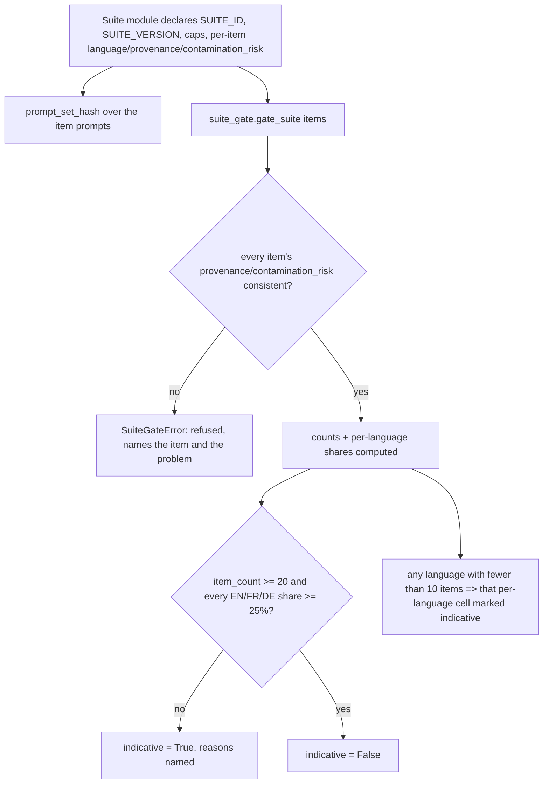

<!-- Fill or omit these sections; never add, rename, or reorder one. -->

# Instruction: Suite caps/tags/hash + suite_gate

## Architecture projection

> Tree of the final files. ✅ create · ✏️ modify · ❌ delete

```txt
.
├── src/
│   └── wave_local_ai_v2/
│       ├── classification_suite.py  ✏️ modify — language/provenance/contamination_risk per item, caps, suite id/version, prompt_set_hash()
│       └── suite_gate.py            ✅ create — gate_suite(): counts, per-language shares, provenance consistency check, indicative verdict
└── tests/
    ├── test_classification_suite.py ✏️ modify
    └── test_suite_gate.py           ✅ create
```

## User Journey



## Test Scope

```mermaid
---
title: Test scope
---
journey
  section Setup
    Construct suites as plain lists of dict-like items carrying item_id, language, provenance, contamination_risk => fixtures ready: 5: system
  section Happy path
    gate_suite on a >=20-item, EN/FR/DE >=25%-each, every language >=10 items suite => indicative is False, no per-language cell flagged: 5: system
  section Edge case - below item count
    gate_suite on a 19-item suite => indicative True, reason names the 19-item count against the 20 minimum: 1: system
  section Edge case - below language share
    gate_suite on a 20-item suite with DE at 20% (4 items) => indicative True, reason names the DE share: 1: system
  section Edge case - missing provenance
    gate_suite on a suite where one item has no provenance key => SuiteGateError raised, names that item: 1: system
  section Edge case - self-inconsistent declaration
    gate_suite on an item declared provenance="public" but contamination_risk=False (or the reverse) => SuiteGateError raised: 1: system
  section Edge case - thin per-language cell
    gate_suite on a suite where one language has exactly 5 items => that language's per-language cell is marked indicative, independent of the suite's overall verdict: 1: system
  section Edge case - the real classification suite
    gate_suite(CLASSIFICATION_TASK_SUITE) => indicative True, reasons name both the item-count shortfall and the FR/DE 0% share (never a refusal, never a pass): 5: system
  section Edge case - prompt-set hash stability
    prompt_set_hash(CLASSIFICATION_TASK_SUITE) called twice => identical; called after one item's prompt is edited => different: 1: system
```

## Tasks to do

### `1)` Tag every item, declare the suite's identity and caps

> Language, provenance and contamination_risk live on the item; id, version, caps and the hash live on the module — the shape stays whatever `classification_suite.py` already takes, per the epic's boundary (suite shape/registry is a sibling epic's).

1. Extend `ClassificationItem` (`TypedDict`) with `language: Literal["en", "fr", "de"]`, `provenance: Literal["hand_written", "licensed", "public"]`, `contamination_risk: bool`.
2. Extend `_item()` to take `language` and `provenance` (default `language="en"`, `provenance="hand_written"`, matching every item that exists today) and compute `contamination_risk = provenance == "public"` itself, so every item authored through `_item()` is self-consistent by construction; leave the ten existing `_item(...)` calls unchanged (their defaults already match: EN, hand-written).
3. Add module-level constants: `SUITE_ID` (a stable string id for this suite, e.g. `"classification-support-routing"`), `SUITE_VERSION` (starts at `"1"`), `MAX_OUTPUT_TOKENS` (the cap value `quality_cli.py` already hardcodes as `FIXED_MAX_TOKENS`, `32` — moves here as the suite's declared cap; phase 3 wires `quality_cli.py` to reference it instead of its own constant), `STOP_SEQUENCES: list[str]` (empty list — no stop sequence is sent today), `CONTEXT_LENGTH` (the context the suite assumes every compared model runs at; use the same value `server.CONTEXT_SIZE` already declares, either by importing it or by a same-valued constant with a comment cross-referencing `server.py` — pick whichever avoids a real dependency cycle, there is none since `server.py` does not import `classification_suite`).
4. Add `def prompt_set_hash(items: Sequence[ClassificationItem]) -> str`: a pure function, SHA-256 hex digest over a deterministic serialization of the items' prompts only (e.g. items sorted by `item_id`, then `"\n".join(f"{item['item_id']}:{item['prompt']}" for item in sorted_items)`, hashed) — deliberately not over the whole item dict, so a future non-prompt field never moves the hash. Add a module-level `PROMPT_SET_HASH = prompt_set_hash(CLASSIFICATION_TASK_SUITE)` computed once at import.

### `2)` The gate

> Validates fields on any object exposing them — not `isinstance` against this module's shape.

1. Create `src/wave_local_ai_v2/suite_gate.py` with named constants `MIN_SUITE_ITEMS = 20`, `MIN_LANGUAGE_SHARE = 0.25`, `MIN_PER_LANGUAGE_CELL_ITEMS = 10`, `LANGUAGES = ("en", "fr", "de")`.
2. Add `class SuiteGateError(ValueError)`.
3. Add a `SuiteGateResult` `TypedDict`: `item_count: int`, `language_counts: dict[str, int]`, `language_shares: dict[str, float]`, `indicative: bool`, `indicative_reasons: list[str]`, `per_language_indicative: dict[str, bool]`.
4. Add `def gate_suite(items: Iterable[Mapping[str, object]]) -> SuiteGateResult`:
   - First pass, provenance consistency: for every item, require the `provenance` key present and its value one of `hand_written`/`licensed`/`public`, and the `contamination_risk` key present and equal to `provenance == "public"`. Raise `SuiteGateError` naming the offending item's `item_id` and what was wrong (missing key vs. mismatched value) on the first failure found. This step verifies consistency only, never the declaration's truth.
   - Second pass, counts and shares: tally `item_count` and, for each of `en`/`fr`/`de`, its count and share (`count / item_count`).
   - Build `indicative_reasons`: append a reason when `item_count < MIN_SUITE_ITEMS` (naming the count and the threshold), and one more reason per language whose share is `< MIN_LANGUAGE_SHARE` (naming the language and its share). `indicative = bool(indicative_reasons)`.
   - Build `per_language_indicative`: for each of `en`/`fr`/`de`, `True` when that language's count is `< MIN_PER_LANGUAGE_CELL_ITEMS`, independent of the overall `indicative` verdict.

### `3)` Tests

1. `tests/test_classification_suite.py`: every item in `CLASSIFICATION_TASK_SUITE` carries `language` in `{"en","fr","de"}`, `provenance` in the allowed set, and `contamination_risk == (provenance == "public")`; `prompt_set_hash(CLASSIFICATION_TASK_SUITE)` is stable across two calls; a copy of the suite with one item's `prompt` field changed produces a different hash. Add an assertion that `SUITE_ID`, `SUITE_VERSION`, `MAX_OUTPUT_TOKENS`, `STOP_SEQUENCES`, `CONTEXT_LENGTH` are all defined and non-empty/sane (e.g. `MAX_OUTPUT_TOKENS > 0`).
2. `tests/test_suite_gate.py` (new), five constructed suites as plain lists of dict items (not `_item()`, so an inconsistent/missing declaration can actually be constructed): a 19-item suite → `indicative is True`, reason mentions the count; a 20-item suite with DE at 20% (4 of 20) → `indicative is True`, reason mentions `de`; a suite with one item missing `provenance` → `gate_suite` raises `SuiteGateError`; a suite where one language has exactly 5 items → that language's `per_language_indicative` entry is `True`; a fully compliant suite (≥20 items, every language ≥25% share and ≥10 absolute items, e.g. 40 items split 14/13/13) → `indicative is False` and no `per_language_indicative` entry is `True`. Also assert `gate_suite(CLASSIFICATION_TASK_SUITE)` itself returns `indicative is True` with reasons naming both the item-count shortfall and at least the `fr`/`de` 0% share — the story's explicit requirement that today's suite lands marked indicative, never failed and never silently passing.

## Test acceptance criteria

<!-- Each criterion is an observable behavior, not a command. -->

| Task | Acceptance criteria |
| ---- | -------------------- |
| 1... | Every item in `CLASSIFICATION_TASK_SUITE` exposes `language`, `provenance`, `contamination_risk`; `SUITE_ID`, `SUITE_VERSION`, `MAX_OUTPUT_TOKENS`, `STOP_SEQUENCES`, `CONTEXT_LENGTH` are importable module constants; `prompt_set_hash` is deterministic and sensitive to prompt edits. |
| 2... | `gate_suite` raises `SuiteGateError` on a missing/inconsistent provenance declaration; returns `indicative=True` with a named reason for an under-20-item or under-25%-share suite; returns `per_language_indicative[lang]=True` for any language counted under 10 items regardless of the overall verdict; returns `indicative=False` for a suite meeting every threshold. |
| 3... | `gate_suite(CLASSIFICATION_TASK_SUITE)` returns `indicative=True`, never raises. |
| 4... | `uv run pytest tests/test_classification_suite.py tests/test_suite_gate.py` passes with no regressions elsewhere (`uv run pytest`). |
