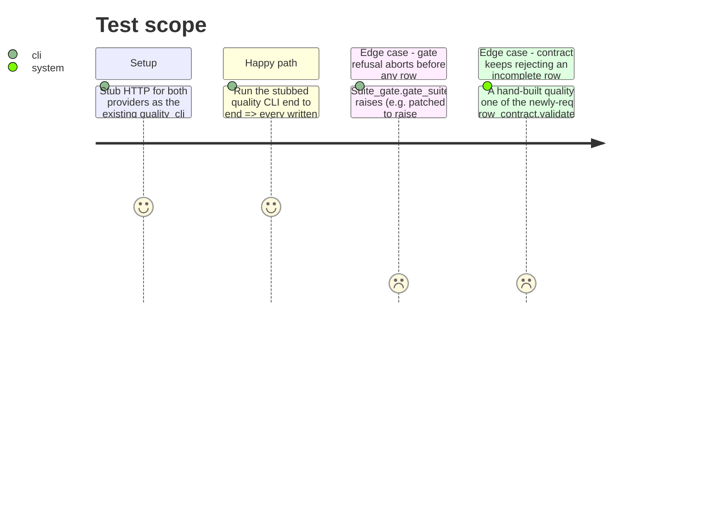

<!-- Fill or omit these sections; never add, rename, or reorder one. -->

# Instruction: quality_cli writes suite fields, contract extended

## Architecture projection

> Tree of the final files. ✅ create · ✏️ modify · ❌ delete

```txt
.
├── src/
│   └── wave_local_ai_v2/
│       ├── row_contract.py   ✏️ modify — REQUIRED_FIELDS["quality"] extended with the caps/suite/item/indicative fields
│       └── quality_cli.py    ✏️ modify — gates the suite once per run, writes caps + suite triple + item tags + indicative mark onto every row
└── tests/
    ├── test_row_contract.py  ✏️ modify — quality-kind fixture updated to the extended required set
    ├── test_cli.py           ✏️ modify — QUALITY_ONLY_FIELDS grows with the new field names
    └── test_quality_cli.py   ✏️ modify
```

## User Journey

```mermaid
flowchart TD
  A[_run starts] --> B[suite_gate.gate_suite CLASSIFICATION_TASK_SUITE]
  B -- SuiteGateError --> C[main prints one stderr line, exit 1, no row written]
  B -- ok --> D[gate result: indicative + reasons, held for the whole run]
  D --> E[_score_and_write per model]
  E --> F[each row gets: caps from classification_suite, suite id/version/hash, this item's language/provenance/contamination_risk, the run's indicative mark]
  F --> G[row_contract.validate_row "quality" row before append_row writes it]
```

## Test Scope



## Tasks to do

### `1)` Extend the contract

> The row contract is the single list every story extends; this is that extension happening.

1. In `row_contract.py`, add to `REQUIRED_FIELDS["quality"]`: `max_output_tokens`, `stop_sequences`, `context_length`, `suite_id`, `suite_version`, `prompt_set_hash`, `language`, `provenance`, `contamination_risk`, `indicative`, `indicative_reasons`.

### `2)` Gate once, write on every row

1. In `quality_cli.py`, import `suite_gate` and call `suite_gate.gate_suite(CLASSIFICATION_TASK_SUITE)` once near the top of `_run()` (after the cheap offline pre-conditions, before the expensive local suite run — same ordering rationale the existing pre-condition checks already follow). Add `suite_gate.SuiteGateError` to the tuple of exceptions `main()` catches and reports on stderr.
2. Replace the module's own `FIXED_MAX_TOKENS` use in the local `/completion` request body with `classification_suite.MAX_OUTPUT_TOKENS` (same value, `32`, today — no behavioral change). Leave the cloud call and `mistral_client.complete_prompt`'s signature untouched: `STOP_SEQUENCES` is empty today, so no `stop` parameter needs threading through either HTTP path yet; note this as a follow-up if a future suite ever declares a non-empty `STOP_SEQUENCES`, out of this phase's scope (`mistral_client.py` is not in the story's file list).
3. Thread the gate result into `_score_and_write` (or compute it once in `_run` and pass it down) so every row's assembly can add: `"max_output_tokens": classification_suite.MAX_OUTPUT_TOKENS`, `"stop_sequences": list(classification_suite.STOP_SEQUENCES)`, `"context_length": classification_suite.CONTEXT_LENGTH`, `"suite_id": classification_suite.SUITE_ID`, `"suite_version": classification_suite.SUITE_VERSION`, `"prompt_set_hash": classification_suite.PROMPT_SET_HASH`, `"language": item["language"]`, `"provenance": item["provenance"]`, `"contamination_risk": item["contamination_risk"]`, `"indicative": gate_result["indicative"]`, `"indicative_reasons": list(gate_result["indicative_reasons"])`.

### `3)` Tests

1. `tests/test_row_contract.py`: update the quality-kind "complete row" fixture to include the ten fields phase 3 adds, so the existing "complete row passes" test keeps passing against the now-larger required set.
2. `tests/test_cli.py`: add the same ten field names to `QUALITY_ONLY_FIELDS` so the runtime/quality separation guard still holds (a runtime row must never carry a quality-only field, including these new ones).
3. `tests/test_quality_cli.py`: extend the stubbed-run assertions so a written row's `max_output_tokens`, `stop_sequences`, `context_length`, `suite_id`, `suite_version`, `prompt_set_hash` equal the `classification_suite` module's constants; `language`/`provenance`/`contamination_risk` equal the corresponding suite item's own values; `indicative` is `True` (the real suite is under-sized and EN-only, so every row this fixture writes is indicative) and `indicative_reasons` is non-empty. Add a test that patches `suite_gate.gate_suite` to raise `SuiteGateError` and asserts `quality_cli.main()` exits 1 with nothing appended to `quality_results_path`.

## Test acceptance criteria

<!-- Each criterion is an observable behavior, not a command. -->

| Task | Acceptance criteria |
| ---- | -------------------- |
| 1... | `row_contract.REQUIRED_FIELDS["quality"]` includes the ten new field names; a quality row missing any one of them is refused by `validate_row`. |
| 2... | A row `quality_cli.py` writes carries every new field with the value the suite/gate actually declared for it; a `SuiteGateError` aborts the run before any row is written. |
| 3... | `uv run pytest tests/test_row_contract.py tests/test_cli.py tests/test_quality_cli.py` passes with no regressions elsewhere (`uv run pytest`). |
