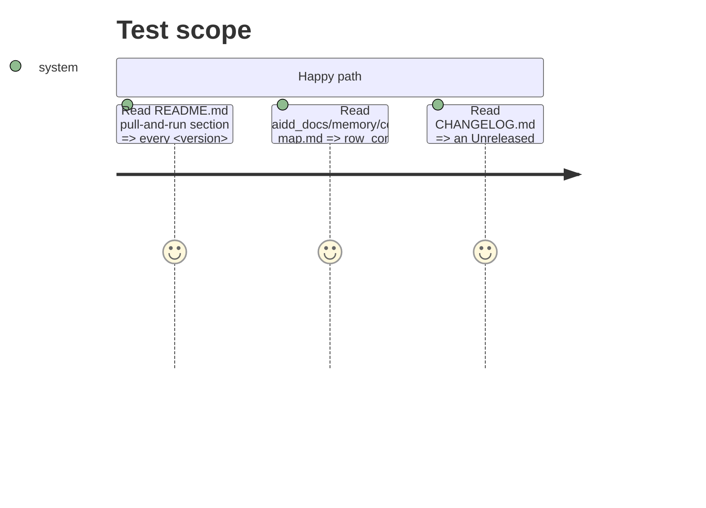

<!-- Fill or omit these sections; never add, rename, or reorder one. -->

# Instruction: Docs — README tag example, codebase map, CHANGELOG

## Architecture projection

> Tree of the final files. ✅ create · ✏️ modify · ❌ delete

```txt
.
├── README.md                     ✏️ modify — <version> placeholder replaced by v0.1.0 in the pull-and-run walkthrough
├── CHANGELOG.md                  ✏️ modify — Unreleased entry for this increment
└── aidd_docs/
    └── memory/
        └── codebase-map.md       ✏️ modify — row_contract.py and suite_gate.py listed
```

## User Journey

n/a — documentation only, no runtime behavior change.

## Test Scope



## Tasks to do

### `1)` README tag example

> The task names lines 118 and 132; line 126 (`curl .../<version>/compose.yaml`) is the same walkthrough's third occurrence of the identical placeholder — leaving it as `<version>` while its neighbors become a real tag would make the copy-pasteable sequence internally inconsistent, so all three are brought in line together.

1. In `README.md`, replace `<version>` with `v0.1.0` at line 118 (`docker pull ghcr.io/aliquanto3/wave_local_ai_v2:<version>`), line 126 (`curl -fsSLO https://raw.githubusercontent.com/Aliquanto3/wave_local_ai_v2/<version>/compose.yaml`), and line 132 (`` Set `WAVE_IMAGE_TAG=<version>` ``). `v0.1.0` matches the version already tagged in `CHANGELOG.md`'s `## [0.1.0] - 2026-08-22` entry — do not invent a version the changelog doesn't carry.

### `2)` Codebase map

1. In `aidd_docs/memory/codebase-map.md`, under `src/wave_local_ai_v2/`'s module listing (or wherever the file currently enumerates modules — follow its existing format, do not restructure it), add `row_contract.py` (the row schema contract and writer gate) and `suite_gate.py` (the suite size/language-mix/provenance gate).

### `3)` Changelog

1. In `CHANGELOG.md`, under `## [Unreleased]`, add an `### Added` subsection (the file has none yet under Unreleased) noting: every published row now carries a `schema_version` and is refused by the writer unless contract-complete; the classification suite declares its generation caps, suite id/version, a prompt-set hash, and per-item language/provenance/contamination-risk tags; a suite gate marks an under-sized or language-imbalanced suite (today's 10-item, EN-only suite included) indicative rather than passing or failing it outright.

## Test acceptance criteria

<!-- Each criterion is an observable behavior, not a command. -->

| Task | Acceptance criteria |
| ---- | -------------------- |
| 1... | No `<version>` placeholder remains in the pull-and-run walkthrough; all three occurrences read `v0.1.0`. |
| 2... | `row_contract.py` and `suite_gate.py` are named in `codebase-map.md`. |
| 3... | `CHANGELOG.md`'s `## [Unreleased]` section describes the row contract, the writer gate, and the suite's caps/tags/gate. |
