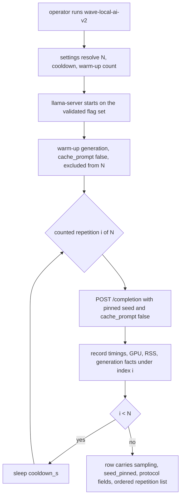
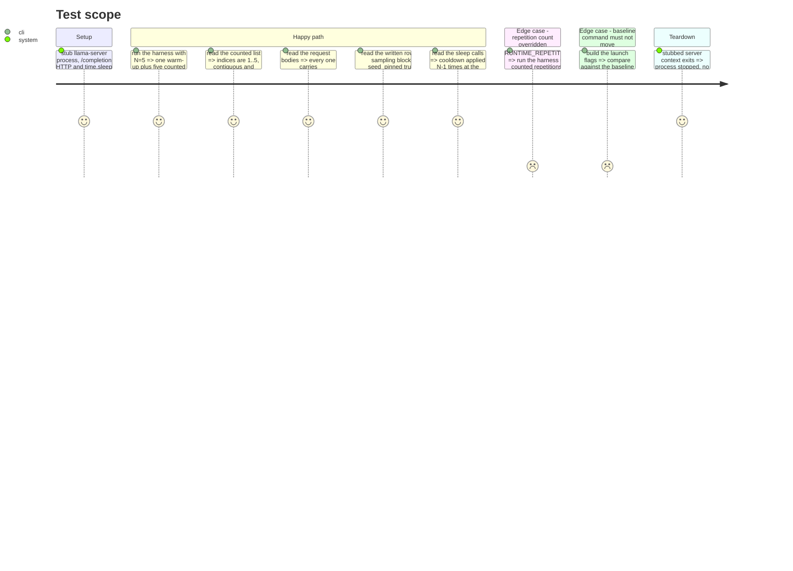

# Instruction: Repetition protocol, pinned sampling, warm-up isolation

## Architecture projection

> Tree of the final files. ✅ create · ✏️ modify · ❌ delete

```txt
.
├── src/wave_local_ai_v2/
│   ├── repetitions.py     ✅ warm-up, counted loop, cooldown, per-request cache reset, ordered raw list
│   ├── settings.py        ✏️ repetition count, cooldown seconds, warm-up count as env-backed values
│   ├── server.py          ✏️ sampler constants become numbers + a sampler mapping; the flag bytes do not move
│   ├── timings.py         ✏️ surface stop_type / tokens_predicted / truncated as generation facts
│   └── __init__.py        ✏️ one request becomes one repetition set; row carries `sampling` and `seed_pinned`
└── tests/
    ├── test_repetitions.py ✅ loop shape, ordering, cooldown count, cache-reset flag on every request
    ├── test_settings.py    ✏️ the three new settings default and override
    ├── test_server.py      ✏️ the flag list is still byte-for-byte the validated baseline
    └── test_cli.py         ✏️ `sampling` leaves QUALITY_ONLY_FIELDS; the row carries the protocol fields
```

## User Journey



## Test Scope



## Tasks to do

### `1)` Make the protocol configurable

> Three protocol values become settings with the PRD's defaults, not constants.

1. Add `runtime_repetitions: int = 5`, `runtime_cooldown_s: float = 10.0`, `runtime_warmup_count: int = 1` to `Settings`.
2. Read them in `load_settings` from `RUNTIME_REPETITIONS`, `RUNTIME_COOLDOWN_S`, `RUNTIME_WARMUP_COUNT`.
3. Raise `SettingsError` naming the variable when a value is non-numeric, when repetitions is below 2 (the sample sd is undefined below it), when cooldown is negative, or when warm-up count is negative.
4. Add the three to `.env.example` with their defaults commented as the published values.

### `2)` Pin the runtime sampling without moving the flag set

> The seed determines the output; the flag list stays the validated baseline byte for byte.

1. In `server.py`, turn `TEMPERATURE`, `TOP_P`, `TOP_K`, `MIN_P`, `PRESENCE_PENALTY` into numeric constants and `str()` them inside `build_flags`. Assert in the test that the produced list is unchanged.
2. Add `SAMPLER_SETTINGS: dict[str, float | int]` in `server.py` built from those same constants — one source for the flags and for what the row reports.
3. In `__init__.py`, add `RUNTIME_SEED = 20260822` beside the other run-specific constants, with a comment pointing at `quality_cli.QUALITY_SEED` as the pattern and at the probe evidence that the request body honours it.
4. Build `RUNTIME_SAMPLING = {"seed": RUNTIME_SEED, **server.SAMPLER_SETTINGS}` and send `seed` in the `/completion` body. Do not send the other sampler values: they already reach the model through the flags, and re-sending them would make the request diverge from the validated launch.
5. Put `"sampling": RUNTIME_SAMPLING` and `"seed_pinned": True` on the row, plus `"model_id"`-equivalent identity already carried by `model_file` and `quant`.
6. Remove `"sampling"` from `QUALITY_ONLY_FIELDS` in `tests/test_cli.py` — it is no longer quality-only. Leave the mirror in `tests/test_quality_cli.py` alone.

### `3)` Surface the generation facts a repetition is judged on

> `timings.py` gains what phase 3 needs to name a failure, without changing what it already returns.

1. Add `GenerationFacts(TypedDict)` with `stop_type: str | None`, `tokens_predicted: int | None`, `truncated: bool | None`, and `content: str`.
2. Add `parse_generation_facts(response_json)` reading `stop_type`, `tokens_predicted`, `truncated` and `content` from the completion response, tolerating absent keys with `None`.
3. Leave `parse_timings` and its `Timings` shape untouched: it is spread into the row today and phase 2 moves it, not this one.

### `4)` Build the repetition loop

> One server process, one warm-up, N counted repetitions, a cooldown between them, full prefill each time.

1. Create `repetitions.py` with `RepetitionResult(TypedDict)`: `index`, `ttft_ms`, `prompt_tok_per_s`, `gen_tok_per_s`, `vram_used_mib`, `gpu_draw_w`, `process_rss_bytes`, `wall_clock_s`, `stop_type`, `tokens_predicted`.
2. Add `SLOT_RESET_METHOD = "cache_prompt_false"` as a named constant, with a comment recording the 501 from `POST /slots/0?action=erase` and why the per-request field was chosen instead.
3. Write `run_repetition_set(*, send, read_gpu, read_rss, sleep, warmup_count, count, cooldown_s)` returning `(warmups, counted)` — two ordered lists of `RepetitionResult`. Warm-ups carry index 0, 1-based indices belong to the counted set.
4. Every request, warm-up included, sends `cache_prompt: False` and the pinned seed. Take the GPU and RSS reads immediately after each completion returns, so peaks in phase 2 have per-repetition samples.
5. Apply the cooldown between counted repetitions only: `count - 1` times, and once after the last warm-up so the first counted repetition starts from the same posture as the rest. Never after the final counted repetition.
6. Inject `send`, `read_gpu`, `read_rss` and `sleep` as parameters so `tests/test_repetitions.py` stubs the HTTP call and the sleep without patching module globals.

### `5)` Rewire the CLI onto the loop

> `_run` stops being one request; the row starts carrying the protocol.

1. Replace the single `send_request` / `measure_energy` pair with: run the warm-ups outside the tracker, then `measure_energy(lambda: run_repetition_set(...))` over the counted repetitions.
2. Rewrite the reverted-warm-up comment block at `__init__.py:29-40` and `:186-200`: it currently records why a warm-up was rejected. It must now record what changed — the probed `cache_prompt: false` mechanism, the 501 that ruled out slot erase, and the phase-4 acceptance check — rather than being deleted, so the failed attempt stays on the record.
3. Add to the row: `warmup_count`, `warmup_repetitions` (the ordered warm-up results), `restart_between_repetitions: False`, `cooldown_s`, `repetitions_n`, `slot_reset_method`, and `repetitions` (the ordered counted list).
4. Leave the top-level timing fields spread from repetition 1 for now, and say so in a one-line comment naming phase 2 as the owner. This phase must still write a contract-valid row.
5. Update the stdout summary line to report N alongside the metrics.

## Test acceptance criteria

| Task | Acceptance criteria                                                                                                                                                 |
| ---- | ------------------------------------------------------------------------------------------------------------------------------------------------------------------- |
| 1    | The three settings default to 5, 10.0 and 1, are overridable by environment variable, and a repetition count of 1 or 0 is refused by name rather than silently accepted. |
| 2    | The launched flag list is byte-for-byte the list in `context_input/baseline_qwen36.md`; the written row's `sampling` block carries the seed plus the five flag-sourced sampler values, and `seed_pinned` is true. |
| 3    | Given a completion response, the generation facts report the stop type, the predicted-token count and the truncation flag, and report `None` for each rather than raising when the key is absent. |
| 4    | With HTTP and sleep stubbed, one warm-up and N counted requests are issued in order; the counted indices are 1..N contiguous; every request body carries `cache_prompt: false` and the pinned seed; the cooldown is applied N-1 times between counted repetitions and never after the last. |
| 5    | The written row carries the ordered counted repetition list, the ordered warm-up list, and the five protocol fields, and remains acceptable to the writer gate.        |
</content>
