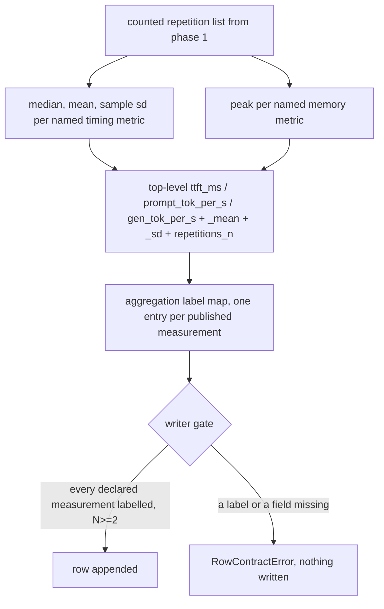
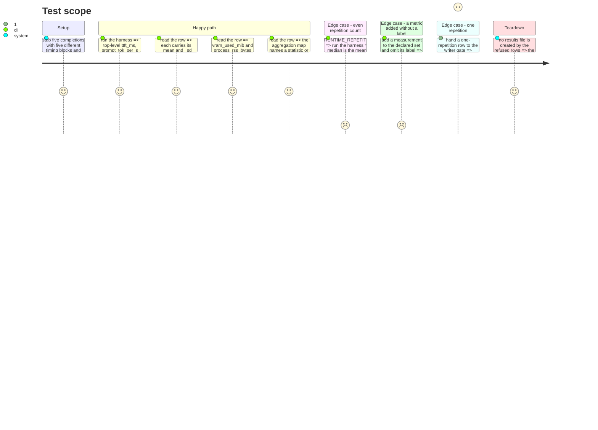

# Instruction: Aggregation and the extended row contract

## Architecture projection

> Tree of the final files. ✅ create · ✏️ modify · ❌ delete

```txt
.
├── src/wave_local_ai_v2/
│   ├── aggregation.py     ✅ median, mean, sample sd, peak, the named metric set, the aggregation labels
│   ├── __init__.py        ✏️ top-level timings become aggregates; memory becomes a peak; row declares aggregation
│   └── row_contract.py    ✏️ aggregates, peaks, protocol fields, sampling and the label map become required
└── tests/
    ├── test_aggregation.py ✅ known sets give known statistics; even N; peak is max; N<2 raises
    ├── test_row_contract.py ✏️ a row missing an aggregation label, or with N<2, is refused
    └── test_cli.py          ✏️ five differing stubbed timing blocks produce hand-computed medians and peaks
```

## User Journey



## Test Scope



## Tasks to do

### `1)` Write the statistics

> Four functions, no hidden behaviour, N<2 refused at the source.

1. Create `aggregation.py` with `median`, `mean`, `sample_sd` (N-1 form) and `peak`, each over a list of floats.
2. `sample_sd` raises `AggregationError` on N<2 rather than returning 0.0 or `None`; a zero would be a silent claim of perfect reproducibility.
3. `peak` returns the maximum, and returns `None` when every sample is `None` — a channel that never read is absent, not zero. Ignore individual `None` samples when at least one real reading exists.
4. `median` on an even N returns the mean of the two middle values, stated in the docstring.

### `2)` Name the metric set and the labels in code

> A metric added later either declares an aggregation or fails the writer gate.

1. Add `AGGREGATED_TIMING_METRICS = ("ttft_ms", "prompt_tok_per_s", "gen_tok_per_s")`.
2. Add `PEAK_METRICS = ("vram_used_mib", "process_rss_bytes", "gpu_draw_w")` — `gpu_draw_w` is read in the same NVML call and a peak is the defensible sizing figure for it too.
3. Add `AGGREGATION_LABELS: dict[str, str]`, one entry per published measurement: `"median"` for the three timing metrics, `"peak_over_counted_repetitions"` for the three peaks, `"total_over_counted_repetitions"` for `wall_clock_s`, and `"total_over_counted_repetitions_including_cooldowns"` for `energy_kwh`.
4. Add `MEASUREMENT_FIELDS = frozenset(AGGREGATION_LABELS)` — the set the contract checks against, so adding a published measurement without a label is a test failure, not a silent omission.
5. Add `aggregate_timings(counted)` returning `{metric: median, f"{metric}_mean": ..., f"{metric}_sd": ...}` for each named timing metric, plus `repetitions_n`.

### `3)` Assemble the aggregated row

> Top-level fields stop being one sample.

1. In `__init__.py`, replace the phase-1 placeholder spread with `aggregate_timings(counted)` and the peak reads over the counted list.
2. Add `"aggregation": dict(aggregation.AGGREGATION_LABELS)` to the row — the declaration travels with the row, not only with the code that wrote it.
3. Keep the raw counted repetitions inline and unmodified: the aggregates are computed from them, and a reader recomputes rather than trusts.
4. Keep the stdout summary reporting the median with N.

### `4)` Extend the contract

> The gate is what makes the criteria able to fail.

1. Add to the runtime required set: `sampling`, `seed_pinned`, `warmup_count`, `warmup_repetitions`, `restart_between_repetitions`, `cooldown_s`, `repetitions_n`, `slot_reset_method`, `repetitions`, `aggregation`, and the six `_mean` / `_sd` fields.
2. Add three runtime-only structural checks to `validate_row`: `repetitions_n >= 2`; `len(row["repetitions"]) == row["repetitions_n"]` with indices contiguous from 1; and `set(row["aggregation"]) == aggregation.MEASUREMENT_FIELDS` with every one of those keys also present as a row field.
3. Raise `RowContractError` naming the offending field or index in each case, in the existing single-message style.
4. Move `SCHEMA_VERSION` from `"1"` to `"2"`. Note in the module docstring that the bump is the runtime shape change and that quality rows move with it because the constant is shared.

## Test acceptance criteria

| Task | Acceptance criteria                                                                                                                                                     |
| ---- | ------------------------------------------------------------------------------------------------------------------------------------------------------------------------ |
| 1    | Known repetition sets produce known median, mean and sample sd; an even N takes the mean of the two middle values; peak returns the maximum rather than the last sample; N<2 raises rather than returning a number. |
| 2    | Every field named in the aggregation label map exists on a written row, and adding a measurement field without a label makes the contract test fail.                       |
| 3    | With five stubbed repetitions carrying five different timing blocks, the row's three top-level metrics equal the hand-computed medians, each carries its mean and sd, and the two memory figures equal the maxima. |
| 4    | A row with `repetitions_n` below 2, a repetition list whose length or indices disagree with it, or an aggregation map missing a declared measurement is refused and nothing is written to disk. |
</content>
