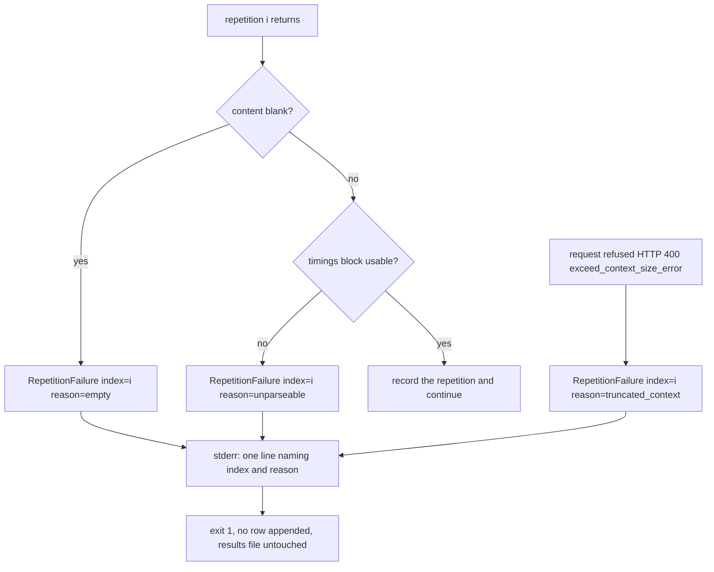
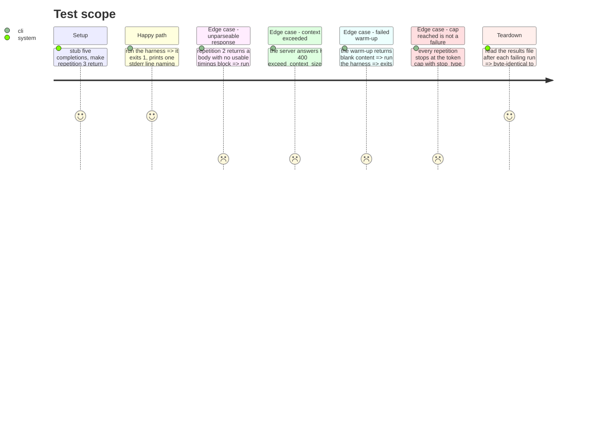

# Instruction: A failed repetition fails the row

## Architecture projection

> Tree of the final files. ✅ create · ✏️ modify · ❌ delete

```txt
.
├── src/wave_local_ai_v2/
│   ├── repetitions.py      ✏️ classify each repetition, raise on the first failure with index and reason
│   └── __init__.py         ✏️ the new error joins the caught set: one stderr line, exit 1, nothing written
└── tests/
    ├── test_repetitions.py ✏️ empty, unparseable and context-exceeded each fail the row by index and reason
    └── test_cli.py         ✏️ the failure exits non-zero and leaves the results file byte-identical
```

## User Journey



## Test Scope



## Tasks to do

### `1)` Classify a repetition's outcome

> Reuse the quality taxonomy; do not invent a second vocabulary for the same failures.

1. In `repetitions.py`, import the four reason constants from `scoring.py`. Do not redefine them.
2. Add `RepetitionFailure(RuntimeError)` carrying `index: int` and `reason: str`, whose message is the single line the CLI prints: `repetition {index} failed: {reason}`. Use index 0 for a warm-up and say so in the message.
3. Classify in this order, per repetition: blank `content` after stripping → `empty`; a completion whose timings block is absent or missing a field (the existing `MissingTimingsError`) → `unparseable`; a request refused with HTTP 400 and `error.type == "exceed_context_size_error"` → `truncated_context`.
4. Write in the module docstring, with the probe evidence, why `truncated_max_tokens` is defined but unreachable here: the runtime harness chooses `max_tokens` as its measurement budget, so `stop_type: "limit"` is the intended stop of a healthy run, and failing on it would fail every row. The cap stays disclosed as the row's `max_tokens` field.
5. Record `stop_type` and `tokens_predicted` on every repetition regardless, so a generation that ended early at EOS is visible in the raw list rather than absorbed into a median without trace.

### `2)` Fail the whole row, first failure wins

> Not dropped and re-run, not kept as zero.

1. Raise `RepetitionFailure` at the first failing repetition, warm-ups included. Do not continue the loop, do not retry, do not substitute a value.
2. Apply the same rule to the warm-up: a warm-up is not a licence to retry, and its failure carries index 0.
3. Leave the cooldown and the server shutdown to the existing context manager, so a failure still stops the process cleanly.

### `3)` One stderr line, exit 1, nothing written

> The harness's existing single-line error style, not a traceback.

1. Add `RepetitionFailure` to the caught tuple in `main()`.
2. Confirm the raise happens strictly before `append_row`, so no partial row and no results file are created — assert it in the test by comparing the file bytes before and after.
3. Do not add the failure to any row: the absence of a row is the evidence, per the story's own falsification note.

## Test acceptance criteria

| Task | Acceptance criteria                                                                                                                                          |
| ---- | -------------------------------------------------------------------------------------------------------------------------------------------------------------- |
| 1    | A blank completion, a response with no usable timings, and an HTTP 400 `exceed_context_size_error` each produce their own distinct reason from the quality taxonomy; a generation stopping at the token cap produces no failure at all. |
| 2    | A failure at repetition 3 of 5 stops the run at repetition 3 — repetitions 4 and 5 are never requested — and a failing warm-up fails the row with index 0 and no retry. |
| 3    | The run exits non-zero, prints exactly one stderr line naming the index and the reason with no traceback, and the results file is byte-identical to before the run. |
</content>
