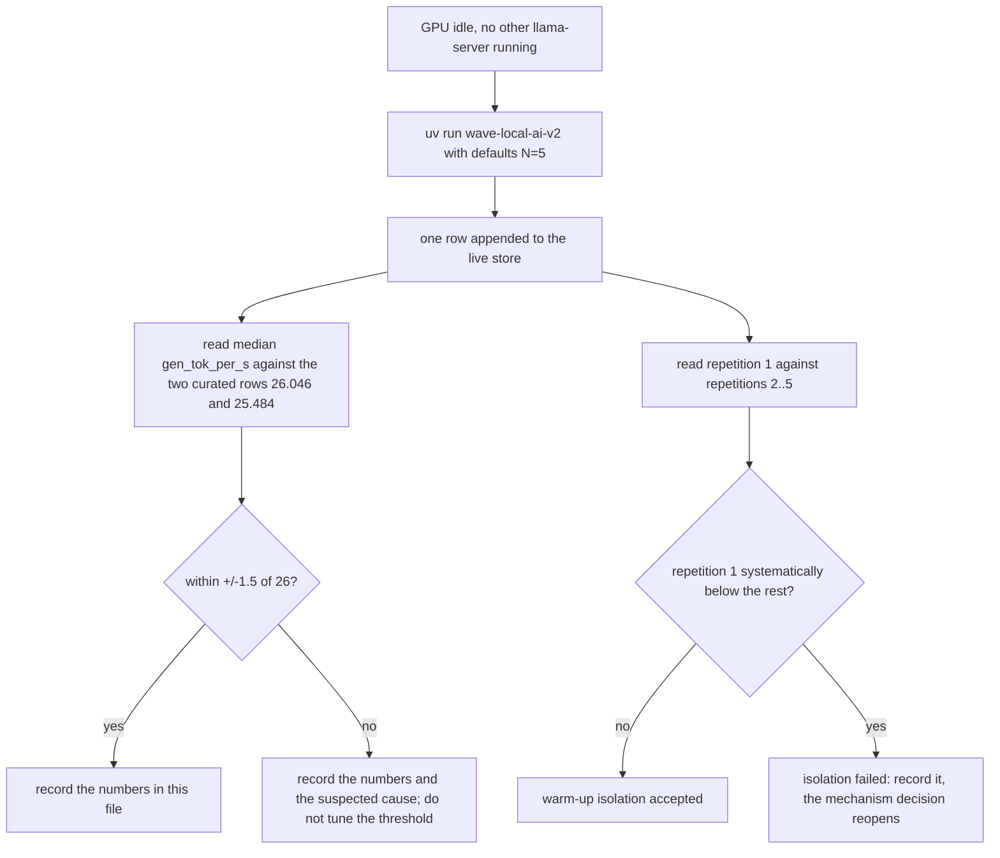
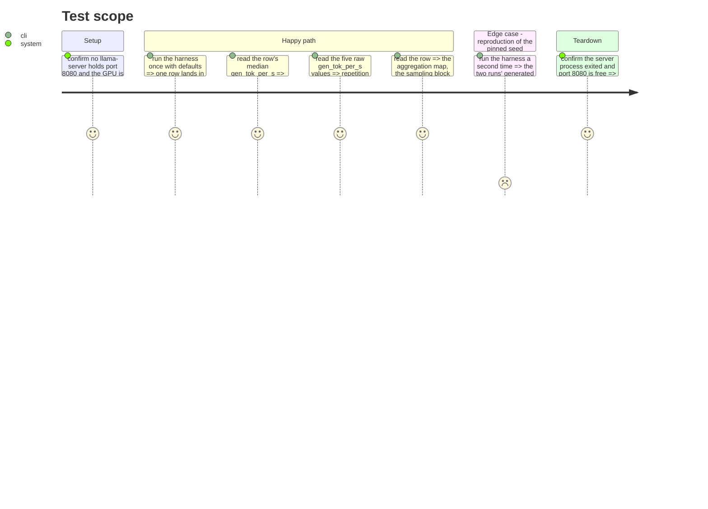

# Instruction: Live validation on this machine, docs, changelog, memory

## Architecture projection

> Tree of the final files. ✅ create · ✏️ modify · ❌ delete

```txt
.
├── aidd_docs/
│   ├── memory/cli.md       ✏️ the runtime command's shape: a repetition set, not one shot
│   └── tasks/2026_08/2026_08_22_runtime-repetition-protocol/
│       └── phase-4.md      ✏️ the observed numbers recorded here, in the Evidence section below
├── docs/setup.md           ✏️ runtime section: what a run now costs and what it writes
└── CHANGELOG.md            ✏️ Unreleased / Added and Changed
```

The live run appends to `aidd_docs/results/runtime.jsonl` (the untracked per-machine
store). It does **not** touch `aidd_docs/results/runtime-reference.jsonl`: the curated
reference bundle is regenerated by order 19, not by this increment.

## User Journey



## Test Scope



## Tasks to do

### `1)` Run it for real, once, and write the numbers down

> The live run is evidence, not a test. Nothing in the suite depends on it.

1. Confirm no `llama-server` process is running and port 8080 is free before starting; the harness refuses a bound port, but a stale process would also skew the thermal state.
2. Run `uv run wave-local-ai-v2` with the defaults (N=5, cooldown 10 s, warm-up 1).
3. Fill the Evidence section below from the written row: the five raw `gen_tok_per_s`, `ttft_ms` and `prompt_tok_per_s` values, the median / mean / sd of each, the two peaks, `energy_kwh`, and the wall-clock cost of the whole run.
4. Compare the median `gen_tok_per_s` against the curated rows (26.046 and 25.484). Record the delta. If it falls outside ±1.5 of 26, record the number and the suspected cause — thermal state, the pinned seed changing the generated text length, the per-repetition cache reset. Do not move the acceptance band to fit the observation.
5. Compare repetition 1 against repetitions 2..5. Record whether it is systematically below them. This is the warm-up isolation acceptance check; if it fails, the `cache_prompt: false` decision reopens and phase 1 task 4 is revisited.
6. Run a second time and record whether the generated text is byte-identical under the pinned seed. A seed that does not reproduce makes `seed_pinned: true` a false claim on the row.

### `2)` Say what changed, where the project remembers things

> One line each, no duplication between the three files.

1. `CHANGELOG.md` under Unreleased: Added — the repetition protocol, the pinned runtime seed, the aggregates and peaks, the aggregation declaration. Changed — a runtime row is a repetition set and `SCHEMA_VERSION` is now `"2"`.
2. `aidd_docs/memory/cli.md`: rewrite the `wave-local-ai-v2` bullet. It no longer "sends one fixed prompt" — it runs one warm-up plus N counted repetitions in one server process, and appends one aggregate row carrying its raw repetitions. Name the three new environment variables.
3. `docs/setup.md` step 4.2: state that a runtime run now takes roughly N times longer, name the defaults and the environment variables that lower them for a development loop, and state that a repetition failure exits non-zero and writes nothing.

### `3)` Close the loop on the reverted warm-up note

> The repo's record of a failed attempt must not be silently overwritten by a working one.

1. Verify the rewritten comment in `__init__.py` reads correctly against what phase 4 actually observed, and correct it if the live numbers disagree with what phase 1 assumed.
2. Verify nothing in the repo still claims the runtime harness is single-shot: grep for "one fixed prompt", "single-shot" and "one real request" across `src/`, `docs/`, `aidd_docs/memory/` and `README.md`, and fix what is now false.

## Evidence

> Filled from the live run appended to `aidd_docs/results/runtime.jsonl` (`run_id`
> `e85c505d1bac46019da2f6704acd101b`, `captured_at` 2026-08-22T19:11:57Z). GPU idle
> (0% util, 0 MiB used, no thermal slowdown) and port 8080 free were confirmed before
> starting.

| Figure                                | Observed                                                             |
| -------------------------------------- | --------------------------------------------------------------------- |
| `gen_tok_per_s` raw, reps 1..5          | 25.4259, 25.4859, 24.8657, 25.7128, 25.4396                           |
| `gen_tok_per_s` median / mean / sd      | 25.4396 / 25.3860 / 0.3130                                            |
| Delta vs curated 26.046                 | -0.606 (25.4396 vs 26.046), inside +/-1.5 -- accepted                 |
| Repetition 1 vs repetitions 2..5        | rep 1 = 25.4259, sits mid-pack (reps 2..5: 25.4859, 24.8657, 25.7128, 25.4396); rep 3 is the lowest, not rep 1 -- warm-up isolation accepted |
| `ttft_ms` median / mean / sd            | 5476.425 / 5487.0722 / 49.5585                                        |
| `prompt_tok_per_s` median / mean / sd   | 272.0753 / 271.5650 / 2.4448                                          |
| `vram_used_mib` peak                    | 4548.68 (constant across all 5 counted reps and the warm-up)          |
| `process_rss_bytes` peak                | 15,225,712,640 (rep 1)                                                |
| `energy_kwh` over the counted span      | 0.00259323 (`energy_method: measured_nvml`)                           |
| Wall clock, whole run                   | 52.531 s summed over the 5 counted repetitions (excludes the ~50 s of cooldowns and the warm-up); the operator-facing session, warm-up + 5 requests + cooldowns, ran ~113 s |
| Second run reproduces the text          | Yes, with a caveat: the row does not persist raw `content` (only `stop_type`/`tokens_predicted`), so the two full harness runs (`run_id` `e85c505d1bac...`, `af4246c7ba3f...`) cannot be diffed for text equality from `runtime.jsonl` alone -- both did report identical `tokens_predicted` (128) and `stop_type` (`limit`). A direct probe reusing the harness's exact request shape (same flags, `cache_prompt: False`, `seed: 20260822`) against a freshly launched server sent the same prompt twice and got byte-identical `content` (563 chars both times) -- `seed_pinned: true` holds. |

## Test acceptance criteria

| Task | Acceptance criteria                                                                                                                                                           |
| ---- | -------------------------------------------------------------------------------------------------------------------------------------------------------------------------------- |
| 1    | One real row exists in the live store with `repetitions_n` 5 and five raw repetitions; the Evidence table above is filled from it; the median `gen_tok_per_s` and its delta against the curated 26.046 are recorded whether or not they fall inside ±1.5; repetition 1's position relative to repetitions 2..5 is stated explicitly. |
| 2    | The changelog, `cli.md` and `docs/setup.md` each describe the repetition-set run shape, and none of them still describes a single request.                                        |
| 3    | No file under `src/`, `docs/`, `aidd_docs/memory/` or `README.md` still asserts the runtime harness sends one request, and the reverted-warm-up note records both the old failure and the mechanism that replaced it. |
</content>
