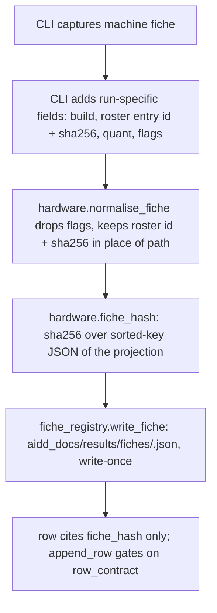
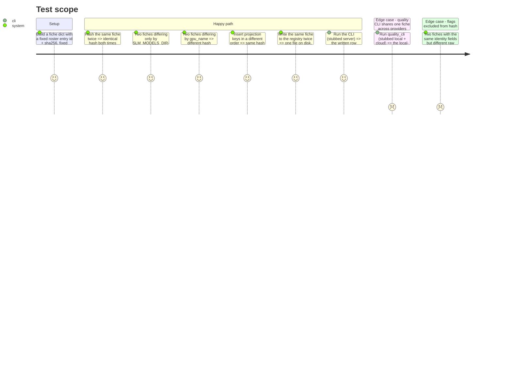

<!-- Fill or omit these sections; never add, rename, or reorder one. -->

# Instruction: Fiche projection, hash, registry, rows cite the hash

## Architecture projection

> Tree of the final files. ✅ create · ✏️ modify · ❌ delete

```txt
.
├── src/wave_local_ai_v2/
│   ├── hardware.py            ✏️ run-specific fields + normalised projection + hash
│   ├── fiche_registry.py      ✅ write-once storage, lookup, verification helper
│   ├── settings.py            ✏️ FICHE_REGISTRY_DIR / fiche_registry_dir
│   ├── row_contract.py        ✏️ fiche_hash required on both kinds; flattened fields leave runtime
│   ├── __init__.py            ✏️ build + register the fiche, cite the hash
│   └── quality_cli.py         ✏️ build + register the fiche once per run, cite the hash on both rows
├── aidd_docs/results/fiches/  ✅ tracked registry directory (empty at commit time bar tests' evidence)
└── tests/
    ├── test_fiche_registry.py ✅ new
    ├── test_hardware.py       ✏️ projection + hash tests
    ├── test_cli.py            ✏️ written row cites a resolvable hash
    └── test_quality_cli.py    ✏️ both rows of one run cite the same resolvable hash
```

## User Journey



## Test Scope



## Wireframe

<!-- UI phase only. No UI => omit the section, don't invent one. -->

## Tasks to do

### `1)` Extend the hardware fiche with run-specific fields and a normalised projection

> The fiche stops refusing the fields that describe the run, and gains the projection its hash is computed over.

1. In `hardware.py`, extend `HardwareFiche` (or introduce a superset `Fiche` TypedDict layered on it — keep `capture_fiche()`'s machine-only return type for callers that still want it) with the run-specific fields the story names: `llama_cpp_build: str | None`, `roster_entry_id: str`, `model_sha256: str`, `quant: str`, `flags: list[str]`.
2. Add `build_fiche(machine: HardwareFiche, *, llama_cpp_build, roster_entry_id, model_sha256, quant, flags) -> Fiche` that merges the machine capture with the run-specific fields — no re-reading of the machine, no side effects.
3. Add `normalise_fiche(fiche: Fiche) -> dict[str, Any]` returning exactly: `cpu`, `ram_gb`, `gpu_name`, `gpu_driver_version`, `os`, `cuda_ceiling`, `llama_cpp_build`, `quant`, `roster_entry_id`, `model_sha256`. No `flags` key, no filesystem path, no host, no port (none of the latter two ever existed on the fiche — state this in the docstring so a future field addition doesn't reintroduce them silently).
4. Add `fiche_hash(fiche: Fiche) -> str`: `hashlib.sha256(json.dumps(normalise_fiche(fiche), sort_keys=True).encode("utf-8")).hexdigest()`. Sorted keys make the hash independent of insertion order without a bespoke serializer.
5. Update the module docstring: it no longer refuses run-specific fields; state which caller (the two CLIs) supplies them and why `capture_fiche()` itself stays machine-only (so `build_fiche` composes with a plain dict in tests, without needing a live roster entry).

### `2)` Create the fiche registry: write-once storage and lookup

> A fiche is a stored, addressable artifact, not something reconstructed from a row.

1. Create `fiche_registry.py`. `write_fiche(fiche: dict, registry_dir: Path) -> str`: compute the hash (call `hardware.fiche_hash`), and if `registry_dir/<hash>.json` does not already exist, write the **full** fiche (including `flags`, the raw evidence field) as pretty or compact JSON — pick one and keep it stable, since a future re-hash-of-file-content check (phase 2) depends on deterministic bytes; if the file already exists, do nothing (return the hash unchanged — no re-write, no duplicate, no error on a second identical fiche in the same run).
2. `read_fiche(fiche_hash: str, registry_dir: Path) -> dict | None`: return the parsed JSON, or `None` if the file is absent. Never raises on a missing file — phase 2's validator distinguishes "missing" from "edited" and needs this to degrade quietly.
3. Docstring states the write-once contract explicitly and that `registry_dir` defaults to `aidd_docs/results/fiches/` via `settings.fiche_registry_dir`, never hardcoded in this module.

### `3)` Wire `settings.py`, `row_contract.py` and both CLIs to the hash

> Every row that used to flatten the fiche now cites it by hash instead.

1. `settings.py`: add `DEFAULT_FICHE_REGISTRY_DIR = "aidd_docs/results/fiches"`, a `fiche_registry_dir: Path` field, and `FICHE_REGISTRY_DIR` env var resolution in `load_settings` — no existence check at load time (mirrors `roster_path`: `fiche_registry.write_fiche` creates it via `mkdir(parents=True, exist_ok=True)`, matching `results.append_row`'s own pattern).
2. `row_contract.py`: from the `"runtime"` required-field set, remove `cpu`, `ram_gb`, `gpu_name`, `gpu_driver_version`, `os`, `cuda_ceiling`, `llama_cpp_build`, `model_file`, `quant`, `flags`; add `fiche_hash` to both `"runtime"` and `"quality"` sets.
3. `__init__.py::_run`: after resolving `roster_entry`, `flags` and `llama_cpp_build`, build the full fiche (`hardware.build_fiche(capture_fiche(), llama_cpp_build=llama_cpp_build, roster_entry_id=roster_entry.entry_id, model_sha256=roster_entry.sha256, quant=roster_entry.quant, flags=flags)`), write it (`fiche_registry.write_fiche(fiche, settings.fiche_registry_dir)`), and replace the row's `**fiche, "llama_cpp_build": ..., "model_file": ..., "quant": ..., "flags": ...` block with a single `"fiche_hash": fiche_hash_value`. Drop the now-unused `Path(roster_entry.file).name` line (`model_file` no longer published; if another part of the row needs the file name, keep the import but stop writing the key).
4. `quality_cli.py::_run`: build and register **one** fiche from the local launch (same fields as above, using the local `roster_entry`, its resolved `flags`, and the local `llama_cpp_build` — note `quality_cli.py` does not currently probe `llama_cpp_build` at all; add a `build_probe.probe_build(settings.llama_server_path)` call before/after `_run_local_suite`, matching `__init__.py`'s existing pattern) once per run; pass the resulting hash into `_score_and_write` (a new `fiche_hash: str` parameter) so both the local-provider and the mistral-provider row cite the same value.
5. `quality_cli.py::_score_and_write`: add `"fiche_hash": fiche_hash` to the written row dict.

## Test acceptance criteria

<!-- Each criterion is an observable behavior, not a command. -->

| Task | Acceptance criteria |
| ---- | -------------------- |
| 1... | `normalise_fiche` output has no `flags` key and no filesystem path; two fiches differing only by `flags` (e.g. one carrying an absolute `D:\ia\models\...` argument, the other not) hash identically; two fiches differing by `gpu_name` hash differently; dict key insertion order never changes the hash (constructed via two differently-ordered literal dicts). |
| 2... | Writing the same fiche twice leaves exactly one file under a temp `registry_dir`; `read_fiche` on an unwritten hash returns `None`; `read_fiche` after `write_fiche` returns the fiche including its `flags`. |
| 3... | `row_contract.REQUIRED_FIELDS["runtime"]` no longer contains the ten flattened fields and contains `fiche_hash`; `REQUIRED_FIELDS["quality"]` contains `fiche_hash`; a stubbed-server run of `wave-local-ai-v2` writes a row whose `fiche_hash` resolves via `fiche_registry.read_fiche` against a temp registry dir; a stubbed run of `wave-local-ai-v2-quality` writes a local-provider row and a mistral-provider row that cite the identical `fiche_hash`. |
