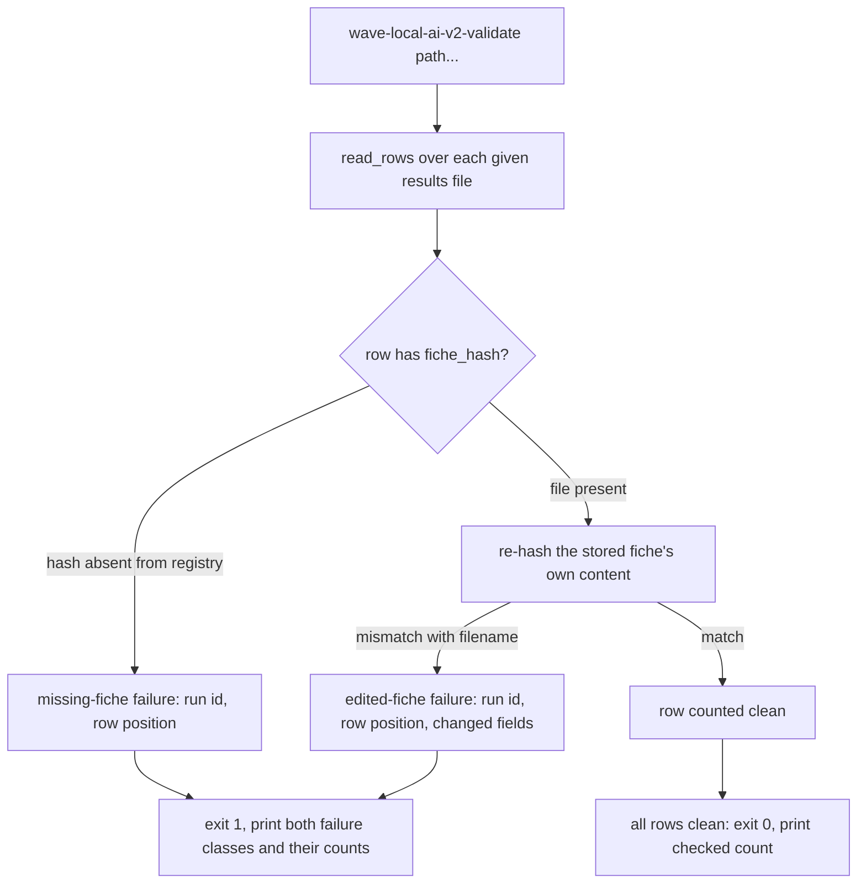
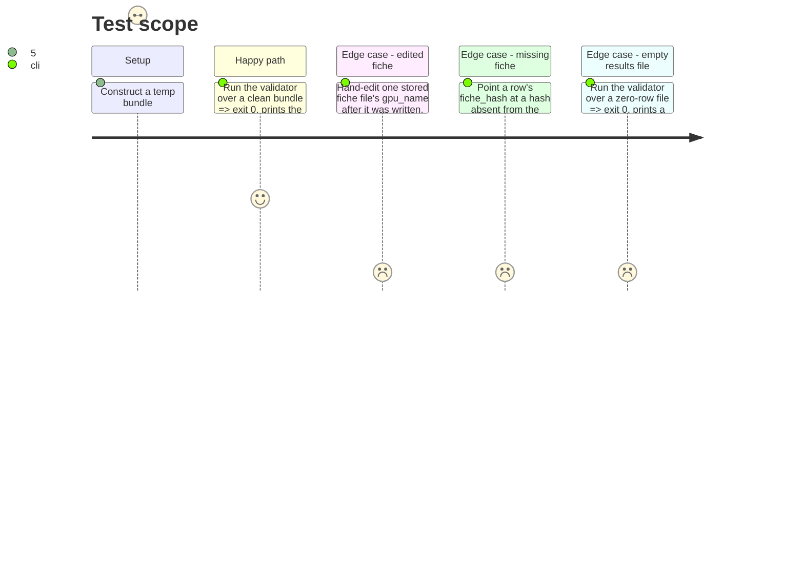

<!-- Fill or omit these sections; never add, rename, or reorder one. -->

# Instruction: Invalidation validator

## Architecture projection

> Tree of the final files. ✅ create · ✏️ modify · ❌ delete

```txt
.
├── src/wave_local_ai_v2/
│   ├── fiche_registry.py      ✏️ verify_fiche helper reused by the validator
│   └── fiche_validator.py     ✅ the check, the two failure classes, the exit code, main()
├── pyproject.toml             ✏️ new console script wave-local-ai-v2-validate
└── tests/
    └── test_fiche_validator.py ✅ new
```

## User Journey



## Test Scope



## Wireframe

<!-- UI phase only. No UI => omit the section, don't invent one. -->

## Tasks to do

### `1)` Add a verification helper to `fiche_registry.py`

> One place computes "does this stored fiche still hash to its own filename", reused by the validator rather than re-implemented.

1. Add `verify_fiche(fiche_hash: str, registry_dir: Path) -> FicheVerification` (a small `TypedDict` or dataclass: `status: Literal["ok", "edited", "missing"]`, `changed_fields: list[str]`).
2. `missing`: `read_fiche` returns `None`.
3. `edited`: the file exists, but `hardware.fiche_hash(stored_fiche)` (recomputed from the file's own current content) does not equal `fiche_hash` (the name it was stored under) — a re-hash of the stored content only, no row involved.
4. **Naming the changed field** (see plan.md's Decisions table): the content-hash mismatch alone only proves *that* the file changed, not *which* field — there is no second copy on disk to diff against, by the write-once design. The registry directory is git-tracked (`.gitignore` decision, phase 1), so `verify_fiche` gets its comparison copy from git: run `git show HEAD:<relative path to the fiche file>` (via `subprocess`, cwd at the repo root reachable from `registry_dir`) and parse it as the pre-edit JSON. Diff its keys against the current file's content field-by-field to build `changed_fields`. Degrade explicitly, never raise, when this isn't available — not in a git repository, the path isn't tracked, or `git` isn't on PATH: set `changed_fields = ["unavailable: <reason>"]` rather than guessing. This mirrors `cpu_temp_source`'s degrade-to-a-named-state discipline (`machine_state.py`) rather than inventing a new silent-failure shape.
5. Tests exercise the git path directly: `test_fiche_validator.py`'s edited-fiche fixture `git init`s the temp registry dir, commits the original fiche, edits the field in place, then runs the validator — a temp directory and a git repository are not mutually exclusive, and this is the only way "names the fiche fields that changed" is actually derivable without inventing a second stored copy the write-once contract doesn't otherwise need.

### `2)` Build the validator command

> A named, non-zero-on-failure command over a results file, not a read-time computation.

1. Create `fiche_validator.py`. `validate_bundle(results_paths: list[Path], registry_dir: Path) -> ValidationReport` (`rows_checked: int`, `edited: list[dict]` naming `run_id`, row position (0-based or 1-based — pick one, document it), and the fiche path; `missing: list[dict]` naming the same plus the absent hash).
2. Read every row of every given path via `results.read_rows` (already tolerant of an absent file). For each row missing `fiche_hash` entirely, treat as `missing` (a pre-hash-era row, same honesty discipline the README already applies to the old reference rows) rather than crashing on a `KeyError`.
3. `main()`: parse `sys.argv[1:]` as zero or more result-file paths; when none given, default to `[settings.results_path, settings.quality_results_path]` from `load_settings()`. Call `validate_bundle`, print the checked count and, when non-empty, each `edited`/`missing` entry on its own line under its class label, `sys.exit(1)` if either list is non-empty, else `sys.exit(0)` with `rows_checked` printed.
4. Wrap `SettingsError` / `OSError` the same way the two existing CLIs do: one line on stderr, exit 1 — no traceback for an operator-facing failure.

### `3)` Register the console script

1. `pyproject.toml`: add `wave-local-ai-v2-validate = "wave_local_ai_v2.fiche_validator:main"` under `[project.scripts]`, alongside the two existing entries.

## Test acceptance criteria

<!-- Each criterion is an observable behavior, not a command. -->

| Task | Acceptance criteria |
| ---- | -------------------- |
| 1... | `verify_fiche` returns `"missing"` for an unwritten hash and `"ok"` for an untouched written fiche; a stored fiche file edited in place (its content changed but its filename left as the original hash) is reported `"edited"` by recomputing the hash of the file's own current content, with no read of any row; when the edit happened inside a git-tracked, committed registry, `changed_fields` names the actual differing key(s) (e.g. `["gpu_name"]`) via a `git show HEAD:...` diff; outside git (or `git` unavailable), `changed_fields` degrades to a named `"unavailable: ..."` reason instead of guessing or raising. |
| 2... | A constructed bundle of rows plus fiches exits 0 with the correct checked count; editing one stored fiche exits non-zero and names the citing row(s) by run id and position under the edited class; a row citing an absent hash exits non-zero under the distinct missing class; a zero-row file exits 0 with a zero count; the validator never calls anything that recomputes a run (no server launch, no roster load beyond what reading JSON needs). |
| 3... | `uv run wave-local-ai-v2-validate --help`-equivalent invocation (no args) resolves to the two settings-configured result paths without raising `SettingsError` when those paths do not exist (an absent live store is zero rows, not a validator failure). |
