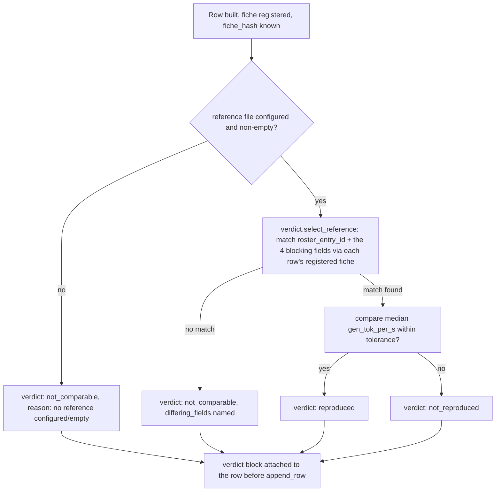

<!-- Fill or omit these sections; never add, rename, or reorder one. -->

# Instruction: Three-state verdict, both CLIs attach it

## Architecture projection

> Tree of the final files. ✅ create · ✏️ modify · ❌ delete

```txt
.
├── src/wave_local_ai_v2/
│   ├── verdict.py              ✅ reference selection, tolerance comparison, three states, deltas
│   ├── settings.py             ✏️ reference file paths + reproduction tolerance
│   ├── row_contract.py         ✏️ verdict required on both row kinds
│   ├── __init__.py             ✏️ attach the runtime verdict before append_row
│   └── quality_cli.py          ✏️ attach the quality verdict before append_row
└── tests/
    └── test_verdict.py         ✅ new, on constructed rows and stubs
```

## User Journey



## Test Scope

```mermaid
---
title: Test scope
---
journey
  section Setup
    Construct reference rows (runtime and quality) with known fiches and medians => ready fixture: 5: system
  section Happy path
    Candidate row's fiche matches a reference's 4 blocking fields, medians equal => verdict reproduced: 5: system
    Quality candidate's per-item predicted labels identical to the matching reference => verdict reproduced: 5: system
  section Edge case - tolerance boundary
    Candidate median 9.9% off the matching reference => reproduced; 10.1% off => not_reproduced: 1: system
  section Edge case - blocking field differs
    Candidate's fiche differs from every reference's fiche in gpu_name only => not_comparable, naming gpu_name: 1: system
  section Edge case - non-blocking field differs
    Candidate's fiche differs from a reference only in cpu or driver => still matched and compared, difference reported but never blocking: 1: system
  section Edge case - empty reference file
    Reference file has zero rows => not_comparable, not not_reproduced: 1: system
  section Edge case - quality label mismatch
    One item's predicted_label differs from the matching reference => verdict not_reproduced, naming the differing item_id: 1: system
```

## Wireframe

<!-- UI phase only. No UI => omit the section, don't invent one. -->

## Tasks to do

### `1)` Settings and row contract

1. `settings.py`: add `DEFAULT_RUNTIME_REFERENCE_PATH = "aidd_docs/results/runtime-reference.jsonl"`, `DEFAULT_QUALITY_REFERENCE_PATH = "aidd_docs/results/quality-reference.jsonl"`, `DEFAULT_RUNTIME_REPRODUCTION_TOLERANCE = 0.10`; fields `runtime_reference_path: Path`, `quality_reference_path: Path`, `runtime_reproduction_tolerance: float`; env vars `RUNTIME_REFERENCE_PATH`, `QUALITY_REFERENCE_PATH`, `RUNTIME_REPRODUCTION_TOLERANCE` (reuse `_require_numeric` for the tolerance, minimum `0.0`). Keep this distinct from `runtime_spread_threshold` (criterion 7) even though both default to `0.10` — they gate different questions and a future PRD revision can move one without the other.
2. `row_contract.py`: add `verdict` to both `"runtime"` and `"quality"` required-field sets. No new structural validation inside `validate_row` beyond presence — `verdict.py` is the single place that can produce a malformed block, so the contract stays a presence gate, consistent with how `sampling`/`repetitions` are already handled.

### `2)` `verdict.py`: runtime verdict

> One primary metric decides the verdict; the rest are reported. Reference matching never uses CPU, RAM, driver or OS.

1. Define the three verdict strings as module constants: `VERDICT_REPRODUCED = "reproduced"`, `VERDICT_NOT_REPRODUCED = "not_reproduced"`, `VERDICT_NOT_COMPARABLE = "not_comparable"`.
2. `runtime_blocking_fields(fiche: dict) -> dict`: project exactly `llama_cpp_build`, `quant`, `gpu_name`, `flags` from a stored fiche dict (read via `fiche_registry.read_fiche`).
3. `select_runtime_reference(candidate_row: dict, reference_rows: list[dict], registry_dir: Path) -> ReferenceMatch | None`: resolve the candidate's fiche; for each reference row (in file order — first match wins, since the reference files are curated single-model snapshots and no tie-break beyond "first" is meaningful here), resolve its fiche too and compare `runtime_blocking_fields`. Return the first row whose blocking fields all equal the candidate's, else `None`.
4. `runtime_verdict(candidate_row: dict, reference_rows: list[dict], registry_dir: Path, tolerance: float) -> dict`:
   - Empty `reference_rows` (or none share `roster_entry_id`, which narrows the search before the field comparison) → `{"verdict": VERDICT_NOT_COMPARABLE, "reference_run_id": None, "differing_fields": [], "reason": "no reference rows configured or matched"}`.
   - No blocking-field match found among non-empty candidates → `VERDICT_NOT_COMPARABLE`, `differing_fields` naming every blocking field that differed against the *closest* reference (fewest differing fields; tie broken by file order) so the report is informative rather than "everything differs."
   - Match found → compute `delta = abs(candidate_row["gen_tok_per_s"] - reference_row["gen_tok_per_s"]) / reference_row["gen_tok_per_s"]`; `VERDICT_REPRODUCED` if `delta <= tolerance` else `VERDICT_NOT_REPRODUCED`.
   - On a match (either reproduced or not_reproduced), also attach: `reference_run_id`, `ttft_ms_delta` and `prompt_tok_per_s_delta` (same relative-delta formula, reported only, never gating), `candidate_machine_state` / `reference_machine_state` (pass through each row's own `machine_state`/`repetitions`-derived summary — reuse whatever the row already carries rather than re-deriving a new shape).

### `3)` `verdict.py`: quality verdict

1. `select_quality_references(candidate_rows: list[dict], reference_rows: list[dict]) -> list[dict]`: reference rows sharing `model_id`, `suite_version` and the candidate's sampling `seed`, matched per item via `item_id`.
2. `quality_verdict(candidate_rows: list[dict], reference_rows: list[dict]) -> dict`: no matching reference rows → `VERDICT_NOT_COMPARABLE` with a reason. Matching rows found → compare `predicted_label` per `item_id` (both sides, including `None`); all equal → `VERDICT_REPRODUCED`; any differing → `VERDICT_NOT_REPRODUCED`, naming the differing `item_id`s. Attach `reference_run_id` the same way the runtime verdict does.

### `4)` Attach the verdict in both CLIs

1. `__init__.py::_run`: after the row dict is built (fiche hash known) but before `append_row`, read reference rows via `results.read_rows(settings.runtime_reference_path)` (empty list if the path doesn't exist — `read_rows` already degrades this way) and call `verdict.runtime_verdict(row, reference_rows, settings.fiche_registry_dir, settings.runtime_reproduction_tolerance)`; set `row["verdict"] = ...`.
2. `quality_cli.py::_score_and_write`: after `scored_items`/rows are built for one (model, provider) batch, read `results.read_rows(settings.quality_reference_path)`, filter to the same `model_id`, and call `verdict.quality_verdict(this_batch_rows, matching_reference_rows)`; attach the same `verdict` block to every row of that batch (the verdict is per suite-run, not per item, so every row of one (model, provider) batch shares it — same pattern `suite_accuracy` already uses).

## Test acceptance criteria

<!-- Each criterion is an observable behavior, not a command. -->

| Task | Acceptance criteria |
| ---- | -------------------- |
| 1... | `Settings` carries the three new fields with the stated defaults; `row_contract.REQUIRED_FIELDS` requires `verdict` on both kinds. |
| 2... | Equal medians against a matching reference → `reproduced`; 9.9% delta → `reproduced`, 10.1% → `not_reproduced`; a differing `gpu_name` alone (all else matching) → `not_comparable` naming `gpu_name`; a differing `cpu` or `gpu_driver_version` alone still finds the match and reports the run without blocking; an empty reference list → `not_comparable`, never `not_reproduced`. |
| 3... | Identical per-item `predicted_label`s against the matching reference → `reproduced` quality verdict; one differing label → `not_reproduced` naming that `item_id`; no matching reference (different `model_id`/`suite_version`/seed) → `not_comparable`. |
| 4... | A stubbed-server `wave-local-ai-v2` run against a temp reference file produces a row whose `verdict` block is present and internally consistent with the reference given; a stubbed `wave-local-ai-v2-quality` run attaches one verdict per (model, provider) batch, identical across every row of that batch. |
