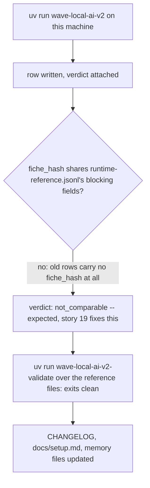

<!-- Fill or omit these sections; never add, rename, or reorder one. -->

# Instruction: Live run, evidence, docs and memory

## Architecture projection

> Tree of the final files. ✅ create · ✏️ modify · ❌ delete

```txt
.
├── aidd_docs/results/
│   ├── fiches/                 ✏️ one real fiche file from the live run
│   └── README.md               ✏️ record the expected not_comparable outcome and why
├── CHANGELOG.md                ✏️ Unreleased entry for the three stories
├── docs/setup.md               ✏️ validator command, fiches directory
└── aidd_docs/memory/
    ├── cli.md                  ✏️ third command
    └── codebase-map.md         ✏️ fiche_registry.py, fiche_validator.py, verdict.py
```

## User Journey



## Test Scope

```mermaid
---
title: Test scope
---
journey
  section Setup
    A quiet thermal window on the bench machine, .env pointing at the roster's shipped entry => ready to run: 5: system
  section Happy path
    uv run wave-local-ai-v2 => one row written, carrying fiche_hash and a verdict block: 5: cli
    uv run wave-local-ai-v2-validate aidd_docs/results/runtime-reference.jsonl aidd_docs/results/quality-reference.jsonl => exits 0, prints checked counts (the reference rows carry no fiche_hash yet -- read them post-story-19; today's check is over this run's own fresh store instead): 5: cli
  section Edge case - old reference rows carry no fiche_hash
    Run's verdict computed against runtime-reference.jsonl => not_comparable, recorded as the expected outcome this run demonstrates, not a bug: 1: system
  section Teardown
    Record the observed values in aidd_docs/results/README.md and CHANGELOG.md => evidence committed: 5: system
```

## Wireframe

<!-- UI phase only. No UI => omit the section, don't invent one. -->

## Tasks to do

### `1)` One live runtime run on this machine

> Confirms the whole chain end to end against real hardware, not stubs.

1. Run `uv run wave-local-ai-v2` once (default settings: `RUNTIME_REPETITIONS=5`, `RUNTIME_COOLDOWN_S=10.0`), the same protocol the previous increment's evidence row used.
2. Confirm the written row: carries `fiche_hash` (no inline `cpu`/`gpu_name`/`llama_cpp_build`/`quant`/`flags` at the top level any more), and a `verdict` block.
3. Expect `verdict.verdict == "not_comparable"`: `runtime-reference.jsonl`'s three rows predate `fiche_hash` entirely (per `aidd_docs/results/README.md`'s existing "What is deliberately absent" section), so no reference row can share the candidate's blocking fields. Confirm this is what happened (not a bug in `select_runtime_reference` — read its `differing_fields`/reason and check it names the absence correctly) before moving on.
4. Run `uv run wave-local-ai-v2-validate` (default paths) and separately over `aidd_docs/results/runtime-reference.jsonl aidd_docs/results/quality-reference.jsonl` explicitly: both must exit 0 today (the reference rows' fiches, if any were ever registered for them, are untouched; more likely they have no `fiche_hash` at all and the validator's "missing" class fires per-row for that reason — confirm which, and record it plainly rather than papering over it).
5. Commit the new fiche file(s) this run wrote under `aidd_docs/results/fiches/` (tracked directory, per plan.md's Resources) as part of this phase's evidence, not left as an untracked live artifact.

### `2)` Update `aidd_docs/results/README.md`

1. Add a section (or extend the existing "What is deliberately absent" one) stating: the current `runtime-reference.jsonl` and `quality-reference.jsonl` rows carry no `fiche_hash` and no `verdict`, so a re-run against them today always reports `not_comparable` — by design, not a defect, and exactly what story 19 (regenerating these files) resolves.
2. Record this increment's live run's observed `verdict` block and its `differing`/`reason` content as the evidence for stories 15 and 16, the same way the file already documents prior increments' live rows.

### `3)` `CHANGELOG.md`

1. Add an `### Added` entry under `[Unreleased]` describing: the fiche is now a stored, hash-cited artifact (registry directory, normalised projection excluding flags/path/host/port); `wave-local-ai-v2-validate` detects an edited or missing fiche; every runtime and quality row now carries a `verdict` block (`reproduced` / `not_reproduced` / `not_comparable`) computed and stored by the harness against a configured reference file.

### `4)` `docs/setup.md`

1. Add the validator command (`uv run wave-local-ai-v2-validate [paths...]`) to whichever section already lists the two existing CLI commands, or a new short section if none does — read the file's current structure before placing it.
2. Mention the `aidd_docs/results/fiches/` directory: tracked, write-once, populated by both CLIs on every run.

### `5)` `aidd_docs/memory/cli.md` and `codebase-map.md`

1. `cli.md`: add the validator as the third command, its default paths, and its two failure classes, following the existing entries' terseness.
2. `codebase-map.md`: add `fiche_registry.py`, `fiche_validator.py` and `verdict.py` to the module listing, and the new `wave-local-ai-v2-validate` entry point to the Entry points list.

## Test acceptance criteria

<!-- Each criterion is an observable behavior, not a command. -->

| Task | Acceptance criteria |
| ---- | -------------------- |
| 1... | A real row exists in this machine's `runtime.jsonl` (or wherever `RUNTIME_RESULTS_PATH` points) carrying `fiche_hash` and a `verdict` block whose value is `not_comparable`, with a reason/differing-fields report that correctly names the absence of a matching reference; `wave-local-ai-v2-validate` exits 0 against both reference files; the fiche file(s) this run produced are committed under `aidd_docs/results/fiches/`. |
| 2... | `README.md` states the not-comparable-until-story-19 fact plainly and records this run's observed verdict block. |
| 3... | `CHANGELOG.md`'s `[Unreleased]` section names all three shipped capabilities. |
| 4... | `docs/setup.md` documents the validator command and the fiches directory in a place a first-time reader would find them alongside the other two commands. |
| 5... | `cli.md` lists three commands; `codebase-map.md` lists the three new modules and the new entry point. |
