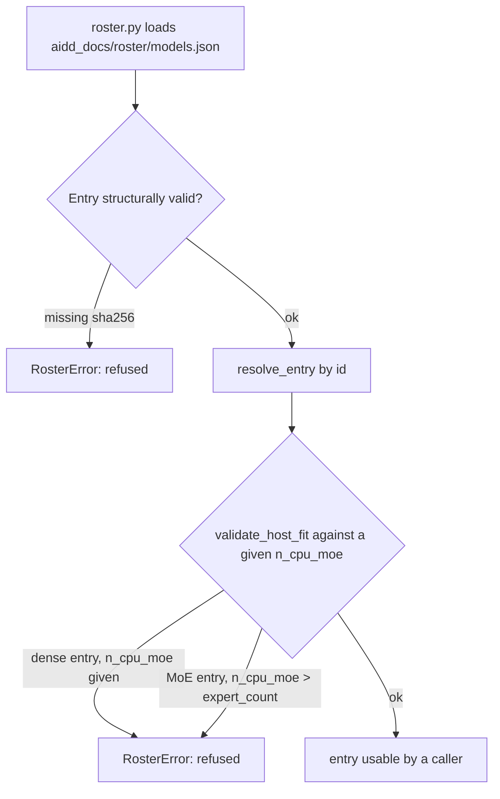
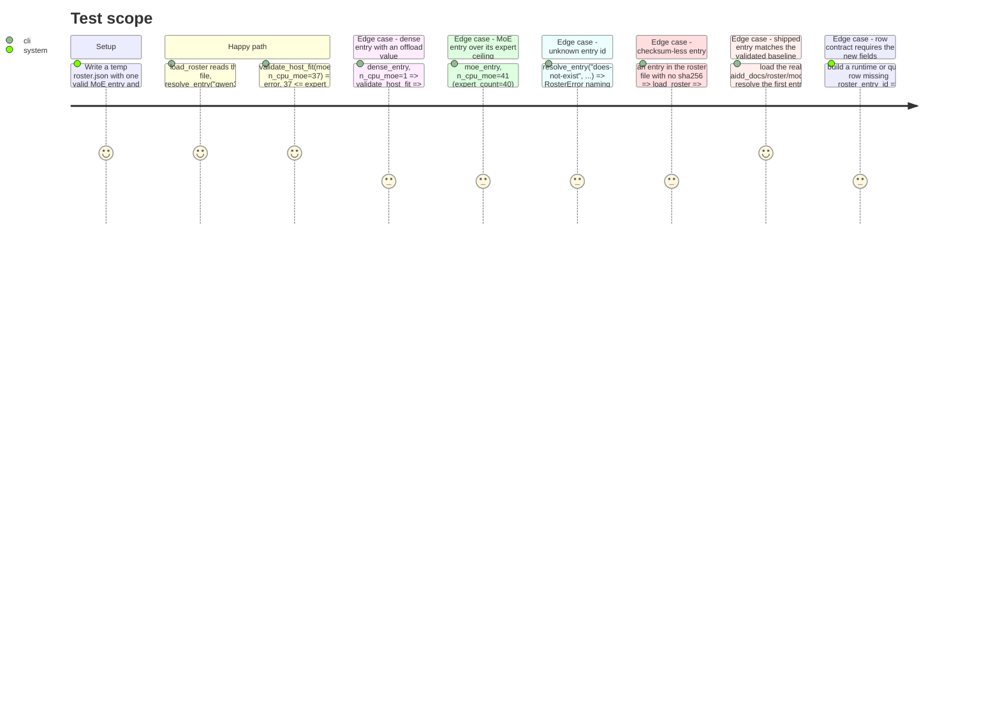

<!-- Fill or omit these sections; never add, rename, or reorder one. -->

# Instruction: Roster file and validation

## Architecture projection

> Tree of the final files. ✅ create · ✏️ modify · ❌ delete

```txt
.
├── aidd_docs/
│   └── roster/
│       └── models.json                 ✅ create
├── src/wave_local_ai_v2/
│   ├── roster.py                       ✅ create
│   ├── row_contract.py                 ✏️ modify (roster_entry_id, roster_version required fields)
│   ├── settings.py                     ✏️ modify (roster_path, roster_entry_id settings)
│   ├── __init__.py                     ✏️ modify (populate roster_entry_id/roster_version on the runtime row)
│   └── quality_cli.py                  ✏️ modify (populate roster_entry_id/roster_version on quality rows)
└── tests/
    ├── test_roster.py                  ✅ create
    ├── test_cli.py                     ✏️ modify (assert new fields on the stubbed row)
    └── test_quality_cli.py             ✏️ modify (assert new fields on the stubbed rows)
```

## User Journey



## Test Scope



## Tasks to do

### `1)` Author the roster file

> One tracked entry pinning the validated baseline model, split per the plan's flag decision.

1. Create `aidd_docs/roster/models.json`:
   - Top level: `roster_version` (integer, start at `1`), `entries` (object keyed by entry id).
   - Entry id: `"qwen3.6-35b-a3b-ud-iq4xs"`.
   - Entry fields, sourced from `docs/setup.md` step 3 verbatim: `repo` (`"unsloth/Qwen3.6-35B-A3B-GGUF"`), `revision` (`"main"`), `file` (`"Qwen3.6-35B-A3B-UD-IQ4_XS.gguf"`), `quant` (`"UD-IQ4_XS"`), `sha256` (`"649d7508507b84638732c4f52c24c8b15843c6dca2f3ff793ae07c14a67ebbb3"`). <!-- pragma: allowlist secret -->
   - `architecture` block: `kind` (`"moe"`), `expert_count` (`40`, from `context_input/baseline_qwen36.md`'s "40 couches exactement... plafond"), `active_params_b` (`3.1`, from `context_input/model_candidates.md`'s "35B / 3.1B").
   - `server_flags` block: every model-intrinsic flag from `context_input/baseline_qwen36.md`'s validated command, excluding `--n-cpu-moe`, `-t`, `--host`, `--port` (host settings or server-address, not model data): `n_gpu_layers` (99), `context_size` (32768), `flash_attention` (`"on"`), `jinja` (`true`), `parallel_slots` (1), `load_mode` (`"none"`), and a `sampler` sub-object mirroring `server.SAMPLER_SETTINGS` (`temperature` 1.0, `top_p` 0.95, `top_k` 20, `min_p` 0, `presence_penalty` 1.5).
   - `validated_host` block: `n_cpu_moe` (37), `threads` (8), `fiche_summary` (one line describing the machine this was validated on — consumer NVIDIA laptop GPU, ~6 GB VRAM, Windows, matching `docs/setup.md`'s "Windows, NVIDIA GPU" fiche and `context_input/baseline_qwen36.md`'s VRAM figures).
2. Do not add a second entry: which models populate the roster belongs to `quality-scored-comparison-first-three-use-cases` per story 12's own boundary.

### `2)` Write `roster.py`

> Load, validate, resolve — the module every later phase imports.

1. Define a `RosterError(ValueError)` (or similar) raised by every failure mode below, always naming the entry id or field at fault.
2. `load_roster(path: Path) -> RosterFile` (a small dataclass or `TypedDict` wrapping `roster_version` and a dict of entries): parses the JSON, and for every entry, refuses (raises `RosterError`) one missing `sha256` or any other required field (`repo`, `revision`, `file`, `quant`, `architecture`, `server_flags`, `validated_host`).
3. `resolve_entry(roster: RosterFile, entry_id: str) -> RosterEntry`: raises `RosterError` naming the unknown id when absent.
4. `validate_host_fit(entry: RosterEntry, n_cpu_moe: int | None) -> None`: raises `RosterError` when `entry.architecture.kind == "dense"` and `n_cpu_moe` is not `None`; raises when `kind == "moe"` and `n_cpu_moe is not None and n_cpu_moe > entry.architecture.expert_count`. Passes silently otherwise (including an MoE entry with `n_cpu_moe=None`, since that's a caller decision outside this rule's scope).
5. Expose whatever flag-building helper phase 2 will need to turn `entry.server_flags` into the same ordered list shape `server.build_flags` already returns (a plain function is enough; the wiring into `server.py` itself is phase 2's job) — do not import `server.py` from `roster.py` to avoid a cycle; phase 2 imports `roster` from `server.py`, not the reverse.

### `3)` Extend the row contract

> Both row kinds cite the roster; the writer gate enforces it.

1. In `row_contract.py`, add `"roster_entry_id"` and `"roster_version"` to both `REQUIRED_FIELDS["runtime"]` and `REQUIRED_FIELDS["quality"]`.
2. In `settings.py`, add `roster_path: Path` (default `Path("aidd_docs/roster/models.json")`, loaded from `ROSTER_PATH`, no existence check at settings-load time the way `SLM_MODELS_DIR` gets one — a missing roster file is `roster.py`'s failure to raise, not settings') and `roster_entry_id: str` (default `"qwen3.6-35b-a3b-ud-iq4xs"`, loaded from `ROSTER_ENTRY_ID`).
3. In `__init__.py` and `quality_cli.py`, populate `roster_entry_id` and `roster_version` on every written row using `roster.load_roster(settings.roster_path)` and `settings.roster_entry_id` — this is the minimal wiring needed to keep the row contract-complete; it does not yet replace `MODEL_RELATIVE_PATH`, `QUANT`, `LLAMA_CPP_BUILD` or `server.build_flags`'s constants (phase 2's job). Load the roster once per run, not once per row.
4. Update `tests/test_cli.py` and `tests/test_quality_cli.py`'s row-shape assertions (or add one each) to check `roster_entry_id`/`roster_version` are present and match the fixture roster used in tests — stub `settings.roster_path` to a small temp roster file in the existing `stubbed_run` fixtures rather than depending on the real tracked file, so these tests don't couple to `aidd_docs/roster/models.json`'s content.

## Test acceptance criteria

<!-- Each criterion is an observable behavior, not a command. -->

| Task | Acceptance criteria |
| ---- | -------------------- |
| 1 | `aidd_docs/roster/models.json` parses as valid JSON; its one entry's `repo`/`revision`/`file`/`quant`/`sha256` match `docs/setup.md` step 3 verbatim; `architecture.kind == "moe"`, `architecture.expert_count == 40`; `validated_host == {"n_cpu_moe": 37, "threads": 8, "fiche_summary": <str>}`. |
| 2 | `roster.load_roster` returns a valid roster from a well-formed file and raises `RosterError` on a checksum-less entry; `resolve_entry` raises on an unknown id; `validate_host_fit` raises for a dense entry given any `n_cpu_moe`, raises for an MoE entry given `n_cpu_moe` above `expert_count`, and passes for a value at or below the ceiling. All four behaviors covered in `tests/test_roster.py`, run via `uv run pytest tests/test_roster.py -v`. |
| 3 | A runtime row and a quality row built by `_run()` (stubbed server/HTTP, as the existing tests already do) both carry `roster_entry_id` and `roster_version`; `row_contract.validate_row` raises `RowContractError` when either is absent from a constructed row. `uv run pytest tests/test_cli.py tests/test_quality_cli.py tests/test_row_contract.py -v` passes, and the full suite (`uv run pytest`) stays green. |
