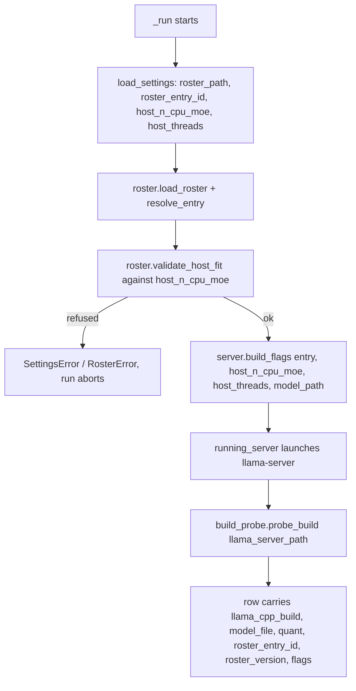

<!-- Fill or omit these sections; never add, rename, or reorder one. -->

# Instruction: Server, CLIs and build probe resolve through the roster

## Architecture projection

> Tree of the final files. ✅ create · ✏️ modify · ❌ delete

```txt
.
├── src/wave_local_ai_v2/
│   ├── build_probe.py                  ✅ create
│   ├── server.py                       ✏️ modify (build_flags takes a roster entry + host values; N_CPU_MOE/THREADS deleted)
│   ├── settings.py                     ✏️ modify (host_n_cpu_moe, host_threads settings)
│   ├── __init__.py                     ✏️ modify (resolve model/quant/build through roster + build_probe; LLAMA_CPP_BUILD, MODEL_RELATIVE_PATH, QUANT constants deleted; launch refused on a flag mismatch)
│   └── quality_cli.py                  ✏️ modify (resolve model/quant through roster; MODEL_RELATIVE_PATH constant deleted)
└── tests/
    ├── test_build_probe.py             ✅ create
    ├── test_server.py                  ✏️ modify (build_flags signature, roster-driven flag list, launch refusal on mismatch)
    ├── test_cli.py                     ✏️ modify (build/model/quant come from the probe and roster)
    └── test_quality_cli.py             ✏️ modify (model/quant come from the roster)
```

## User Journey



## Test Scope

```mermaid
---
title: Test scope
---
journey
  section Setup
    Stub subprocess.run for build_probe; stub a temp roster with one MoE entry => fixtures ready: 5: system
  section Happy path
    probe_build parses "version: 0.1.2-dev (build 10537, commit bf0040e15)" from stderr => returns "b10537": 5: cli
    server.build_flags(entry, host_n_cpu_moe=37, host_threads=8, model_path) => the exact validated flag list, byte for byte: 5: cli
    _run() writes a row whose llama_cpp_build/model_file/quant/flags all trace to the probe and the roster, none to a source constant: 5: cli
  section Edge case - unparseable version banner
    subprocess.run returns stdout/stderr with no "build <n>" pattern => probe_build returns None, no exception: 3: cli
  section Edge case - failed invocation
    subprocess.run raises OSError or times out => probe_build returns None, no exception: 3: cli
  section Edge case - flag/roster mismatch refuses the launch
    a resolved flag set that does not match the roster entry's server_flags => the run raises before starting llama-server: 3: cli
  section Teardown
    No real llama-server is started by any test in this phase => process list unchanged: 5: system
```

## Tasks to do

### `1)` `build_probe.py`

> Reads the build the running binary actually reports.

1. `probe_build(server_path: Path) -> str | None`: runs `[str(server_path), "--version"]` via `subprocess.run(..., capture_output=True, text=True, timeout=<a few seconds>)`.
2. Read **stderr**, not stdout — verified live on this machine (`plan.md`'s Resources table): the b10537 binary prints its version banner to stderr with exit code 0 and empty stdout.
3. Match `r"build (\d+)"` against the captured stderr; on a match, return `f"b{match.group(1)}"` (matches the `"b10537"` convention the deleted constant used). On no match, or any `OSError`/`subprocess.TimeoutExpired`/`subprocess.SubprocessError` from the call itself, return `None` — never raise, never assume a value.
4. `tests/test_build_probe.py`: stub `subprocess.run` (do not invoke a real binary) to cover a real-shaped banner parsing to `"b10537"`, an unparseable banner returning `None`, and a failed invocation (raise inside the stub) returning `None` rather than propagating.

### `2)` `server.py`: flags from a roster entry and host values

> `build_flags` stops reading module constants for anything the roster or host settings now own.

1. Delete `N_CPU_MOE` and `THREADS` module constants. Keep `HOST`, `PORT`, and the other constants that are neither model-intrinsic nor host-fitted (`N_GPU_LAYERS`, `CONTEXT_SIZE`, `FLASH_ATTENTION`, `PARALLEL_SLOTS`, the sampler constants) only if phase 1's `roster.py` flag-building helper doesn't already supersede them — prefer sourcing every model-intrinsic flag from the roster entry's `server_flags` block so there is exactly one place each value lives. `SAMPLER_SETTINGS` may stay as a `server.py`-level derived export (built from the roster entry passed in) since `quality_cli.py`'s `LOCAL_SAMPLING` comment references it by name.
2. Change `build_flags`'s signature to take the roster entry, `host_n_cpu_moe: int`, `host_threads: int` and `model_path: Path`, and build the same ordered flag list as before, sourcing `--n-cpu-moe` and `-t` from the two host parameters and everything else from `entry.server_flags`.
3. Add a call to `roster.validate_host_fit(entry, host_n_cpu_moe)` at the top of `build_flags` (or immediately before calling it in each CLI — pick one call site, not both, and say which in a one-line comment) so a mismatched flag set refuses before `running_server` ever spawns a process.
4. Update `tests/test_server.py::test_build_flags_matches_baseline` to build the flag list from the shipped roster entry plus `host_n_cpu_moe=37, host_threads=8` and assert the exact same list the old test asserted — this is the phase's first byte-identical checkpoint (phase 3 adds the frozen-baseline-list version of the same check). Add a test asserting a dense-entry/over-ceiling host value refuses via `roster.RosterError` before any process spawns.

### `3)` `__init__.py`: runtime row resolves through the roster

1. Delete `LLAMA_CPP_BUILD`, `MODEL_RELATIVE_PATH`, `QUANT` module constants.
2. In `_run()`: load the roster (once), resolve the entry from `settings.roster_entry_id`, resolve `model_path` as `settings.slm_models_dir / entry.file` (the roster's `file` field replaces the hardcoded relative path — note `docs/setup.md`'s download step already places the file at `<SLM_MODELS_DIR>/Qwen3.6-35B-A3B/<file>`; phase 3's docs update reconciles the download path with however the roster's `file` field is shaped, e.g. including the subdirectory or not — pick one and keep `docs/setup.md` consistent with it).
3. Build `flags` via the new `server.build_flags(entry, settings.host_n_cpu_moe, settings.host_threads, model_path)`.
4. Call `build_probe.probe_build(settings.llama_server_path)` once (before or after the server starts — probing the binary itself doesn't need the server running, so before is simpler and doesn't cost readiness-wait time) and use its result for the row's `llama_cpp_build`, explicit `None` on an unreadable build rather than a fallback string.
5. Row's `model_file` becomes `entry.file` (or its basename, matching today's `MODEL_RELATIVE_PATH.name` shape), `quant` becomes `entry.quant`.
6. `settings.py`: add `host_n_cpu_moe: int` (default 37, env `SERVER_N_CPU_MOE`, same `_require_numeric` pattern as the runtime settings, minimum 0) and `host_threads: int` (default 8, env `SERVER_THREADS`, minimum 1).

### `4)` `quality_cli.py`: same roster resolution, no build probe

1. Delete `MODEL_RELATIVE_PATH` (keep `LOCAL_MODEL_ID` if it's still used as the row's `model_id` — check whether it should become `entry.repo` or stay a separate display id; if kept, source it from the roster entry rather than a literal so it can't drift from the entry `_local_model_path` resolves).
2. Resolve `model_path` and `flags` through `roster.load_roster`/`resolve_entry`/`server.build_flags` exactly as in `__init__.py`, using `settings.host_n_cpu_moe`/`host_threads`.
3. Quality rows don't carry `llama_cpp_build` (not in `REQUIRED_FIELDS["quality"]`), so no `build_probe` call is needed here — only `roster_entry_id`/`roster_version` (already wired in phase 1) plus the model path/quant resolution change.

## Test acceptance criteria

<!-- Each criterion is an observable behavior, not a command. -->

| Task | Acceptance criteria |
| ---- | -------------------- |
| 1 | `probe_build` returns `"b10537"` when stubbed with the real captured banner text on stderr; returns `None` on an unparseable banner and on a stubbed subprocess failure, in both cases without raising. `uv run pytest tests/test_build_probe.py -v` passes and starts no real subprocess. |
| 2 | `server.build_flags` produces the exact validated flag list from the shipped roster entry and host defaults 37/8; a dense-entry-with-offload or over-ceiling-MoE combination raises `roster.RosterError` before any `subprocess.Popen` call. `uv run pytest tests/test_server.py -v` passes. |
| 3 | A runtime row's `llama_cpp_build`, `model_file`, `quant` and `flags` all trace to `build_probe`/`roster`/`server.build_flags`, and grepping `__init__.py` finds no `LLAMA_CPP_BUILD`, `MODEL_RELATIVE_PATH`, or `QUANT` constant. `uv run pytest tests/test_cli.py -v` passes. |
| 4 | A quality row's model path and `quant`-bearing fields trace to the roster; grepping `quality_cli.py` finds no `MODEL_RELATIVE_PATH` constant. `uv run pytest tests/test_quality_cli.py -v` passes, and the full suite (`uv run pytest`) stays green. |
