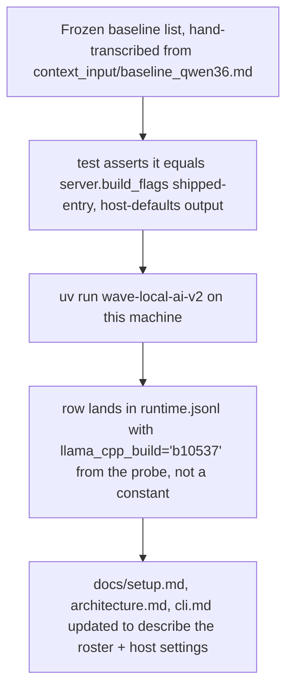

<!-- Fill or omit these sections; never add, rename, or reorder one. -->

# Instruction: Byte-identical proof and documentation

## Architecture projection

> Tree of the final files. ✅ create · ✏️ modify · ❌ delete

```txt
.
├── tests/
│   └── test_launch_byte_identical.py   ✅ create
├── CHANGELOG.md                        ✏️ modify
├── docs/setup.md                       ✏️ modify (roster is where the model is declared; .env gains host values)
└── aidd_docs/memory/
    ├── architecture.md                 ✏️ modify (roster as the model/flag source of truth)
    └── cli.md                          ✏️ modify (host env vars, roster entry id)
```

## User Journey



## Test Scope

```mermaid
---
title: Test scope
---
journey
  section Setup
    Transcribe the exact validated flag list from context_input/baseline_qwen36.md into a frozen constant in the new test file => baseline recorded independent of server.py: 5: system
  section Happy path
    uv run pytest tests/test_launch_byte_identical.py => the roster+host-default-built command equals the frozen baseline list, field for field: 5: cli
    uv run wave-local-ai-v2 on the bench machine => a runtime row is appended with llama_cpp_build == "b10537" (the probed value, matching the pinned build docs/setup.md names) and roster_entry_id == the shipped entry id: 5: cli
  section Edge case - none
    (covered in phases 1-2; this phase only adds the cross-check and the live proof): 3: system
```

## Tasks to do

### `1)` Byte-identical regression test

> A frozen, independently-transcribed copy of the baseline command, so a future edit to `server.py`, the roster file, or the settings defaults cannot silently drift from `context_input/baseline_qwen36.md` without this test catching it.

1. `tests/test_launch_byte_identical.py`: hand-transcribe the flag list from `context_input/baseline_qwen36.md`'s "Commande retenue" section as a literal constant in the test file (not imported from `server.py`, so the test can't pass by construction).
2. Load the real shipped `aidd_docs/roster/models.json`, resolve its one entry, call `server.build_flags(entry, host_n_cpu_moe=37, host_threads=8, model_path=<any placeholder path>)`, and assert the result equals the frozen list (substituting the placeholder path for `-m`'s value, since the baseline's `<gguf>` is a placeholder too).
3. This is deliberately a second, independent check from `test_server.py`'s own baseline assertion (phase 2): that one guards `server.py`'s behavior against its own prior test; this one guards the roster file's shipped content against the original validated source document.

### `2)` Live run on this machine

> Not a pytest — a real invocation proving the probe and the roster produce a real row.

1. Run `uv run wave-local-ai-v2` on this machine (the GPU-bearing machine `docs/setup.md` already requires for this command).
2. Confirm the appended row in `runtime.jsonl` (or wherever `RUNTIME_RESULTS_PATH` points) carries `llama_cpp_build == "b10537"` — the value `build_probe.probe_build` read from the live binary, not a source constant — and `roster_entry_id`/`roster_version` matching the shipped roster.
3. Record the command's stdout line (the existing `gen_tok_per_s=... -> <path>` summary) as evidence in this phase file's own execution notes (not committed to the repo beyond the row itself) or in the implement step's report — this is the "one live run... showing the probed build" the plan's phase description asks for.

### `3)` Documentation

1. `CHANGELOG.md`, under `## [Unreleased]` → `### Added`: one entry stating the roster file now pins the model's identity and flag set, and that server flags, model file and llama.cpp build resolve through it and host settings rather than source constants; name the two host settings (`SERVER_N_CPU_MOE`, `SERVER_THREADS`) and that `LLAMA_CPP_BUILD` is now a live probe.
2. `docs/setup.md`:
   - Step 3 ("Get the model weights"): note that the repo/revision/file/checksum values it lists are also the ones `aidd_docs/roster/models.json`'s entry pins, and that a mismatch between the two is a bug, not a choice.
   - Step 4 (`.env` configuration): document the two new host-fitted env vars (`SERVER_N_CPU_MOE`, `SERVER_THREADS`, defaults 37/8) and `ROSTER_PATH`/`ROSTER_ENTRY_ID` if they're expected to ever be overridden by a reader following this walkthrough (state plainly if they're not, since the tracked roster file ships with one entry).
   - The GPU deployment section's note about `-ngl 99` and `--n-cpu-moe 37` living in `src/wave_local_ai_v2/server.py` (docs/setup.md's existing NVIDIA GPU subsection) needs updating: `--n-cpu-moe` is now a host setting (`.env`/`SERVER_N_CPU_MOE`), not a `server.py` constant to hand-edit.
3. `aidd_docs/memory/architecture.md`: add or amend a bullet under Gotchas or Key decisions stating the roster file is now the source of the model's identity, architecture and flag set, and that `server.py`/`__init__.py`/`quality_cli.py` no longer hardcode them — link `[[cli]]`-style if the memory format used elsewhere in this file supports it, otherwise plain prose.
4. `aidd_docs/memory/cli.md`: note the two new host env vars and that the roster entry id (`ROSTER_ENTRY_ID`, default the shipped baseline entry) selects which roster entry a run uses.

## Test acceptance criteria

<!-- Each criterion is an observable behavior, not a command. -->

| Task | Acceptance criteria |
| ---- | -------------------- |
| 1 | `uv run pytest tests/test_launch_byte_identical.py -v` passes; the frozen list in the test file and `context_input/baseline_qwen36.md`'s command read identically field for field on manual inspection. |
| 2 | A real row exists in the runtime results file with `llama_cpp_build == "b10537"`, `roster_entry_id` and `roster_version` matching the shipped roster, produced by an actual `uv run wave-local-ai-v2` invocation on this machine (not a stub) — quote the row's relevant fields or the command's stdout line as evidence when reporting this phase done. |
| 3 | `CHANGELOG.md` has a new `### Added` bullet under `[Unreleased]`; `docs/setup.md` describes the roster's role and the two host env vars; `aidd_docs/memory/architecture.md` and `cli.md` no longer describe the model/flags as source constants. `git diff --stat` for this task touches only these four files. |
