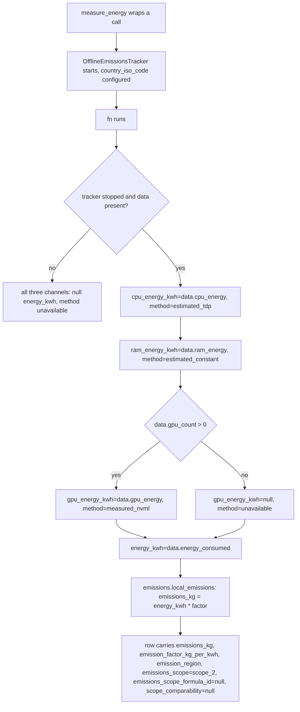
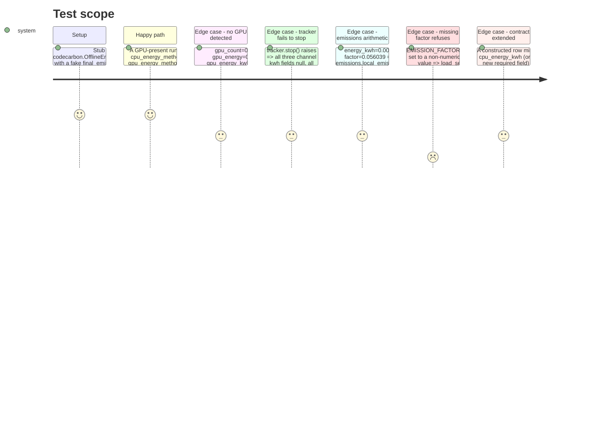

<!-- Fill or omit these sections; never add, rename, or reorder one. -->

# Instruction: Per-channel energy + emissions module + contract

## Architecture projection

> Tree of the final files. ✅ create · ✏️ modify · ❌ delete

```txt
.
├── src/
│   └── wave_local_ai_v2/
│       ├── energy.py            ✏️ modify — per-channel EnergyResult, OfflineEmissionsTracker, single-label derivation deleted
│       ├── emissions.py         ✅ create — offline factor/region, Scope-2 conversion, Scope-3 formula (formula id, not yet wired to a caller)
│       ├── settings.py          ✏️ modify — emission_country_iso_code, emission_region, emission_factor_kg_per_kwh, scope3_wh_per_token
│       ├── aggregation.py       ✏️ modify — cpu_energy_kwh/gpu_energy_kwh/ram_energy_kwh join AGGREGATION_LABELS
│       └── row_contract.py      ✏️ modify — energy_method removed; per-channel + emissions/scope fields added to both REQUIRED_FIELDS kinds
└── tests/
    ├── test_energy.py           ✏️ modify — stub codecarbon.OfflineEmissionsTracker, assert per-channel labels
    ├── test_emissions.py        ✅ create
    ├── test_settings.py         ✏️ modify
    ├── test_aggregation.py      ✏️ modify
    └── test_row_contract.py     ✏️ modify — fixture rows carry the new required fields
```

## User Journey



## Test Scope



## Tasks to do

### `1)` Per-channel energy in `energy.py`

> Delete the single-label derivation; return three independently-labelled channels plus the composite total.

1. Change the import to `from codecarbon import OfflineEmissionsTracker` (still inside the `try` in `measure_energy`, unchanged failure handling). Accept a new required keyword `country_iso_code: str` on `measure_energy`, passed to `OfflineEmissionsTracker(country_iso_code=country_iso_code, output_methods=[], log_level="error")`.
2. Replace `EnergyResult` with:
   ```python
   class EnergyResult(TypedDict):
       cpu_energy_kwh: float | None
       cpu_energy_method: str
       gpu_energy_kwh: float | None
       gpu_energy_method: str
       ram_energy_kwh: float | None
       ram_energy_method: str
       energy_kwh: float | None
   ```
3. On tracker-init failure or `not stopped` or `data is None`: return all seven fields as the "unavailable" case — every `*_kwh` is `None`, every `*_method` is `"unavailable"`, `energy_kwh` is `None`. Delete the module's lines 52-55 (the `gpu_energy > 0` composite-label derivation) entirely — no line in the new module derives `energy_kwh`'s label from any single channel.
4. On success: `cpu_energy_kwh=data.cpu_energy`, `cpu_energy_method="estimated_tdp"` (module-level constant, `ENERGY_METHOD_ESTIMATED_TDP`); `ram_energy_kwh=data.ram_energy`, `ram_energy_method="estimated_constant"` (`ENERGY_METHOD_ESTIMATED_CONSTANT`); GPU: `data.gpu_count > 0` -> `gpu_energy_kwh=data.gpu_energy`, `gpu_energy_method="measured_nvml"` (`ENERGY_METHOD_MEASURED_NVML`); else `gpu_energy_kwh=None`, `gpu_energy_method="unavailable"` (`ENERGY_METHOD_UNAVAILABLE`). `energy_kwh=data.energy_consumed`.
5. Update the module docstring: it currently claims `energy_method` reflects "the GPU figure" — rewrite to describe the three independently-labelled channels and cite the RAM-is-always-estimated and CPU-is-always-TDP facts from this phase's Resources.

### `2)` `emissions.py`

> The offline factor/region as configured values, and the local Scope-2 conversion. The Scope-3 formula is defined here but not yet called by any CLI (phase 3 wires it into the quality path).

1. Create `src/wave_local_ai_v2/emissions.py`. Module docstring cites `global_energy_mix.json`'s `"FRA"` entry (path + year, from this phase's Resources) as the source of the default factor.
2. Constants: `EMISSIONS_SCOPE_2 = "scope_2"`, `EMISSIONS_SCOPE_3 = "scope_3"`, `SCOPE3_FORMULA_ID = "scope3-v1-wh-per-token"`, `SCOPE_COMPARABILITY_NOTE = "not like-for-like: no local Scope-3 component exists yet (facility overhead, hardware amortization)"` (exact wording confirmed at implementation time against the story's acceptance line).
3. `def local_emissions(energy_kwh: float | None, factor_kg_per_kwh: float) -> float | None`: returns `None` when `energy_kwh` is `None` (the tracker was unavailable — no fabricated emissions off a missing measurement); else `energy_kwh * factor_kg_per_kwh`.
4. `def scope3_cloud_emissions(total_tokens: int, wh_per_token: float, factor_kg_per_kwh: float) -> tuple[float, float]`: returns `(energy_kwh_estimate, emissions_kg)` where `energy_kwh_estimate = total_tokens * wh_per_token / 1000` and `emissions_kg = energy_kwh_estimate * factor_kg_per_kwh`. Not called until phase 3 (quality_cli has no per-batch total-token figure until phase 2's Mistral usage change lands) — this phase only defines and unit-tests it.

### `3)` Settings

1. Add to `Settings` (and `load_settings`, `_require_numeric`/`os.environ.get` as fits each type): `emission_country_iso_code: str = "FRA"` (env `EMISSION_COUNTRY_ISO_CODE`, no numeric validation — a bad ISO code is CodeCarbon's own failure to surface, not settings'), `emission_region: str = "FR"` (env `EMISSION_REGION`, published on the row, distinct from CodeCarbon's own `region` kwarg which this project does not use per this phase's Resources), `emission_factor_kg_per_kwh: float = 0.056039` (env `EMISSION_FACTOR_KG_PER_KWH`, `_require_numeric` with `minimum=0.0`), `scope3_wh_per_token: float` (env `SCOPE3_WH_PER_TOKEN`, `_require_numeric`, `minimum=0.0` — default value and its source confirmed at implementation time; no invented default ships without a cited estimate, e.g. a published cloud-inference energy-per-token study).
2. Name the new default constants (`DEFAULT_EMISSION_COUNTRY_ISO_CODE`, etc.) alongside the existing `DEFAULT_*` block, matching the file's existing convention.

### `4)` `aggregation.py`

1. Add `"cpu_energy_kwh": "total_over_counted_repetitions_including_cooldowns"`, `"gpu_energy_kwh": "total_over_counted_repetitions_including_cooldowns"`, `"ram_energy_kwh": "total_over_counted_repetitions_including_cooldowns"` to `AGGREGATION_LABELS`, next to the existing `energy_kwh` entry. Do **not** add `emissions_kg` (see plan.md's Decisions).

### `5)` `row_contract.py`

1. Runtime kind: remove `"energy_method"` from `REQUIRED_FIELDS["runtime"]`. Add `"cpu_energy_kwh"`, `"cpu_energy_method"`, `"gpu_energy_kwh"`, `"gpu_energy_method"`, `"ram_energy_kwh"`, `"ram_energy_method"`, `"emissions_kg"`, `"emission_factor_kg_per_kwh"`, `"emission_region"`, `"emissions_scope"`, `"emissions_scope_formula_id"`, `"scope_comparability"`.
2. Quality kind: add the same twelve field names (mirrors runtime — see plan.md's Decisions).
3. Bump `SCHEMA_VERSION` to `"4"` (the runtime row's required-field set changed incompatibly: `energy_method` is gone). Leave `FICHE_HASH_SCHEMA_VERSION` at `"3"` (unrelated).

### `6)` Tests

1. `tests/test_energy.py`: replace every `patch("codecarbon.EmissionsTracker", ...)` with `patch("codecarbon.OfflineEmissionsTracker", ...)`; extend `_fake_emissions_data` with `cpu_energy`, `ram_energy`, `gpu_count` parameters. Rewrite the two labelling tests into: GPU-present asserts all three method labels and all three `*_kwh` values plus `energy_kwh`; GPU-absent (`gpu_count=0`) asserts `gpu_energy_kwh is None` and `gpu_energy_method == "unavailable"` while `cpu_energy_method`/`ram_energy_method` stay their fixed labels. Update the tracker-init-failure and failed-to-stop tests to assert all six new fields (`*_kwh` null, `*_method` `"unavailable"`) plus `energy_kwh is None`.
2. `tests/test_emissions.py` (new): `local_emissions(0.002, 0.056039)` equals `0.000112078` (assert with a float tolerance); `local_emissions(None, 0.056039)` is `None`; `scope3_cloud_emissions` with a known token count/rate returns the hand-computed pair.
3. `tests/test_settings.py`: assert the four new fields load from env with their documented defaults, and that a non-numeric or negative `EMISSION_FACTOR_KG_PER_KWH` / `SCOPE3_WH_PER_TOKEN` raises `SettingsError`.
4. `tests/test_aggregation.py`: assert `cpu_energy_kwh`/`gpu_energy_kwh`/`ram_energy_kwh` are members of `MEASUREMENT_FIELDS`.
5. `tests/test_row_contract.py`: update the runtime and quality fixture-row builders to include the twelve new fields (and drop `energy_method`); add a case asserting a row still carrying only the old `energy_method` key is refused, naming the missing fields.

## Test acceptance criteria

<!-- Each criterion is an observable behavior, not a command. -->

| Task | Acceptance criteria |
| ---- | -------------------- |
| 1... | With the tracker stubbed, a GPU-present run labels `gpu_energy_method="measured_nvml"` while `cpu_energy_method`/`ram_energy_method` stay `"estimated_tdp"`/`"estimated_constant"` regardless of magnitude; no line in `energy.py` derives `energy_kwh`'s label from `gpu_energy`. |
| 2... | `emissions.local_emissions` is pure arithmetic on `energy_kwh` and the configured factor, returning `None` only when `energy_kwh` is `None`; `scope3_cloud_emissions` is defined and unit-tested but called by no CLI yet. |
| 3... | `load_settings()` exposes `emission_country_iso_code`, `emission_region`, `emission_factor_kg_per_kwh`, `scope3_wh_per_token`, each overridable via env and each documented with its source. |
| 4... | `aggregation.MEASUREMENT_FIELDS` includes the three new per-channel energy fields; `emissions_kg` is not a member. |
| 5... | A row missing any of the twelve new required fields is refused by `row_contract.validate_row`, naming them; a row still carrying `energy_method` alone (pre-increment shape) is refused as incomplete. |
| 6... | `uv run pytest tests/test_energy.py tests/test_emissions.py tests/test_settings.py tests/test_aggregation.py tests/test_row_contract.py` passes with no regressions elsewhere (`uv run pytest`). |
