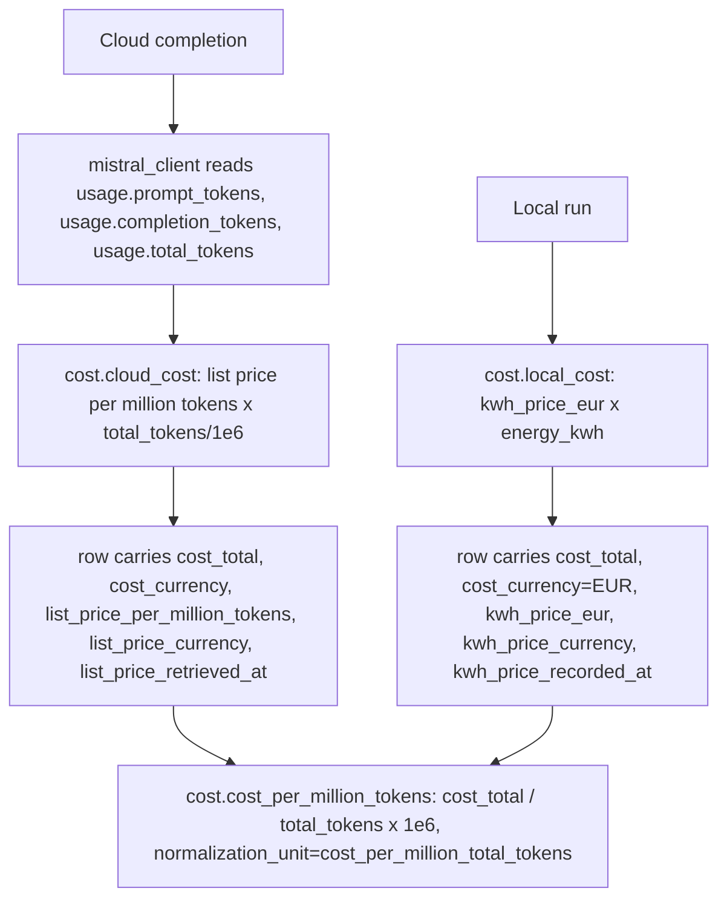
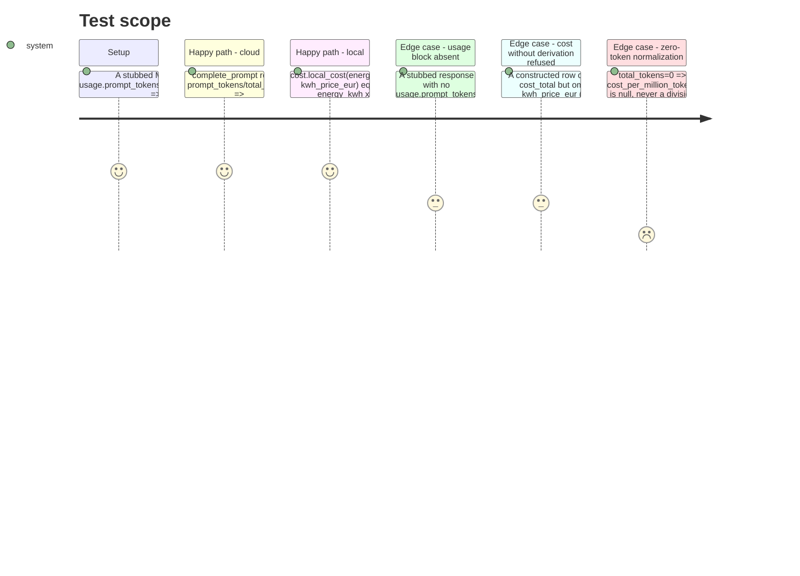

<!-- Fill or omit these sections; never add, rename, or reorder one. -->

# Instruction: Cost module + Mistral token usage + contract

## Architecture projection

> Tree of the final files. ✅ create · ✏️ modify · ❌ delete

```txt
.
├── src/
│   └── wave_local_ai_v2/
│       ├── cost.py               ✅ create — kWh-price and list-price derivations, normalization unit, Mistral price table
│       ├── mistral_client.py     ✏️ modify — MistralCompletion carries prompt_tokens/total_tokens from the usage block
│       ├── settings.py           ✏️ modify — kwh_price_eur, kwh_price_recorded_at
│       └── row_contract.py       ✏️ modify — cost + derivation-input fields added to both REQUIRED_FIELDS kinds
└── tests/
    ├── test_cost.py              ✅ create
    ├── test_mistral_client.py    ✏️ modify — stubbed usage block includes prompt_tokens/total_tokens
    ├── test_settings.py          ✏️ modify
    └── test_row_contract.py      ✏️ modify
```

## User Journey



## Test Scope



## Tasks to do

### `1)` Mistral token usage in `mistral_client.py`

> Surface `prompt_tokens` and `total_tokens` from the response's `usage` block, alongside the already-read `completion_tokens`.

1. Verify the exact `usage` object shape on a real (or officially documented) Mistral chat-completions response before relying on field names beyond `completion_tokens` (already trusted) — confirm `prompt_tokens` and `total_tokens` are present under the same `usage` object, matching the OpenAI-compatible naming the module's docstring already assumes. Update the module docstring's verified-against line with the confirmation date.
2. Extend `MistralCompletion` with `prompt_tokens: int | None` and `total_tokens: int | None`.
3. In `complete_prompt`, read `response_json["usage"].get("prompt_tokens")` and `.get("total_tokens")` — `.get`, not `[...]`, so an absent key degrades to `None` rather than raising (the existing `completion_tokens` read stays a hard `KeyError`-raising access, since that one field is load-bearing for `score_item`; the two new ones are not). Guard each present-but-wrong-typed value the same way the existing `finish_reason`/`generated_tokens` guards do (raise `MistralRequestError` naming the field), but only when the key is present — a genuinely absent key is `None`, not an error.

### `2)` `cost.py`

> The two derivations, the normalization unit, and the Mistral price table.

1. Create `src/wave_local_ai_v2/cost.py`. Module docstring: "no live Mistral price API exists; the table below is a manually retrieved snapshot, dated" (per the story's decision).
2. `NORMALIZATION_UNIT = "cost_per_million_total_tokens"`.
3. `MISTRAL_PRICE_TABLE: dict[str, MistralPrice]` keyed by the dated model id (`mistral_client.MODEL`), one entry: `{"input_per_million": ..., "output_per_million": ..., "currency": ..., "retrieved_at": "YYYY-MM-DD"}` — values and currency confirmed at implementation time against https://mistral.ai/pricing (or docs.mistral.ai) live, cited the same way `mistral_client.py`'s own docstring cites its verification date. Raise a module-level `CostTableError` (or reuse a settings-style error) if `mistral_client.MODEL` has no table entry, rather than silently costing at `0`.
4. `def cloud_cost(prompt_tokens: int, completion_tokens: int, price: MistralPrice) -> float`: `prompt_tokens/1e6 * price["input_per_million"] + completion_tokens/1e6 * price["output_per_million"]`.
5. `def local_cost(energy_kwh: float | None, kwh_price: float) -> float | None`: `None` when `energy_kwh` is `None` (mirrors `emissions.local_emissions`), else `energy_kwh * kwh_price`.
6. `def cost_per_million_tokens(cost_total: float, total_tokens: int | None) -> float | None`: `None` when `total_tokens` is `None` or `0` (undefined, not a fabricated `0.0` or a `ZeroDivisionError` — same rule `aggregation.spread` applies to a zero median), else `cost_total / total_tokens * 1_000_000`.

### `3)` Settings

1. Add `kwh_price_eur: float` (env `KWH_PRICE_EUR`, `_require_numeric`, `minimum=0.0`; default value and its source confirmed at implementation time against a published French residential/professional tariff, cited in the constant's comment — no invented number ships uncited) and `kwh_price_recorded_at: str` (env `KWH_PRICE_RECORDED_AT`, a plain date string, default matching the tariff citation's date — not computed at run time, since this is a configured value, not a live retrieval).
2. Name the new default constants alongside the existing `DEFAULT_*` block.

### `4)` `row_contract.py`

1. Add to both `REQUIRED_FIELDS["runtime"]` and `REQUIRED_FIELDS["quality"]`: `"tokens_in_total"`, `"tokens_out_total"`, `"cost_total"`, `"cost_currency"`, `"cost_per_million_tokens"`, `"normalization_unit"`, `"kwh_price_eur"`, `"kwh_price_currency"`, `"kwh_price_recorded_at"`, `"list_price_per_million_tokens"`, `"list_price_currency"`, `"list_price_retrieved_at"`.
2. Bump `SCHEMA_VERSION` to `"5"`.
3. `validate_row` gains one more consistency check (alongside the existing endpoint/template one): a row where `cost_total` is not `None` must not have every one of `kwh_price_eur` and `list_price_per_million_tokens` be `None` — i.e. a non-null cost must carry at least one derivation basis. Raise `RowContractError` naming the row's kind when it doesn't (the story's "a row whose cost is present without its derivation inputs is refused by the writer gate").

### `5)` Tests

1. `tests/test_cost.py` (new): `cloud_cost` against a hand-computed price/token pair; `local_cost(None, price)` is `None`; `cost_per_million_tokens(cost, 0)` and `cost_per_million_tokens(cost, None)` are both `None`; `cost_per_million_tokens(cost, total_tokens)` matches the hand-computed value.
2. `tests/test_mistral_client.py`: extend the stubbed response fixture with `usage.prompt_tokens`/`usage.total_tokens`; assert `complete_prompt` surfaces both; add a case where `usage` lacks `prompt_tokens` and assert the field reads `None` rather than raising.
3. `tests/test_settings.py`: assert `kwh_price_eur`/`kwh_price_recorded_at` load with documented defaults and that a non-numeric or negative `KWH_PRICE_EUR` raises `SettingsError`.
4. `tests/test_row_contract.py`: update fixture rows with the twelve new fields; add a case where `cost_total` is present but both price-basis fields are `None`, asserting `RowContractError`.

## Test acceptance criteria

<!-- Each criterion is an observable behavior, not a command. -->

| Task | Acceptance criteria |
| ---- | -------------------- |
| 1... | `complete_prompt` returns `prompt_tokens` and `total_tokens` alongside `completion_tokens`; a response missing either yields `None` for that field, never a raised exception. |
| 2... | `cost.cloud_cost`/`cost.local_cost`/`cost.cost_per_million_tokens` are pure functions matching their hand-computed test values; `MISTRAL_PRICE_TABLE` carries one dated, sourced entry for `mistral_client.MODEL`. |
| 3... | `load_settings()` exposes `kwh_price_eur` and `kwh_price_recorded_at`, each documented and overridable via env. |
| 4... | A row carrying a non-null `cost_total` with both `kwh_price_eur` and `list_price_per_million_tokens` null is refused by `validate_row`; a row missing any of the twelve new required keys is refused, naming them. |
| 5... | `uv run pytest tests/test_cost.py tests/test_mistral_client.py tests/test_settings.py tests/test_row_contract.py` passes with no regressions elsewhere (`uv run pytest`). |
