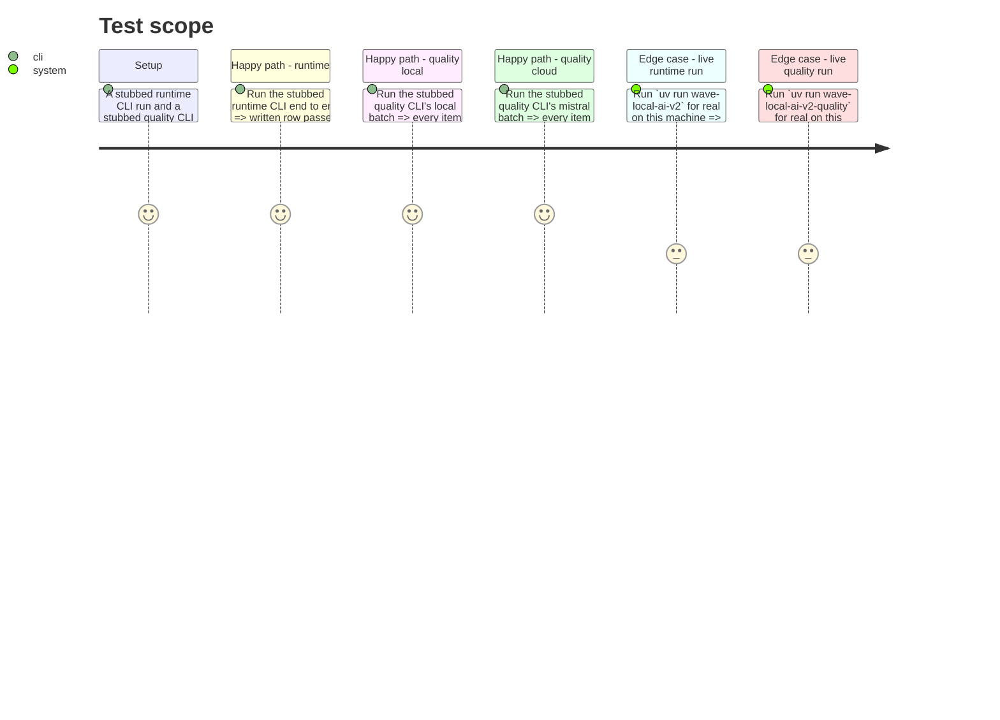

<!-- Fill or omit these sections; never add, rename, or reorder one. -->

# Instruction: CLI wiring, live runs, docs and memory

## Architecture projection

> Tree of the final files. ✅ create · ✏️ modify · ❌ delete

```txt
.
├── src/
│   └── wave_local_ai_v2/
│       ├── __init__.py           ✏️ modify — per-channel energy, Scope-2 emissions, local cost, tokens_out_total/tokens_in_total
│       ├── quality_cli.py        ✏️ modify — local suite wrapped in measure_energy (Scope 2 + local cost); mistral batch gets Scope-3 emissions + cloud cost
│       └── timings.py            ✏️ modify (conditional) — prompt-token field, only if phase-2's live verification found one to read
├── docs/
│   └── setup.md                  ✏️ modify — new energy/emissions/cost configuration subsection
├── CHANGELOG.md                  ✏️ modify — Unreleased/Added entries for both stories
└── aidd_docs/
    └── memory/
        └── architecture.md       ✏️ modify — Gotchas: per-channel energy method, Scope 2/3 boundary
```

## User Journey

```mermaid
flowchart TD
  A[Runtime CLI: _run_counted wrapped in measure_energy] --> B[row gets 3 channel kwh/method pairs + energy_kwh]
  B --> C[emissions.local_emissions -> emissions_kg, emissions_scope=scope_2, scope_comparability=null]
  C --> D[cost.local_cost -> cost_total EUR, kwh_price_eur/currency/recorded_at]
  D --> E[tokens_out_total=sum(tokens_predicted), tokens_in_total=verified field or null]
  E --> F[cost.cost_per_million_tokens if total_tokens known]
  G[Quality CLI local batch] --> H[whole suite loop wrapped in measure_energy once]
  H --> I[same Scope-2 emissions + local cost, repeated per item row like suite_accuracy]
  J[Quality CLI mistral batch] --> K[sum prompt_tokens/completion_tokens over the batch]
  K --> L[emissions.scope3_cloud_emissions -> energy_kwh, emissions_kg, emissions_scope=scope_3, scope_comparability=note]
  K --> M[cost.cloud_cost -> cost_total, list_price_* fields]
  L --> N[batch cost/emissions repeated per item row]
  M --> N
```

## Test Scope



## Tasks to do

### `1)` `__init__.py` wiring

1. Pass `country_iso_code=settings.emission_country_iso_code` into the existing `measure_energy(_run_counted)` call.
2. Replace `**energy` in the row dict (currently spreads the old two-key `EnergyResult`) with the new seven-key `EnergyResult` spread — no other change needed since it is still one dict spread.
3. After the row's timing/energy fields are assembled, add: `emissions_kg = emissions.local_emissions(row["energy_kwh"], settings.emission_factor_kg_per_kwh)`, then `"emissions_kg": emissions_kg, "emission_factor_kg_per_kwh": settings.emission_factor_kg_per_kwh, "emission_region": settings.emission_region, "emissions_scope": emissions.EMISSIONS_SCOPE_2, "emissions_scope_formula_id": None, "scope_comparability": None` (a local row is never Scope 3, so the formula id and comparability note stay null — see plan.md's Decisions).
4. Token counts: `tokens_out_total = sum(rep["tokens_predicted"] for rep in counted if rep["tokens_predicted"] is not None) if any(...) else None`; `tokens_in_total` per phase 2's live-verified field, or `None` with a comment stating the harness does not capture it yet if verification found no usable field on this build.
5. Cost: `cost_total = cost.local_cost(row["energy_kwh"], settings.kwh_price_eur)`; `total_tokens = tokens_in_total + tokens_out_total` when both are known else `None`; `"cost_total": cost_total, "cost_currency": "EUR", "cost_per_million_tokens": cost.cost_per_million_tokens(cost_total, total_tokens) if cost_total is not None else None, "normalization_unit": cost.NORMALIZATION_UNIT, "tokens_in_total": tokens_in_total, "tokens_out_total": tokens_out_total, "kwh_price_eur": settings.kwh_price_eur, "kwh_price_currency": "EUR", "kwh_price_recorded_at": settings.kwh_price_recorded_at, "list_price_per_million_tokens": None, "list_price_currency": None, "list_price_retrieved_at": None`.
6. Extend the closing `print(...)` with `emissions_kg` and `cost_total` alongside the existing `energy_method` line (which no longer exists — replace it with the three method labels or drop to keep the line readable; keep it a single line).

### `2)` `quality_cli.py` wiring

1. Wrap `_run_local_suite`'s whole call in `measure_energy(..., country_iso_code=settings.emission_country_iso_code)` inside `_run` (mirrors `__init__.py`'s pattern: the tracker spans the whole suite loop, not per item). Thread the resulting `EnergyResult` and its derived `emissions_kg` into `_score_and_write` as new keyword arguments, applied identically to every item row of that batch (same pattern `batch_verdict` already uses).
2. For the `local` provider batch: `emissions_scope=emissions.EMISSIONS_SCOPE_2`, `emissions_scope_formula_id=None`, `scope_comparability=None`; `cost_total=cost.local_cost(energy_kwh, settings.kwh_price_eur)`, `kwh_price_*` populated, `list_price_*` null, `tokens_in_total`/`tokens_out_total` from the suite's per-item `generated_tokens`/prompt lengths if available else null (same honesty rule as phase 3 task 1's runtime tokens — do not fabricate a prompt-token count the local `/completion` path never returned).
3. For the `mistral` provider batch: sum `prompt_tokens` and `completion_tokens` (from phase 2's extended `MistralCompletion`) over every item in `_run_cloud_suite`'s response list; `energy_kwh, emissions_kg = emissions.scope3_cloud_emissions(total_tokens, settings.scope3_wh_per_token, settings.emission_factor_kg_per_kwh)`; the three CodeCarbon channel fields (`cpu_energy_kwh`, etc.) are all `None`/`"unavailable"` (never measured for a network call); `emissions_scope=emissions.EMISSIONS_SCOPE_3`, `emissions_scope_formula_id=emissions.SCOPE3_FORMULA_ID`, `scope_comparability=emissions.SCOPE_COMPARABILITY_NOTE`; `cost_total=cost.cloud_cost(prompt_tokens_sum, completion_tokens_sum, cost.MISTRAL_PRICE_TABLE[mistral_client.MODEL])`, `list_price_*` populated from the same table entry, `kwh_price_*` null.
4. Both batches: `cost_per_million_tokens = cost.cost_per_million_tokens(cost_total, total_tokens)`, `normalization_unit = cost.NORMALIZATION_UNIT`.
5. Extend `_score_and_write`'s signature with the new per-batch fields (energy/emissions/cost), added to every row it builds — same insertion point as the existing `**call_path_fields` spread.

### `3)` Live evidence runs

1. On this machine, with a local model installed and `MISTRAL_API_KEY` set: run the runtime CLI once (`uv run wave-local-ai-v2` or its documented equivalent) against the default (untracked, gitignored) results path — not the curated reference file. Confirm the written row passes `validate_row` and record the new fields' values (energy per channel, emissions, cost) in this file's Test Scope evidence or a short note, without committing the results file itself.
2. Run the quality CLI once the same way, confirming both the `local` and `mistral` batches populate their respective Scope-2/Scope-3 fields distinctly (e.g. the local batch's `emissions_scope` is `"scope_2"` with populated CodeCarbon channels, the mistral batch's is `"scope_3"` with a populated `scope_comparability`).
3. Do not regenerate or overwrite `aidd_docs/results/runtime-reference.jsonl` / `quality-reference.jsonl` in this phase — republishing the curated reference bundle is a larger, separately-scoped concern (epic Boundaries: "republishing the reference bundle"); this phase only proves the new fields populate on a live run.

### `4)` Docs and memory

1. `CHANGELOG.md`, under `## [Unreleased]` / `### Added`: one entry for the per-channel energy/emissions/scope fields (naming the deleted single-label derivation), one entry for the cost fields (naming the normalization unit and that currencies are never converted).
2. `docs/setup.md`: add a new subsection (after section 4, "Configure `.env` and run") documenting the new env vars (`EMISSION_COUNTRY_ISO_CODE`, `EMISSION_REGION`, `EMISSION_FACTOR_KG_PER_KWH`, `SCOPE3_WH_PER_TOKEN`, `KWH_PRICE_EUR`, `KWH_PRICE_RECORDED_AT`) with their defaults and cited sources, and a one-paragraph explanation of the Scope 2 / Scope 3 boundary and why the two are not directly comparable.
3. `aidd_docs/memory/architecture.md` Gotchas: rewrite the energy paragraph to describe the three independently-labelled channels (replacing the single `energy_method` description) and add one sentence on the Scope 2 (local) / Scope 3 (cloud, formula-estimated) boundary and its `scope_comparability` caveat.

## Test acceptance criteria

<!-- Each criterion is an observable behavior, not a command. -->

| Task | Acceptance criteria |
| ---- | -------------------- |
| 1... | A stubbed runtime CLI run writes a row that passes `row_contract.validate_row("runtime", row)` and carries non-placeholder per-channel energy, emissions, and cost fields. |
| 2... | A stubbed quality CLI run writes local-provider rows with `emissions_scope="scope_2"` and populated CodeCarbon channels, and mistral-provider rows with `emissions_scope="scope_3"`, a populated `scope_comparability`, and `list_price_*` fields — both batches sharing one cost/emissions figure across their item rows. |
| 3... | One real runtime CLI invocation and one real quality CLI invocation on this machine each produce a row whose new fields are populated with real, non-placeholder values (recorded as evidence); the tracked reference files are untouched. |
| 4... | `CHANGELOG.md`, `docs/setup.md`, and `aidd_docs/memory/architecture.md` each reflect the shipped fields with no stale reference to the deleted `energy_method` field. |
| 5... | `uv run pytest` passes in full; `uv run mypy` and `uv run ruff check` pass with no new findings. |
