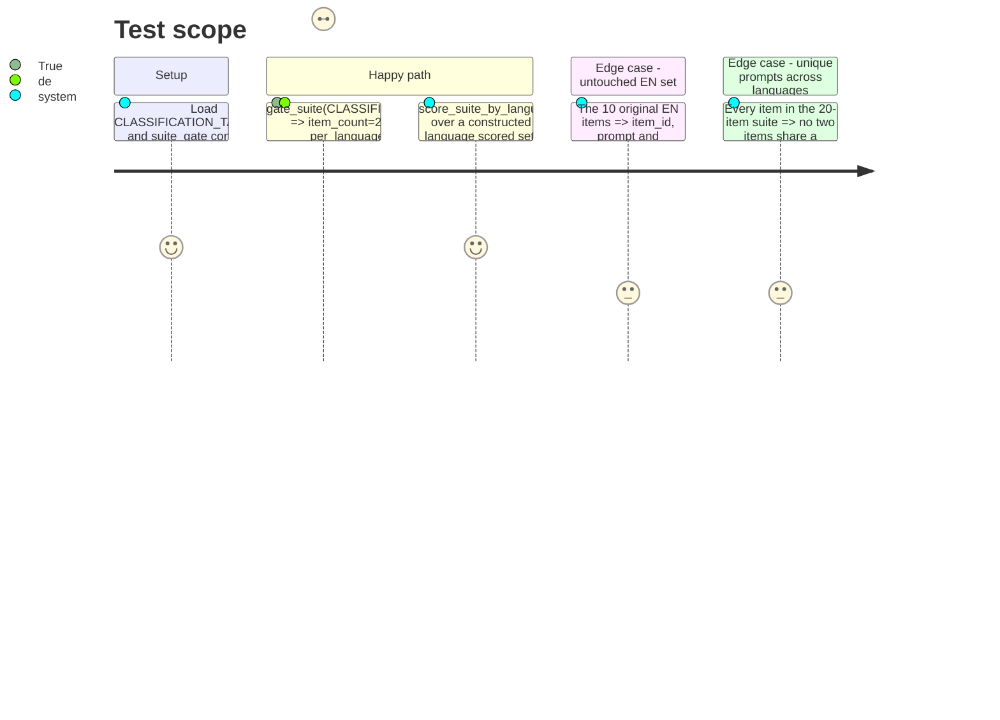

<!-- Fill or omit these sections; never add, rename, or reorder one. -->

# Instruction: Ten added items, suite version bump, per-language scoring + gate

## Architecture projection

> Tree of the final files. ✅ create · ✏️ modify · ❌ delete

```txt
.
└── src/
    └── wave_local_ai_v2/
        ├── classification_suite.py   ✏️ modify — 5 FR + 5 DE hand-written items, SUITE_VERSION "1" -> "2"
        ├── scoring.py                 ✏️ modify — score_suite_by_language: per-language accuracy, n, indicative
        ├── quality_cli.py             ✏️ modify — writes language_breakdown onto every row
        └── row_contract.py            ✏️ modify — language_breakdown required on quality rows, SCHEMA_VERSION "6" -> "7"
└── tests/
    ├── test_classification_suite.py   ✏️ modify — 20 items, EN/FR/DE >=25% share, native-authorship spot checks
    ├── test_suite_gate.py             ✏️ modify — real suite passes suite-level gate, per-language cells still indicative
    └── test_scoring.py                ✏️ modify — score_suite_by_language over a constructed mixed-language set
```

## User Journey

```mermaid
flowchart TD
  A[classification_suite.py: +5 fr +5 de hand_written items] --> B[SUITE_VERSION bumps, PROMPT_SET_HASH recomputes automatically]
  B --> C[suite_gate.gate_suite: item_count=20, en=50%, fr=25%, de=25% -> suite-level indicative=False]
  C --> D[per_language_indicative: en=False n=10, fr=True n=5, de=True n=5]
  E[quality_cli._score_and_write] --> F[scoring.score_suite_by_language over scored_items + item language tags]
  F --> G[row['language_breakdown'] = per-language accuracy/n/indicative, same batch-level pattern as suite_accuracy]
  G --> H[row_contract.validate_row refuses a quality row missing language_breakdown]
```

## Test Scope



## Tasks to do

### `1)` Ten new items in `classification_suite.py`

> Add 5 FR + 5 DE hand-written items, unambiguous to one of the four labels, bump the suite version.

1. Add 5 French items via `_item(...)` with `language="fr"`, `provenance="hand_written"` (the `_item` helper's default), one per label plus one extra split however keeps the four labels covered — realistic short business support messages, natively authored (not translated from the EN ten). Example shape: a billing dispute, a technical bug report, an account-access issue, a feature request/compliment, one more of the caller's choice. Every message must route unambiguously to exactly one of `billing`/`technical`/`account`/`other`.
2. Add 5 German items the same way with `language="de"`.
3. Append all ten to `CLASSIFICATION_TASK_SUITE`, ids following the existing `<label>-NN` convention scoped per language to keep ids unique (e.g. `billing-fr-01`, `technical-de-01`) — `item_id` uniqueness is asserted by `test_classification_suite.py`.
4. Bump `SUITE_VERSION = "2"` with a comment naming this story (Methodology 2: "editing any prompt bumps the suite version" — adding items is the same class of change). `PROMPT_SET_HASH` recomputes automatically since it is derived from `CLASSIFICATION_TASK_SUITE` at import time; no manual edit needed.
5. Do not touch any of the existing 10 EN items' `item_id`, `prompt` or `expected_label`.

### `2)` Per-language scoring in `scoring.py`

> One function computing accuracy, n and the indicative mark per language, reusing the gate's own threshold.

1. Import `LANGUAGES` and `MIN_PER_LANGUAGE_CELL_ITEMS` from `wave_local_ai_v2.suite_gate` (one-directional: `suite_gate.py` does not import `scoring.py`).
2. Add a `LanguageCell(TypedDict)`: `accuracy: float`, `n: int`, `indicative: bool`.
3. Add `score_suite_by_language(items: Sequence[ClassificationItem], scored_items: list[ScoredItem]) -> dict[str, LanguageCell]`: zips `items`/`scored_items` by position (same convention `_score_and_write` already uses), buckets by `item["language"]`, and for each of `suite_gate.LANGUAGES` computes accuracy (0.0 if n=0, matching `score_suite`'s empty-list rule), `n`, and `indicative = n < MIN_PER_LANGUAGE_CELL_ITEMS`.
4. Keep it provider-agnostic and side-effect-free, matching the module's existing docstring claim ("no network, no randomness").

### `3)` Wire `language_breakdown` into `quality_cli.py` and `row_contract.py`

1. In `_score_and_write`, after `suite_score = score_suite(scored_items)`, compute `language_breakdown = score_suite_by_language(CLASSIFICATION_TASK_SUITE, scored_items)`.
2. Add `"language_breakdown": language_breakdown` to the row dict, next to `"suite_accuracy"` — same batch-level, repeated-per-row pattern.
3. In `row_contract.py`, add `"language_breakdown"` to the `"quality"` `REQUIRED_FIELDS` set, and bump `SCHEMA_VERSION = "7"` with a comment: `"7": language_breakdown (per-language accuracy/n/indicative) became required on quality rows (Story 20: the-classification-suite-reaches-twenty-items-across-three-languages).`

### `4)` Tests

1. `test_classification_suite.py`: assert `len(CLASSIFICATION_TASK_SUITE) == 20`; assert each of `{"en", "fr", "de"}` has a share `>= 0.25`; assert every item still carries a consistent `language`/`provenance`/`contamination_risk` triple; add a test that no two items share the exact same `prompt` string (`len({item["prompt"] for item in CLASSIFICATION_TASK_SUITE}) == len(CLASSIFICATION_TASK_SUITE)`); keep the existing label-set and hash tests.
2. `test_suite_gate.py`: replace `test_real_classification_suite_is_indicative_for_count_and_language_share` with a test asserting `gate_suite(CLASSIFICATION_TASK_SUITE)["indicative"] is False` (suite-level: count and every language share now pass) while `result["per_language_indicative"] == {"en": False, "fr": True, "de": True}` (en at n=10 is not below the per-cell threshold; fr/de at n=5 are).
3. `test_scoring.py`: add tests for `score_suite_by_language` against a constructed list of `ClassificationItem`/`ScoredItem` pairs spanning all three languages, asserting per-language accuracy is the exact fraction correct within that language, `n` matches the count, and `indicative` is `True` below 10 items and `False` at or above it.

## Test acceptance criteria

<!-- Each criterion is an observable behavior, not a command. -->

| Task | Acceptance criteria |
| ---- | -------------------- |
| 1... | `CLASSIFICATION_TASK_SUITE` holds 20 items; EN/FR/DE each cover at least 25%; the ten added items declare `provenance="hand_written"`; the ten original EN items are unchanged; `SUITE_VERSION` and `PROMPT_SET_HASH` both differ from their pre-phase values. |
| 2... | `score_suite_by_language` returns one `LanguageCell` per language in `suite_gate.LANGUAGES`, with accuracy computed only over that language's items, `n` matching the count, and `indicative` true exactly when `n < 10`. |
| 3... | A quality row written by `quality_cli.py` carries `language_breakdown`; `row_contract.validate_row("quality", row)` refuses a row missing it; `SCHEMA_VERSION` is `"7"`. |
| 4... | `gate_suite(CLASSIFICATION_TASK_SUITE)["indicative"] is False` and `per_language_indicative` is `{"en": False, "fr": True, "de": True}`; `uv run pytest` passes in full; `uv run mypy` and `uv run ruff check` pass with no new findings. |
