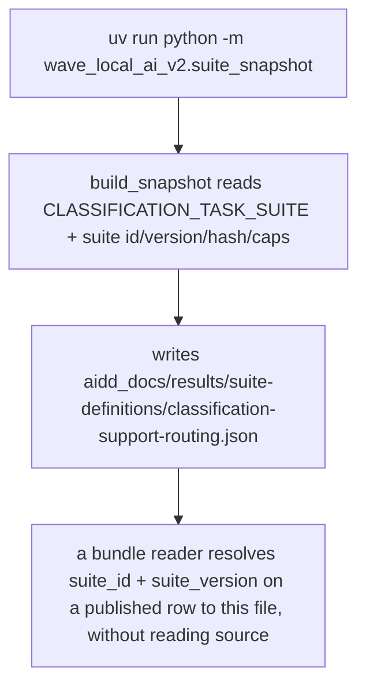
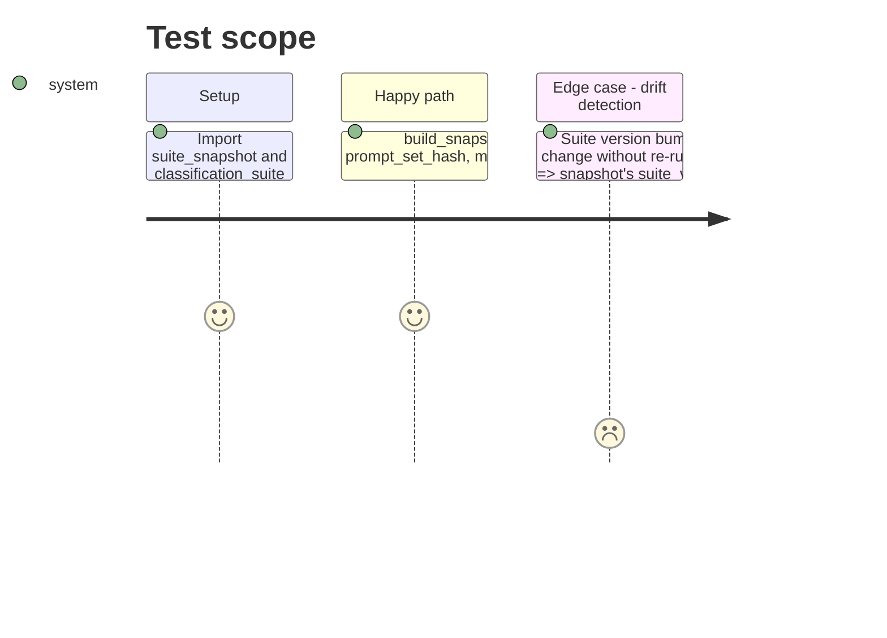

<!-- Fill or omit these sections; never add, rename, or reorder one. -->

# Instruction: Suite definition snapshot export

## Architecture projection

> Tree of the final files. ✅ create · ✏️ modify · ❌ delete

```txt
.
├── src/
│   └── wave_local_ai_v2/
│       └── suite_snapshot.py          ✅ create — build_snapshot() + __main__ writer
├── tests/
│   └── test_suite_snapshot.py         ✅ create — snapshot matches the live suite exactly
└── aidd_docs/
    └── results/
        └── suite-definitions/
            └── classification-support-routing.json   ✅ create (written by phase 3's manual run, not committed here)
```

## User Journey



## Test Scope



## Tasks to do

### `1)` `suite_snapshot.py`

> A small module, not a registry: this is the one suite that exists, exported as the code holds it.

1. Add `build_snapshot() -> dict[str, Any]` returning: `suite_id`, `suite_version`, `prompt_set_hash` (all three from `classification_suite`), `max_output_tokens`, `stop_sequences`, `context_length`, and `items`: a list of plain dicts, one per `ClassificationItem`, carrying exactly `item_id`, `prompt`, `expected_label`, `language`, `provenance`, `contamination_risk` — no derived or transient field.
2. Add a `__main__` block: writes `json.dumps(build_snapshot(), indent=2, sort_keys=True)` to `aidd_docs/results/suite-definitions/<suite_id>.json` (directory created if absent), printing the path written. No new `pyproject.toml` entry point — invoked as `uv run python -m wave_local_ai_v2.suite_snapshot`, per plan.md's Decision that this is a small module, not a registry or a new CLI surface.
3. Docstring states plainly: this is a snapshot of the suite as the code holds it at export time, not a live registry a row resolves through at read time — matching story 19's acceptance line distinguishing the two.

### `2)` Test

1. `test_suite_snapshot.py`: assert `build_snapshot()["suite_id"] == classification_suite.SUITE_ID`, `["suite_version"] == classification_suite.SUITE_VERSION`, `["prompt_set_hash"] == classification_suite.PROMPT_SET_HASH`; assert `len(snapshot["items"]) == len(CLASSIFICATION_TASK_SUITE)`; assert every item in the snapshot round-trips the six named fields exactly against the corresponding `CLASSIFICATION_TASK_SUITE` entry (same order, since `build_snapshot` does not reorder).

## Test acceptance criteria

<!-- Each criterion is an observable behavior, not a command. -->

| Task | Acceptance criteria |
| ---- | -------------------- |
| 1... | `python -m wave_local_ai_v2.suite_snapshot` writes a JSON file at `aidd_docs/results/suite-definitions/classification-support-routing.json` whose content matches `build_snapshot()`'s return value. |
| 2... | `build_snapshot()` carries every field story 19 needs a bundle reader to resolve a row's `suite_id`/`suite_version`/`prompt_set_hash` against, with no field renamed or omitted relative to the live suite. |
| 3... | `uv run pytest` passes in full; `uv run mypy` and `uv run ruff check` pass with no new findings. |
