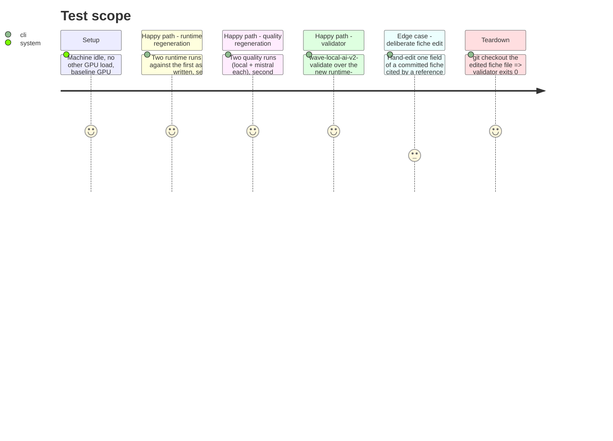

<!-- Fill or omit these sections; never add, rename, or reorder one. -->

# Instruction: Live bundle regeneration on the bench machine (manual checklist)

## Architecture projection

> Tree of the final files. ✅ create · ✏️ modify · ❌ delete

```txt
.
└── aidd_docs/
    └── results/
        ├── runtime-reference.jsonl            ✏️ modify — overwritten with 2 fresh runs' rows under the current schema
        ├── quality-reference.jsonl            ✏️ modify — overwritten with 2 fresh runs' rows (local + mistral) under the current schema
        ├── runtime-reference.schema-1.jsonl   ✅ create — the old runtime-reference.jsonl, renamed (git mv), untouched content
        ├── quality-reference.schema-1.jsonl   ✅ create — the old quality-reference.jsonl, renamed (git mv), untouched content
        ├── fiches/                             ✏️ modify — new fiche files from this phase's runs, committed
        └── suite-definitions/
            └── classification-support-routing.json  ✏️ modify — (re-)exported after phase 1's item count changed it
└── .gitignore                                  ✏️ modify — negation pattern for the new *-reference.schema-*.jsonl name shape
```

## User Journey

```mermaid
flowchart TD
  A[git mv old reference files to *.schema-1.jsonl] --> B[.gitignore negation added so they stay tracked]
  B --> C[quiet thermal window confirmed]
  C --> D[runtime run 1, N=5, default paths]
  D --> E[copy run 1's row(s) to a temp reference file]
  E --> F[RUNTIME_REFERENCE_PATH -> temp file, runtime run 2, N=5]
  F --> G[run 2's row carries a verdict against run 1]
  G --> H[quality run 1, local+mistral]
  H --> I[copy run 1's rows to a temp reference file]
  I --> J[QUALITY_REFERENCE_PATH -> temp file, quality run 2]
  J --> K[run 2's rows carry a verdict against run 1]
  K --> L[copy both runtime rows and both quality batches' rows into the freed runtime-reference.jsonl / quality-reference.jsonl]
  L --> M[wave-local-ai-v2-validate over the new bundle -> exit 0, counts recorded]
  M --> N[deliberate edit of one committed fiche field]
  N --> O[wave-local-ai-v2-validate again -> exit 1, edited row named, recorded]
  O --> P[revert the edit, git checkout the fiche file]
```

## Test Scope



## Tasks to do

### `1)` Free the reference filenames and update `.gitignore`

1. `git mv aidd_docs/results/runtime-reference.jsonl aidd_docs/results/runtime-reference.schema-1.jsonl`
2. `git mv aidd_docs/results/quality-reference.jsonl aidd_docs/results/quality-reference.schema-1.jsonl`
3. In `.gitignore`, add `!aidd_docs/results/*-reference.schema-*.jsonl` immediately after the existing `!aidd_docs/results/*-reference.jsonl` line — the renamed files no longer match the `*-reference.jsonl` suffix the current negation pattern requires, so without this line they fall back under the blanket `aidd_docs/results/*.jsonl` ignore and silently stop being tracked.
4. `git status` — confirm both renamed files show as tracked (not ignored) before continuing.

### `2)` Confirm the quiet thermal window

1. Close any other GPU-using application. Run `nvidia-smi --query-gpu=temperature.gpu,utilization.gpu --format=csv` (or the platform equivalent) and record the idle baseline temperature.
2. Do not proceed if the GPU is already above its idle baseline from a prior run within the last few minutes — let it cool first. This mirrors the machine-state fields the harness itself now records (`aidd_docs/results/README.md`'s prior thermal-slowdown exclusions).

### `3)` Re-export the suite snapshot (post phase-1 item count change)

1. `uv run python -m wave_local_ai_v2.suite_snapshot`
2. Confirm the written file's `items` count is 20 and `suite_version` matches `classification_suite.SUITE_VERSION`.

### `4)` Runtime regeneration — two runs, N=5, second against the first

1. Run 1: `uv run wave-local-ai-v2` with default settings (`RUNTIME_REPETITIONS=5`, `RUNTIME_COOLDOWN_S=10.0`). This writes to the default untracked `aidd_docs/results/runtime.jsonl`. Its verdict will be `not_comparable` (no reference configured yet, or the renamed file no longer resolves) — expected for the first run.
2. Copy run 1's row: `Copy-Item aidd_docs/results/runtime.jsonl aidd_docs/results/runtime-reference-run1.jsonl` (or extract just the newest line if the live store already held prior rows).
3. Set `RUNTIME_REFERENCE_PATH=aidd_docs/results/runtime-reference-run1.jsonl` in `.env` (or as an inline env var for the next command only).
4. Run 2: `uv run wave-local-ai-v2` again, same default repetition settings. Confirm the written row's `verdict` block names `reference_run_id` equal to run 1's `run_id`.
5. Unset/restore `RUNTIME_REFERENCE_PATH` in `.env` back to its default (or remove the inline override) before moving to the quality half.

### `5)` Quality regeneration — two runs, local + mistral, second against the first

1. Confirm `MISTRAL_API_KEY` in `.env` is a real, working key (the mistral preflight check refuses to start otherwise — `aidd_docs/tasks/.../mistral-model-preflight`).
2. Run 1: `uv run wave-local-ai-v2-quality`. Writes both provider batches (20 items each, local and mistral) to the default untracked `aidd_docs/results/quality.jsonl`.
3. Copy run 1's rows: `Copy-Item aidd_docs/results/quality.jsonl aidd_docs/results/quality-reference-run1.jsonl`.
4. Set `QUALITY_REFERENCE_PATH=aidd_docs/results/quality-reference-run1.jsonl`.
5. Run 2: `uv run wave-local-ai-v2-quality` again. Confirm both provider batches' rows carry a `verdict` naming `reference_run_id` equal to the matching provider's run-1 `run_id` (quality verdicts match by `model_id`/`suite_version`/seed, per `verdict.select_quality_references`).
6. Unset/restore `QUALITY_REFERENCE_PATH` back to its default.

### `6)` Assemble the new committed bundle

1. Copy runs 1 and 2's runtime rows (2 rows total) into `aidd_docs/results/runtime-reference.jsonl`, LF line endings (match the existing convention noted in the old README: live stores are CRLF, committed snapshots are LF).
2. Copy runs 1 and 2's quality rows (2 runs x 2 providers x 20 items = 80 rows total) into `aidd_docs/results/quality-reference.jsonl`, same LF convention.
3. `git add aidd_docs/results/fiches/` — commit every new fiche file this phase's runs wrote (one per distinct machine/flag configuration; likely one file reused across all four runs since the flag set and machine did not change).
4. `git add aidd_docs/results/suite-definitions/classification-support-routing.json`.
5. Delete the temporary `*-run1.jsonl` files created in tasks 4-5 (they were a manual scaffold, not part of the bundle).

### `7)` Validator proof — clean pass, then the deliberate-edit case

1. `uv run wave-local-ai-v2-validate aidd_docs/results/runtime-reference.jsonl aidd_docs/results/quality-reference.jsonl` — record the printed `checked N row(s)` line and the exit code (expected: 0, `N` = 2 + 80 = 82, no `edited`/`missing` lines).
2. Deliberate-edit case: open one fiche file cited by a reference row (`aidd_docs/results/fiches/<hash>.json`) and hand-edit one field (e.g. flip `gpu_name` or one flag value) — do not touch the filename.
3. Re-run the same validator command. Record the exit code (expected: 1) and the printed `edited` block naming the row and the changed field(s).
4. Revert the edit: `git checkout -- aidd_docs/results/fiches/<hash>.json`.
5. Re-run the validator once more to confirm it is back to exit 0 — record this too, so the checklist's own teardown is evidenced, not assumed.

## Test acceptance criteria

<!-- Each criterion is an observable behavior, not a command. -->

| Task | Acceptance criteria |
| ---- | -------------------- |
| 1... | Both superseded reference files exist under their `.schema-1.jsonl` names, are tracked by git, and are byte-identical to their pre-rename content. |
| 4... | Two runtime rows exist, the second's `verdict` block names the first's `run_id` as `reference_run_id` and states `reproduced`, `not_reproduced`, or `not_comparable` with named differing fields in that last case. |
| 5... | Four quality batches (2 runs x 2 providers) exist, each run-2 batch's rows carry a `verdict` naming the matching run-1 batch's `run_id`. |
| 7... | The validator exits 0 over the assembled bundle with the recorded row count; the deliberate-edit run exits 1 and names the edited fiche and field; the revert brings the validator back to exit 0. |
