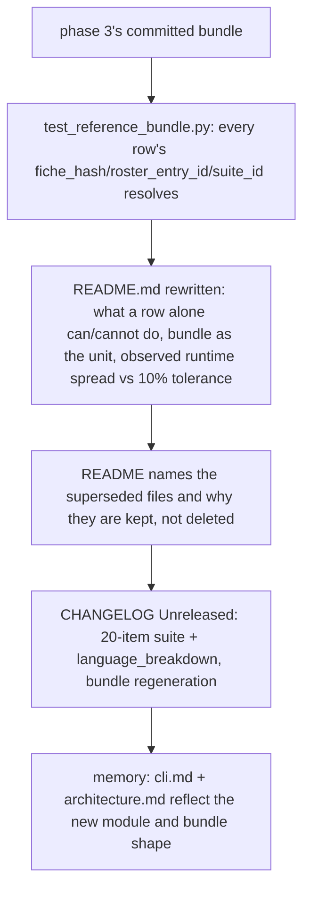
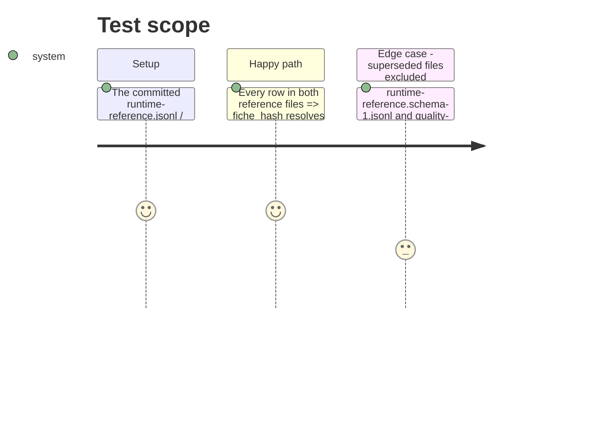

<!-- Fill or omit these sections; never add, rename, or reorder one. -->

# Instruction: README bundle inventory, reference-bundle test, CHANGELOG, memory

## Architecture projection

> Tree of the final files. ✅ create · ✏️ modify · ❌ delete

```txt
.
├── aidd_docs/
│   └── results/
│       └── README.md              ✏️ modify — rewritten as the bundle inventory
├── tests/
│   └── test_reference_bundle.py   ✅ create — every published row's pointers resolve inside the bundle
├── CHANGELOG.md                   ✏️ modify — Unreleased/Added entries for both stories
└── aidd_docs/
    └── memory/
        ├── cli.md                 ✏️ modify — suite_snapshot module, language_breakdown mention
        └── architecture.md        ✏️ modify — bundle composition, superseded-file convention
```

## User Journey



## Test Scope



## Tasks to do

### `1)` `tests/test_reference_bundle.py`

1. Read `aidd_docs/results/runtime-reference.jsonl` and `aidd_docs/results/quality-reference.jsonl` (the current-schema bundle only, named explicitly — not a glob over every `*-reference*.jsonl`, which would silently pull in the superseded files).
2. For every row: assert `row["fiche_hash"]` resolves via `fiche_registry.read_fiche(row["fiche_hash"], settings.fiche_registry_dir)` returning non-`None`; assert `row["roster_entry_id"]` is a key of `roster.load_roster(settings.roster_path).entries`; for quality rows, assert `row["suite_id"]` and `row["suite_version"]` match the exported snapshot at `aidd_docs/results/suite-definitions/<suite_id>.json`; assert `row["schema_version"] == row_contract.SCHEMA_VERSION` on every row of both files.
3. Add one test asserting the two `*.schema-1.jsonl` files exist, and that their rows' `schema_version` (where present) is strictly below the current `row_contract.SCHEMA_VERSION` or absent — named explicitly as the superseded set, not iterated by the main bundle-resolution test.

### `2)` `aidd_docs/results/README.md` rewrite

1. Open with what the bundle is: `runtime-reference.jsonl` + `quality-reference.jsonl` + `fiches/` + `aidd_docs/roster/models.json` + `suite-definitions/` — the unit an auditor is handed, per the epic's Success Evidence, not any one file alone.
2. State plainly what a row alone can and cannot do: it names its model, prompt, sampling, machine (by fiche hash) and code sha, but resolving any of those to an actual artifact requires the rest of the bundle sitting beside it.
3. Record the two live runtime runs from phase 3: dates, branch/tip, the observed `gen_tok_per_s` (and other headline metrics) of both, and the computed spread between them as a percentage. State the 10% tolerance (`RUNTIME_REPRODUCTION_TOLERANCE`) next to that observed number — if the observed spread exceeds 10%, say so as a finding for the PRD, not a threshold quietly adjusted here.
4. Record the two quality runs (local + mistral, each run twice): accuracy per run per provider, and the per-language breakdown table (accuracy, n, indicative) for EN/FR/DE — stating plainly that FR and DE cells are indicative at n=5, an observed consequence of the 25%-share threshold at 20 items, not a defect.
5. Name both superseded files (`runtime-reference.schema-1.jsonl`, `quality-reference.schema-1.jsonl`), the schema version each was produced under, and why they are kept rather than deleted (published-evidence continuity for the epic's duration, per the epic's Boundaries).
6. Record the validator's two invocations from phase 3 (clean pass with its row count, and the deliberate-edit case with its exit code and named row) exactly as observed, not paraphrased into a generic claim.

### `3)` `CHANGELOG.md`

1. Under `## [Unreleased]` / `### Added`: one entry for the suite reaching 20 items across EN/FR/DE with native FR/DE authorship and the new `language_breakdown` field (naming `SCHEMA_VERSION` moving `"6"` -> `"7"`); one entry for the suite definition snapshot export; one entry for the regenerated, current-schema reference bundle superseding the two `*.schema-1.jsonl` files.

### `4)` Memory

1. `aidd_docs/memory/cli.md`: mention `uv run python -m wave_local_ai_v2.suite_snapshot` and its output path; note `language_breakdown` on quality rows.
2. `aidd_docs/memory/architecture.md`: update the bundle-composition description (fiche registry, roster, suite snapshot, prompt-provenance constants) and the superseded-file convention (renamed and dated, never deleted) if not already covered generically.

## Test acceptance criteria

<!-- Each criterion is an observable behavior, not a command. -->

| Task | Acceptance criteria |
| ---- | -------------------- |
| 1... | `test_reference_bundle.py` fails if any row in the current-schema bundle cites a `fiche_hash`, `roster_entry_id`, or `suite_id`/`suite_version` that does not resolve, or carries a `schema_version` other than the current one; it passes against the bundle phase 3 produced. |
| 2... | `aidd_docs/results/README.md` names the bundle's files as one unit, states what a row alone can/cannot do, records both live runtime runs' observed spread against the 10% tolerance, records both quality runs' per-language breakdown with the indicative cells named, and explains both superseded files. |
| 3... | `CHANGELOG.md`'s `## [Unreleased]` section names the 20-item suite, `language_breakdown`, the schema version bump, the snapshot export, and the bundle regeneration. |
| 4... | `cli.md` and `architecture.md` carry no stale reference to a 10-item or EN-only suite. |
| 5... | `uv run pytest` passes in full, including the new `test_reference_bundle.py`; `uv run mypy` and `uv run ruff check` pass with no new findings; `uv run pre-commit run --all-files` is green. |
