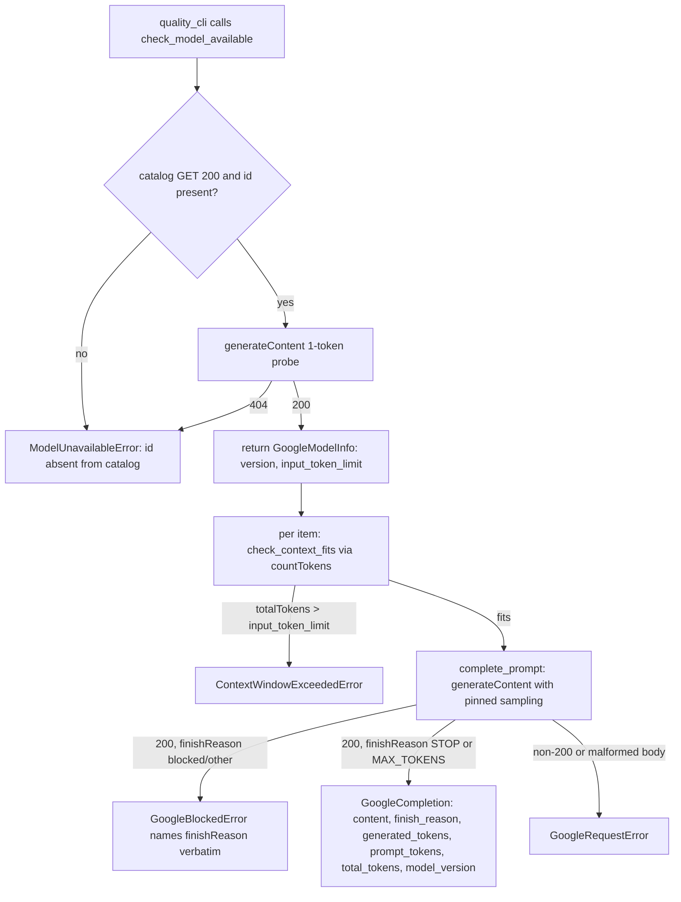

<!-- Fill or omit these sections; never add, rename, or reorder one. -->

# Instruction: `google_client.py` — the Google AI Studio provider boundary

## Architecture projection

> Tree of the final files. ✅ create · ✏️ modify · ❌ delete

```txt
.
├── src/wave_local_ai_v2/
│   ├── google_client.py         ✅ requests-only client: complete_prompt, check_model_available, check_context_fits
│   └── settings.py               ✏️ + google_api_key (repr=False), read from GOOGLE_API_KEY
└── tests/
    ├── test_google_client.py     ✅ HTTP-stubbed contract tests
    └── test_settings.py          ✏️ + google_api_key read/default/repr tests
```

## User Journey



## Test Scope

<!-- Required for every phase. Keep Setup, Happy path, any qualifying Edge cases, and any required Teardown in this one journey. -->

```mermaid
---
title: Test scope
---
journey
  section Setup
    Stub requests.get and requests.post at the google_client module boundary => no live HTTP call: 5: system
  section Happy path
    complete_prompt against a well-shaped 200 body => content, endpoint, finish_reason, both token counts, model_version returned: 5: system
    check_model_available against a catalog 200 plus a generateContent 200 probe => GoogleModelInfo(version, input_token_limit): 5: system
  section Edge case - absent from catalog
    GET /models/{id} returns 404 => check_model_available => ModelUnavailableError naming the id: 1: system
  section Edge case - listed but not callable
    GET /models/{id} returns 200, generateContent probe returns 404 "no longer available" => check_model_available => ModelUnavailableError naming the id and both endpoints: 1: system
  section Edge case - empty completion, token count absent
    200 body with candidates[0].content.parts == [{"text": ""}], no candidatesTokenCount key => complete_prompt => generated_tokens == 0, content == "": 1: system
  section Edge case - content object with no parts key
    200 body with candidates[0].content == {} => complete_prompt => content == "", no raise: 1: system
  section Edge case - MAX_TOKENS under the cap
    200 body, finishReason MAX_TOKENS, candidatesTokenCount below max_output_tokens => complete_prompt returns finish_reason "MAX_TOKENS" verbatim, caller (phase 2) derives truncation from it, not from the token count: 1: system
  section Edge case - blocked generation
    200 body, finishReason SAFETY => complete_prompt => GoogleBlockedError naming "SAFETY": 1: system
  section Edge case - context overflow
    countTokens 200 body with totalTokens > the model's inputTokenLimit => check_context_fits => ContextWindowExceededError, no generateContent call made: 1: system
  section Edge case - non-200 and malformed bodies
    401 status => GoogleRequestError naming the status; a 200 body missing candidates => GoogleRequestError; a non-string finish_reason or non-int token count => GoogleRequestError: 1: system
  section Edge case - rate limit surfaced
    429 body carrying error.details[].RetryInfo.retryDelay => GoogleRequestError's message includes the retry delay string, no retry attempted here: 1: system
```

## Wireframe

<!-- UI phase only. No UI => omit the section, don't invent one. -->

## Tasks to do

### `1)` Write `google_client.py`

> A `requests`-only client shaped like `mistral_client.py`, module docstring citing `aidd_docs/memory/external/google-ai-studio-api.md` and the decision file for every non-obvious response shape.

1. Constants: `BASE_URL = "https://generativelanguage.googleapis.com/v1"`, `MODEL = "gemini-3.5-flash-lite"`, `CATALOG_URL = f"{BASE_URL}/models/{MODEL}"`, `GENERATE_URL = f"{BASE_URL}/models/{MODEL}:generateContent"`, `COUNT_TOKENS_URL = f"{BASE_URL}/models/{MODEL}:countTokens"`, `REQUEST_TIMEOUT_S = 60`, `CATALOG_TIMEOUT_S = 15` (mirrors `mistral_client`'s split).
2. `GoogleRequestError(RuntimeError)`; `ModelUnavailableError(GoogleRequestError)`; `ContextWindowExceededError(GoogleRequestError)`; `GoogleBlockedError(GoogleRequestError)` — four exceptions, all raised at the provider boundary, never further down.
3. The full `finishReason` enum from the decision file as two frozensets: `_TRUNCATING_FINISH_REASONS = frozenset({"MAX_TOKENS"})` and `_BLOCKED_FINISH_REASONS = frozenset({"SAFETY", "RECITATION", "LANGUAGE", "BLOCKLIST", "PROHIBITED_CONTENT", "SPII", "IMAGE_SAFETY", "IMAGE_PROHIBITED_CONTENT", "IMAGE_RECITATION", "ESCALATION"})`; every other non-`STOP` value (`OTHER`, `FINISH_REASON_UNSPECIFIED`, `MALFORMED_FUNCTION_CALL`, `IMAGE_OTHER`, `NO_IMAGE`, `UNEXPECTED_TOOL_CALL`, `TOO_MANY_TOOL_CALLS`, `MISSING_THOUGHT_SIGNATURE`, `MALFORMED_RESPONSE`) is treated the same as a blocked reason for the purpose of raising — none of them is `STOP` or `MAX_TOKENS`, so there is no third bucket to maintain.
4. `class GoogleCompletion(TypedDict)`: `content: str`, `endpoint: str`, `finish_reason: str`, `generated_tokens: int`, `prompt_tokens: int | None`, `total_tokens: int | None`, `model_version: str | None`.
5. `class GoogleModelInfo(TypedDict)`: `version: str`, `input_token_limit: int`.
6. `complete_prompt(prompt: str, api_key: str, *, temperature: float, top_p: float, top_k: int, seed: int, max_tokens: int) -> GoogleCompletion` — every sampling field required, same rule and same reason as `mistral_client.complete_prompt`'s docstring. POST `GENERATE_URL`, header `x-goog-api-key`, body `{"contents": [{"role": "user", "parts": [{"text": prompt}]}], "generationConfig": {"temperature", "topP", "topK", "seed", "maxOutputTokens", "candidateCount": 1}}`. No `thinkingConfig`, no `stopSequences` — deliberately absent, per the decision file.
   - Non-200 → `GoogleRequestError` naming the status and (when present) the body's `error.details[].RetryInfo.retryDelay`.
   - Extract text as `"".join(part.get("text", "") for part in candidate.get("content", {}).get("parts", []) or [])` — tolerates a missing `content`, a missing `parts`, and an empty list; never indexes `parts[0]`.
   - Read `finishReason`; not a string → `GoogleRequestError`. In `_BLOCKED_FINISH_REASONS` or not one of `{"STOP", "MAX_TOKENS"}` → `GoogleBlockedError` naming it verbatim.
   - Read `usageMetadata.candidatesTokenCount` with `.get(..., 0)` (absent, not zero, per the decision) — wrong type → `GoogleRequestError`. Read `promptTokenCount` / `totalTokenCount` with `.get(...)` → `None` when absent, wrong type → `GoogleRequestError` (mirrors `mistral_client`'s `prompt_tokens`/`total_tokens` guards).
   - Read top-level `modelVersion` with `.get(...)` → `None` when absent.
7. `check_model_available(api_key: str, model: str = MODEL) -> GoogleModelInfo` — GET `CATALOG_URL`; non-200 or absent id → `ModelUnavailableError` naming the id and `CATALOG_URL`. On success, POST a `generateContent` probe (`max_tokens=1`, `temperature=0`) at `GENERATE_URL`; a 404 there → `ModelUnavailableError` naming the id and both endpoints (catalog presence is not availability, per the decision). Return `GoogleModelInfo(version=entry["version"], input_token_limit=entry["inputTokenLimit"])`.
8. `check_context_fits(prompt: str, api_key: str, input_token_limit: int, model: str = MODEL) -> None` — POST `COUNT_TOKENS_URL` with `{"contents": [...]}`; read `totalTokens`; raise `ContextWindowExceededError` naming the item's token count and the limit when it exceeds `input_token_limit`. Never calls `generateContent`.

### `2)` Add `google_api_key` to `settings.py`

1. `google_api_key: str = field(default="", repr=False)` on `Settings`, same placement and same reasoning comment as `mistral_api_key`.
2. `load_settings()` reads `GOOGLE_API_KEY` via `os.environ.get("GOOGLE_API_KEY", "")`, not required at load time (mirrors `mistral_api_key` exactly — the runtime-only harness must still start with no cloud credential at all).

### `3)` Tests

1. `tests/test_google_client.py`, one test per Test Scope row above, HTTP stubbed via `unittest.mock.patch` on `wave_local_ai_v2.google_client.requests.get`/`.post`, mirroring `tests/test_mistral_client.py`'s structure (constants for the expected URLs, a `_catalog`/`_generate` body builder).
2. `tests/test_settings.py`: `GOOGLE_API_KEY` is read into `settings.google_api_key`; defaults to `""` when unset; absent from `repr(settings)` while still readable by attribute access (extend the existing Mistral-key repr test rather than duplicate its shape).

## Test acceptance criteria

<!-- Each criterion is an observable behavior, not a command. -->

| Task | Acceptance criteria |
| ---- | -------------------- |
| 1a   | A well-shaped 200 `generateContent` body yields a `GoogleCompletion` with `content`, `finish_reason`, both token counts, and `model_version` populated from the response |
| 1b   | `candidatesTokenCount` absent from the response yields `generated_tokens == 0`, not a raise |
| 1c   | `content: {}` (no `parts` key) yields `content == ""`, not a raise |
| 1d   | A `finishReason` in `_BLOCKED_FINISH_REASONS`, or any value outside `{"STOP", "MAX_TOKENS"}`, raises `GoogleBlockedError` naming the reason verbatim |
| 1e   | A non-string `finish_reason` or non-int token count raises `GoogleRequestError` at the provider boundary, never further down |
| 2a   | `check_model_available` on a catalog id absent from `GET /models/{id}` raises `ModelUnavailableError` naming the id |
| 2b   | `check_model_available` on a catalog id present but 404 on the `generateContent` probe raises `ModelUnavailableError` naming the id and both endpoints |
| 2c   | `check_model_available` on a fully successful pair returns `GoogleModelInfo` with the catalog's `version` and `inputTokenLimit` |
| 3a   | `check_context_fits` on a `countTokens` response whose `totalTokens` exceeds the given limit raises `ContextWindowExceededError` and issues no `generateContent` call |
| 4    | `Settings.google_api_key` reads `GOOGLE_API_KEY`, defaults to `""`, and never appears in `repr(settings)` |
