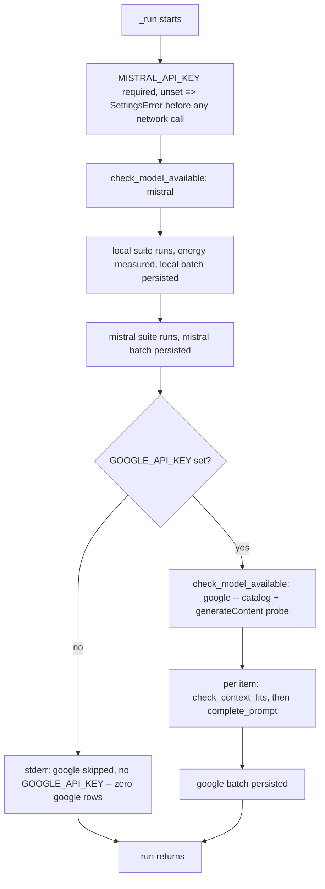
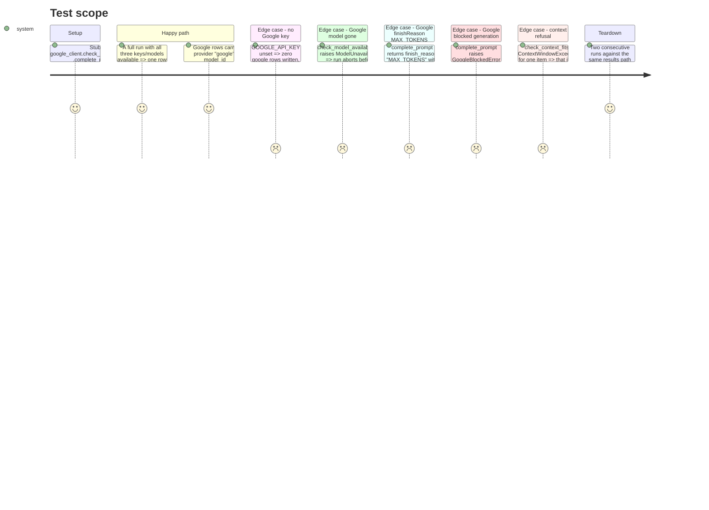

<!-- Fill or omit these sections; never add, rename, or reorder one. -->

# Instruction: Google as the quality CLI's third batch

> **Superseded in two places by a mid-phase scope change** (`feat(quality):
> make the cloud provider set configuration`, recorded in phase-3's Evidence
> section and in `CHANGELOG.md`). The cloud provider set became configuration
> (`settings.QUALITY_PROVIDERS`) and both cloud providers moved to a uniform
> optional-skip shape. What that changes below, and nothing else:
>
> - **User Journey, first node.** An unset `MISTRAL_API_KEY` no longer raises
>   `SettingsError` before any network call: it skips the Mistral batch with
>   one stderr line, exactly as an unset `GOOGLE_API_KEY` does.
> - **Criterion 4.4.** A `GoogleBlockedError` raised mid-batch is no longer
>   caught by `quality_cli.main` for an exit 1. It is caught by
>   `_try_run_cloud_provider`, printed as one `google skipped: ...` stderr
>   line, and the run exits 0 with the local and mistral rows intact. Same
>   for every other cloud-provider failure, transport errors included.

## Architecture projection

> Tree of the final files. ✅ create · ✏️ modify · ❌ delete

```txt
.
├── src/wave_local_ai_v2/
│   ├── quality_cli.py            ✏️ generic per-provider cloud dispatch; local → mistral → google, each batch persisted before the next
│   ├── cost.py                   ✏️ GOOGLE_PRICE_TABLE + its own import-time guard; PRICE_TABLES lookup by provider id
│   ├── prompt_provenance.py      ✏️ + TEMPLATE_ID_GOOGLE_CHAT_MESSAGE, its hash, into is_consistent's reach
│   └── scoring.py                 ✏️ score_item gains an optional truncation_reason override
└── tests/
    ├── test_quality_cli.py        ✏️ + the google batch's own assertions, mirroring the mistral ones
    ├── test_cost.py                ✏️ + GOOGLE_PRICE_TABLE assertions
    └── test_scoring.py             ✏️ + truncation_reason override tests
```

## User Journey



## Test Scope

<!-- Required for every phase. Keep Setup, Happy path, any qualifying Edge cases, and any required Teardown in this one journey. -->



## Wireframe

<!-- UI phase only. No UI => omit the section, don't invent one. -->

## Tasks to do

### `1)` Generalize the cost table

1. `cost.py`: add `GOOGLE_PRICE_TABLE: dict[str, Price]` with the one entry from the decision file (`"gemini-3.5-flash-lite": {"input_per_million": 0.30, "output_per_million": 2.50, "currency": "USD", "retrieved_at": "2026-08-27"}`), keyed by the literal id, never by `google_client.MODEL` (mirrors the existing Mistral rule and its comment).
2. Add `google_client` to `cost.py`'s imports; add the same import-time guard shape for `GOOGLE_PRICE_TABLE` against `google_client.MODEL`, raising `CostTableError`.
3. Add `PRICE_TABLES: dict[str, dict[str, Price]] = {"mistral": MISTRAL_PRICE_TABLE, "google": GOOGLE_PRICE_TABLE}` below both guards, for `quality_cli`'s generic per-provider lookup. `MISTRAL_PRICE_TABLE` and `GOOGLE_PRICE_TABLE` stay public and unchanged in shape — `test_cost.py`'s existing literal-source assertions must still pass.

### `2)` Extend `prompt_provenance.py`

1. `TEMPLATE_ID_GOOGLE_CHAT_MESSAGE = "google-generatecontent-user-part"` and its own `_GOOGLE_...TEMPLATE` string documenting the fixed `{"role": "user", "parts": [{"text": <prompt>}]}` wrapper, hashed the same way `MISTRAL_CHAT_MESSAGE_HASH` is.

### `3)` `scoring.score_item` gains an optional override

1. Add `truncation_reason: str | None = None` as a keyword-only parameter. When `truncated` is `True` and `truncation_reason` is given, use it directly (it must be `FAILURE_REASON_TRUNCATED_MAX_TOKENS` or `FAILURE_REASON_TRUNCATED_CONTEXT` — anything else is a caller bug, assert or raise `ValueError`). When it is `None` (every existing call site, Mistral and local), fall back to today's `generated_tokens >= max_output_tokens` comparison unchanged.
2. `tests/test_scoring.py`: the override wins over a token count that would otherwise pick the other reason; the default path is untouched (existing tests keep passing with no edits).

### `4)` Wire Google into `quality_cli.py`

1. Introduce one small per-cloud-provider record (a `TypedDict` or a plain dict of callables is fine — no new class hierarchy) carrying: the provider id, whether its key is required-to-abort or optional-to-skip, `check_model_available`, a per-item completion function returning `_Completion` plus the raw provider response, the call-path fields, and the batch-fields builder. `_run_cloud_suite`, `_mistral_call_path`/`_cloud_batch_fields` become the `"mistral"` entry; a new `"google"` entry supplies its own per-item function (context-fits pre-flight, then `complete_prompt`, truncation from `finish_reason` via `score_item`'s new override) and its own call-path/batch-fields builders (endpoint `google_client.GENERATE_URL`, template id from Task 2, price table `cost.PRICE_TABLES["google"]`).
2. `_run`: after the Mistral batch is persisted, branch on `settings.google_api_key`. Empty → one stderr line (`"google skipped: GOOGLE_API_KEY is not set"`), no google rows, no google network call. Non-empty → `google_client.check_model_available`, then run the google batch through the same `_score_and_write` used by the other two providers, model_id `google_client.MODEL`.
3. Extend `quality_cli.main`'s except tuple with `google_client.GoogleRequestError` (which `GoogleBlockedError`, `ModelUnavailableError` and `ContextWindowExceededError` all subclass), the same widening rule already applied for `MistralRequestError`.
4. Google row extras: alongside the existing row fields, add two non-required keys — `"model_version"` (the per-response `modelVersion`, or the pre-flight's `version` when the response omitted it) and `"api_version"` (the literal `"v1"`) — present only on google rows. Confirm `row_contract.REQUIRED_FIELDS["quality"]` is untouched by this task; these two keys ride through `validate_row` unchecked.
5. `GOOGLE_SAMPLING: dict[str, Any] = {"temperature": 0, "top_p": 1, "top_k": 1, "seed": QUALITY_SEED}`, alongside `CLOUD_SAMPLING`, distinct keys from both existing sampling blocks (parity with the existing `"random_seed" not in sampling` / `"presence_penalty" not in sampling` test pattern).

### `5)` Tests

1. `tests/test_quality_cli.py`: extend `stubbed_run`'s fixture with google-side patches (`google_client.check_model_available`, `.complete_prompt`, `.check_context_fits`) defaulting to a happy path, so every existing test keeps passing unedited; add one test per Test Scope row above, mirroring the corresponding Mistral test's shape (e.g. `test_google_rows_carry_scope_3_emissions_and_the_list_price_they_cost_from`, `test_run_skips_google_when_the_key_is_unset`, `test_google_context_refusal_scores_truncated_context_without_a_generate_call`).
2. `tests/test_cost.py`: `GOOGLE_PRICE_TABLE` carries one dated sourced entry for `google_client.MODEL`; `PRICE_TABLES["google"] is GOOGLE_PRICE_TABLE`; an unpriced google id fails at import (mirrors the existing Mistral import-guard test, reloading `cost` under a patched `google_client.MODEL`).

## Test acceptance criteria

<!-- Each criterion is an observable behavior, not a command. -->

| Task | Acceptance criteria |
| ---- | -------------------- |
| 1    | `GOOGLE_PRICE_TABLE` is keyed by the literal `"gemini-3.5-flash-lite"`; importing `cost` with an unpriced `google_client.MODEL` raises `CostTableError`; `MISTRAL_PRICE_TABLE`'s values and `test_cost.py`'s existing assertions are unchanged |
| 3    | `score_item(..., truncated=True, generated_tokens=4, max_output_tokens=8, truncation_reason="truncated_max_tokens")` returns `truncated_max_tokens` even though the token comparison alone would pick `truncated_context` |
| 4.1  | A full run against all three providers writes local rows, then mistral rows, then google rows, in that order, each batch already on disk (readable via `read_rows`) before the next batch's first network call |
| 4.2  | `GOOGLE_API_KEY` unset writes zero rows with `provider == "google"`, leaves the local and mistral rows intact, and the process still exits 0 |
| 4.3  | A google row carries `provider == "google"`, `model_id == google_client.MODEL`, a `sampling` block with `top_p`/`top_k`/`seed` and no `random_seed` or `presence_penalty`, a `cost_total` derived from `GOOGLE_PRICE_TABLE`, and the extra `model_version`/`api_version` keys, while `row_contract.REQUIRED_FIELDS["quality"]` is unchanged from before this phase |
| 4.4  | `google_client.GoogleBlockedError` raised mid-batch is caught by `quality_cli.main`, printed as one stderr line, and exits 1 — never an uncaught traceback |
| 4.5  | An item that fails `check_context_fits` scores `truncated_context` on its own row without a `generateContent` call for that item, while the batch's other items are generated normally |
