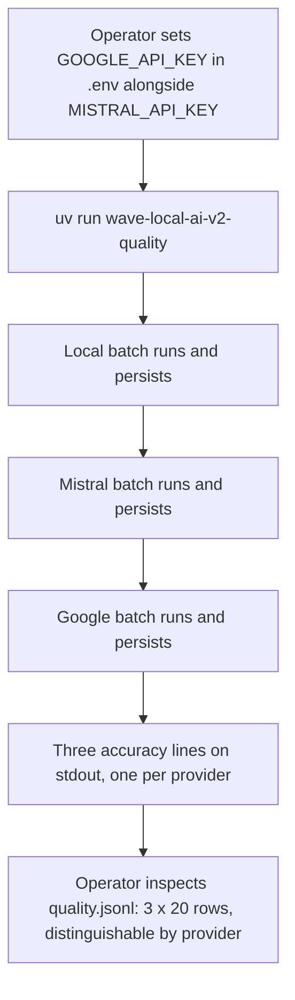
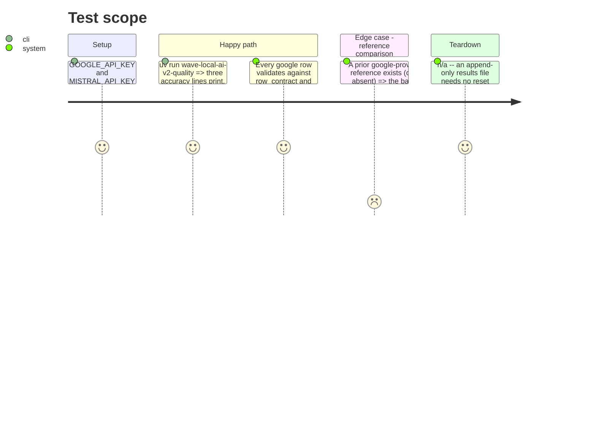

<!-- Fill or omit these sections; never add, rename, or reorder one. -->

# Instruction: One live three-provider run, and the docs it proves

## Architecture projection

> Tree of the final files. ✅ create · ✏️ modify · ❌ delete

```txt
.
├── aidd_docs/results/quality.jsonl   ✏️ one live run's rows appended: local, mistral, google
├── CHANGELOG.md                       ✏️ + entry for the second cloud provider
├── .env.example                       ✏️ + GOOGLE_API_KEY line
├── docs/setup.md                      ✏️ + the three-provider run note (was "second run, set MISTRAL_API_KEY")
├── aidd_docs/memory/ecosystem.md      ✏️ + google as a second cloud provider, scope-3 estimate unchanged
└── aidd_docs/memory/codebase-map.md   ✏️ + google_client.py entry
```

## User Journey



## Test Scope

<!-- Required for every phase. Keep Setup, Happy path, any qualifying Edge cases, and any required Teardown in this one journey. -->



## Wireframe

<!-- UI phase only. No UI => omit the section, don't invent one. -->

## Tasks to do

### `1)` One live run on this machine

> Proves the whole path end to end against the real API, not stubs.

1. Confirm `GOOGLE_API_KEY` is set in `.env` (per the spike's confirmed free-tier key). Run `uv run wave-local-ai-v2-quality`.
2. Read back the newly appended rows in `aidd_docs/results/quality.jsonl`: confirm 20 local + 20 mistral + 20 google rows, each google row's `model_id == "gemini-3.5-flash-lite"`, `version` matching the catalog's current snapshot, `api_version == "v1"`, and a non-null `cost_total`/`list_price_input_per_million`.
3. Record the run's suite accuracy, cost and the verdict for all three providers in the phase's own evidence note (not committed to `quality.jsonl` beyond the rows themselves) — this is the "reference-comparison verdict" the story's Evidence section asks for.
4. If the run raises (`GoogleBlockedError`, rate-limit `GoogleRequestError`, or otherwise), record the exact failure and adjust phase 1/2 rather than silently retrying past it — a live failure here means the stubbed tests missed a real response shape.

### `2)` `CHANGELOG.md`

1. One entry: Google AI Studio (`gemini-3.5-flash-lite`) added as a second cloud subject to the quality CLI, alongside Mistral, under the same pinning discipline.

### `3)` `.env.example`

1. Add `GOOGLE_API_KEY=AIza-replace-me` beneath the existing `MISTRAL_API_KEY` line.

### `4)` `docs/setup.md`

1. Update the "second run, set `MISTRAL_API_KEY` first" section (or add a sibling one) to name `GOOGLE_API_KEY` too, and state plainly that an unset Google key skips that provider's rows rather than aborting the run — the one behavioral asymmetry with Mistral an operator needs to know before they wonder why `quality.jsonl` has no google rows.

### `5)` `aidd_docs/memory/ecosystem.md`

1. Extend the cloud-provider section to name Google as the second cloud subject, its pinned id, and that its Scope-3 energy/emissions estimate reuses the same `SCOPE3_WH_PER_TOKEN` formula as Mistral's (no new formula id).

### `6)` `aidd_docs/memory/codebase-map.md`

1. Add `google_client.py` next to the existing `mistral_client.py` entry, one line, same style.

## Test acceptance criteria

<!-- Each criterion is an observable behavior, not a command. -->

| Task | Acceptance criteria |
| ---- | -------------------- |
| 1    | The live run completes (or its failure is recorded and phases 1/2 are revised before this phase is marked done); `quality.jsonl` gains 60 rows in the local/mistral/google order, all `row_contract`-valid |
| 2    | `CHANGELOG.md` names the second cloud provider and its pinned id |
| 3    | `.env.example` documents `GOOGLE_API_KEY` |
| 4    | `docs/setup.md` tells an operator both env vars matter and that a missing Google key degrades to a skip, not a failure |
| 5    | `aidd_docs/memory/ecosystem.md` names Google as the second cloud subject |
| 6    | `aidd_docs/memory/codebase-map.md` lists `google_client.py` |
