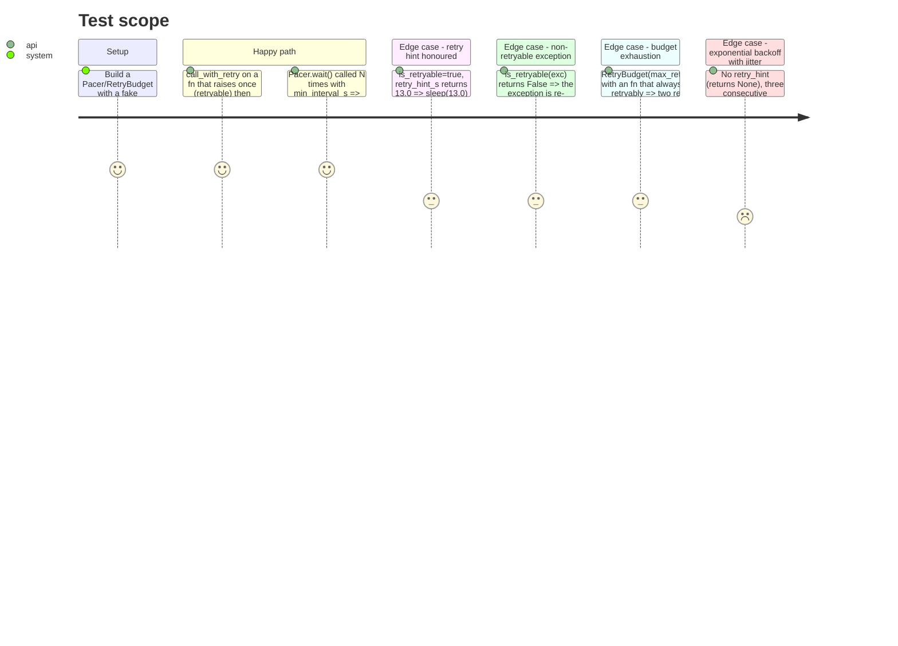

<!-- Fill or omit these sections; never add, rename, or reorder one. -->

# Instruction: The pacing/retry primitives (`retry.py`)

## Architecture projection

> Tree of the final files. ✅ create · ✏️ modify · ❌ delete

```txt
.
├── src/wave_local_ai_v2/
│   └── retry.py                 ✅ Pacer, RetryBudget, RetryBudgetExhausted, call_with_retry
└── tests/
    └── test_retry.py            ✅ unit tests, fake clock/sleep/jitter, no real time.sleep
```

## User Journey

```mermaid
flowchart TD
  A[Caller wraps an HTTP call in call_with_retry] --> B{Call raises?}
  B -- no --> C[Return result, retries_taken=0]
  B -- yes --> D{is_retryable(exc)?}
  D -- no --> E[Re-raise immediately]
  D -- yes --> F{Budget has retries left?}
  F -- no --> G[Raise RetryBudgetExhausted, cause=exc]
  F -- yes --> H[Sleep: retry_hint_s or exponential backoff + jitter]
  H --> I[Retry the call]
  I --> B
```

## Test Scope

<!-- Required for every phase. Keep Setup, Happy path, any qualifying Edge cases, and any required Teardown in this one journey. -->



## Tasks to do

### `1)` Write `retry.py`

> A dependency-free pacing/retry layer: no knowledge of any provider, HTTP library, or CLI — pure functions and two small stateful helpers, testable with fake clock/sleep/jitter.

1. `Pacer(min_interval_s, *, clock=time.monotonic, sleep=time.sleep)` with `.wait()`: no-op before the first call; otherwise sleeps only the remainder of `min_interval_s` since the previous call, and advances its own notion of "last call time" by exactly `min_interval_s` (not by the wall clock read after sleeping) so a slow test clock never compounds drift.
2. `RetryBudget(max_retries: int)` with `.take() -> bool`: decrements and returns `True` while retries remain, returns `False` (no decrement) once exhausted. One instance is shared across every item of one provider batch — a run-scoped budget, not a per-call one.
3. `RetryBudgetExhausted(RuntimeError)`: raised with `raise RetryBudgetExhausted(...) from exc` so `__cause__` keeps the original error (its status code, its retry hint) inspectable by whatever catches it.
4. `call_with_retry(fn, *, is_retryable, retry_hint_s, budget, base_delay_s, max_delay_s=60.0, sleep=time.sleep, jitter=random.random) -> tuple[T, int]`: calls `fn()`; on an exception, re-raises immediately if `is_retryable(exc)` is `False`; otherwise takes one unit from `budget` (raising `RetryBudgetExhausted` if none remain), computes the delay as `retry_hint_s(exc)` when not `None`, else `min(max_delay_s, base_delay_s * 2**attempt)` with `jitter()` added as a fractional extra, sleeps, increments `attempt`, and retries. Returns `(result, attempt)` on eventual success.
5. Module docstring states the scope explicitly: this module knows nothing about status codes, providers, or the CLI — every provider-specific decision (`is_retryable`, `retry_hint_s`) is supplied by the caller.

## Test acceptance criteria

<!-- Each criterion is an observable behavior, not a command. -->

| Task | Acceptance criteria              |
| ---- | -------------------------------- |
| 1... | A fake-clock `Pacer` fed a scripted sequence of `.wait()` calls sleeps exactly the amounts the Journey table states, and the first call never sleeps. |
| 1... | `call_with_retry` on a fn raising once then succeeding returns `(result, 1)` and calls the stub `sleep` exactly once. |
| 1... | `is_retryable` returning `False` re-raises the original exception with no sleep call and no budget consumption. |
| 1... | A present `retry_hint_s` value is passed to `sleep` verbatim, never blended with the exponential-backoff formula. |
| 1... | `RetryBudget(max_retries=N)` exhausted after `N` retryable failures raises `RetryBudgetExhausted` whose `__cause__` is the last raised exception. |
| 1... | With no hint, three consecutive retries sleep strictly increasing durations bounded by `max_delay_s`. |
