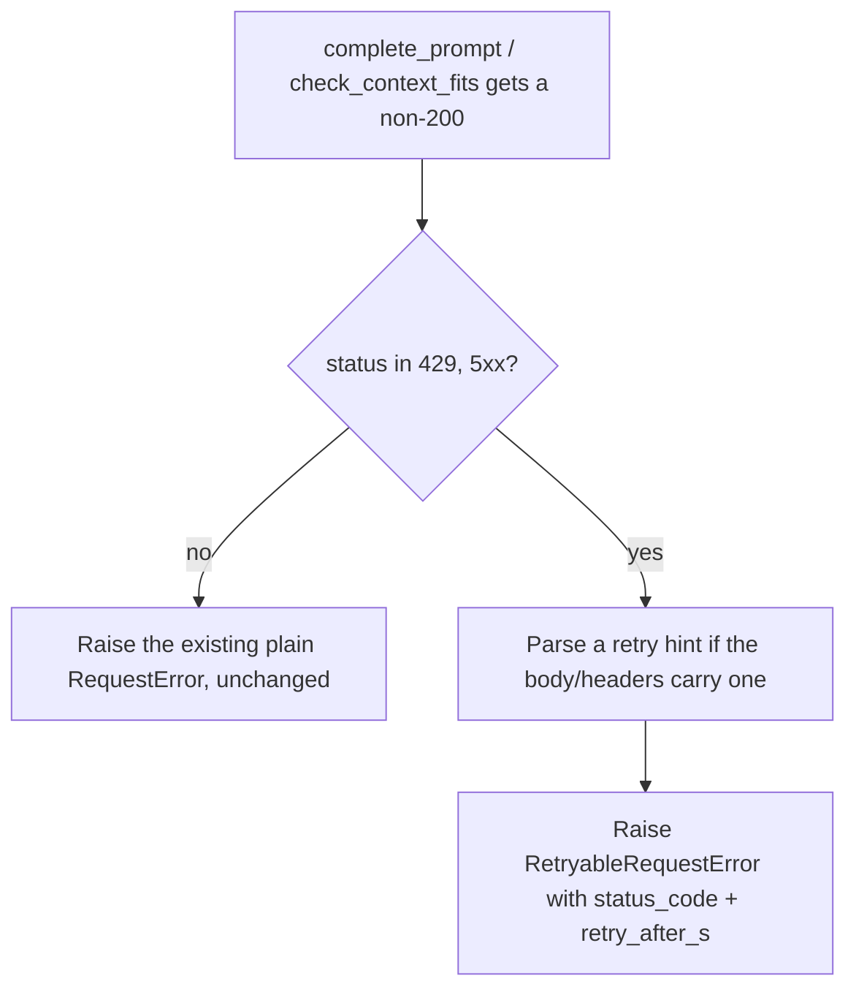
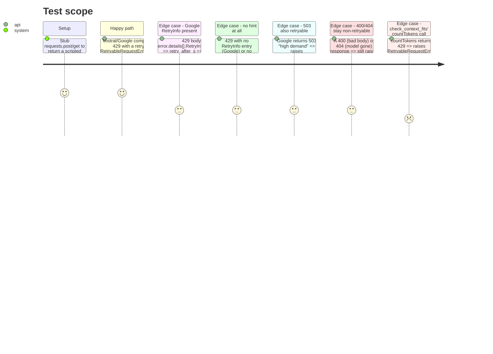

<!-- Fill or omit these sections; never add, rename, or reorder one. -->

# Instruction: Clients raise a typed retryable error

## Architecture projection

> Tree of the final files. ✅ create · ✏️ modify · ❌ delete

```txt
.
├── src/wave_local_ai_v2/
│   ├── mistral_client.py        ✏️ RetryableRequestError(MistralRequestError): status_code, retry_after_s
│   └── google_client.py         ✏️ RetryableRequestError(GoogleRequestError): status_code, retry_after_s; reuses/refactors _retry_hint
└── tests/
    ├── test_mistral_client.py   ✏️ 429/5xx raise RetryableRequestError; 400 still plain MistralRequestError
    └── test_google_client.py    ✏️ 429/503 raise RetryableRequestError with retry_after_s parsed from RetryInfo; check_context_fits' countTokens call gets the same treatment
```

## User Journey



## Test Scope

<!-- Required for every phase. Keep Setup, Happy path, any qualifying Edge cases, and any required Teardown in this one journey. -->



## Tasks to do

### `1)` `mistral_client.py`: `RetryableRequestError`

> A distinct, retryable subclass of the existing error, carrying enough for a caller's `is_retryable`/`retry_hint_s` to decide without re-parsing anything.

1. Add `class RetryableRequestError(MistralRequestError)` with `__init__(self, message, *, status_code: int, retry_after_s: float | None)`, storing both as attributes.
2. In `complete_prompt`, when `response.status_code != 200`: if the status is `429` or `>= 500`, raise `RetryableRequestError` (status_code, `retry_after_s=_mistral_retry_hint(response)`) instead of the plain error; every other non-200 status keeps raising `MistralRequestError` exactly as today.
3. Add `_mistral_retry_hint(response) -> float | None`: reads the standard `Retry-After` header (seconds, integer form) opportunistically. Docstring is explicit that this is *not* a live-confirmed Mistral behavior the way Google's `RetryInfo` is (no memory file documents it) — absence just means `None`, falling back to backoff.
4. `check_model_available`'s error paths (`ModelUnavailableError`, the plain `MistralRequestError` on a non-200 catalog fetch) are untouched: the acceptance explicitly wants a model-availability failure to fail immediately, never retried.

### `2)` `google_client.py`: `RetryableRequestError`

> Same shape as Mistral's, reusing the already-live-confirmed `RetryInfo.retryDelay` parser.

1. Add `class RetryableRequestError(GoogleRequestError)` with the same `status_code`/`retry_after_s` attributes.
2. Refactor `_retry_hint` (currently returns a pre-formatted string for the error message) into a `_parse_retry_delay_s(response) -> float | None` that returns the numeric seconds (parsing the `"13s"`-shaped `retryDelay` duration string), keeping a thin wrapper for the existing message-building use if still needed.
3. In `complete_prompt`, when `response.status_code != 200`: `429` or `503` raise `RetryableRequestError` (status_code, `retry_after_s=_parse_retry_delay_s(response)`); every other status keeps raising `GoogleRequestError` unchanged.
4. Apply the identical status check inside `check_context_fits`'s `countTokens` call: a 429/503 there raises `RetryableRequestError` too — it shares the same 15 RPM quota as `generateContent`, so it is exactly as retryable.
5. `check_model_available`'s catalog GET and probe stay as they are (not itemized in scope, not called per-item) — leave unwrapped, note the gap is accepted in the plan's Risks if surfaced by the live-evidence phase.

## Test acceptance criteria

<!-- Each criterion is an observable behavior, not a command. -->

| Task | Acceptance criteria              |
| ---- | -------------------------------- |
| 1... | A stubbed 429 from Mistral raises `RetryableRequestError` with `status_code == 429`. |
| 1... | A stubbed 500 from Mistral raises `RetryableRequestError` with `status_code == 500`. |
| 1... | A stubbed 400 from Mistral still raises plain `MistralRequestError`, not the retryable subclass. |
| 1... | A 429 with a `Retry-After: 7` header sets `retry_after_s == 7.0`; a 429 with no such header sets `retry_after_s is None`. |
| 2... | A stubbed 429 with `error.details[].RetryInfo.retryDelay == "13s"` raises `RetryableRequestError` with `retry_after_s == 13.0`. |
| 2... | A stubbed 503 raises `RetryableRequestError`, not `GoogleRequestError` directly. |
| 2... | A stubbed 404/400 still raise the existing, non-retryable error types unchanged. |
| 2... | `check_context_fits` on a stubbed 429 from `countTokens` raises `RetryableRequestError`. |
