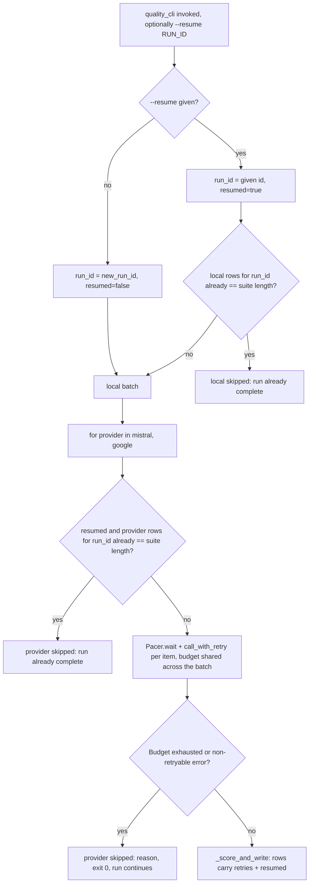

<!-- Fill or omit these sections; never add, rename, or reorder one. -->

# Instruction: `quality_cli.py` wiring + `--resume`

## Architecture projection

> Tree of the final files. ✅ create · ✏️ modify · ❌ delete

```txt
.
├── src/wave_local_ai_v2/
│   ├── quality_cli.py            ✏️ Pacer+RetryBudget per provider batch, --resume flag, retries/resumed row fields
│   ├── settings.py               ✏️ MISTRAL_REQUEST_PACING_S, GOOGLE_REQUEST_PACING_S, CLOUD_RETRY_MAX_ATTEMPTS
│   ├── results.py                ✏️ rows_for_run(path, run_id) -> list[dict]
│   └── row_contract.py           ✏️ SCHEMA_VERSION "7" -> "8"; quality REQUIRED_FIELDS gains retries, resumed
└── tests/
    ├── test_quality_cli.py       ✏️ pacing intervals, 429-then-success under retry, resume skip/rerun, budget exhaustion still skips
    ├── test_settings.py          ✏️ new env vars parsed, defaults, minimum validation
    ├── test_results.py           ✏️ rows_for_run filters correctly
    └── test_row_contract.py      ✏️ schema bump, new required fields enforced
```

## User Journey



## Test Scope

<!-- Required for every phase. Keep Setup, Happy path, any qualifying Edge cases, and any required Teardown in this one journey. -->

```mermaid
---
title: Test scope
---
journey
  %% Every task has exactly one actor: browser, api, cli, or system.
  section Setup
    stubbed_run fixture stubs process/HTTP, monkeypatches time.sleep to record calls instead of blocking => deterministic, zero-real-time test => system: 5: system
  section Happy path
    Fresh run, Mistral stub 429-then-200 on one item => item succeeds after one retry, row's retries field == 1, run continues normally => system: 5: cli
  section Happy path
    Fresh run, no --resume => every row's resumed field is false => system: 5: cli
  section Edge case - pacing intervals
    A 3-item Google batch's stub records call timestamps via the monkeypatched sleep => sleep is called with GOOGLE_REQUEST_PACING_S between items, not before the first => system: 3: cli
  section Edge case - resume skips a complete provider
    quality.jsonl already has 20 mistral rows for run_id R; invoke main with --resume R => mistral's complete_prompt stub is never called, "mistral skipped: run already complete" on stderr => system: 5: cli
  section Edge case - resume reruns an incomplete provider
    quality.jsonl has 0 google rows for run_id R (a prior run's google batch never finished) => --resume R re-runs all 20 items fresh, new rows carry run_id R and resumed=true => system: 5: cli
  section Edge case - retry budget exhaustion still skips
    Mistral stub always 429s => after CLOUD_RETRY_MAX_ATTEMPTS retries the batch gives up, "mistral skipped: ..." on stderr, exit code 0, google still attempted => system: 5: cli
  section Edge case - resume with an unknown run_id
    --resume given a run_id with zero existing rows anywhere => behaves like a fresh run under that id; every row still marked resumed=true => system: 2: cli
```

## Tasks to do

### `1)` `settings.py`: new pacing/retry configuration

> Provider-configurable pacing, one shared retry-attempts ceiling, following the existing `_require_numeric` pattern exactly.

1. `DEFAULT_MISTRAL_REQUEST_PACING_S = 1.1`, `DEFAULT_GOOGLE_REQUEST_PACING_S = 4.1`, `DEFAULT_CLOUD_RETRY_MAX_ATTEMPTS = 4` (module constants, comment citing this plan's Decisions/Risks on the 4.1s figure).
2. `Settings` gains `mistral_request_pacing_s: float`, `google_request_pacing_s: float`, `cloud_retry_max_attempts: int`, all with the defaults above.
3. `load_settings` reads `MISTRAL_REQUEST_PACING_S`, `GOOGLE_REQUEST_PACING_S`, `CLOUD_RETRY_MAX_ATTEMPTS` via `_require_numeric`, minimum `0.0`/`0.0`/`1` respectively (a pacing interval can be zero -- disabled -- but not negative; at least one attempt must be allowed).

### `2)` `results.py`: `rows_for_run`

> The read-back a resume needs, generic over provider/kind rather than duplicated per call site.

1. `def rows_for_run(path: Path, run_id: str) -> list[dict[str, Any]]`: `read_rows(path)` filtered to `row.get("run_id") == run_id`. Docstring: an empty list on an absent store or an unknown `run_id` alike -- both mean "nothing to skip".

### `3)` `row_contract.py`: schema bump

> `retries` and `resumed` become required, quality rows only.

1. Bump `SCHEMA_VERSION` to `"8"`, extending the version-history comment block with the new line (mirroring every prior bump's phrasing).
2. Add `"retries"` and `"resumed"` to the `"quality"` `REQUIRED_FIELDS` frozenset only -- `"runtime"` is untouched.

### `4)` `quality_cli.py`: wiring

> Replace the ad hoc `GOOGLE_REQUEST_PACING_S` stopgap and Mistral's unpaced loop with the shared `retry.Pacer`/`retry.RetryBudget`/`retry.call_with_retry`, add `--resume`, thread `resumed` onto every row.

1. Remove the module-level `GOOGLE_REQUEST_PACING_S` constant and its two `time.sleep(...)` call sites in `_make_google_complete_item`'s closure; replace with a `Pacer` built once per Google batch (closed over alongside `model_info`), `.wait()` called before each of the two per-item requests.
2. Give Mistral the same treatment: build a `Pacer(settings.mistral_request_pacing_s)` once per Mistral batch, `.wait()` before each item's `complete_prompt`.
3. Wrap both providers' per-item completion calls in `retry.call_with_retry`, `is_retryable=lambda exc: isinstance(exc, <provider>.RetryableRequestError)`, `retry_hint_s=lambda exc: exc.retry_after_s if isinstance(exc, <provider>.RetryableRequestError) else None`, one shared `RetryBudget(settings.cloud_retry_max_attempts)` per provider batch (not per item -- a run-scoped budget). Record `retries_taken` on the `_Completion` (new `retries: int` key; `0` for local, which never retries).
4. `_try_run_cloud_provider`'s `except` tuple gains `retry.RetryBudgetExhausted` alongside the existing provider error type and `requests.RequestException` -- exhaustion prints the same `"<provider> skipped: {exc}"` line and returns, preserving `main()`'s exit-0 continuation.
5. Add `--resume RUN_ID` via `argparse` in `main()` (`_parse_args(argv) -> argparse.Namespace`), threaded into `_run(resume_run_id: str | None = None)`. `run_id = resume_run_id or new_run_id()`; `is_resume = resume_run_id is not None`.
6. Before running the local batch: if `is_resume` and `len([r for r in results.rows_for_run(settings.quality_results_path, run_id) if r["provider"] == "local"]) >= len(CLASSIFICATION_TASK_SUITE)`, print `"local skipped: run {run_id} already complete"` to stderr and skip the local batch entirely (no server launch). Otherwise run it as today.
7. `_try_run_cloud_provider` gets the same completeness check per provider before calling `spec["run_batch"]`, printing the matching skip line and returning early when already complete.
8. `_score_and_write` gains a `resumed: bool` parameter, threaded onto every row of a batch it writes (`is_resume` from the call site -- true even for a provider that resume re-ran from scratch, since "this run's invocation was a `--resume` invocation" is what the field records, not "this specific row was skipped").

## Test acceptance criteria

<!-- Each criterion is an observable behavior, not a command. -->

| Task | Acceptance criteria              |
| ---- | -------------------------------- |
| 1... | `GOOGLE_REQUEST_PACING_S=6` (etc.) overrides the default; a non-numeric or negative value raises `SettingsError` naming the var. |
| 2... | `rows_for_run` on an empty/absent store returns `[]`; on a store with rows from two different `run_id`s returns only the matching ones. |
| 3... | Writing a quality row missing `retries` or `resumed` raises `RowContractError` naming the missing field. |
| 4... | A Mistral stub that 429s once then 200s succeeds, and the written row's `retries == 1`. |
| 4... | The stubbed `sleep` records a Google batch's per-item pacing at `settings.google_request_pacing_s`, with no sleep call before the first item. |
| 4... | `--resume <run_id>` on a store already carrying every row for `(run_id, "mistral")` calls the stubbed `complete_prompt` zero times for Mistral and prints the "already complete" skip line. |
| 4... | `--resume <run_id>` on a store with zero rows for `(run_id, "google")` re-runs all 20 items and every written row has `resumed: true`. |
| 4... | A Mistral stub that always 429s exhausts the budget, prints `"mistral skipped: ..."`, `main()` still exits with code `0`, and Google's batch still runs. |
