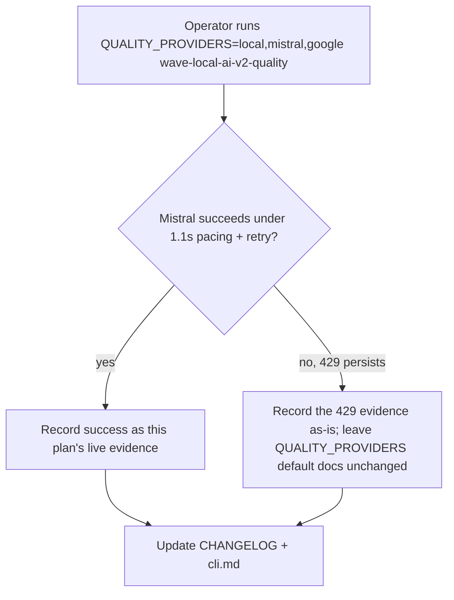
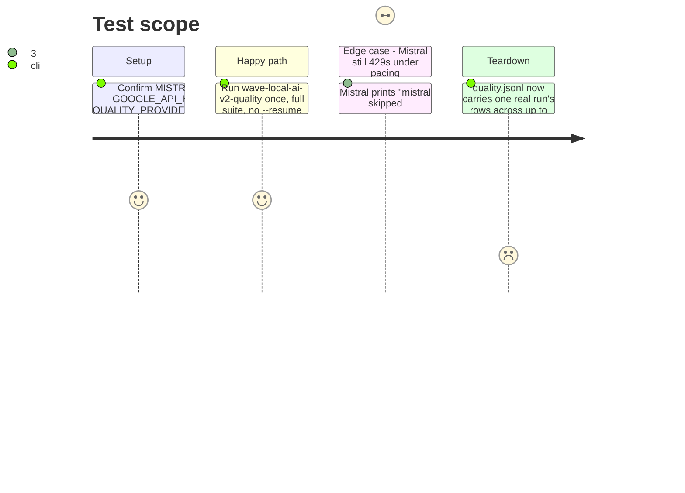

<!-- Fill or omit these sections; never add, rename, or reorder one. -->

# Instruction: Live three-provider evidence + docs

## Architecture projection

> Tree of the final files. ✅ create · ✏️ modify · ❌ delete

```txt
.
├── CHANGELOG.md                  ✏️ Unreleased/Added: pacing+retry layer, --resume, schema "8"
├── aidd_docs/memory/cli.md       ✏️ document the --resume flag and its per-provider skip behavior
└── aidd_docs/tasks/2026_09/2026_09_05_.../decision.md  ✅ live-run evidence (if a live run against real credentials is executed)
```

## User Journey



## Test Scope

<!-- Required for every phase. Keep Setup, Happy path, any qualifying Edge cases, and any required Teardown in this one journey. -->



## Tasks to do

### `1)` Run the live three-provider evidence

> One real invocation on this machine, credentials already configured per `aidd_docs/memory/external/google-ai-studio-api.md` and the project's existing `.env` convention.

1. Confirm `.env` has `QUALITY_PROVIDERS=local,mistral,google` (or export it for the one invocation) and both cloud API keys set.
2. Run `uv run wave-local-ai-v2-quality`, capture stdout/stderr in full.
3. If Mistral succeeds: note the accuracy line and the retry count observed (0 or more) as evidence the 1.1s pacing (+ retry, if any 429 fired) makes the Free tier usable again.
4. If Mistral still 429s after exhausting the retry budget: capture the exact stderr skip line and the retry count that preceded it, write it into a short `decision.md` in this feature folder, and leave `QUALITY_PROVIDERS`'s documented default unchanged (per the story's own instruction) — this is evidence to record, not a default to silently walk back.

### `2)` Docs

> `CHANGELOG.md` and `cli.md`, following each file's existing section conventions exactly (no new headings invented).

1. `CHANGELOG.md`, `## [Unreleased]` → `### Added`: one entry describing the pacing/retry layer (`retry.py`), the two clients' `RetryableRequestError`, the `--resume` flag, and the schema bump to `"8"` (`retries`, `resumed`) — matching the terseness and citation style of the entries already there (e.g. the Google-subject entry above it).
2. `cli.md`: extend the `wave-local-ai-v2-quality` bullet with the `--resume <run_id>` flag's behavior (skips a provider whose rows for that run_id are already complete, re-runs an incomplete one from scratch, marks every row of a `--resume` invocation `resumed`) and name the new pacing/retry env vars (`MISTRAL_REQUEST_PACING_S`, `GOOGLE_REQUEST_PACING_S`, `CLOUD_RETRY_MAX_ATTEMPTS`) next to the existing `QUALITY_PROVIDERS` mention.

## Test acceptance criteria

<!-- Each criterion is an observable behavior, not a command. -->

| Task | Acceptance criteria              |
| ---- | -------------------------------- |
| 1... | The live run's full stdout/stderr is captured and quoted (not paraphrased) in the phase's completion notes or a `decision.md`, whichever succeeded or failed. |
| 1... | If Mistral 429s persist, `QUALITY_PROVIDERS`'s documented default in `settings.py`/`cli.md` is left exactly as it is today — no silent walk-back of the three-provider default. |
| 2... | `CHANGELOG.md`'s new entry sits under the existing `## [Unreleased]` / `### Added`, does not duplicate or contradict the Google-subject entry already there. |
| 2... | `cli.md` names `--resume` and all three new env vars with their defaults. |
