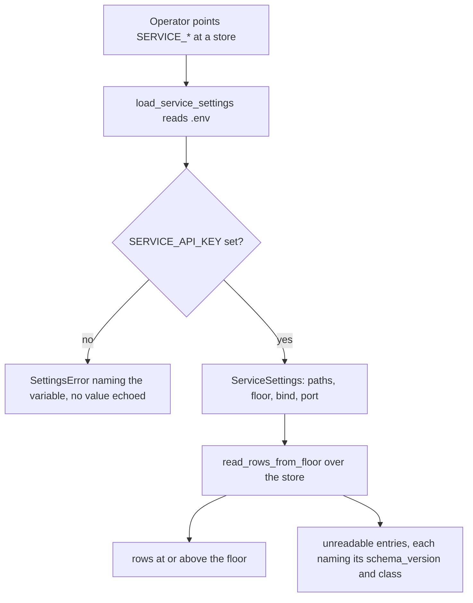
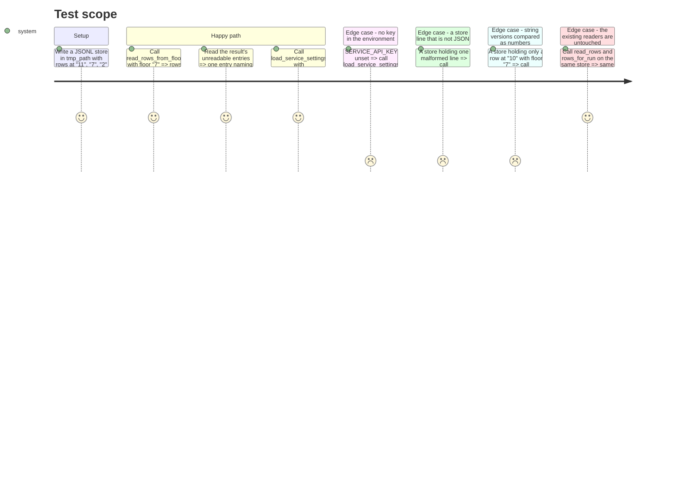

# Instruction: The floor-aware read path and the service's own settings

## Architecture projection

> Tree of the final files. ✅ create · ✏️ modify · ❌ delete

```txt
.
├── src/wave_local_ai_v2/
│   ├── results.py          ✏️ a read path that reports rows below the floor instead of dropping them
│   └── settings.py         ✏️ ServiceSettings + load_service_settings: bind, port, key, floor, store/registry paths
├── tests/
│   ├── test_results.py     ✏️ floor selection, unreadable classes, unchanged read_rows
│   └── test_settings.py    ✏️ service settings defaults, overrides, the missing-key refusal
└── .env.example            ✏️ the four SERVICE_* variables, key placeholder only
```

## User Journey



## Test Scope



## Tasks to do

### `1)` The floor-aware read path in `results.py`

> Report what cannot be read, rather than filtering it away.

1. Add a frozen dataclass `StoreRead` with `rows: list[dict[str, Any]]` and `unreadable: list[UnreadableRows]`, and a frozen `UnreadableRows` with `schema_version: str | None`, `count: int`, `reason: str`.
2. Name the three unreadable reasons as module constants: `UNREADABLE_BELOW_FLOOR`, `UNREADABLE_NO_SCHEMA_VERSION`, `UNREADABLE_UNPARSABLE_LINE`. Finite and named, like `row_contract`'s own reason strings.
3. Add `read_rows_from_floor(path: Path, minimum_schema_version: str) -> StoreRead`. An absent file is an empty `StoreRead`, matching `read_rows`'s existing "absent store is not an error" contract.
4. Compare versions as **integers**, not strings: `"10"` sorts before `"7"` lexically and the bundle/live gap (`"7"` vs `"11"`) crosses exactly that boundary. `tests/test_reference_bundle.py:103` already carries this trap in a comment; state it in a comment here too.
5. A row with no `schema_version` key is `UNREADABLE_NO_SCHEMA_VERSION` with `schema_version=None` — never coerced to a version it does not carry. A line that fails `json.loads` is `UNREADABLE_UNPARSABLE_LINE`, also with `schema_version=None`; do not let a `JSONDecodeError` escape a read-only service.
6. Aggregate `unreadable` by `(schema_version, reason)` into counts, ordered deterministically (numeric version ascending, `None` last), so two calls over one store produce byte-identical output.
7. Leave `read_rows`, `rows_for_run`, `resume_skip_reason` and `append_row` untouched. Every existing caller keeps its exact-match `schema_version` behaviour.

### `2)` `ServiceSettings` in `settings.py`

> Everything the service needs and nothing that would require a model install.

1. Add `DEFAULT_SERVICE_HOST = "127.0.0.1"`, `DEFAULT_SERVICE_PORT = 8000`, `DEFAULT_SERVICE_SCHEMA_FLOOR = "7"` beside the existing `DEFAULT_*` constants. Comment the floor: `"7"` is the published bundle's own version (`tests/test_reference_bundle.PUBLISHED_BUNDLE_SCHEMA_VERSION`), so the same service serves the committed bundle and the live store at `"11"` with no code change, and the superseded `*.schema-1.jsonl` rows fall below it and are counted rather than rendered.
2. Add a frozen `ServiceSettings` dataclass: `api_key: str = field(repr=False)`, `host`, `port`, `schema_floor`, `runtime_results_path`, `quality_results_path`, `fiche_registry_dir`, `roster_path`, `suite_definitions_dir`. `repr=False` on the key for the same reason `mistral_api_key` carries it — a traceback frame or a logged settings object must not carry the credential.
3. Add `load_service_settings() -> ServiceSettings`: `load_dotenv()`, then read `SERVICE_API_KEY`, `SERVICE_HOST`, `SERVICE_PORT`, `SERVICE_SCHEMA_FLOOR`, and the store/registry paths from the **same** env vars and `DEFAULT_*` constants `load_settings` already uses (`RUNTIME_RESULTS_PATH`, `QUALITY_RESULTS_PATH`, `ROSTER_PATH`, `SUITE_DEFINITIONS_DIR`), resolving `FICHE_REGISTRY_DIR` through the existing `fiche_registry_dir_from_env()` so the two forms cannot disagree.
4. Refuse an empty or unset `SERVICE_API_KEY` with `SettingsError("SERVICE_API_KEY is not set")` — no value in the message, and the refusal is unconditional: it does not consult the bind address. Docstring it against the PRD criterion, which is unconditional and is taken literally rather than relaxed for loopback development.
5. Validate the port through the existing `_require_numeric` with `minimum=1` and a stated reason; validate `SERVICE_SCHEMA_FLOOR` parses as an integer and refuse with `SettingsError` naming the variable otherwise.
6. Do **not** add TLS certificate settings. TLS is order 5; a knob read but never used is configuration that lies about what the process does. State that in the module comment beside the service block so the omission reads as a decision, not an oversight.
7. Do not call `_require_existing_path` for anything here. A missing store is zero rows to a reader, exactly as a missing roster file is `roster.py`'s failure to raise rather than `settings`'.

### `3)` `.env.example`

> The variables an operator sets, with the key as a placeholder only.

1. Add a commented block: `SERVICE_API_KEY=` with a placeholder value in the same shape as the two existing key lines, `# SERVICE_HOST=127.0.0.1`, `# SERVICE_PORT=8000`, `# SERVICE_SCHEMA_FLOOR=7`.
2. Comment that no key value ships in the repo and that the service refuses to start without one, on a loopback bind too — the epic's Dependencies row states this and the file is where an operator meets it.
3. Comment that pointing `RUNTIME_RESULTS_PATH`/`QUALITY_RESULTS_PATH` at `aidd_docs/results/*-reference.jsonl` serves the committed bundle with no code change.

### `4)` Tests

> Both new surfaces, over temp directories.

1. `tests/test_results.py`: extend with the floor selection, the three unreadable classes, the numeric comparison (`"10"` against floor `"7"`), the malformed-line case, the absent-file case, and a regression asserting `read_rows` still returns exactly what it returned before.
2. `tests/test_settings.py`: extend with the defaults, each override, the port and floor refusals, and the missing-key refusal — asserting the message names `SERVICE_API_KEY` and that `repr(settings)` does not contain the key's value.
3. Use `monkeypatch.setenv`/`delenv` and `tmp_path`, matching how the existing settings tests isolate the environment.

## Test acceptance criteria

| Task | Acceptance criteria                                                                                                                                                    |
| ---- | ---------------------------------------------------------------------------------------------------------------------------------------------------------------------- |
| 1    | A store mixing `"11"`, `"7"`, `"2"`, a version-less row and a malformed line, read at floor `"7"`, returns the first two rows and three named unreadable entries whose counts sum to the rest; no exception escapes. |
| 1    | A row at `"10"` is returned at floor `"7"` rather than counted unreadable — the string comparison trap does not reproduce.                                               |
| 1    | `read_rows`, `rows_for_run` and `resume_skip_reason` return exactly what they returned before this phase over the same fixtures.                                         |
| 2    | With `SERVICE_API_KEY` unset, `load_service_settings` raises `SettingsError` naming the variable; with it set, the returned settings carry the key, `127.0.0.1`, `8000` and floor `"7"`. |
| 2    | `repr()` of the returned settings contains no substring of the key.                                                                                                     |
| 2    | `load_service_settings` succeeds with `SLM_MODELS_DIR` and `LLAMA_SERVER_PATH` unset.                                                                                   |
| 3    | `.env.example` names the four `SERVICE_*` variables and carries no real key value; `detect-secrets` over the repo stays clean.                                           |
| 4    | `uv run pytest` passes and `uv run ruff check .`, `uv run ruff format --check .`, `uv run mypy src/ scripts/` are clean.                                                 |
