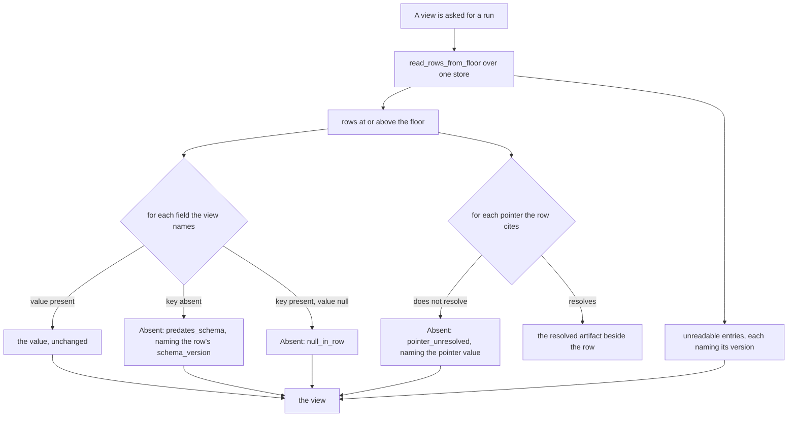
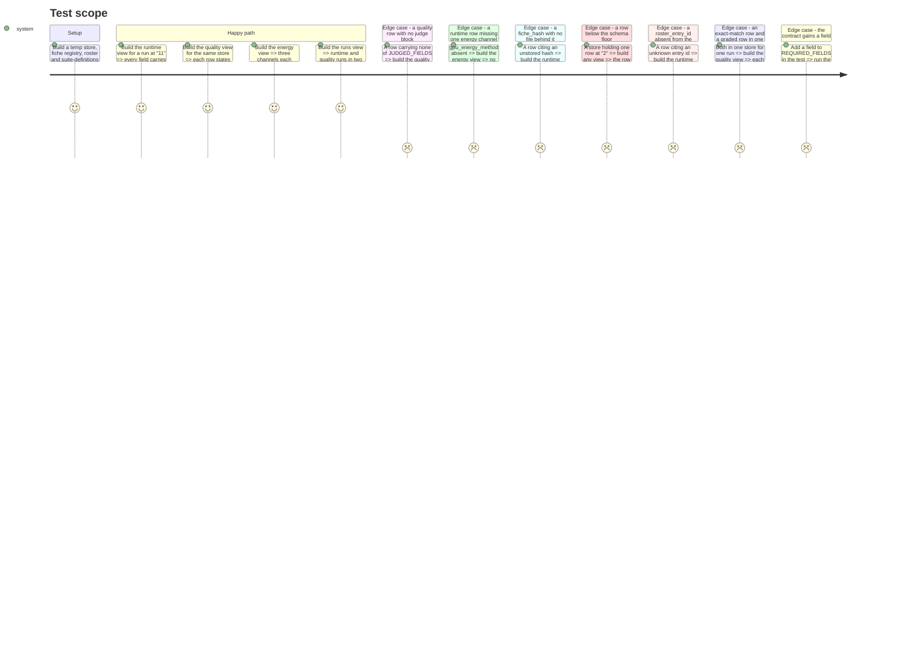

# Instruction: The read model — four views, three named absence reasons, derived from the contract

## Architecture projection

> Tree of the final files. ✅ create · ✏️ modify · ❌ delete

```txt
.
├── src/wave_local_ai_v2/
│   └── read_model.py         ✅ the typed layer over the stores: Absent, the floor selection, the four views, pointer resolution
└── tests/
    └── test_read_model.py    ✅ one case per absence reason, the two score shapes, the contract partition
```

## User Journey



## Test Scope



## Tasks to do

### `1)` The absence value

> Two states per field, and the reasons are finite.

1. Name the three reasons as module constants: `ABSENT_PREDATES_SCHEMA = "predates_schema"`, `ABSENT_NULL_IN_ROW = "null_in_row"`, `ABSENT_POINTER_UNRESOLVED = "pointer_unresolved"`. Collect them in `ABSENCE_REASONS: frozenset[str]` so the set is checkable rather than a convention.
2. Add a frozen `Absent` dataclass: `reason: str`, `detail: dict[str, Any]`. Serialise as `{"absent": true, "reason": ..., "detail": {...}}` — the `absent` marker makes an absence impossible to mistake for a value at the JSON boundary, which is the whole point of the contract.
3. Add `resolve_field(row, field) -> Any | Absent`: key not in `row` → `Absent(ABSENT_PREDATES_SCHEMA, {"row_schema_version": row.get("schema_version")})`; value is `None` → `Absent(ABSENT_NULL_IN_ROW, {})`; otherwise the value unchanged. Docstring why the first branch is sound rather than a guess: `append_row` gates every write on `validate_row`, so a row at the current schema always carries every required key — an absent key can only mean the row predates the field.
4. Nothing is defaulted, zero-filled, back-filled or inferred anywhere in this module. No `or 0`, no `.get(field, 0)`, no `dict.setdefault`. State it in the module docstring.

### `2)` The field partition against `row_contract`

> Derived from the contract, so a contract change fails the build rather than blanking a column.

1. Declare, per row kind, the fields each view renders — `RUNTIME_VIEW_FIELDS`, `ENERGY_VIEW_FIELDS`, `QUALITY_VIEW_FIELDS`, `QUALITY_JUDGE_FIELDS`, `QUALITY_GRADED_FIELDS`, `RUNS_VIEW_FIELDS` — as `frozenset[str]`.
2. Declare `RUNTIME_FIELDS_NOT_RENDERED` and `QUALITY_FIELDS_NOT_RENDERED` beside them, each entry justified in a comment (e.g. the raw `repetitions` array, `prompt`, `subject_output`).
3. The invariant the tests hold, stated as a comment on the declarations: for each kind, the union of every rendered set and the not-rendered set equals `row_contract.REQUIRED_FIELDS[kind]` exactly, and the quality judge/graded sets equal `row_contract.JUDGED_FIELDS` and `row_contract.GRADED_FIELDS` exactly. No field appears in two rendered sets of the same kind.
4. Never re-list a contract field's *presence* rule here. This module names which fields a view shows; `row_contract` stays the only place that says which fields a row owes.

### `3)` The four views

> One model per route, each over exactly one store.

1. `runs_view(runtime_path, quality_path, floor)` → two named collections. Each entry: `run_id`, `captured_at`, `row_count`, `schema_version`, and the `roster_entry_id` resolution — identity only, no measurement field of either kind. Each collection carries its own `unreadable` list and the `schema_floor` in force. Runs are grouped by `run_id` in first-seen file order.
2. `quality_view(quality_path, run_id, floor, roster, suite_definitions_dir)` → one entry per row. Each entry declares `score_shape`: `"graded"` when the row carries any of `GRADED_FIELDS`, else `"exact_match"` — the same declaration rule `row_contract._validate_graded_fields` uses, so the discriminator cannot drift from the writer's. Render the shape's own fields and **omit the other shape's entirely**; never null-fill the shape a row does not carry, and never place both under one key. A response holding both shapes states, at the response level, which shapes it carries.
3. Per-language cells (`language_breakdown` / `score_breakdown`) are passed through with their `n` and `indicative` marks intact, each cell resolved field-by-field so a missing cell key is an `Absent` rather than a hole.
4. The judge block: resolve every field of `row_contract.JUDGED_FIELDS`. Today no store holds a judged row, so every one resolves to `Absent(ABSENT_PREDATES_SCHEMA, ...)` — this is the live path, not a reserved one. `agreement` and `single_judge` are rendered as they stand and no agreement is computed.
5. `runtime_view(runtime_path, run_id, floor, fiche_registry_dir, roster)` → one entry per row: the runtime fields, the `verdict` block as it stands with its `reference_run_id` and `differing_fields`, the aggregation/spread fields, and the fiche resolved through `fiche_registry.read_fiche` and placed beside the row. `read_fiche` returning `None` → `Absent(ABSENT_POINTER_UNRESOLVED, {"pointer": "fiche_hash", "value": <hash>})`, never `{}`.
6. `energy_view(path, run_id, floor, ...)` → the three channels, each `*_energy_kwh` beside its own `*_energy_method`, plus `energy_kwh`, `emissions_kg`, `emission_factor_kg_per_kwh`, `emission_region`, `emissions_scope`, `emissions_scope_formula_id` and `scope_comparability`. The composite carries **no** single method label — the field it would have read was retired at schema `"4"`.
7. The composite rule: `energy_headline` is present only when all three `*_energy_method` fields resolve to values. Otherwise it is `{"withheld": true, "missing_labels": [{"field": ..., "absence": {...}}, ...]}` — each missing label carries its own three-reason absence, so no fourth reason is invented and the caller learns which label is missing and why.
8. Every view resolves pointers explicitly: `fiche_hash` against the registry, `roster_entry_id` against the loaded roster, `suite_id`/`suite_version` against `suite_snapshot.snapshot_filename` in the suite-definitions directory. Each unresolved pointer is an `Absent(ABSENT_POINTER_UNRESOLVED, ...)` naming the pointer and its value.
9. This module computes no verdict, no agreement, no score, no aggregate and no sum. A number absent from a row is absent from the view. State it in the module docstring, beside the no-defaulting rule.
10. Open every file for reading only. Import neither `results.append_row` nor anything that writes.

### `4)` Tests

> `tests/test_read_model.py`, over fixture stores in temp dirs.

1. One test per absence reason, exactly as the story's "Tests it needs" names them: a quality row with no judge block; a runtime row missing one of the three energy channel labels; a `fiche_hash` with no file behind it; a row below the schema floor; a `roster_entry_id` absent from the roster.
2. The two shapes: an exact-match row and a graded row in one response keep their two shapes and no field of one appears on the other.
3. The partition tests over `row_contract`, one per kind, asserting exact set equality and disjointness — the failure message names the unclassified field.
4. A test asserting no `Absent` in any view carries a reason outside `ABSENCE_REASONS`.
5. Build fixture rows from a helper that starts from the contract's own required set, so a fixture cannot silently drift from a real row's shape.

## Test acceptance criteria

| Task | Acceptance criteria                                                                                                                                                       |
| ---- | --------------------------------------------------------------------------------------------------------------------------------------------------------------------------- |
| 1    | Given a row with a key absent, a key set to `null`, and a key with a value, `resolve_field` returns the three distinct outcomes and the absent-key case names the row's own `schema_version`. |
| 2    | Adding a field to `row_contract.REQUIRED_FIELDS` fails the partition test naming that field; classifying it as rendered or not-rendered makes it pass.                        |
| 3    | A quality row carrying none of `JUDGED_FIELDS` yields a judge block of absences — no zero, no unlabelled number anywhere in the entry.                                        |
| 3    | A runtime row with `gpu_energy_method` removed yields no `energy_headline` value, and the withheld block names `gpu_energy_method` with its own absence reason.               |
| 3    | A row citing an unstored `fiche_hash` yields `pointer_unresolved` naming the hash; the entry contains no empty object in the fiche position.                                  |
| 3    | A store holding a row at `"2"` under floor `"7"` yields that row in `unreadable` naming `"2"`, and no partial entry for it appears in any view.                              |
| 3    | An exact-match row and a graded row in one response each declare their shape, and `correct`/`suite_accuracy`/`language_breakdown` appear on neither the graded entry nor `item_score`/`suite_score`/`score_breakdown` on the exact-match one. |
| 4    | `uv run pytest` passes; `uv run mypy src/ scripts/` is clean with `read_model` fully annotated.                                                                              |
