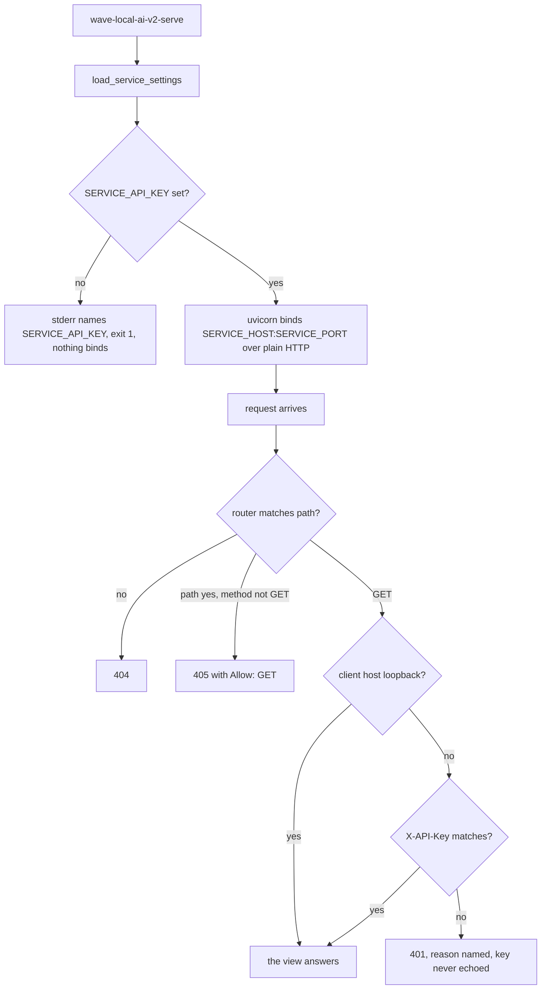
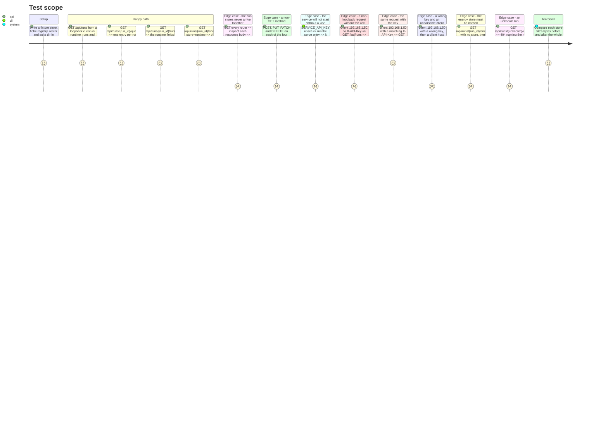

# Instruction: The service — four routes, the key gate, the serving entry

## Architecture projection

> Tree of the final files. ✅ create · ✏️ modify · ❌ delete

```txt
.
├── pyproject.toml            ✏️ fastapi + uvicorn pinned runtime deps, httpx in the dev group, the serve console script
├── uv.lock                   ✏️ resolved by `uv add` — the pin, never hand-edited
├── src/wave_local_ai_v2/
│   └── service.py            ✅ the FastAPI app, four GET routes, the startup key check, the non-loopback gate, main()
└── tests/
    └── test_service.py       ✅ the four routes, 405 on every other method, the startup refusal, the key gate
```

## User Journey



## Test Scope



## Tasks to do

### `1)` Dependencies

> Pinned by the lockfile, and the audit gate checked rather than assumed.

1. `uv add fastapi uvicorn` — plain `uvicorn`, not `uvicorn[standard]`: base deps are `click` and `h11`, which is all HTTP/1.1 loopback serving needs, and `[standard]` pulls `watchfiles`/`uvloop`/`httptools` that this service never uses.
2. `uv add --dev httpx` — what `starlette.testclient.TestClient` requires. Test-only, so it stays out of the runtime dependency set.
3. Run `uv run python scripts/audit_dependencies.py` after the add. If it reports no blocking finding, `docs/dependency-waivers.yml` needs **nothing** — do not add an empty or speculative entry. If it does block, stop and report the advisory rather than waiving it silently: a waiver is a decision with an owner and an expiry.
4. Add `wave-local-ai-v2-serve = "wave_local_ai_v2.service:main"` under `[project.scripts]`, beside the four existing entries.

### `2)` The key gate in `service.py`

> Required at startup, enforced off loopback, never echoed.

1. `is_loopback_client(host: str | None) -> bool`: `None` → `False`; a host that `ipaddress.ip_address` cannot parse → `False`; otherwise `addr.is_loopback` (covers `127.0.0.0/8` and `::1`). Fail closed, and comment why: `TestClient`'s default client host is the literal string `"testclient"`, and a real deployment behind anything unexpected must not be handed the keyless path by accident.
2. Read no proxy header. `X-Forwarded-For` and friends are attacker-controlled and the epic excludes any reverse-proxy posture; the peer address is the only input. State it in the function's docstring.
3. Compare the key with `hmac.compare_digest`, never `==`.
4. Wire the gate as a dependency on the `/api` `APIRouter`, not as HTTP middleware — see plan.md's Decision. Middleware would answer 401 before the router could answer 405 for a non-loopback non-`GET`, and the story requires both.
5. The 401 body names the reason ("missing X-API-Key" / "invalid X-API-Key") and carries no key material, no store path and no traceback. Nothing in this module logs the key, the header, or the settings object.
6. `create_app(settings: ServiceSettings) -> FastAPI` raises before returning if `settings.api_key` is empty — a second, in-process assertion of the startup rule, so an app built in a test or embedded elsewhere cannot skip it.

### `3)` The four routes

> One route per view, one store per route, `GET` only.

1. `GET /api/runs` → `read_model.runs_view` over both store paths, answering two named collections. This is the one route that reads both files, and it composes nothing: no entry of one collection is joined to, ordered against or summed with the other.
2. `GET /api/runs/{run_id}/quality` → `read_model.quality_view` over the quality store only.
3. `GET /api/runs/{run_id}/runtime` → `read_model.runtime_view` over the runtime store only.
4. `GET /api/runs/{run_id}/energy` → `read_model.energy_view`, with a **required** `store` query parameter constrained to `runtime|quality` (a `Literal` annotation, so FastAPI answers 422 naming the parameter and its accepted values). See plan.md's Decision.
5. A `run_id` no row of the named store carries → 404 with a body naming the `run_id` and the store searched. Not an empty list: an empty list of rows and a run that does not exist are different facts.
6. Declare every route with `methods=["GET"]` only and register no `POST`/`PUT`/`PATCH`/`DELETE` anywhere. 405 then comes from Starlette's own router (`Route.handle` raises `HTTPException(405)` with an `Allow` header) rather than from a handler of ours.
7. Import nothing that writes. `service.py` must not import `results.append_row`, `fiche_registry.write_fiche` or `suite_snapshot`'s writer; every store file is opened for reading through `read_model`.
8. Do not configure CORS here. The epic's single-origin topology and CORS-as-defence-in-depth belong to the story that serves the bundle; adding a permissive default now is the kind of thing that survives to production unreviewed.

### `4)` The serving entry

> `main()`, plain HTTP, loopback default.

1. `main() -> int`: `load_service_settings()`, catching `SettingsError` to print the message to stderr and return `1` — the message names the variable and carries no value, and no socket is bound on that path.
2. Build the app and hand it to `uvicorn.run(app, host=settings.host, port=settings.port)`. Plain HTTP: TLS is order 5, and no certificate setting is read here (see phase 1, task 2.6).
3. Print the bound address and the schema floor in force on startup, and nothing else. Never the key, never its length.

### `5)` Tests

> `tests/test_service.py`, over temp stores.

1. Drive the app with `TestClient(app, client=("127.0.0.1", 12345))` for the loopback path and `client=("192.168.1.50", 12345)` for the gated one — confirmed against starlette's `testclient.py`, which assigns the parameter straight to `scope["client"]`.
2. The four routes over a temporary store; every non-`GET` method on every route answering 405 from both client kinds; the startup refusal when the key is absent; a non-loopback request refused without the key and answered with it; a wrong key refused; an unparsable client host refused.
3. The no-composition assertion, made structurally rather than by eye: collect a quality-only field name and a runtime-only field name from `row_contract.REQUIRED_FIELDS` differences, and assert no response body carries one of each.
4. A read-only assertion: hash every store file before the suite's requests and after, and assert the bytes and the directory listing are unchanged. Additionally monkeypatch `results.append_row` to raise and assert every route still answers.
5. Assert the key's value appears in no response body and in nothing the entry point prints.

## Test acceptance criteria

| Task | Acceptance criteria                                                                                                                                                    |
| ---- | ------------------------------------------------------------------------------------------------------------------------------------------------------------------------ |
| 1    | `uv run python scripts/audit_dependencies.py` prints `no blocking findings` with `docs/dependency-waivers.yml` still `waivers: []`; `uv.lock` carries pinned `fastapi`, `uvicorn` and `httpx`. |
| 2    | A non-loopback `GET /api/runs` without `X-API-Key` answers 401 naming the reason; the same request with the matching key answers 200 with the identical body a loopback client receives. |
| 2    | A client host of `"testclient"` (unparsable as an IP) is treated as non-loopback and refused without a key.                                                              |
| 2    | No response body, log line or printed startup line contains the key's value.                                                                                            |
| 3    | Each of the four routes answers its view; no response body carries both a quality-only and a runtime-only field.                                                         |
| 3    | `POST`, `PUT`, `PATCH` and `DELETE` answer 405 with an `Allow: GET` header on all four routes, from a loopback and a non-loopback client alike.                          |
| 3    | `GET /api/runs/{run_id}/energy` with no `store`, or `store=both`, answers 422 naming the parameter; with `store=runtime` it answers the energy view.                     |
| 3    | A `run_id` absent from the named store answers 404 naming the run and the store, not an empty list.                                                                     |
| 4    | With `SERVICE_API_KEY` unset, the serve entry returns non-zero, names the variable on stderr, and binds no socket.                                                       |
| 5    | Every store file's bytes are unchanged after the whole suite, no file was created, and every route still answers with `results.append_row` monkeypatched to raise.       |
| 5    | `uv run pytest` passes at or above the 80% coverage gate; the four before-commit hooks are clean.                                                                        |
