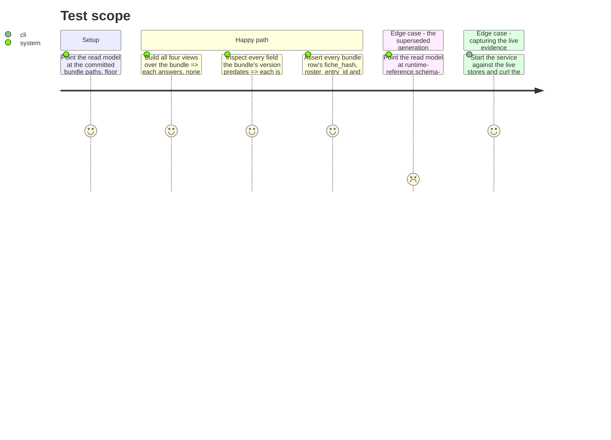

# Instruction: The bundle proof, the published evidence and the docs

## Architecture projection

> Tree of the final files. ✅ create · ✏️ modify · ❌ delete

```txt
.
├── tests/
│   └── test_reference_bundle.py     ✏️ the four views over the committed bundle at "7", absences named not failures
├── aidd_docs/
│   ├── memory/
│   │   ├── cli.md                   ✏️ wave-local-ai-v2-serve, its settings, the key rule
│   │   ├── codebase-map.md          ✏️ read_model.py + service.py in the package description, the fourth entry point
│   │   ├── ecosystem.md             ✏️ the browser-to-service edge, the first process of ours a second machine reaches
│   │   └── architecture.md          ✏️ FastAPI/uvicorn in the Stack, the declared-absent contract as a Gotcha
│   └── tasks/2026_09/2026_09_06_four-views-over-http/evidence/
│       ├── bundle-runs.json         ✅ the four views over the committed bundle (schema "7")
│       ├── bundle-quality.json      ✅
│       ├── bundle-runtime.json      ✅
│       ├── bundle-energy.json       ✅
│       ├── live-runs.json           ✅ the same four views over the live stores (schema "11")
│       ├── live-quality.json        ✅
│       ├── live-runtime.json        ✅
│       ├── live-energy.json         ✅
│       └── README.md                ✅ how each was captured, and what the two shapes prove
└── CHANGELOG.md                     ✏️ the Unreleased Added entry
```

## User Journey

```mermaid
flowchart TD
  A[One unchanged service] --> B[SERVICE_* pointed at the committed bundle]
  A --> C[SERVICE_* pointed at the live stores]
  B --> D[Four responses, mostly-absent, rows at "7"]
  C --> E[Four responses, mostly-populated, rows at "11"]
  D --> F[Filed under evidence/ with the capture commands]
  E --> F
  F --> G[The absence contract is shown to hold in both directions]
```

## Test Scope



## Tasks to do

### `1)` The bundle proof in `tests/test_reference_bundle.py`

> The same service over the published evidence, one schema behind.

1. Add tests building all four views over `RUNTIME_REFERENCE_PATH`, `QUALITY_REFERENCE_PATH`, `DEFAULT_FICHE_REGISTRY_DIR`, `DEFAULT_ROSTER_PATH` and `SUITE_DEFINITIONS_DIR`, at floor `PUBLISHED_BUNDLE_SCHEMA_VERSION`.
2. Assert every field the bundle's `"7"` predates resolves to `Absent(ABSENT_PREDATES_SCHEMA, ...)` naming `"7"` — not a failure, not a zero, not a dropped column. Name at least `thinking_policy` (introduced at `"11"`) and the whole judge block explicitly, so the assertion is about known fields rather than whatever happens to be absent.
3. Assert no bundle row produces a `pointer_unresolved` in any view — the bundle's own five-part completeness, already asserted field-by-field in this file, now asserted through the read path a reader will actually use.
4. Add a test over a superseded `*.schema-1.jsonl` file: at floor `"7"` every row lands in `unreadable` (below floor, or no `schema_version` at all) and none is rendered. Keep it in the existing "superseded set is named explicitly, never globbed" discipline this file already states.
5. Do not move `PUBLISHED_BUNDLE_SCHEMA_VERSION` and do not touch a published byte.

### `2)` The published evidence

> The story's own output, captured from one unchanged service.

1. Capture the four responses over the committed bundle: `RUNTIME_RESULTS_PATH=aidd_docs/results/runtime-reference.jsonl QUALITY_RESULTS_PATH=aidd_docs/results/quality-reference.jsonl SERVICE_SCHEMA_FLOOR=7`, service started on loopback, four `GET`s. File as `evidence/bundle-*.json`.
2. Capture the same four over the live stores at their defaults. File as `evidence/live-*.json`.
3. Write `evidence/README.md`: the exact commands, the `run_id`s chosen, and the one sentence that is the point — the first set is mostly-absent at `"7"` and the second mostly-populated at `"11"`, from one service with no code difference between the two runs.
4. Record explicitly that this story writes **no** results row: these responses are its own output, not a benchmark artifact, and neither store gained a line.
5. Redact nothing and default nothing in the captured bodies — a mostly-absent response is the evidence.

### `3)` The docs

> Four files, each the smallest true change.

1. `aidd_docs/memory/cli.md`: add `wave-local-ai-v2-serve` to Commands — the four routes, `SERVICE_HOST`/`SERVICE_PORT`/`SERVICE_SCHEMA_FLOOR`/`SERVICE_API_KEY`, the unconditional startup key requirement, the loopback-keyless / non-loopback-keyed rule, the required `store` parameter on the energy route, and that pointing the two store paths at the `*-reference.jsonl` files serves the committed bundle. State that TLS and the browser's side of the key are a later story, so a reader does not take plain HTTP for the finished posture.
2. `aidd_docs/memory/codebase-map.md`: add `read_model.py` and `service.py` to the package description and `wave-local-ai-v2-serve` to Entry points (the list currently names three commands; it becomes four, and the existing omission of `wave-local-ai-v2-judge-probe` is a separate gap — note it in one line, do not fix it here).
3. `aidd_docs/memory/ecosystem.md`: add the browser-to-service edge. This is the first process of the project's own that a second machine can reach; the diagram should show it as such rather than as another outbound client.
4. `aidd_docs/memory/architecture.md`: add FastAPI + uvicorn to Stack, and one Gotcha for the declared-absent contract — the three finite reasons, the `unreadable` count, and the fact that the "two stores are never merged" rule is now enforced by there being no endpoint that could, not by a convention about tables.
5. `CHANGELOG.md`: one `### Added` entry under `[Unreleased]`, in the existing voice — what the service does, the four routes, the three absence reasons, the key rule, and the two new pinned runtime dependencies.

## Test acceptance criteria

| Task | Acceptance criteria                                                                                                                                                     |
| ---- | ------------------------------------------------------------------------------------------------------------------------------------------------------------------------- |
| 1    | All four views answer over the committed bundle at floor `"7"` without raising, and every field `"7"` predates is reported as `predates_schema` naming `"7"`.               |
| 1    | No bundle row yields a `pointer_unresolved` in any view.                                                                                                                  |
| 1    | Every row of a `*.schema-1.jsonl` file lands in `unreadable` at floor `"7"` and none is rendered.                                                                          |
| 1    | `PUBLISHED_BUNDLE_SCHEMA_VERSION` is unchanged and `git diff` touches no `*-reference*.jsonl` byte.                                                                        |
| 2    | Eight response bodies are filed under `evidence/`, the bundle four mostly-absent at `"7"` and the live four mostly-populated at `"11"`, with the capture commands recorded beside them. |
| 2    | `git status` shows no change to `aidd_docs/results/runtime.jsonl` or `quality.jsonl`, and neither file grew a line during capture.                                          |
| 3    | The four memory files and `CHANGELOG.md` describe the service as shipped — a reader who has not seen the code can start it, reach the four routes and predict the key refusal. |
| 3    | `uv run pre-commit run --all-files` and `uv run pytest` are clean, and `uv run python scripts/audit_dependencies.py` reports no blocking finding.                            |
