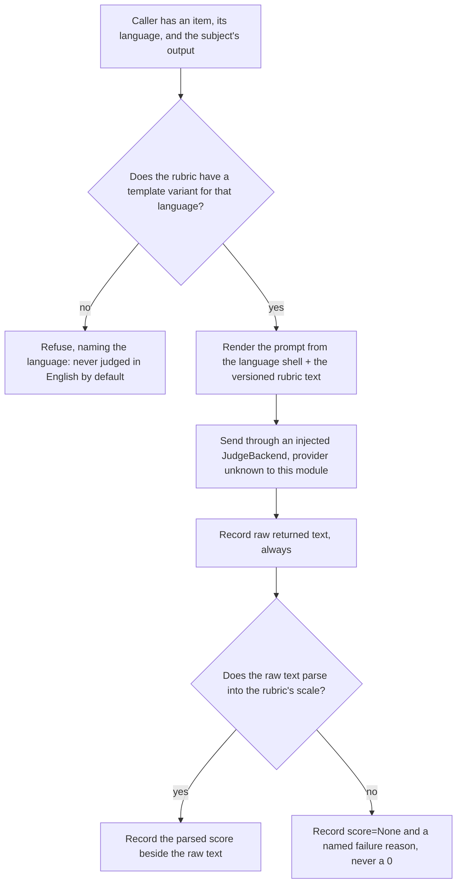
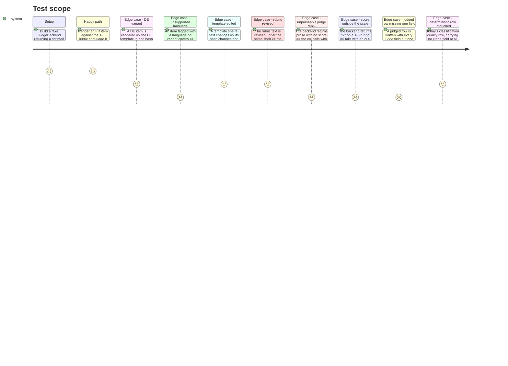

<!-- Fill or omit these sections; never add, rename, or reorder one. -->

# Instruction: Versioned judge prompts and rubrics, the judge call, the contract bump

## Architecture projection

> Tree of the final files. ✅ create · ✏️ modify · ❌ delete

```txt
.
├── src/wave_local_ai_v2/
│   ├── judge_protocol.py        ✅ EN/FR/DE prompt shells + their ids/hashes, versioned rubrics, render, missing-variant refusal
│   ├── judge.py                 ✅ provider-agnostic JudgeBackend protocol, response parse into the rubric's scale, per-call record
│   ├── prompt_provenance.py     ✏️ unchanged rule, new call site only — judge template hashes go through `template_hash`
│   └── row_contract.py          ✏️ SCHEMA_VERSION "8" → "9"; JUDGED_FIELDS declared, required conditionally, structurally validated
└── tests/
    ├── test_judge_protocol.py   ✅ per-language variant selection, missing-variant refusal, template-hash and rubric-version independence
    ├── test_judge.py            ✅ (stubbed) parse to scale, out-of-scale and unparseable fail with a named reason, never 0
    └── test_row_contract.py     ✏️ a judged row missing one judge field is refused naming it; a deterministic row validates unchanged
```

## User Journey



## Test Scope

<!-- Required for every phase. Keep Setup, Happy path, any qualifying Edge cases, and any required Teardown in this one journey. -->



## Tasks to do

### `1)` `judge_protocol.py`: language-variant prompt shells, versioned rubrics, rendering

> Templates in code beside `classification_suite.py`'s items, so a template edit is a reviewable diff. The shell is hashed; the rubric is substituted into it and versioned on its own.

1. Declare the language type and the three prompt shells. `JudgeLanguage = Literal["en", "fr", "de"]`. `JUDGE_PROMPT_TEMPLATES: dict[JudgeLanguage, str]` holds one shell per language, each written in that language, each carrying exactly three substitution slots: the rubric text, the item's own prompt, and the subject output being judged. The shell instructs the judge to answer in the form the rubric's own answer instruction states, and nothing else.
2. Declare their ids and hashes. `JUDGE_TEMPLATE_IDS: dict[JudgeLanguage, str]` → `"judge-prompt-en" | "judge-prompt-fr" | "judge-prompt-de"`. `JUDGE_TEMPLATE_HASHES: dict[JudgeLanguage, str]` computed at import from `prompt_provenance.template_hash` over the **shell**, never over the filled prompt — a per-item substitution must not move the hash. Do not introduce a second hashing helper.
3. Declare the rubric kinds: `RUBRIC_KIND_ORDINAL_1_5 = "ordinal_1_5"` and `RUBRIC_KIND_CATEGORICAL = "categorical"`, plus `RUBRIC_KINDS` holding both.
4. Add `@dataclass(frozen=True) class Rubric` with `rubric_id: str`, `version: str`, `kind: str`, `scale: tuple[int, ...] | None` (the ordinal points, `(1, 2, 3, 4, 5)`), `categories: frozenset[str] | None`, and `text: dict[JudgeLanguage, str]` — the criteria plus the answer instruction, written per language. `__post_init__` refuses a rubric whose kind does not match which of `scale`/`categories` is populated, naming the mismatch.
5. Ship exactly one rubric instance: `OPEN_ENDED_QUALITY_1_TO_5`, `rubric_id="open-ended-quality-1to5"`, `version="1"`, `kind=RUBRIC_KIND_ORDINAL_1_5`, `scale=(1,2,3,4,5)`, with EN/FR/DE criteria text. Keep its criteria generic (does the output do what the item asked, is it correct, is it in the right language) — the rewriting suite's own rubric text belongs to another epic and must not be pre-empted here. Ship **no** categorical rubric instance; the categorical machinery is exercised by test fixtures until a suite declares one.
6. Add `class UnsupportedJudgeLanguageError(ValueError)`. Add `template_for(language) -> str` and `rubric_text_for(rubric, language) -> str`, each raising it and naming the language and what was available. An item whose language has no shell **or** no rubric text is refused; it is never silently judged in English.
7. Add `RenderedJudgePrompt` (TypedDict): `prompt`, `template_id`, `template_hash`, `language`, `rubric_id`, `rubric_version`, `rubric_kind`. Add `render_judge_prompt(*, rubric, language, item_prompt, subject_output) -> RenderedJudgePrompt` filling the shell and returning the shell's hash, not the filled prompt's.
8. Module docstring states the two independence rules in one line each: the shell is hashed and the rubric is not, so a rubric revision moves `rubric_version` and leaves `template_hash` alone; and rows written before a shell edit stay attributable to the text they actually used because the hash is content-derived.

### `2)` `judge.py`: the provider-agnostic call interface and the response parse

> One judge call, through either provider, with no provider type named in this module. A response that cannot be parsed is a missing judgement, never a zero.

1. Add `JudgeResponse` (TypedDict): `content: str`, `model_id: str`, `provider: str`, `family: str`, `tokens_in: int | None`, `tokens_out: int | None`, `retries: int`. This is what a backend returns; it names no provider-specific type.
2. Add `class JudgeBackend(Protocol)` with a single `__call__(self, prompt: str) -> JudgeResponse`. Document that the backend owns the pacing/retry layer and the provider error types, and that a transport failure propagates out of `judge.py` untouched — this module never catches a provider error, it only handles parse failures.
3. Declare the failure reasons as named constants, matching `scoring.py`'s existing style: `FAILURE_REASON_JUDGE_EMPTY = "judge_response_empty"`, `FAILURE_REASON_JUDGE_UNPARSEABLE = "judge_response_unparseable"`, `FAILURE_REASON_JUDGE_OUT_OF_SCALE = "judge_score_out_of_scale"`, and a tuple holding all three.
4. Add `parse_judge_score(raw: str, rubric) -> tuple[int | str | None, str | None]` returning `(score, failure_reason)` with exactly one of them non-null. Ordinal: extract the single integer the answer instruction asks for; an integer outside `rubric.scale` is out-of-scale, prose with no integer or more than one candidate integer is unparseable, an empty/whitespace answer is empty. Categorical: reuse `scoring.normalize_label` against `rubric.categories` rather than writing a second normalizer; `None` back from it is unparseable.
5. Add `JudgeCallRecord` (TypedDict): `model_id`, `provider`, `family`, `score`, `raw_text`, `failure_reason`, `tokens_in`, `tokens_out`, `retries`.
6. Add `run_judge_call(backend, rendered, rubric) -> JudgeCallRecord`. It calls the backend with `rendered["prompt"]`, records `content` as `raw_text` **whatever happens to the parse**, and fills `score`/`failure_reason` from `parse_judge_score`. On failure `score` is `None`: assert in the docstring, and in the code path, that a failed parse never yields `0` — `aidd_docs/results/README.md` records that Mistral at `temperature=0` with a pinned `random_seed` did not reproduce one item across two runs, so a judge reply is never assumed reproducible and the raw text is the row's evidence.
7. Do not add judge selection, family logic, or agreement here; phases 2 and 3 own those.

### `3)` `row_contract.py`: the judged block, required conditionally, under one bump

> The whole judged-field set is declared here once, for both stories. Phase 3 adds rules over these fields without touching the version again.

1. Bump `SCHEMA_VERSION` from `"8"` to `"9"` and add the version comment in the existing block's voice: judged quality rows carry a judge block (per-judge records, prompt/rubric provenance, agreement or single-judge flag, contested state, judge egress and judge cost); the block is required only on a row that carries any of it, so a deterministic quality row is unchanged.
2. Declare `JUDGED_FIELDS: frozenset[str]` holding the complete set, grouped by comment: prompt/rubric provenance (`judge_prompt_id`, `judge_prompt_template_hash`, `judge_prompt_language`, `rubric_id`, `rubric_version`, `rubric_kind`); the calls (`judges`); independence and agreement (`single_judge`, `single_judge_reason`, `agreement`, `agreement_statistic`); contested state (`contested`, `contested_reason`, `contested_threshold`, `judged_headline_score`, `judged_headline_excluded_n`); egress (`judge_egress`); cost (`judge_cost`).
3. In `validate_row`, after the existing required-field check and only for `kind == "quality"`: compute `present = JUDGED_FIELDS & row.keys()`. When `present` is empty, return as today. When it is non-empty, raise `RowContractError` naming every member of `JUDGED_FIELDS - row.keys()`, with a message that says the row declares itself judged by carrying `sorted(present)`.
4. Add `_validate_judged_structure(row)`, called only when the row is judged, mirroring `_validate_runtime_repetition_structure`'s shape and voice. It checks: `judges` is a non-empty list; every entry carries the `JudgeCallRecord` keys; `judge_prompt_language` is one of the three; `rubric_kind` is one of `judge_protocol.RUBRIC_KINDS`; `judge_egress` carries its keys (`item_left_machine`, `subject_output_left_machine`, `providers`, `generation_count`, `judge_call_count`); `judge_cost` carries its keys (`tokens_in_total`, `tokens_out_total`, `cost_total`, `cost_currency`, `per_provider`). Every failure names the field. The family-collision and neither-statistic-nor-flag rules are **not** added here — phase 3 owns them.
5. Import `judge_protocol` for the rubric-kind and language constants rather than re-declaring literals; keep the import direction one-way (`judge_protocol` must not import `row_contract`).

## Test acceptance criteria

<!-- Each criterion is an observable behavior, not a command. -->

| Task | Acceptance criteria              |
| ---- | -------------------------------- |
| 1 | Rendering an item tagged `fr` returns `template_id == "judge-prompt-fr"` and a prompt whose instruction text is the French shell, not the English one. |
| 1 | Rendering the same item tagged `de` returns the DE id and a different hash from the FR one. |
| 1 | Editing a shell's text in the test (a modified copy through `template_hash`) yields a different hash, while the rubric version is unchanged. |
| 1 | A rubric revised to `version="2"` with the same shells reports the new version and byte-identical template hashes. |
| 1 | `template_hash` of the filled prompt differs from the recorded `template_hash`, proving the hash is over the shell and not over the substitution. |
| 1 | An item whose language has no shell, and one whose rubric has no text for its language, each raise `UnsupportedJudgeLanguageError` naming that language. |
| 1 | A `Rubric` declared `ordinal_1_5` with `categories` set, or `categorical` with `scale` set, is refused at construction naming the mismatch. |
| 2 | A stubbed backend returning the rubric's expected answer form yields a `JudgeCallRecord` with a score inside `rubric.scale`, `failure_reason is None`, and `raw_text` equal to what the backend returned. |
| 2 | A stubbed backend returning `"7"` on the 1-5 rubric yields `score is None` and `failure_reason == "judge_score_out_of_scale"`; the assertion tests `score is None`, not `score == 0`. |
| 2 | A stubbed backend returning prose with no score yields `failure_reason == "judge_response_unparseable"` and still records the prose as `raw_text`. |
| 2 | A stubbed backend returning `""` yields `failure_reason == "judge_response_empty"`. |
| 2 | A backend that raises an arbitrary exception propagates it out of `run_judge_call` unchanged — `judge.py` catches no transport error. |
| 2 | `grep` over `judge.py` finds no import of `mistral_client` or `google_client`. |
| 3 | A quality row carrying today's deterministic fields and no judge field validates under `SCHEMA_VERSION == "9"`. |
| 3 | A judged row built from the complete set, then stripped of exactly one judge field, is refused with that field named — asserted once per field in `JUDGED_FIELDS`. |
| 3 | A judged row whose `judges` list is empty, or whose first entry lacks `raw_text`, is refused naming the structural failure. |
| 3 | A judged row whose `judge_prompt_language` is `"es"`, or whose `rubric_kind` is unknown, is refused naming the value. |
