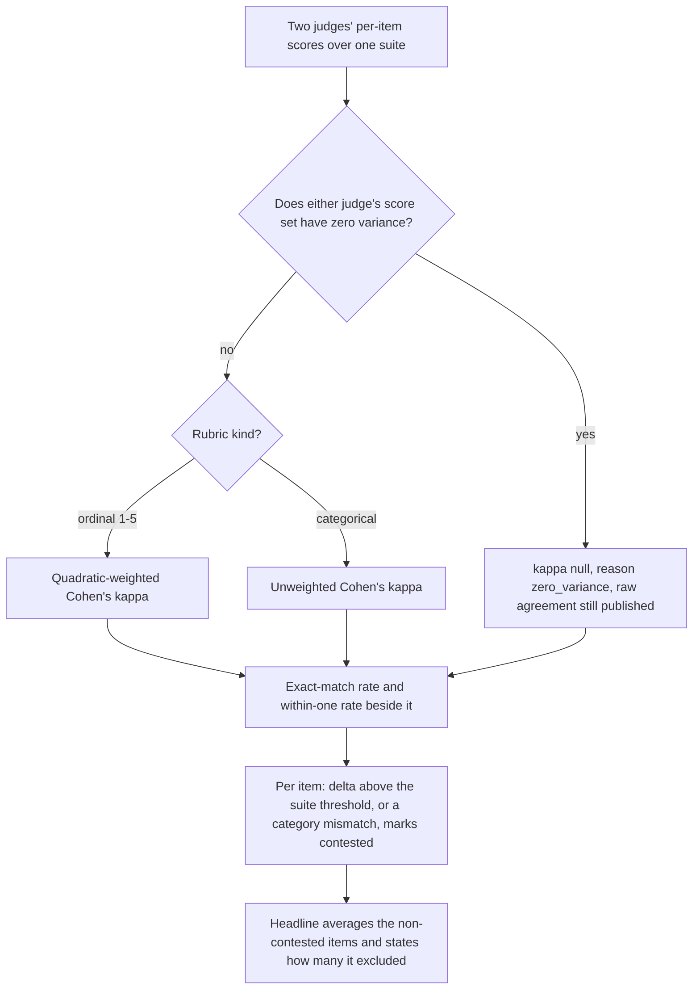
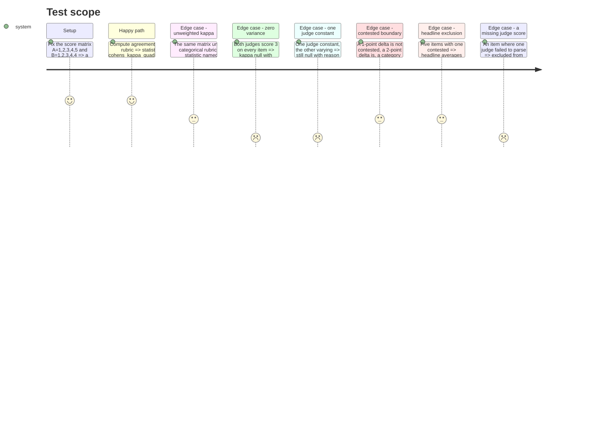

<!-- Fill or omit these sections; never add, rename, or reorder one. -->

# Instruction: Agreement statistics and the contested rule

## Architecture projection

> Tree of the final files. ✅ create · ✏️ modify · ❌ delete

```txt
.
├── src/wave_local_ai_v2/
│   ├── agreement.py             ✅ quadratic-weighted + unweighted kappa, exact-match and within-one rates, null-with-reason, contested rule, headline
│   └── settings.py              ✏️ CONTESTED_ORDINAL_MAX_DELTA default 1, exposed as a per-suite override seam
├── .env.example                 ✏️ the new variable, with its default and one line of why
└── tests/
    └── test_agreement.py        ✅ hand-computed kappa values, both null cases, the contested boundary, the headline exclusion count
```

## User Journey



## Test Scope

<!-- Required for every phase. Keep Setup, Happy path, any qualifying Edge cases, and any required Teardown in this one journey. -->



## Tasks to do

### `1)` `agreement.py`: the two kappas and the raw agreement figures

> `κ = 1 − ΣΣ W(i,j)·Õ(i,j) / ΣΣ W(i,j)·Ẽ(i,j)`, with `Õ` the normalized confusion matrix and `Ẽ` the outer product of the two raters' marginals. Quadratic `W(i,j) = (i−j)²`, unweighted `W(i,j) = 0 if i == j else 1`.

1. Declare the statistic names as constants: `AGREEMENT_STATISTIC_KAPPA_QUADRATIC = "cohens_kappa_quadratic_weighted"`, `AGREEMENT_STATISTIC_KAPPA_UNWEIGHTED = "cohens_kappa_unweighted"`. Declare the two null reasons: `KAPPA_NULL_ZERO_VARIANCE = "zero_variance"`, `KAPPA_NULL_ZERO_EXPECTED_DISAGREEMENT = "zero_expected_disagreement"`.
2. Add `cohens_kappa(scores_a, scores_b, *, categories, weighted: bool) -> tuple[float | None, str | None]` returning `(value, null_reason)` with exactly one non-null. Build the confusion counts over `categories` (the rubric's ordinal points or its category set, so an unobserved category still occupies a row and a column), normalize by `N`, take the marginals' outer product as expected, and apply the weight function. Do **not** divide the quadratic weights by `(k−1)²`: the factor scales numerator and denominator alike and cancels (see plan Resources), so omitting it keeps the arithmetic readable and the result identical.
3. Return the null cases before dividing, in this order: `KAPPA_NULL_ZERO_VARIANCE` when either input has a single distinct value across the items; then `KAPPA_NULL_ZERO_EXPECTED_DISAGREEMENT` when the denominator is `0`. Docstring states plainly why the first is stricter than the mathematics requires: a constant judge against a varying one yields a defined `0`, which would read as chance-level disagreement when the judges may in fact have agreed on every item — the same honesty rule `cost.total_or_none` and `aggregation.spread` already apply to a fabricated figure.
4. Add `exact_match_rate(scores_a, scores_b) -> float` and `within_one_rate(scores_a, scores_b) -> float | None`; the latter returns `None` for a categorical rubric, where "within one" has no meaning, rather than a number that invites a false ordering.
5. Add `Agreement` (TypedDict): `statistic`, `value`, `value_null_reason`, `exact_match_rate`, `within_one_rate`, `n_items`, `n_items_excluded`. Add `agreement_for_rubric(rubric, pairs) -> Agreement`, where `pairs` is the per-item `(score_a, score_b)` sequence. A pair with a `None` on either side (a judge whose call failed to parse, phase 1) is dropped from the statistic and counted in `n_items_excluded` — never coerced to a score. `n_items` is what the statistic was actually computed over.
6. Guard the degenerate input: zero usable pairs returns the `Agreement` with `value=None` and a null reason rather than raising or returning `0.0`.

### `2)` `agreement.py`: the contested rule and the headline

> Contested items stay visible; only the headline excludes them, and it says how many.

1. Add `@dataclass(frozen=True) class ContestedThreshold` with `max_ordinal_delta: int` (contested strictly above it) and a `for_rubric_kind` note in the docstring: a categorical rubric ignores the delta and treats any mismatch as contested. Add `DEFAULT_CONTESTED_THRESHOLD` built from `settings.DEFAULT_CONTESTED_ORDINAL_MAX_DELTA`.
2. Declare the contested reasons: `CONTESTED_REASON_ORDINAL_DELTA = "ordinal_delta_above_threshold"`, `CONTESTED_REASON_CATEGORY_MISMATCH = "category_mismatch"`.
3. Add `is_contested(rubric_kind, score_a, score_b, threshold) -> tuple[bool, str | None]`. Ordinal: `abs(a - b) > threshold.max_ordinal_delta`. Categorical: `a != b`. A pair with a `None` on either side is **not** contested — it is a missing judgement, which phase 3's single-judge/failure handling reports; conflating the two would publish an unjudged item as a disagreement.
4. Add `Headline` (TypedDict): `score`, `n_included`, `n_excluded`. Add `headline_score(item_scores, contested_flags) -> Headline` averaging the mean of each non-contested item's two judge scores, reporting how many items it excluded. `score` is `None` when nothing survives inclusion — never `0.0`.

### `3)` `settings.py` and `.env.example`: the per-suite threshold and its default

> Configured per suite, defaulted here. No judged suite exists yet, so the default is the whole of today's behavior and the per-suite override is a named seam.

1. Add `DEFAULT_CONTESTED_ORDINAL_MAX_DELTA = 1` beside the other `DEFAULT_*` constants, with the comment recording it as this increment's decision (more than 1 point apart on a 1-5 rubric, or any category mismatch) and naming the seam: a suite that declares its own threshold overrides this; until one does, this is the only value in play.
2. Add `contested_ordinal_max_delta: int` to `Settings`, read in `load_settings` through the existing `_require_numeric` with `minimum=0` and `minimum_reason="a contested threshold cannot be negative"`, env var `CONTESTED_ORDINAL_MAX_DELTA`.
3. Add the variable to `.env.example` with its default and one line of why, matching the file's existing comment density.
4. Do not touch `classification_suite.py`: it is deterministic and declares no rubric. The per-suite override lands when the first judged suite is defined.

## Test acceptance criteria

<!-- Each criterion is an observable behavior, not a command. -->

| Task | Acceptance criteria              |
| ---- | -------------------------------- |
| 1 | `A=[1,2,3,4,5]`, `B=[1,2,3,4,4]`, ordinal points `(1,2,3,4,5)`, quadratic: the value equals `16/17` (`0.9411764705882353`) to floating tolerance, with the arithmetic written out in the test's comment. |
| 1 | The same pair, unweighted over the same five categories: the value equals `0.75` exactly (`po=0.8`, `pe=0.2`). |
| 1 | Both judges constant at `3`: value is `None`, reason is `"zero_variance"`, and the test asserts `value is None` rather than a numeric comparison. |
| 1 | One judge constant at `3`, the other `[1,2,3]`: value is `None` with reason `"zero_variance"` — the test states in a comment that the unweighted mathematics would have returned `0` here. |
| 1 | An ordinal `Agreement` names `statistic == "cohens_kappa_quadratic_weighted"`; a categorical one names `"cohens_kappa_unweighted"`. |
| 1 | A categorical `Agreement` carries `within_one_rate is None`; the ordinal one carries `1.0` for the fixed matrix. |
| 1 | A pair list containing one `(4, None)` reports `n_items` one lower and `n_items_excluded == 1`, and the kappa value is unchanged from the same list without that pair. |
| 1 | An empty pair list returns `value is None` with a null reason, and raises nothing. |
| 2 | Scores `(3, 4)` are not contested; `(2, 4)` is, with reason `"ordinal_delta_above_threshold"`; categorical `("adequate", "partial")` is, with reason `"category_mismatch"`. |
| 2 | With `max_ordinal_delta=2`, `(2, 4)` stops being contested — the threshold is read, not hardcoded at the call site. |
| 2 | A pair with a `None` score is not contested. |
| 2 | Five items with one contested: the headline averages exactly the four included, `n_excluded == 1`, and the headline changes when the contested item is un-flagged. |
| 2 | All five contested: `score is None`, `n_included == 0`, `n_excluded == 5`. |
| 3 | `load_settings` with no `CONTESTED_ORDINAL_MAX_DELTA` set resolves `contested_ordinal_max_delta == 1`; with `CONTESTED_ORDINAL_MAX_DELTA=2` it resolves `2`; with `-1` it raises `SettingsError` naming the variable. |