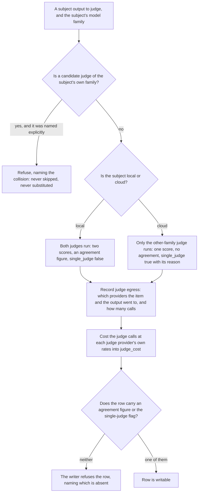
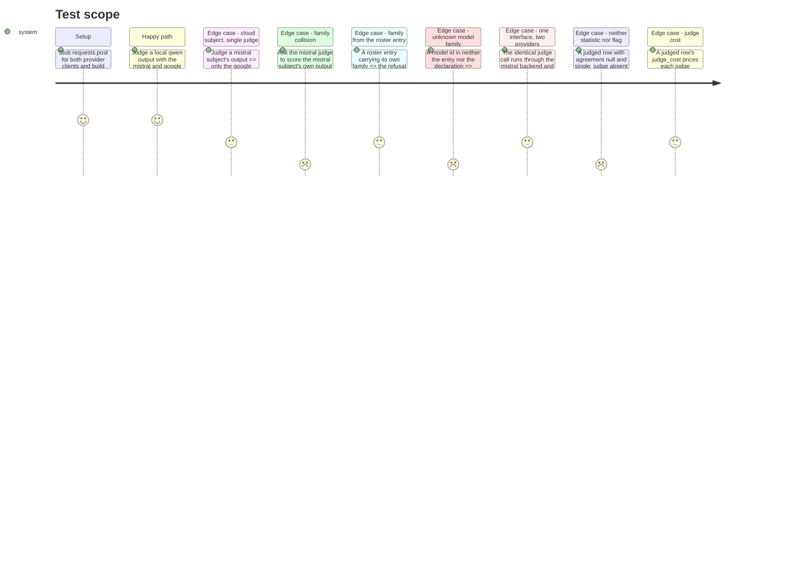

<!-- Fill or omit these sections; never add, rename, or reorder one. -->

# Instruction: Independence by family, refusals, egress and judge cost

## Architecture projection

> Tree of the final files. ✅ create · ✏️ modify · ❌ delete

```txt
.
├── src/wave_local_ai_v2/
│   ├── roster.py                ✏️ family constants, the in-code declaration, optional entry field, family_of resolution
│   ├── judge.py                 ✏️ judge selection by family, collision refusal, judged-block assembly (egress, agreement, contested)
│   ├── judge_backends.py        ✅ the only module importing both provider clients: binds each to JudgeBackend through retry.py
│   ├── cost.py                  ✏️ judge_cost_fields: per-judge-provider tokens and cost from the existing PRICE_TABLES
│   └── row_contract.py          ✏️ the neither-agreement-nor-flag refusal, over the fields phase 1 declared (no version bump)
└── tests/
    ├── test_roster.py           ✏️ family_of prefers the entry, falls back to the declaration, refuses an unknown model
    ├── test_judge.py            ✏️ (stubbed) same-family refusal, cloud subject single-judge, local subject two judges + agreement
    ├── test_cost.py             ✏️ judge tokens cost at the judge provider's own rates; cost_total stays the subject's
    └── test_row_contract.py     ✏️ a judged row with neither agreement nor single_judge is refused naming what is absent
```

## User Journey



## Test Scope

<!-- Required for every phase. Keep Setup, Happy path, any qualifying Edge cases, and any required Teardown in this one journey. -->



## Tasks to do

### `1)` `roster.py`: model family as the attribute independence is enforced on

> Declared here as the seam story 4 names: read from a roster entry when Methodology 13's roster carries one, from the in-code declaration until it does.

1. Declare `FAMILY_QWEN = "qwen"`, `FAMILY_MISTRAL = "mistral"`, `FAMILY_GOOGLE = "google"`, and `KNOWN_FAMILIES: frozenset[str]` holding the three.
2. Declare `MODEL_FAMILIES: dict[str, str]` mapping every model id this project names — the roster entry's `display_id`, `mistral_client.MODEL`, `google_client.MODEL` — to its family. Key by the literal dated ids, never by the client modules' `MODEL` variables, for the same reason `cost.MISTRAL_PRICE_TABLE`'s own comment gives: keying by the variable makes the mapping unfalsifiable and lets a model rotation inherit the retired model's family. `roster.py` must not import the client modules; write the literals.
3. Add `family: str | None = None` to `RosterEntry` and read it in `_parse_entry` as an optional key (`raw_entry.get("family")`). Do **not** add it to `REQUIRED_FIELDS`: the shipped roster file is untouched by this increment, so every existing entry must still load, and `roster_version` must not move (published rows and `tests/test_reference_bundle.py` compare against it).
4. Add `family_of(model_id: str, entry: RosterEntry | None = None) -> str`. Returns `entry.family` when an entry is given and carries one; otherwise `MODEL_FAMILIES[model_id]`; otherwise raises `RosterError` naming the model id and the known ids. Never defaults to a family — an unknown model is a refusal, because a wrong default silently disables the independence guard. Validate the resolved value is in `KNOWN_FAMILIES` and refuse when it is not.

### `2)` `judge_backends.py`: the two provider bindings, and the only module that imports a client

> Story 3 forbids `judge.py` from naming a provider error type; the pacing/retry layer needs exactly that type. One seam module holds the binding, and story 6 calls it.

1. Module docstring states the rule: this is the only module in the judge path that imports `mistral_client` or `google_client`; `judge.py`, `judge_protocol.py` and `agreement.py` stay provider-agnostic, so adding or swapping a provider reopens this file and nothing else.
2. Add `mistral_judge_backend(api_key, *, pacer, budget, temperature, random_seed, max_tokens) -> judge.JudgeBackend`. The returned callable does `pacer.wait()`, then `retry.call_with_retry` over `mistral_client.complete_prompt` with `is_retryable`/`retry_hint_s` closing over `mistral_client.RetryableRequestError`, and maps the completion into a `judge.JudgeResponse` (`model_id=mistral_client.MODEL`, `provider="mistral"`, `family=roster.FAMILY_MISTRAL`, `tokens_in=prompt_tokens`, `tokens_out=generated_tokens`, `retries`). Same closure shape as `quality_cli._make_mistral_complete_item`, which is the established pattern for a per-batch `Pacer`/`RetryBudget` pair.
3. Add `google_judge_backend(api_key, *, pacer, budget, temperature, top_p, top_k, seed, max_tokens)` with the same shape over `google_client.complete_prompt` and `google_client.RetryableRequestError`. Do not call `check_context_fits` here: the judge prompt's context pre-flight is the caller's decision in story 6, and paying a second request per judge call is a free-tier cost this increment has no evidence to justify.
4. Neither backend catches its provider's errors: a transport failure or an exhausted budget propagates to the caller, which owns the "skip that provider, one stderr line, run continues" contract (`quality_cli._try_run_cloud_provider`).

### `3)` `judge.py`: selection by family, the collision refusal, and the judged block

> A judge never scores its own family. The refusal is named, never a silent skip and never a quiet substitution.

1. Add `@dataclass(frozen=True) class Judge`: `model_id`, `provider`, `family`, `backend`.
2. Add `class JudgeFamilyCollisionError(ValueError)`. Add `select_judges(subject_family, judges) -> list[Judge]`: any judge whose `family == subject_family` raises, naming the subject's family, the judge's model id, and that this is a refusal rather than a skip. It never returns a filtered list with the colliding judge quietly dropped and it never substitutes another judge. Raise before any backend is invoked.
3. Declare `SINGLE_JUDGE_REASON_CLOUD_SUBJECT = "cloud_subject_other_family_only"`. Add `judge_item(*, subject_family, subject_provider, subject_output, item_prompt, item_language, rubric, judges, threshold) -> dict[str, Any]` returning the judged block, whose keys are exactly `row_contract.JUDGED_FIELDS`.
4. `judge_item` runs `select_judges` first, renders once through `judge_protocol.render_judge_prompt`, then calls each selected judge through `run_judge_call`. Two selected judges produce `single_judge=False`, `single_judge_reason=None`, and an `agreement` built through `agreement.agreement_for_rubric`; one selected judge produces `single_judge=True`, a stated reason, and `agreement=None`. It is the count of judges left after the independence rule that decides, not a `provider == "local"` test — that keeps the rule true for any future roster.
5. Fill `contested` and `contested_reason` through `agreement.is_contested` on the two scores, `contested_threshold` as the threshold actually applied (its values, not a reference), and `agreement_statistic` from the `Agreement` — the row names the statistic it published. A single-judge row is not contested: with one score there is no disagreement to have.
6. Fill `judge_egress`: `item_left_machine=True`, `subject_output_left_machine=True`, `providers` as the sorted distinct providers actually called, `generation_count=1`, `judge_call_count=len(selected)`. One judged item is one generation plus up to two judge calls, and the row says so. The values are recorded from the calls that were made, not asserted as constants.
7. Fill `judge_cost` through the new `cost` helper (task 4). Keep both judges' per-item scores on the block whatever the suite-level statistic says, so another agreement statistic can be recomputed from the rows alone.

### `4)` `cost.py`: judge-call tokens costed at each judge provider's own rates

> Judge calls cost tokens too. They join the row's cost block as their own named record; `cost_total` stays the subject generation's.

1. Add `judge_cost_fields(records) -> dict[str, Any]` taking the `JudgeCallRecord` list and returning the `judge_cost` record: `tokens_in_total`, `tokens_out_total`, `cost_total`, `cost_currency`, and `per_provider` — one entry per judge provider carrying `provider`, `model_id`, `tokens_in`, `tokens_out`, `cost_total`, `list_price_input_per_million`, `list_price_output_per_million`, `list_price_retrieved_at`.
2. Price each provider's tokens through the existing `PRICE_TABLES[provider][model_id]` and `cloud_cost`. A model id absent from its table raises `CostTableError` naming it, the same rule the module's import-time guards already enforce — never a default-costed zero.
3. Token totals go through `total_or_none`: one missing count makes that provider's total, and therefore the aggregate `cost_total`, `None` rather than smaller. The aggregate `cost_currency` is the shared currency of the tables involved; refuse (`CostTableError`) rather than sum across two currencies, and say so in the docstring — both tables are USD today, so this is a guard against a future table, not dead weight.
4. Do not modify `cloud_cost`, `local_cost`, `cost_per_million_tokens`, or either price table.

### `5)` `row_contract.py`: the neither-statistic-nor-flag refusal

> Phase 1 declared the fields. This adds the rule over them, with no second `SCHEMA_VERSION` bump.

1. In `_validate_judged_structure`, add: a judged row whose `agreement` is `None` **and** whose `single_judge` is not `True` is refused, naming both — the message states that a judged score must carry either an agreement figure or the single-judge flag, and which one is absent.
2. Add the converse guard: `single_judge=True` alongside a non-null `agreement` is refused too, naming the contradiction. A row cannot be both.
3. Validate that `judge_egress["providers"]` is non-empty and that `judge_egress["judge_call_count"]` equals `len(row["judges"])` — an egress record that disagrees with the calls on the row is worse than no record.
4. Leave `SCHEMA_VERSION` at `"9"`: no field is added or removed here, only rules over fields phase 1 already declared.

## Test acceptance criteria

<!-- Each criterion is an observable behavior, not a command. -->

| Task | Acceptance criteria              |
| ---- | -------------------------------- |
| 1 | `family_of("mistral-small-2603")` returns `"mistral"`, `family_of("gemini-3.5-flash-lite")` returns `"google"`, `family_of("Qwen3.6-35B-A3B")` returns `"qwen"`. |
| 1 | A `RosterEntry` constructed with `family="qwen"` resolves through the entry; the same call with an entry carrying `family=None` resolves through `MODEL_FAMILIES`. |
| 1 | `family_of("some-unknown-model")` raises `RosterError` naming that id; nothing is defaulted. |
| 1 | The shipped `aidd_docs/roster/models.json` still loads, its entry's `family` is `None`, and its `roster_version` is unchanged at `1`. |
| 2 | The Mistral backend, with `requests.post` stubbed to a normal 200 body, returns a `JudgeResponse` naming `provider == "mistral"`, `family == "mistral"`, `model_id == mistral_client.MODEL`, and the body's token counts. |
| 2 | The Google backend, with its own stub, returns the equivalent `JudgeResponse` — the same `run_judge_call` consumes both without a branch. |
| 2 | A stubbed 429 exhausting the budget propagates out of the backend rather than being swallowed. |
| 2 | `grep` over `judge_backends.py` is the only judge-path hit for `mistral_client`/`google_client`. |
| 3 | Asking a Mistral judge to score a Mistral subject's output raises `JudgeFamilyCollisionError` naming the family and the judge model, and the HTTP stub records zero calls — the refusal is proven by attempting the call, not by reading the guard. |
| 3 | A local `qwen` subject with both judges yields two `judges` entries, a non-null `agreement`, `single_judge is False`, and `judge_egress["providers"] == ["google", "mistral"]` with `judge_call_count == 2`. |
| 3 | A `mistral` cloud subject yields one `judges` entry (google), `agreement is None`, `single_judge is True` with a non-empty reason, and `judge_call_count == 1`. |
| 3 | The block returned by `judge_item` has exactly the key set `row_contract.JUDGED_FIELDS`, asserted by set equality so a field added on either side fails the test. |
| 3 | A 2-point disagreement sets `contested is True` with its reason and leaves both judges' scores on the block; the single-judge block has `contested is False`. |
| 4 | A judge-call list with a Mistral and a Google record costs each at its own table's rates; the aggregate `cost_total` equals their sum and is not equal to either alone. |
| 4 | A record with `tokens_in=None` makes that provider's and the aggregate `cost_total` `None`, not a smaller number. |
| 4 | A judge record naming a model id absent from its price table raises `CostTableError` naming it. |
| 4 | A judged row's top-level `cost_total` is byte-identical to the same row built without any judge block — judge cost does not move it. |
| 5 | A judged row with `agreement=None` and `single_judge=False` is refused, and the message names both `agreement` and `single_judge`. |
| 5 | A judged row with `single_judge=True` and a non-null `agreement` is refused naming the contradiction. |
| 5 | A judged row whose `judge_egress["judge_call_count"]` is `2` while `judges` holds one entry is refused. |
| 5 | `SCHEMA_VERSION` is still `"9"` after this phase. |