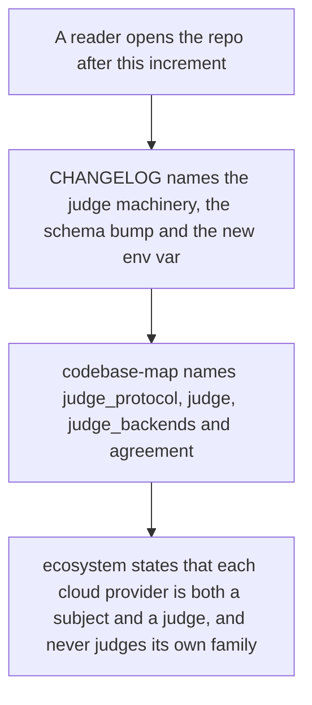
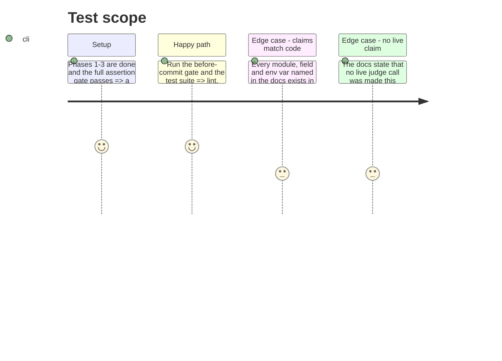

<!-- Fill or omit these sections; never add, rename, or reorder one. -->

# Instruction: CHANGELOG and memory

## Architecture projection

> Tree of the final files. ✅ create · ✏️ modify · ❌ delete

```txt
.
├── CHANGELOG.md                     ✏️ one Unreleased/Added entry for the whole increment, in the file's existing voice
└── aidd_docs/memory/
    ├── codebase-map.md              ✏️ the four new modules named in the src bullet, with what each holds
    └── ecosystem.md                 ✏️ Mistral and Google as judges, not only subjects; the family-independence rule
```

## User Journey



## Test Scope

<!-- Required for every phase. Keep Setup, Happy path, any qualifying Edge cases, and any required Teardown in this one journey. -->



## Tasks to do

### `1)` `CHANGELOG.md`: one `Unreleased` / `Added` entry

> The file's existing entries are dense paragraphs naming modules, constants, defaults and the schema bump. Match that, do not write a bullet list of features.

1. Name the four modules and what each owns: `judge_protocol.py` (EN/FR/DE prompt shells with their ids and `prompt_provenance.template_hash` content hashes, the `OPEN_ENDED_QUALITY_1_TO_5` rubric versioned independently of the shells, and the refusal to judge an item in a language no variant covers), `judge.py` (the provider-agnostic `JudgeBackend` protocol, the parse into the rubric's scale where an unparseable reply fails with a named reason and is never scored `0`, selection by family and the `JudgeFamilyCollisionError` refusal), `judge_backends.py` (the only judge-path module importing `mistral_client`/`google_client`, binding each to the protocol through `retry.py`'s pacer and budget), and `agreement.py` (quadratic-weighted and unweighted Cohen's kappa, exact-match and within-one rates, kappa published as an explicit null with its reason on zero variance, and the contested rule).
2. State the contract change precisely: `SCHEMA_VERSION` `"8"` → `"9"`; the judge block is required only on a row that carries any of it, so an existing deterministic quality row validates unchanged; a judged row carrying neither an agreement figure nor the single-judge flag is refused naming what is absent.
3. State the cost treatment: judge-call tokens are costed per judge provider at that provider's own table rate into `judge_cost`, and the row's `cost_total` remains the subject generation's — the summing question stays open with criterion 16.
4. Name the new configuration: `CONTESTED_ORDINAL_MAX_DELTA`, default `1`, contested being strictly above it or any category mismatch.
5. State plainly what did not happen: no CLI wiring, no judged suite, no live judge call. Every test in this increment runs against stubbed HTTP; the live two-path proof and the judged probe are the next story's.
6. State the divergence from the epic and the PRD in one sentence: the 1-5 ordinal rubric publishes quadratic-weighted Cohen's kappa with the raw agreement figures beside it, where the PRD's criterion 10 and the epic's decision row say absolute score delta.

### `2)` `aidd_docs/memory/codebase-map.md`: the four new modules

> One area bullet, kept in the existing run-on style of the `src/wave_local_ai_v2/` entry. No new mermaid nodes: the diagram is macro-level areas, and these are modules inside an existing area.

1. Extend the `src/wave_local_ai_v2/` bullet with the judge path: `judge_protocol.py` and `agreement.py` are pure and provider-free, `judge.py` calls through an injected backend, and `judge_backends.py` is the single seam that binds the two cloud clients to it — the same one-module-per-provider discipline the bullet already records for `mistral_client.py`/`google_client.py`.
2. Note `roster.py` now resolves model family through `family_of`, preferring a roster entry's own optional `family` and falling back to an in-code declaration until Methodology 13's roster carries it.
3. Do not restate the row contract's field list; the bullet names responsibilities, not schemas.

### `3)` `aidd_docs/memory/ecosystem.md`: judges, not only subjects

> The diagram already labels both providers "benchmark subject · judge". The prose below it does not yet say what judging means.

1. Add a short paragraph under the existing one: each cloud provider is now both a benchmark subject and a judge, and a judge never scores output from its own model family — a Mistral judge pointed at a Mistral subject's output is refused with the collision named, not skipped or substituted.
2. State the consequence for a cloud subject: it is scored by the other-family judge only, carries no agreement figure, and is flagged single-judge on the row. A local model's output is scored by both and carries an agreement figure.
3. State the call volume, because it is an ecosystem fact: one judged item is one generation plus up to two judge calls, all through the pacing/retry layer, all recorded as egress on the row.
4. Do not edit the mermaid diagram: no new external service is introduced by this increment.

## Test acceptance criteria

<!-- Each criterion is an observable behavior, not a command. -->

| Task | Acceptance criteria              |
| ---- | -------------------------------- |
| 1 | Every module, constant, default and env var named in the CHANGELOG entry resolves to something in the working tree — checked by opening each, not by memory. |
| 1 | The entry states the schema bump, the conditional requirement, the cost treatment and the absence of live calls, and reads in the same voice as the two entries above it. |
| 1 | The entry names the kappa divergence from the PRD and the epic rather than presenting weighted kappa as what those documents asked for. |
| 2 | `codebase-map.md` names all four new modules and says which of them may import a provider client; the mermaid block is unchanged. |
| 3 | `ecosystem.md` states the family-independence refusal, the single-judge consequence for a cloud subject, and the per-item call volume; the mermaid block is unchanged. |
| 1-3 | `uv run pre-commit run --all-files` and `uv run pytest` both pass on the finished increment. |