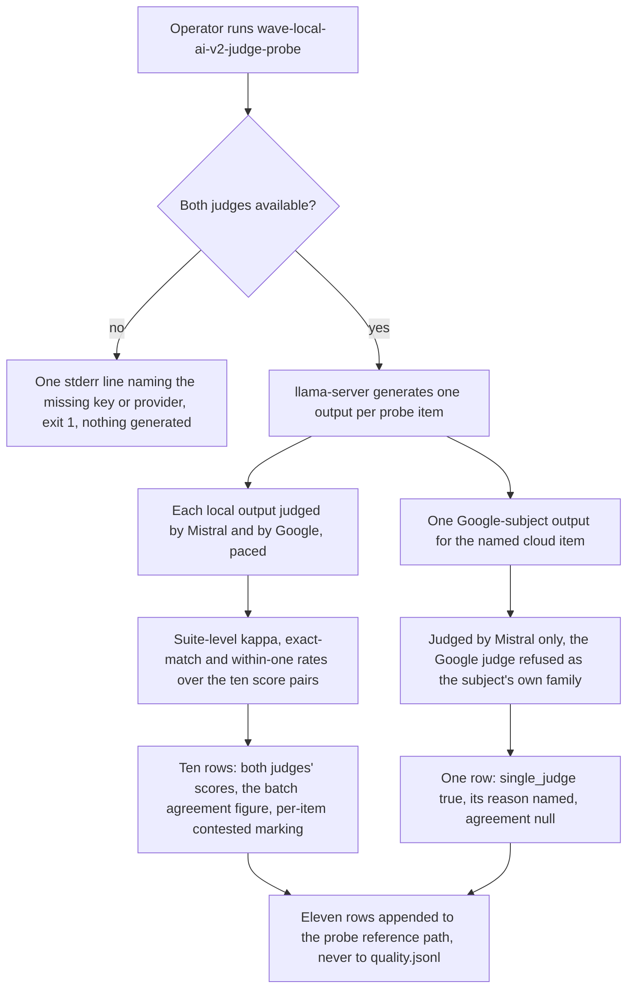
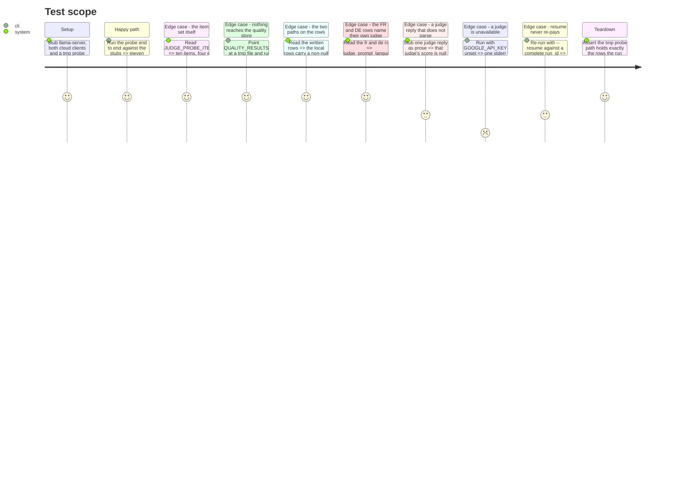

<!-- Fill or omit these sections; never add, rename, or reorder one. -->

# Instruction: The probe items, its runner, its path, and stubbed tests

## Architecture projection

> Tree of the final files. ✅ create · ✏️ modify · ❌ delete

```txt
.
├── src/wave_local_ai_v2/
│   ├── judge_probe.py            ✅ the ten open-ended items, the probe's identity, and the runner that produces the two-judge and single-judge rows
│   ├── quality_rows.py           ✅ the per-batch energy/emissions/cost fields every quality row carries, moved out of quality_cli so both CLIs build them from one place
│   ├── results.py                ✏️ resume_skip_reason, moved from quality_cli and parameterised on the batch's expected item count
│   ├── quality_cli.py            ✏️ imports the three moved functions; no behavioural change
│   ├── classification_suite.py   ✏️ prompt_set_hash duck-typed to any mapping carrying item_id/prompt, so the probe cites the same hashing rule
│   └── settings.py               ✏️ judge_probe_reference_path, defaulted, mirroring the existing *_reference_path settings
├── .env.example                  ✏️ JUDGE_PROBE_REFERENCE_PATH with its default and one line of why
├── pyproject.toml                ✏️ the wave-local-ai-v2-judge-probe console entry
└── tests/
    ├── test_judge_probe.py       ✅ the item set, and a fully stubbed end-to-end run producing both paths' rows
    ├── test_results.py           ✏️ resume_skip_reason's three cases at its new home
    └── test_settings.py          ✏️ the new path setting, defaulted and overridden
```

## User Journey



## Test Scope

<!-- Required for every phase. Keep Setup, Happy path, any qualifying Edge cases, and any required Teardown in this one journey. -->



## Tasks to do

### `1)` `results.py` and `quality_cli.py`: the resume rule, moved and parameterised

> One "never re-pay, never duplicate" rule for both CLIs, keyed on `(run_id, provider)` in whichever store the caller names.

1. Move `quality_cli._resume_skip_reason` into `results.py` as `resume_skip_reason(path: Path, run_id: str, provider: str, item_count: int) -> str | None`, carrying its docstring across. The only change is that the total it compares against is the `item_count` argument instead of `len(CLASSIFICATION_TASK_SUITE)`; the three branches (nothing written, all written, partially written) and their exact message wording are unchanged, so `cli.md`'s quoted strings stay true.
2. Replace the body of the two call sites in `quality_cli.py` with a call passing `len(CLASSIFICATION_TASK_SUITE)`. Delete the private function; do not leave a wrapper.
3. Do not widen or narrow what the message says: `"run <run_id> already complete"` and `"run <run_id> is partially written (N/M items); re-running would duplicate them"` are what `aidd_docs/memory/cli.md` documents and what `tests/test_quality_cli.py` asserts.

### `2)` `quality_rows.py` and `quality_cli.py`: the per-batch row fields, moved

> The energy/emissions/cost keys every quality row carries per batch, declared once for the two CLIs that write quality rows.

1. Create `quality_rows.py` and move `_local_batch_fields` and `_cloud_batch_fields` into it as `local_batch_fields` and `cloud_batch_fields`, verbatim including their docstrings and inline comments — these state the contract's honesty rules (a `None` prompt-token count makes the batch total unknown rather than zero; the three price figures rather than one) and must not be re-worded in transit.
2. Give the module a docstring naming why it exists: both quality-row writers (`quality_cli.py`'s four batches, `judge_probe.py`'s two) derive the same cost/emissions block, and a second copy would be a parallel declaration of `row_contract`'s cost rules.
3. Update `quality_cli.py`'s three call sites to the imported names. No behavioural change; `tests/test_quality_cli.py` passes untouched.

### `3)` `classification_suite.py`: `prompt_set_hash` reads any item that has an id and a prompt

> One hashing rule for a prompt set, not a second one per suite.

1. Widen the parameter type from `Sequence[ClassificationItem]` to a sequence of mappings exposing `item_id` and `prompt`, duck-typed rather than `isinstance`-checked — the choice `suite_gate.gate_suite` already made and documents in its own docstring.
2. Leave the hashing itself byte-identical: sorted by `item_id`, joined as `f"{item_id}:{prompt}"`, SHA-256 hex. `PROMPT_SET_HASH` must not move — the published reference bundle cites it and `tests/test_reference_bundle.py` asserts it against the suite snapshot.
3. Note in the docstring that the probe's item set hashes through the same function, so a reader comparing a `prompt_set_hash` across two files is comparing like with like.

### `4)` `settings.py` and `.env.example`: the probe's own reference path

> The probe never shares a store with the classification suite, in either direction.

1. Add `DEFAULT_JUDGE_PROBE_REFERENCE_PATH = "aidd_docs/results/judge-probe-reference.jsonl"` beside the other `DEFAULT_*_REFERENCE_PATH` constants, with a comment recording that this one is written by a CLI, unlike its two neighbours, and why (the probe is a deliberate one-off proof, not a per-machine benchmark).
2. Add `judge_probe_reference_path: Path` to `Settings`, read in `load_settings` from `JUDGE_PROBE_REFERENCE_PATH` with the default above. No existence check at load time, mirroring the two paths beside it.
3. Add the variable to `.env.example`, commented out at its default with one line of why, matching that file's existing comment density.

### `5)` `judge_probe.py`: the ten items and the probe's identity

> About ten short open-ended prompts, natively authored per language. Not a task suite, not a draft of the rewriting suite's items.

1. Declare `ProbeItem` (TypedDict): `item_id`, `prompt`, `language` (`Literal["en","fr","de"]`), `provenance` (`Literal["hand_written","licensed","public"]`), `contamination_risk` (`bool`). Deliberately **no** `expected_label` and no scoring key of any kind — the rubric is the only scoring rule the probe has, and an item with a label would make this a task suite.
2. Declare `JUDGE_PROBE_ITEMS`: exactly ten items, `hand_written` and `contamination_risk=False` throughout, four `en`, three `fr`, three `de`, with these ids and intents:
   - `improve-en-01` — a blunt one-line message to a client; ask the model to make it more considerate without changing what it says.
   - `improve-en-02` — a rambling meeting invitation; ask for a shorter, clearer version.
   - `summarise-en-01` — a short note about a delivery slipping; ask for a two-sentence summary.
   - `summarise-en-02` — a handful of scattered decisions from a call; ask for a summary a colleague could act on.
   - `improve-fr-01` — un message trop sec à un collègue ; demander une reformulation plus courtoise.
   - `summarise-fr-01` — une note de réunion en désordre ; demander un résumé en deux phrases.
   - `improve-fr-02` — un paragraphe alourdi par le jargon ; demander une version lisible par un non-spécialiste.
   - `improve-de-01` — eine unhöfliche Rückmeldung; um eine sachlichere Fassung bitten.
   - `summarise-de-01` — eine lange Terminabsage; um eine kurze Zusammenfassung bitten.
   - `improve-de-02` — ein überladener Absatz; um eine klarere, kürzere Fassung bitten.
   Write the FR and DE prompts natively in their own language — instruction and material both, never a translation of an EN item, and never the same underlying text in three languages. Keep each item to a few lines: the probe pays two cloud judge calls per item and its own docstring must not read as a benchmark.
3. Declare the probe's identity beside the items: `SUITE_ID = "judge-probe-open-ended"`, `SUITE_VERSION = "1"`, `PROMPT_SET_HASH = classification_suite.prompt_set_hash(JUDGE_PROBE_ITEMS)`, `MAX_OUTPUT_TOKENS = 256` (open-ended prose, not a one-word label), `STOP_SEQUENCES: list[str] = []`, `CONTEXT_LENGTH = 32768` (the shipped roster entry's context, the same literal `classification_suite` carries and for the same stated reason).
4. Declare `CLOUD_SUBJECT_ITEM_ID = "improve-en-01"` — the one item the cloud subject answers, named as a constant so the single-judge row is reproducible rather than "whichever item ran first".
5. Declare `RUBRIC = judge_protocol.OPEN_ENDED_QUALITY_1_TO_5` and state in the module docstring that the probe deliberately reuses the generic shipped rubric: the rewriting suite owns its own rubric text, and the probe must not pre-empt it.
6. Declare the sampling blocks: `LOCAL_SAMPLING` and `GOOGLE_SAMPLING` for the subjects (the same keys and pinned values `quality_cli` sends, so a probe generation and a quality generation are sampled identically), and `JUDGE_SAMPLING_MISTRAL` / `JUDGE_SAMPLING_GOOGLE` for the judge calls, temperature 0 with the seed pinned and a small `JUDGE_MAX_TOKENS` (16 — the rubric asks for one integer). Declare `PROBE_SEED = 20260821` with a comment stating it is deliberately the same value as `quality_cli.QUALITY_SEED` and deliberately not imported from it: a CLI module is not a library, and nothing else in `src/` imports one.
7. Module docstring: the probe drives the judged machinery end to end and publishes no benchmark score; it is not a task suite and its file is never read as a suite reference; it sits below `suite_gate.MIN_SUITE_ITEMS` on purpose and its rows say so through `indicative`.

### `6)` `judge_probe.py`: the runner, both paths, and the rows

> One `run_id` per invocation, `--resume` per `(run_id, provider)` batch, eleven rows, one store.

1. `_parse_args` with `--resume RUN_ID`, help text mirroring the quality CLI's. `main()` catches the same failure set that CLI's `main` catches (`SettingsError`, `server.ServerStartupError`, `OSError`, `roster.RosterError`, `LocalCompletionError`, `SuiteGateError`) plus the two providers' request errors and `retry.RetryBudgetExhausted` — here they abort with one stderr line and exit 1 rather than being skipped, per the plan's Decision that the probe's judges are not optional.
2. Pre-flight, before anything is generated: both `mistral` and `google` must be in `settings.quality_providers` and both keys must be set, else exit 1 naming the missing one. Then `mistral_client.check_model_available` (printing a deprecation notice to stderr as the quality CLI does) and `google_client.check_model_available`, whose `input_token_limit` and `version` the run keeps.
3. Set-up, in the quality CLI's order: `load_settings`, `run_id = resume_run_id or new_run_id()`, `provenance.capture_provenance()`, `roster.load_roster` / `resolve_entry`, the local model path, `suite_gate.gate_suite(JUDGE_PROBE_ITEMS)` (expected to return `indicative=True` naming the sub-20 count — do not suppress it), `server.build_flags`, `build_probe.probe_build`, one fiche per invocation via `build_fiche`/`capture_fiche`/`fiche_registry.write_fiche`, cited by both batches.
4. Build the two judges once per run through `judge_backends.mistral_judge_backend` and `judge_backends.google_judge_backend`, each closed over one `retry.Pacer` at its provider's configured interval and one `retry.RetryBudget` at `cloud_retry_max_attempts` — one pacer per provider for the whole run, so the local batch's twenty judge calls and the cloud item's one are spaced against the same clock. Wrap each in `judge.Judge(model_id=..., provider=..., family=roster.family_of(<that model id>), backend=...)`.
5. Local batch, skipped when `results.resume_skip_reason(probe_path, run_id, "local", len(JUDGE_PROBE_ITEMS))` names a reason: inside `measure_energy`, launch `server.running_server` once and POST each item's prompt to `/completion` with `LOCAL_SAMPLING` and `n_predict=MAX_OUTPUT_TOKENS`, raising `LocalCompletionError` on a missing or non-string `content` exactly as the quality CLI does. Judging happens **after** the measured block closes: a judge call is network time on a remote machine and must not land in the local row's energy figure.
6. Judge each local output with both judges via `judge.judge_item(subject_family=roster.family_of(roster_entry.display_id, roster_entry), ..., item_language=item["language"], rubric=RUBRIC, judges=[mistral_judge, google_judge], threshold=agreement.ContestedThreshold(settings.contested_ordinal_max_delta), single_judge_reason=None)`. Collect the eleven blocks before writing anything.
7. Compute the batch figures over the ten two-judge items: `agreement.agreement_for_rubric(RUBRIC, pairs)` over the `(mistral_score, google_score)` pairs read off each block's `judges` list, and `agreement.headline_score(item_scores, contested_flags)` over the same items. Overwrite `agreement`, `judged_headline_score` and `judged_headline_excluded_n` on each local block with these batch values, leaving `judges`, `contested`, `contested_reason`, `judge_egress` and `judge_cost` per item. Comment why: kappa over one item is null by construction (`agreement.cohens_kappa`'s `insufficient_items`), so the batch figure is the only real one, and it is a repeated batch value like `suite_accuracy`.
8. Cloud-subject item, skipped when `resume_skip_reason(..., "google", 1)` names a reason: `google_client.check_context_fits` then `complete_prompt` for `CLOUD_SUBJECT_ITEM_ID` with `GOOGLE_SAMPLING`, both through `retry.call_with_retry` and the google pacer. Judge that output with the Mistral judge alone, passing `single_judge_reason=judge.SINGLE_JUDGE_REASON_CLOUD_SUBJECT`. Do not hand `judge_item` the Google judge and let it filter: `select_judges` refuses a family collision, and the refusal is the behaviour, not a code path to route around.
9. Row builder, one function for both batches, producing exactly the quality contract's key set plus the judge block and one extra key: `schema_version`, `run_id`, `captured_at`, the provenance fields, `roster_entry_id`/`roster_version`, the call-path fields (`/completion` + `TEMPLATE_ID_NONE` for local; `google_client.GENERATE_URL` + `TEMPLATE_ID_GOOGLE_CHAT_MESSAGE` + its hash for the cloud row), `model_id`, `provider`, `fiche_hash`, the batch fields from `quality_rows.local_batch_fields` / `quality_rows.cloud_batch_fields`, `task_suite="judge-probe"`, `item_id`, `prompt`, `expected_label=None`, `predicted_label=None`, `correct=None`, `suite_accuracy=None`, `language_breakdown=None`, `sampling`, `max_output_tokens`, `stop_sequences`, `context_length`, `suite_id`, `suite_version`, `prompt_set_hash`, `language`, `provenance`, `contamination_risk`, `indicative`/`indicative_reasons` from the gate, `failure_reason` (`None`, or `scoring`'s own empty/truncated-max-tokens constant when the subject output was blank or hit the cap), `failure_counts` (the batch tally over those), `retries`, `resumed`, `verdict`, `**judge_block`, and `subject_output`. Comment the four deliberate nulls in one place: an open-ended item has no label, so `expected_label`, `predicted_label`, `correct` and `suite_accuracy` are `null` rather than fabricated, and the score a reader wants is the judged one.
10. `verdict`: build the `not_comparable` block directly — `{"verdict": verdict.VERDICT_NOT_COMPARABLE, "reference_run_id": None, "differing_fields": [], "reason": "the probe publishes no label and no score: there is nothing for a later run to be compared against"}` — and state in a comment why `verdict.quality_verdict` is not called (it decides on `predicted_label`, which is null on every probe row, so it would publish `reproduced` off two sets of nulls).
11. Write with `results.append_row(settings.judge_probe_reference_path, "quality", row)`, which gates on the contract. Print one stdout line per batch and one summary line naming the statistic, its value or its null reason, the exact-match rate, and the contested count — this is what the operator reads into phase 3's README section.

### `7)` `pyproject.toml`: the console entry

> One line; the probe is invoked the way the other three commands are.

1. Add `wave-local-ai-v2-judge-probe = "wave_local_ai_v2.judge_probe:main"` under `[project.scripts]`.

### `8)` `tests/test_judge_probe.py`, `test_results.py`, `test_settings.py`

> Stubbed HTTP throughout: no llama-server process, no socket, no cloud call.

1. `test_judge_probe.py`: the item-set assertions (count, language split, provenance, no label key, ids unique), then a fully stubbed end-to-end run patching `server.running_server`, the local `/completion` POST, both cloud clients' pre-flights and completions, and both judge backends' underlying `complete_prompt`s — with `Settings` pointed at a tmp probe path and a tmp quality path.
2. Assert the written rows against `row_contract.validate_row` explicitly as well as through `append_row`, so a contract failure names the field rather than surfacing as a missing file.
3. Assert the two paths separately: ten rows with `single_judge is False`, a non-null `agreement` whose `statistic` is named and whose `n_items` is what it was computed over; one row with `single_judge is True`, its reason `cloud_subject_other_family_only`, `agreement is None`, and exactly one entry in `judges`.
4. Assert the language evidence off the rows: the `fr` rows carry `judge_prompt_language == "fr"` and `judge_prompt_id == judge_protocol.JUDGE_TEMPLATE_IDS["fr"]` with the matching hash, the `de` rows the same for `de`, and no row carries the `en` shell's hash for a non-`en` item.
5. Assert the failure path: one stubbed judge reply of prose leaves that judge's `score` null with a named `failure_reason`, keeps its `raw_text`, and drops that item from the statistic (`n_items_excluded` counts it) rather than scoring it zero.
6. Assert the refusals: `GOOGLE_API_KEY` unset (or `google` absent from `QUALITY_PROVIDERS`) exits 1 with one stderr line naming it, writes no row, and never enters `running_server`.
7. Assert the resume path: a probe path pre-seeded with a complete run's rows makes `--resume <that run_id>` skip both batches by name, make no cloud call, and append nothing.
8. Assert the isolation: `quality.jsonl` (the tmp `quality_results_path`) is never created by a probe run.
9. `test_results.py`: `resume_skip_reason`'s three cases at its new home — no rows, all rows, some rows — with the message wording asserted.
10. `test_settings.py`: `judge_probe_reference_path` resolves to its default with the env var unset and to the override with it set.

## Test acceptance criteria

<!-- Each criterion is an observable behavior, not a command. -->

| Task | Acceptance criteria              |
| ---- | -------------------------------- |
| 1 | Resuming a `(run_id, provider)` batch that already holds every one of its items is skipped by name; one that holds none is re-run; one that holds some is refused as partially written — the same three messages, now decided against a caller-supplied item count. |
| 2 | The quality CLI's rows are byte-identical in shape to before the move: `tests/test_quality_cli.py` passes with no edit. |
| 3 | `classification_suite.PROMPT_SET_HASH` is unchanged, and the probe's item set hashes through the same function without a second implementation. |
| 4 | `load_settings` with no `JUDGE_PROBE_REFERENCE_PATH` resolves `aidd_docs/results/judge-probe-reference.jsonl`; with the variable set it resolves that value. |
| 5 | The item set holds ten items, four `en`, three `fr`, three `de`, all `hand_written` with `contamination_risk` false, ids unique, and no item carries an expected label or any scoring key. |
| 5 | Each FR and DE prompt is written in its own language, instruction and material both, and no item is the same text as another item in another language. |
| 6 | A stubbed end-to-end run writes exactly eleven rows to the probe path, every one passing `row_contract.validate_row("quality", row)`. |
| 6 | The ten local rows carry `single_judge false`, two entries in `judges`, and one and the same non-null `agreement` naming its statistic — the batch figure, not a per-item null. |
| 6 | The cloud-subject row carries `single_judge true`, `single_judge_reason == "cloud_subject_other_family_only"`, `agreement is None`, and exactly one judge record, whose provider is `mistral`. |
| 6 | Every row carries `expected_label`, `predicted_label`, `correct` and `suite_accuracy` as `null`, and a non-empty `subject_output`. |
| 6 | Every row carries `indicative true` with a reason naming the item count below twenty. |
| 6 | Every row's `verdict` is `not_comparable` with a reason naming that the probe publishes no label and no score. |
| 6 | An `fr` item's row names the French shell (`judge_prompt_language`, `judge_prompt_id`, `judge_prompt_template_hash`), a `de` item's the German one, and neither names the English shell. |
| 6 | A judge reply that does not parse leaves that judge's `score` null with a named `failure_reason` and its `raw_text` on the row, and the item is counted in the statistic's `n_items_excluded` rather than scored `0`. |
| 6 | A run with either judge's key unset, or its provider absent from `QUALITY_PROVIDERS`, exits 1 naming it, writes no row, and never launches the server. |
| 6 | A `--resume` against a run whose rows are all on disk makes no cloud call and appends nothing. |
| 6 | No probe run creates or writes to the configured quality results path. |
| 7 | `uv run wave-local-ai-v2-judge-probe --help` prints the probe's own usage, including `--resume`. |
