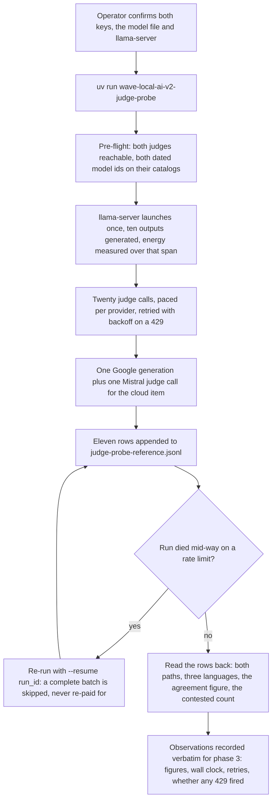
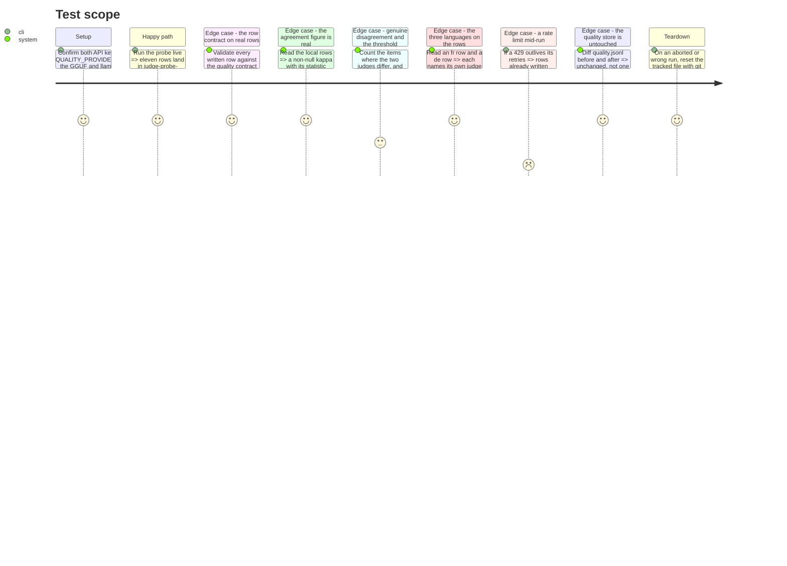

<!-- Fill or omit these sections; never add, rename, or reorder one. -->

# Instruction: The live run — eleven judged rows, both paths, three languages

## Architecture projection

> Tree of the final files. ✅ create · ✏️ modify · ❌ delete

```txt
.
├── aidd_docs/results/
│   ├── judge-probe-reference.jsonl   ✅ the eleven rows this run produces, tracked (.gitignore already re-includes *-reference.jsonl)
│   └── fiches/<hash>.json            ✅ the one fiche this run's rows cite, written by fiche_registry
└── src/wave_local_ai_v2/             ✏️ only if the live run finds a defect; a code change here is a fix, never a fit to the numbers
```

## User Journey



## Test Scope

<!-- Required for every phase. Keep Setup, Happy path, any qualifying Edge cases, and any required Teardown in this one journey. -->



## Tasks to do

### `1)` Preconditions, confirmed before anything is paid for

> A probe run costs twenty-two cloud calls. Everything checkable offline is checked first.

1. Confirm `.env` carries `MISTRAL_API_KEY` and `GOOGLE_API_KEY`, and that `QUALITY_PROVIDERS` (if set) includes both `mistral` and `google`.
2. Confirm `SLM_MODELS_DIR` holds the roster entry's GGUF and `LLAMA_SERVER_PATH` exists; confirm no llama-server is already holding port 8080 (`server.start_server` refuses one, but finding out before the run is cheaper).
3. Confirm `git status` is clean for `aidd_docs/results/` — the run appends to a tracked file, and a pre-existing diff there would be indistinguishable from the run's own output.
4. Run `uv run pytest tests/test_judge_probe.py` first: a stubbed failure must never be discovered by a live run.

### `2)` The live run

> One invocation, both paths, three languages.

1. Run `uv run wave-local-ai-v2-judge-probe` and keep the whole stdout/stderr transcript — the pre-flight lines, any deprecation notice, the per-batch lines, the summary line, and the wall clock.
2. If the run dies on a rate limit or a transport failure, record which provider and which item it named, then re-run with `--resume <run_id>` from the first invocation's own id. Record how many resumes it took. Do **not** widen `CLOUD_RETRY_MAX_ATTEMPTS` or the pacing intervals to get through: whether the free tier makes a judged run impractical or merely slow is one of the three questions phase 3 must answer, and tuning the settings to make the problem disappear would destroy the evidence for that answer.
3. If the run aborted part-way and left rows behind, reset with `git checkout -- aidd_docs/results/judge-probe-reference.jsonl` before any re-run that is *not* a `--resume` — a fresh `run_id` would otherwise append a second generation of rows beside the first.

### `3)` Read the evidence back off the rows

> Every check reads the written file, never the code that wrote it.

1. Count the rows: eleven, ten with `provider` local and one with `provider` google.
2. Validate every row against `row_contract.validate_row("quality", row)` from a scratch script or a REPL, and record that it passed for all eleven.
3. Record, verbatim from the rows: the `agreement` block on a local row (statistic, value or null reason, `exact_match_rate`, `within_one_rate`, `n_items`, `n_items_excluded`), the `judged_headline_score` and `judged_headline_excluded_n`, and the per-item `(mistral_score, google_score)` pairs with the contested marking on each.
4. Record the single-judge row's `single_judge`, `single_judge_reason`, `agreement`, and its one judge record's provider and model id.
5. Record, from an `fr` row and a `de` row, the `judge_prompt_id`, `judge_prompt_template_hash` and `judge_prompt_language`, and confirm each hash equals `judge_protocol.JUDGE_TEMPLATE_HASHES` for that language — the row re-rendering the prompt that was actually sent, read off the row rather than off the template source.
6. Record the judge-call cost and egress: `judge_cost.tokens_in_total` / `tokens_out_total` / `cost_total` per row, and `judge_egress.providers` / `judge_call_count`, plus the run's total judge-call count across the eleven rows.
7. Record the free-tier facts phase 3 needs: total wall clock, the maximum `retries` any row carries, whether any 429 fired at all, and how many `--resume` invocations the run took.
8. Confirm `aidd_docs/results/quality.jsonl` gained no line.

### `4)` What to do if the rows are not what the story requires

> A live run is evidence, not a formality. Some outcomes are findings; some are defects.

1. A judge reply that did not parse, an item both judges scored the same, a contested item, a kappa that is null for a *named* reason other than `insufficient_items` — all of these are findings. Record them and keep the rows. Nothing is re-run to get a prettier number.
2. A kappa null with `insufficient_items` on a ten-item batch, a two-judge row carrying no agreement, a single-judge row carrying one, a row failing the contract, an `fr` item judged against the English shell, or a row landing in `quality.jsonl` — all of these are defects in phase 1's code. Fix the code, reset the tracked file, and re-run from scratch under a fresh `run_id`.
3. If both judges agree on every single item, the contested threshold was never exercised. Say so plainly in phase 3 rather than manufacturing a disagreement: "the threshold did not survive contact because no disagreement occurred" is one of the honest answers to the epic's second question, and the rows back it.

### `5)` Commit the evidence

> The file is tracked; the fiche it cites has to be tracked with it.

1. Stage `aidd_docs/results/judge-probe-reference.jsonl` together with the fiche `aidd_docs/results/fiches/<hash>.json` its rows cite — a row citing an unregistered fiche is exactly what `wave-local-ai-v2-validate` reports as `missing`.
2. Run `uv run wave-local-ai-v2-validate aidd_docs/results/judge-probe-reference.jsonl` and record the checked count and the exit code.
3. Do not add the probe file to `tests/test_reference_bundle.py`: that test names the auditor's bundle explicitly and the probe is deliberately not part of it (the story's "its file is never read as a suite reference"). Confirm the test still passes untouched.

## Test acceptance criteria

<!-- Each criterion is an observable behavior, not a command. -->

| Task | Acceptance criteria              |
| ---- | -------------------------------- |
| 2 | The run completes, whether in one invocation or through `--resume`, and no settings value was changed to make it complete. |
| 3 | `aidd_docs/results/judge-probe-reference.jsonl` holds exactly eleven rows: ten `provider: local`, one `provider: google`. |
| 3 | Every one of the eleven rows passes the quality row contract, judge block included, verified by running the validator over the file rather than by reading the writer. |
| 3 | The ten local rows carry a two-judge agreement figure whose statistic is named and whose value is either a number or a null with a reason that is not `insufficient_items`. |
| 3 | The cloud-subject row carries `single_judge: true` with `cloud_subject_other_family_only`, a null agreement, and one Mistral judge record. |
| 3 | An `fr` row's `judge_prompt_template_hash` equals the French shell's hash and a `de` row's the German shell's, neither the English one. |
| 3 | Each item's two judge scores and its contested marking are recorded, and the headline's excluded count equals the number of contested items. |
| 3 | `quality.jsonl` is unchanged by the run. |
| 5 | `wave-local-ai-v2-validate` over the probe file exits 0 and names the checked row count. |
| 5 | `tests/test_reference_bundle.py` passes with no edit — the probe file is not part of the auditor's bundle. |
| 5 | The transcript, the figures, the wall clock, the retry count and the resume count are recorded in a form phase 3 can quote without re-running anything. |
