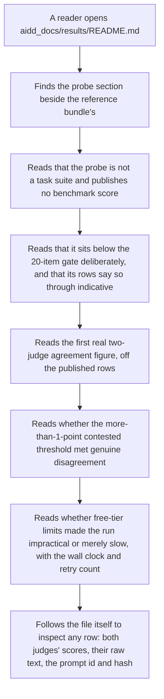
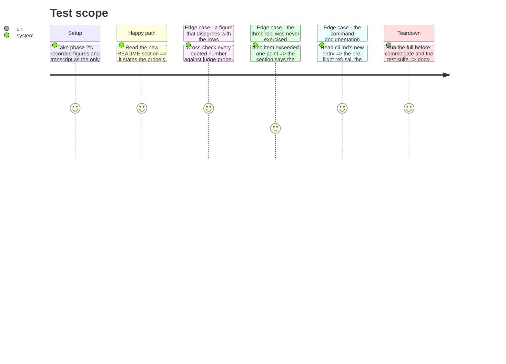

<!-- Fill or omit these sections; never add, rename, or reorder one. -->

# Instruction: The README section, the three answers, CHANGELOG and memory

## Architecture projection

> Tree of the final files. ✅ create · ✏️ modify · ❌ delete

```txt
.
├── aidd_docs/
│   ├── results/README.md         ✏️ the probe's own section: what the file is, what it is not, and the epic's three closing answers
│   └── memory/
│       ├── cli.md                ✏️ the wave-local-ai-v2-judge-probe command, its pre-flight refusal and its resume behaviour
│       └── codebase-map.md       ✏️ judge_probe.py in the package description, and the fourth entry point
└── CHANGELOG.md                  ✏️ one Unreleased/Added entry for the probe and its published rows
```

## User Journey



## Test Scope

<!-- Required for every phase. Keep Setup, Happy path, any qualifying Edge cases, and any required Teardown in this one journey. -->



## Tasks to do

### `1)` `aidd_docs/results/README.md`: the probe's own section

> Placed beside the reference-bundle sections, not inside them: the probe is a fourth artifact, not a sixth part of the bundle.

1. Open the section by stating what the file is: eleven rows produced by one `wave-local-ai-v2-judge-probe` invocation on this machine, ten local-SLM outputs judged by both cloud providers and one Google-subject output judged by Mistral alone, over ten hand-written open-ended items in EN, FR and DE. Name the date, the `run_id`(s), the `commit_sha` and `tree_dirty` the rows carry, and the two subject model ids and two judge model ids — read off the rows, in the same register the existing sections use ("Read the code state from the rows, not from this paragraph").
2. State what the probe is **not**, in its own paragraph: not a task suite, publishes no benchmark score, sits below Methodology 4's 20-item gate deliberately, and every row says so through `indicative: true` and its reason. State that it does not pre-empt the rewriting suite, which owns its own items and its own rubric text; the probe reuses the generic shipped rubric (`open-ended-quality-1to5`) precisely so it cannot become that suite's draft.
3. State that the probe file is **not** part of the auditor's reference bundle (`tests/test_reference_bundle.py` names the bundle's five parts explicitly and this is not one of them), and that it is the one reference-named file a CLI writes to — with the reason: the probe is a deliberate one-off proof rather than a per-machine benchmark, so a curated hand-copy would add a step and no evidence.
4. Publish the per-item table off the rows: item id, language, both judges' scores, the delta, and the contested marking. Then the batch block: the statistic's name, its value or its null reason, `exact_match_rate`, `within_one_rate`, `n_items`, `n_items_excluded`, and the judged headline with its excluded count.
5. Publish the single-judge row on its own: the item, the subject model, the one judge, `single_judge_reason`, and the null agreement — the honest-flag path proven by a row.
6. Publish the language evidence: for one FR item and one DE item, the `judge_prompt_id`, `judge_prompt_template_hash` and `judge_prompt_language` the row carries, stated as what re-renders the prompt each judge actually received.
7. Publish the cost and egress the run recorded: judge tokens in/out, judge `cost_total` and its currency, the total judge-call count, and the note that `cost_total` on the row remains the subject generation's cost with the judge calls priced separately in `judge_cost`.

### `2)` The epic's three closing answers, in that same section

> The epic asks for these three, once the story is done. Answer each in its own short block, with the figure and its source row.

1. **What the first real two-judge agreement figure was.** Give the statistic's name and its value as published, with `n_items` and `n_items_excluded` beside it so the reader knows what it was computed over. If the value is null, give the reason verbatim and say plainly that no numeric figure exists yet and why.
2. **Whether the more-than-1-point contested threshold survived contact with genuine disagreement.** Three honest shapes, whichever the rows show: it fired on N items and those items are visible in the table with both scores, and the headline excluded exactly those; or the judges disagreed but never by more than one point, so the threshold was approached and not crossed; or the judges agreed on every item, so the threshold met no disagreement at all and remains untested by evidence. Never imply the third case validated the threshold.
3. **Whether free-tier limits made a full-roster judged run impractical rather than merely slow.** Give the run's wall clock, the twenty-two cloud calls it took, the configured pacing intervals, the maximum `retries` any row carries, whether any 429 fired, and how many `--resume` invocations were needed. Then extrapolate explicitly and label it as an extrapolation: one judged item costs one generation plus up to two judge calls, so a 20-item suite across a roster of N subjects is 20·N generations and up to 40·N judge calls at these intervals — state what that works out to in wall clock at today's pacing, and answer "impractical" or "merely slow" on that arithmetic rather than on impression.
4. Where an answer is limited by what the probe could observe, say so in the same sentence rather than in a caveat elsewhere: ten items is a small set for a kappa, and the README's existing register already states that kind of limit plainly (`fr` and `de` cells "sit at n=5, below MIN_PER_LANGUAGE_CELL_ITEMS ... an observed consequence, not a defect").
5. Note for whoever closes the epic: these three answers belong in the epic's Success Evidence block too, which asks for them to be recorded "once `done`". This phase does not edit the backlog; name the file and the block so the closing step does not have to rediscover them.

### `3)` `CHANGELOG.md`

> One entry under `## [Unreleased]` / `### Added`, in the file's existing dense register.

1. Describe the probe as shipped: the ten hand-written open-ended items across EN/FR/DE with their language and provenance tags, the `wave-local-ai-v2-judge-probe` command that generates the local outputs through llama-server and judges them through both providers paced, the single Google-subject output judged by Mistral alone and flagged, the probe's own reference path, and the eleven published rows.
2. State the two behaviours that differ from the quality CLI and why, since a reader of the changelog will otherwise assume parity: the probe refuses rather than skips when a judge is unavailable, and it writes into a tracked reference-named file rather than an untracked live store.
3. Name what the probe deliberately does not do: publish a benchmark score, define the rewriting suite's items or rubric, or enter the auditor's reference bundle.

### `4)` `aidd_docs/memory/cli.md` and `aidd_docs/memory/codebase-map.md`

> The memory files are read at the start of every session; a command absent from them is a command the next session will not know exists.

1. `cli.md`: add the fourth command in the existing list's shape — what it runs, what it writes and where, the item count and language split, the judge pre-flight that refuses rather than skips, the pacing and retry settings it shares with the quality CLI, `--resume`'s per-`(run_id, provider)` behaviour with the probe's own item counts (ten local, one google), and the fact that it never writes to `quality.jsonl`.
2. `codebase-map.md`: add `judge_probe.py` to the package paragraph beside the judge-path modules it drives, and add the fourth entry point to the Entry points list.
3. Keep both edits inside the existing structure — no new headings, no restructuring of files that other memory files cross-reference.

### `5)` The gate

> Docs-only, but the gate is the gate.

1. Run `uv run pre-commit run --all-files` and `uv run pytest`; both green before this phase is done.

## Test acceptance criteria

<!-- Each criterion is an observable behavior, not a command. -->

| Task | Acceptance criteria              |
| ---- | -------------------------------- |
| 1 | `aidd_docs/results/README.md` carries a probe section that names the file, its run, its two subjects and its two judges, all traceable to fields on the published rows. |
| 1 | The section states in its own words that the probe is not a task suite, publishes no benchmark score, sits below the 20-item gate deliberately, and does not pre-empt the rewriting suite's items or rubric. |
| 1 | The section states that the probe file is outside the auditor's reference bundle and is the one reference-named file a CLI writes, with the reason given. |
| 1 | Every number in the section appears on a row of `judge-probe-reference.jsonl`; none is restated from a run transcript that the rows do not back. |
| 2 | The first two-judge agreement figure is stated with its statistic name, its value or its named null reason, and the item counts it was computed over. |
| 2 | The contested threshold is answered in whichever of the three honest shapes the rows show, and a run with no disagreement is not written up as the threshold holding. |
| 2 | The free-tier answer gives wall clock, call count, pacing, retries and resumes, and reaches "impractical" or "merely slow" through stated arithmetic labelled as an extrapolation. |
| 2 | The epic's Success Evidence block is named as the place these three answers are also owed, without this phase editing the backlog. |
| 3 | `CHANGELOG.md` gains one `Unreleased`/`Added` entry covering the items, the command, both judged paths, the probe's path, and what the probe deliberately does not do. |
| 4 | `cli.md` documents the command such that its refusal behaviour, its output path and its resume semantics can be predicted from the entry alone. |
| 4 | `codebase-map.md` lists `judge_probe.py` and the fourth entry point. |
| 5 | The before-commit gate and the full test suite both pass. |
