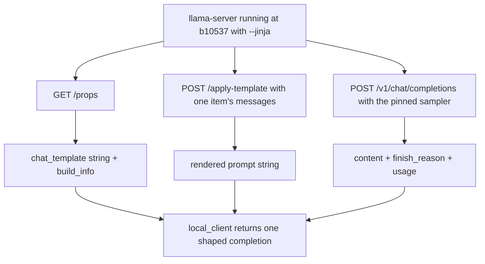
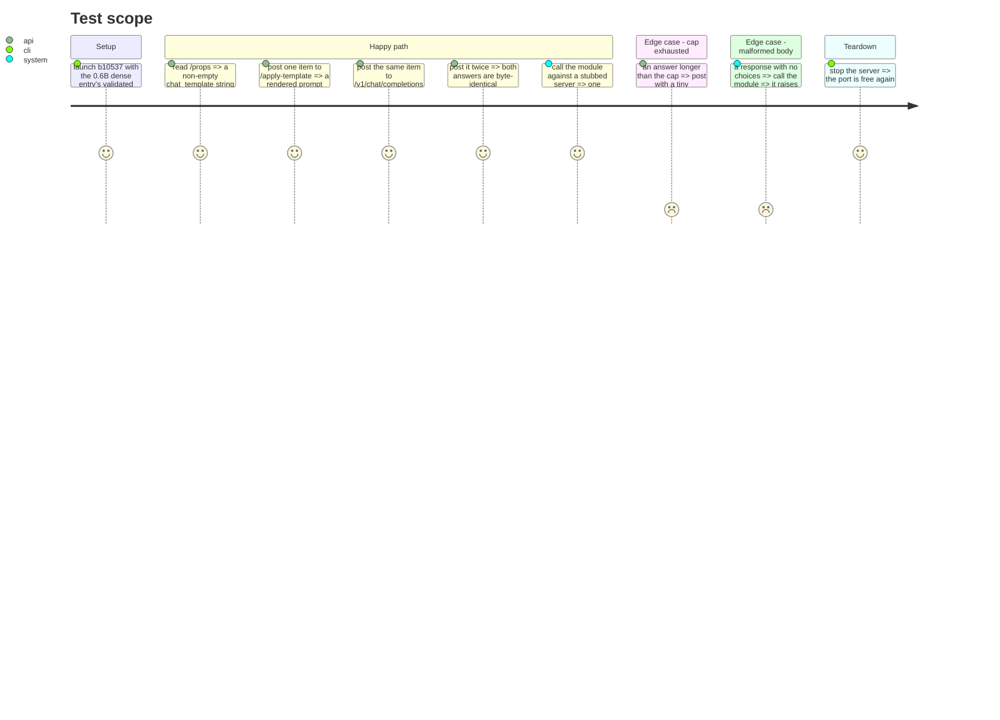

# Instruction: The chat call path, probed live before it is written

## Architecture projection

```txt
.
├── aidd_docs/tasks/2026_09/2026_09_06_local-chat-templated-quality-path/
│   └── evidence.md                       ✅ the live probe transcript this phase rests on
├── src/wave_local_ai_v2/
│   ├── local_client.py                   ✅ chat completion + rendered prompt + server template, one module
│   ├── prompt_provenance.py              ✏️ the local chat endpoint and template-id constants
│   └── row_contract.py                   ✏️ the two `thinking_policy` values a row may carry
└── tests/
    ├── test_local_client.py              ✅ response shaping and failure modes, HTTP stubbed
    └── test_prompt_provenance.py         ✏️ the new endpoint is not raw, so `none` on it is refused
```

## User Journey



## Test Scope



## Tasks to do

### `1)` Probe the live server and write the transcript

> Settle every field name against the running binary before a line of the module is written.

1. Launch `b10537` with `qwen3-0.6b-q8`'s validated flags (smallest entry, fastest launch) through the existing `server.running_server`.
2. `GET /props`. Record `chat_template`, `model_path` and `build_info` verbatim in `evidence.md`.
3. `POST /apply-template` with `{"messages": [{"role": "user", "content": <one classification item's prompt>}]}`. Record the full response and the key the rendered string arrives under.
4. `POST /v1/chat/completions` with the same single-message list, `max_tokens` 32, and every key of `LOCAL_SAMPLING` (`seed`, `temperature`, `top_k`, `top_p`, `presence_penalty`). Record the full response.
5. Repeat step 4 once. Record whether the two contents are byte-identical — this is the `top_k: 0` semantics check the plan's Risks name.
6. Repeat step 4 with `max_tokens` 4 to observe `finish_reason` on a cap-exhausted answer. Record it.
7. Write `evidence.md` with each request and its verbatim response, the build string, and one line per finding. A field name that differs from the plan's Resources row is recorded as a correction there, not silently absorbed.

**Done.** `evidence.md` holds the transcript. It also holds the finding that forced this plan's revision — an empty `content` under the chat template — and the four-variant probe that settled `chat_template_kwargs: {"enable_thinking": false}` as the switch, plus the discovery that `/apply-template` honours it too.

### `1b)` The two probes the decision still needs

> Both are cheap, both change phase 4's shape if they fail, and neither is worth discovering mid-matrix.

1. **The flagship under the switch.** Launch `qwen3.6-35b-a3b-ud-iq4xs` and replay `billing-01` at the 32-token cap twice: once plain, once with `chat_template_kwargs: {"enable_thinking": false}`. Record `content`, `reasoning_content`, `finish_reason`, `usage`, and its `chat_template_caps`. It is a different generation with a different template, and it is the one entry that already answers on the raw path — confirmation that the argument is accepted, not assumed from the 0.6B.
2. **One translation item at 128 tokens.** Replay a single `translation-business-short-form` item on the 0.6B, both ways. Record whether thinking-allowed reaches an answer at four times the classification cap, and whether the `<think>\n\n</think>` prefill lands in `content` under the switch. This decides on evidence whether `disabled` is right for the translation suite too, rather than by symmetry with classification.
3. Append both to `evidence.md` under their own heading. If the flagship rejects the argument or answers worse under it, stop and report — that is a product decision, not a repair.

### `1c)` The two `thinking_policy` values

> The vocabulary a row may publish, declared once.

1. Add `THINKING_POLICY_DISABLED = "disabled"` and `THINKING_POLICY_ALLOWED = "allowed"` to `row_contract.py`, beside the schema version, with a comment stating the field is the **suite's** declared policy and not a per-provider report — the same status `stop_sequences` already carries.
2. `local_client` owns the mapping from policy to request arguments: `disabled` sends `chat_template_kwargs: {"enable_thinking": false}` to both the chat call and `/apply-template`; `allowed` sends neither. No other module knows the argument's spelling.

### `2)` The two new prompt-provenance constants

> Name the endpoint and the template id once, where the existing three already live.

1. Add `LOCAL_CHAT_ENDPOINT = "/v1/chat/completions"` and `LOCAL_APPLY_TEMPLATE_ENDPOINT = "/apply-template"`.
2. Add `TEMPLATE_ID_LLAMACPP_MODEL_CHAT = "llamacpp-model-chat-template"`, with a comment saying the id names the mechanism and the per-row `prompt_template_hash` names which model's template it was.
3. Leave `RAW_ENDPOINTS` holding `/completion` alone, so the new endpoint paired with `none` is refused by `is_consistent`.
4. Do not touch `template_hash` — the chat template's hash is that same function applied to the string `/props` reports.

### `3)` `local_client.py`

> One module, the same shape the two cloud clients already have.

1. `LocalCompletion` TypedDict: `content`, `finish_reason`, `generated_tokens`, `prompt_tokens`, `endpoint`.
2. `chat_template(base_url)` -> the `/props` string, and a `LocalRequestError` when the key is absent or not a string.
3. `render_prompt(base_url, prompt, *, thinking_policy)` -> the `/apply-template` string for a one-message user turn, sending the policy's kwargs so the returned string is the one the chat call will render.
4. `complete_chat(base_url, prompt, *, max_tokens, sampling, thinking_policy)` -> one `LocalCompletion`, raising `LocalRequestError` on a body missing `choices`, a non-string content, or an absent `usage`. An unknown policy value raises rather than silently sending nothing.
5. `TRUNCATING_FINISH_REASONS = frozenset({"length"})`, mirroring `mistral_client` and `google_client`, so the truncation decision is read off the provider's own field rather than inferred from a token count.
6. No retry logic: the local path has no retryable error type today, and inventing one here would put a second retry policy beside `retry.py`.

### `4)` Tests

> Stubbed HTTP only. The live proof is `evidence.md`, and it is not re-run in CI.

1. `test_local_client.py`: a well-formed chat body yields the five fields; `finish_reason` `length` sets the truncation flag and `stop` does not; a missing `choices`, a non-string content and a missing `usage` each raise `LocalRequestError`; `/apply-template` returns the `prompt` key; `/props` with no `chat_template` raises.
2. `test_local_client.py`, the policy: `disabled` puts `chat_template_kwargs: {"enable_thinking": false}` in both the chat body and the `/apply-template` body; `allowed` puts it in neither; an unknown value raises.
3. `test_prompt_provenance.py`: `is_consistent("/v1/chat/completions", TEMPLATE_ID_NONE)` is `False`, and pairing it with the new template id is `True`.
4. Full gate green: `uv run pytest`, `ruff`, `mypy`, coverage at or above the project floor.

## Test acceptance criteria

| Task | Acceptance criteria |
| ---- | ------------------- |
| 1 | `evidence.md` holds a verbatim response for `/props`, `/apply-template` and two `/v1/chat/completions` calls against a named `build_info`, and states whether the two identically-sampled answers matched byte for byte. |
| 1b | `evidence.md` records the flagship answering under the switch with its `chat_template_caps`, and one translation item scored both ways at the 128-token cap, each with the verbatim `content` behind it. |
| 1c | `thinking_policy`'s two values are declared once, and the request argument they map to is spelled in exactly one module. |
| 2 | A row naming the chat endpoint with `prompt_template_id` `none` is refused by the writer gate; naming it with the new id is accepted. |
| 3 | Given a stubbed server, one call returns a completion carrying the answer text, a truncation flag read from `finish_reason`, the generated-token count and the prompt-token count; a body missing `choices` produces the module's named error, not a `KeyError`. A `disabled` policy sends the thinking kwargs on both calls and an `allowed` one sends them on neither. |
| 4 | The suite passes with no change to any existing test's expectations — this phase adds behavior and removes none. |
