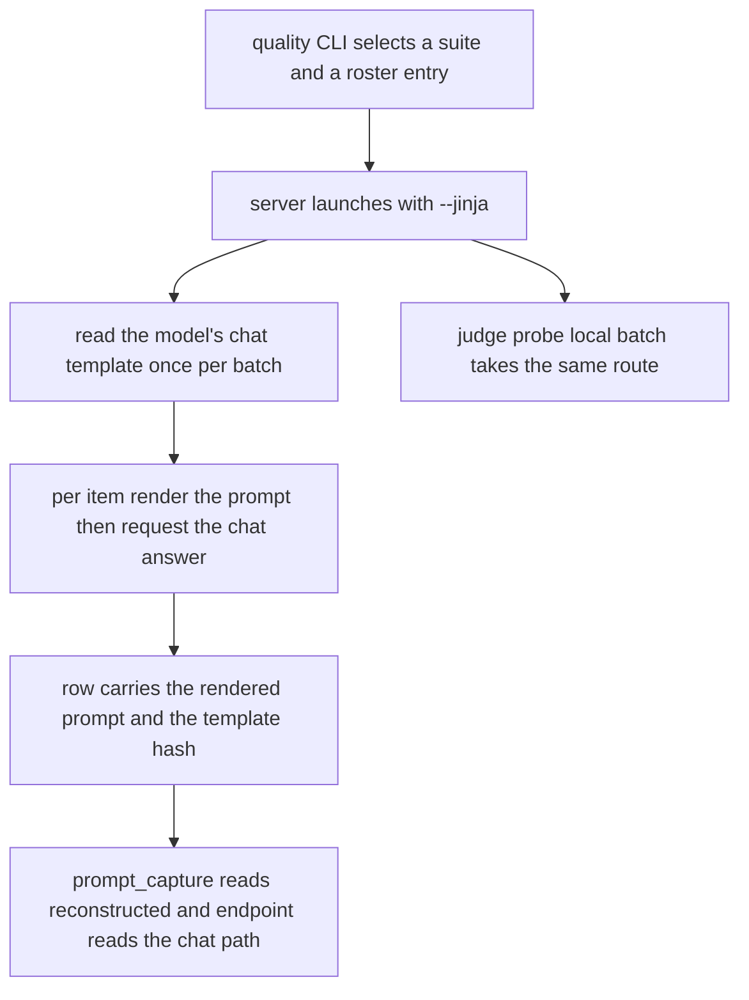
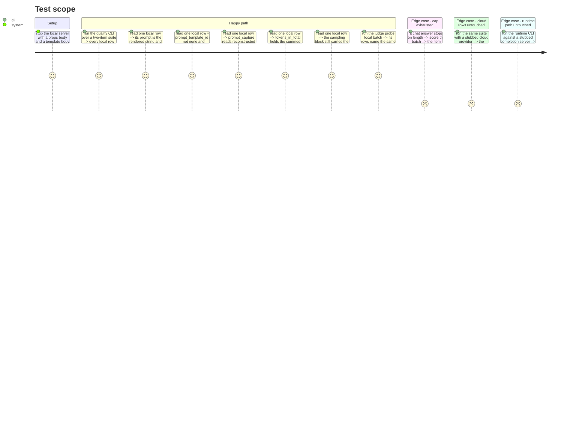

# Instruction: Both local writers move onto it

## Architecture projection

```txt
.
├── src/wave_local_ai_v2/
│   ├── quality_cli.py                    ✏️ `_run_local_suite` and `_local_call_path` call the chat path
│   ├── judge_probe.py                    ✏️ `_generate_local_outputs` and `_local_call_path` do the same
│   ├── quality_rows.py                   ✏️ `local_batch_fields` publishes `tokens_in_total`
│   ├── row_contract.py                   ✏️ `thinking_policy` required on quality rows, schema "10" -> "11"
│   ├── classification_suite.py           ✏️ declares `THINKING_POLICY`
│   └── translation_suite.py              ✏️ declares `THINKING_POLICY`
├── tests/
│   ├── test_quality_cli.py               ✏️ local stub and its row expectations move to the chat endpoint
│   ├── test_judge_probe.py               ✏️ same, for the probe's local batch
│   ├── test_quality_rows.py              ✏️ a local batch with prompt tokens publishes them and the rate
│   ├── test_row_contract.py              ✏️ a quality row without `thinking_policy` is refused
│   └── test_results.py                   ✏️ the complete-row literal gains the new field
└── CHANGELOG.md                          ✏️ what a local row means changed; say so under Changed
```

## User Journey



## Test Scope



## Tasks to do

### `0)` The suites declare a thinking policy and the row carries it

> The field decides whether a score exists, so it lands before the code that reads it.

1. `classification_suite.THINKING_POLICY = row_contract.THINKING_POLICY_DISABLED`, and the same in `translation_suite`, each with a one-line reason naming the cap it protects (32 and 128 tokens) and phase 1's evidence.
2. `SuiteSpec` gains `thinking_policy`, filled from the suite module in both `_SUITES` entries, beside the three caps it sits with.
3. `row_contract`: `thinking_policy` joins the quality row's `REQUIRED_FIELDS`; `SCHEMA_VERSION` moves `"10"` -> `"11"` with a version-history comment in the file's established shape, naming it as quality-rows-only and the runtime row as untouched.
4. `_score_and_write` writes `spec.thinking_policy` on every row of the batch, local and cloud alike, beside `stop_sequences`.
5. `judge_probe` declares `THINKING_POLICY_DISABLED` for its own 256-token probe suite and writes it on its rows, so the required field is satisfied on every quality-row writer rather than only the CLI being changed.

### `1)` `quality_cli._run_local_suite` calls the chat path

> Same loop, same cap, same sampler, different endpoint — plus the rendered string the row now owes.

1. Read the model's chat template once, before the item loop, inside the `running_server` block. One `/props` call per batch, not per item.
2. Per item: `local_client.render_prompt(...)`, then `local_client.complete_chat(...)` with `spec.max_output_tokens`, `spec.thinking_policy` and `LOCAL_SAMPLING` unchanged. Both calls take the same policy, so the stored string is the one the answering call rendered.
3. Return the rendered prompt alongside the completion: extend `_Completion` with a `rendered_prompt` key, or return the pair. The row builder needs the per-item string, so it cannot stay inside this function.
4. Set `truncated` from `finish_reason in local_client.TRUNCATING_FINISH_REASONS`, not from `stopped_limit`. Delete the `stopped_limit` read on this path and say in the changelog that the local chat path no longer carries the misreported label; the raw path's copies keep it, and the open tech-debt row stays open for them.
5. Carry `prompt_tokens` through so the batch fields can total it.
6. Delete `quality_cli.LocalCompletionError` in favour of `local_client.LocalRequestError`, and update `main`'s caught tuple. Two classes with the same name and docstring across two modules is the duplication this increment is allowed to remove.

### `2)` The row's four call-path fields, and its prompt

> The one place the defect's Verification is actually satisfied.

1. `_local_call_path(chat_template)` returns `endpoint` = the chat endpoint, `prompt_template_id` = the new constant, `prompt_template_hash` = `prompt_provenance.template_hash(chat_template)`, `prompt_capture` = `PROMPT_CAPTURE_RECONSTRUCTED`.
2. In `_score_and_write`, `"prompt"` becomes per-provider rather than `item["prompt"]` for everyone: the local batch supplies its rendered string per item, the two cloud batches keep supplying the item text their template wraps. Thread it as one optional per-item override so the cloud paths are not restructured.
3. Leave `prompt_set_hash` alone. It hashes the suite's item prompts, and no item prompt is edited here.

### `3)` `judge_probe` takes the same route

> The third copy of the raw POST becomes a call into the shared client.

1. `_generate_local_outputs` calls `local_client` exactly as task 1 does, at `MAX_OUTPUT_TOKENS` and the probe's own `LOCAL_SAMPLING`.
2. `_local_call_path` mirrors task 2's builder.
3. Delete `judge_probe.LocalCompletionError` for the same reason, and update its `main` catch list.
4. Do not run the probe. It has published no rows, so nothing is superseded and no judge call is paid for here.

### `4)` `quality_rows.local_batch_fields` publishes the input tokens

> The field was null because the count did not exist. It exists now.

1. Take the per-item `prompt_tokens` the same structural way `generated_tokens` is already taken, and total it into `tokens_in_total`.
2. Pass the real total to `cost.cost_per_million_tokens(cost_total, total_tokens)` so the rate stops being `None` — the behavior the current comment already promises.
3. Rewrite the docstring: it currently explains an absence that is no longer true.
4. Leave every other field alone. Local energy stays Scope 2, kWh-derived; nothing about cost basis changes.

### `5)` Tests and the changelog

1. `test_quality_cli.py`: move the local stub from `/completion` to the three chat-path routes; update `test_run_reports_the_endpoint_it_called` (`:824`) and the `tokens_in_total is None` assertion (`:304`); keep `test_every_local_completion_request_pins_the_sampler` (`:648`) asserting the same five keys against the new request body.
2. Add the four Verification assertions as named tests: rendered prompt on the row, non-`none` template id, non-null hash equal to the served template's, `prompt_capture` reads `reconstructed`.
3. Add a test that a cloud row's four call-path fields are unchanged, so the per-provider prompt split cannot silently leak into them.
4. `test_judge_probe.py`: same stub move for the probe's local batch.
5. `CHANGELOG.md` under `### Changed`: the local quality and judged subject paths call the chat endpoint; local rows carry a rendered prompt, a template hash, `reconstructed` capture and an input-token count; the runtime path is unchanged.
6. Full gate green.

## Test acceptance criteria

| Task | Acceptance criteria |
| ---- | ------------------- |
| 0 | Every quality row carries `thinking_policy`, both shipped suites read `disabled`, and a row written without the field is refused by `validate_row`. A runtime row is unaffected and still validates. |
| 1 | A local batch run against a stubbed chat server produces one completion per item, with truncation read from `finish_reason`; a malformed body surfaces the shared client's named error and the CLI exits 1 with one stderr line. The thinking kwargs reach both the chat and the template call. |
| 2 | A local row's `prompt` is the rendered string, its `prompt_template_id` is not `none`, its `prompt_template_hash` equals the hash of the template the stub served, and its `prompt_capture` reads `reconstructed`. The same row passes `row_contract.validate_row`. |
| 3 | The judged probe's local rows carry the same four call-path values as a quality local row, and no `/completion` POST remains in `judge_probe`. |
| 4 | A local batch whose stubbed responses report prompt tokens publishes `tokens_in_total` as their sum and a non-null `cost_per_million_tokens`; a cloud batch's own fields are unchanged. |
| 5 | Every existing cloud-row and runtime-row expectation still passes untouched, and the changelog names what a local row now means. |
