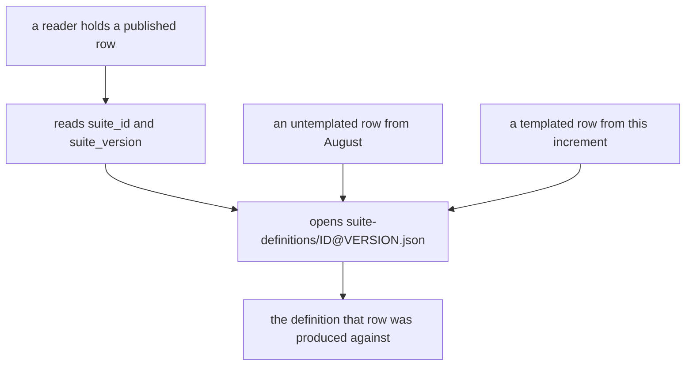
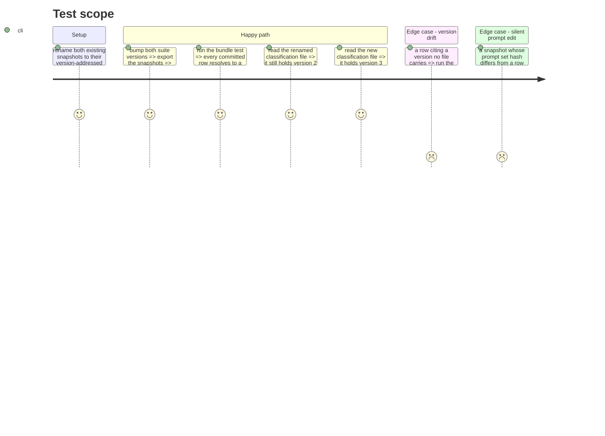

# Instruction: Version-addressed suite snapshots, then the version bump

## Architecture projection

```txt
.
├── aidd_docs/results/suite-definitions/
│   ├── classification-support-routing.json          ❌ renamed, never deleted outright
│   ├── classification-support-routing@2.json        ✅ `git mv` of the file above, the published bundle's target
│   ├── classification-support-routing@3.json        ✅ the templated generation's definition
│   ├── translation-business-short-form.json         ❌ renamed, never deleted outright
│   ├── translation-business-short-form@1.json       ✅ `git mv` of the file above
│   └── translation-business-short-form@2.json       ✅ the templated generation's definition
├── src/wave_local_ai_v2/
│   ├── suite_snapshot.py                            ✏️ writes `<suite_id>@<suite_version>.json`
│   ├── classification_suite.py                      ✏️ `SUITE_VERSION` "2" -> "3", with its reason
│   └── translation_suite.py                         ✏️ `SUITE_VERSION` "1" -> "2", same
└── tests/
    ├── test_reference_bundle.py                     ✏️ resolves a row by suite id AND version
    └── test_suite_snapshot.py                       ✏️ the filename carries the version
```

## User Journey



## Test Scope



## Tasks to do

### `1)` Version-address the snapshot files first

> Nothing may bump until an old row can still find its own definition.

1. `git mv aidd_docs/results/suite-definitions/classification-support-routing.json .../classification-support-routing@2.json`, and the same for `translation-business-short-form.json` -> `@1.json`. A rename, so the bytes stay identical and git records the continuity.
2. `suite_snapshot.main` writes `f"{snapshot['suite_id']}@{snapshot['suite_version']}.json"`. Existing files are never overwritten by a later version — a bump adds a file.
3. Extend the module docstring: a snapshot is addressed by the pair a row cites, which is what lets two generations of one suite sit in the directory at once.
4. Replace the hardcoded relative `SUITE_DEFINITIONS_DIR` with a `settings.DEFAULT_SUITE_DEFINITIONS_DIR` constant, closing the open tech-debt row that names this exact line while the file is already being edited.

### `2)` `test_reference_bundle.py` resolves by the pair

1. `snapshot_path = SUITE_DEFINITIONS_DIR / f"{row['suite_id']}@{row['suite_version']}.json"`.
2. Keep both existing assertions — the file's `suite_id` and `suite_version` equal the row's, and its `prompt_set_hash` equals the row's. The hash check is the one that catches an edited prompt with no bump, and the version is now in the filename rather than only in the body.
3. Read the four bundle paths from `settings.DEFAULT_*` rather than the local `RESULTS_DIR`, closing the second open tech-debt row on this file while it is open.

### `3)` Bump both suite versions

1. `classification_suite.SUITE_VERSION` `"2"` -> `"3"`; `translation_suite.SUITE_VERSION` `"1"` -> `"2"`.
2. Add one version-history line to each, in the shape `classification_suite` already uses for `"2"`: the item set is unchanged and `PROMPT_SET_HASH` does not move; what changed is that the local subject is now sent the item through its own chat template under a declared `thinking_policy`, so a score under this version is not comparable to one under the previous. Name the defect file.
3. `build_snapshot` carries `thinking_policy` beside the three caps, so a bundle reader resolving a row's suite sees the policy that produced its score without importing the suite module.
4. Re-export both snapshots. Confirm four files in the directory and that the two new ones carry the same `prompt_set_hash` as the two renamed ones, and the new `thinking_policy` key only on the new pair.
5. `test_suite_snapshot.py`: assert the filename shape, the policy key, and that a bump produces a second file rather than replacing the first.

### `4)` Prove the supersession is structural, not editorial

1. Add a test over `verdict.select_quality_references` (or the CLI, whichever the file already covers): a candidate batch at `suite_version` `"3"` against reference rows at `"2"` selects nothing and yields `not_comparable`, with the reason naming the version.
2. Confirm no published byte moved: `git diff --stat` over `aidd_docs/results/*.jsonl` is empty, and the two renames show as renames.
3. Full gate green, including `test_reference_bundle.py` over the committed bundle.

## Test acceptance criteria

| Task | Acceptance criteria |
| ---- | ------------------- |
| 1 | The suite-definitions directory holds a file per (suite id, suite version) pair, and re-exporting after a bump adds a file rather than overwriting one. |
| 2 | Every row of the committed reference bundle resolves to a definition file carrying that row's own suite version and prompt-set hash; a row citing an unpublished version fails the test by name. |
| 3 | Both suite modules declare their new version with a stated reason, and both new snapshots carry the same prompt-set hash as their predecessors — proof that no prompt was edited. |
| 4 | A batch at the new suite version receives `not_comparable` against the old reference rows, and no published `.jsonl` byte changed anywhere in the increment. |
