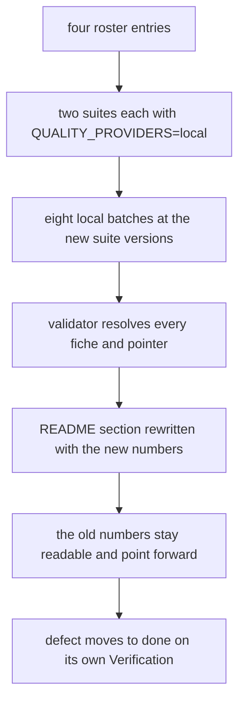
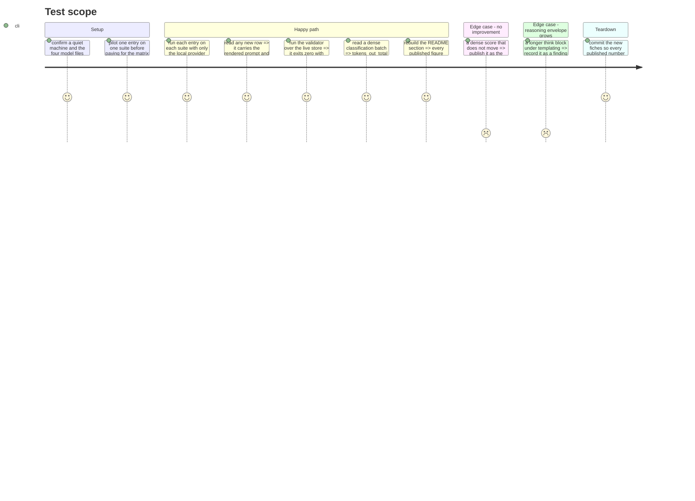

# Instruction: The live re-run and the corrected record

## Architecture projection

```txt
.
├── aidd_docs/results/
│   ├── quality.jsonl                     ✏️ untracked live store; eight new local batches appended
│   ├── fiches/                           ✏️ the run fiches these rows cite, committed
│   └── README.md                         ✏️ the dense side-by-side is superseded and says by what
├── aidd_docs/backlog/defects/
│   └── local-subject-prompts-are-never-chat-templated.md   ✏️ status ready -> done, Verification filled
├── aidd_docs/backlog/tech-debt.md        ✏️ the two rows this increment resolved are closed
└── aidd_docs/tasks/2026_09/2026_09_06_local-chat-templated-quality-path/
    └── evidence.md                       ✏️ the run log appended to phase 1's probe transcript
```

## User Journey



## Test Scope



## Tasks to do

### `1)` Pilot before the matrix

> One batch decides whether the eight are worth paying for.

1. Run `qwen3-0.6b-q8` on `classification` with `QUALITY_PROVIDERS=local`.
2. Read one row and check the four Verification facts, then read the batch's `tokens_out_total` against items times cap.
3. If the model still runs the cap dry on every item, stop and report before running the other seven: the finding would then be that templating is not the whole cause, which is a different statement from the one the defect makes and belongs in the record before more machine time is spent.

### `2)` The eight batches

1. Four entries — `qwen3-0.6b-q8`, `qwen3-1.7b-q8`, `qwen3-4b-q4km`, `qwen3.6-35b-a3b-ud-iq4xs` — each on `classification` and `translation`, `QUALITY_PROVIDERS=local`, one invocation per pair.
2. Record `run_id`, `fiche_hash`, wall clock and the headline score per batch, as the dense increment's own log did.
3. Do not re-run a batch to improve a number. A run reported `unreliable` or thermally suppressed is reported that way.
4. Commit the fiches the new rows cite. The rows themselves stay in the untracked live store, exactly as the two previous live-run increments left theirs, and for the same reason: the committed bundle is frozen a schema behind and regenerating it is separate, already-filed work.
5. `uv run wave-local-ai-v2-validate` over both live stores. Record `checked N row(s)` and the exit code.

### `3)` The record, corrected rather than overwritten

1. In `aidd_docs/results/README.md`, keep the existing "Dense versus MoE, side by side (2026-09-06)" section and its tables in place. Add a leading note naming the defect, stating that those numbers measure instruction-following on a raw endpoint, and pointing at the new section by name. Nothing in the old tables is edited: those rows exist on disk and still say what they said.
2. Add a new dated section for the templated runs: the same two score tables, the same runtime-provenance discipline, the `run_id`s and the fiche hashes, and the suite versions.
3. State plainly what moved and what did not, per model and per suite. If a gap closed, say by how much; if it did not, say so with a quoted completion the way the untemplated section already does.
4. State the comparator's version mismatch: the cited `gemini-3.5-flash-lite` rows sit at the previous suite versions, the items and caps are identical, `prompt_set_hash` is unchanged, and that is why the scores are still comparable across the column.
5. Rewrite the "What the dense rows are actually measuring" subsection into a before/after: what it diagnosed, and what the templated re-run showed.
6. Report the reasoning envelope's behavior under templating for every entry — longer, shorter or absent — as a finding, with its chrF cost stated. Do not change a scoring rule here.
7. State the thinking policy plainly: every new row reads `thinking_policy: disabled`, what that measures, and what it does not. Name the thinking-allowed run as a different, unpublished measurement, deferred on run cost and recorded as such on the defect — so a reader takes a routing score as a routing score and not as the model's ceiling.

### `4)` Close what this increment actually closed

1. `aidd_docs/backlog/defects/local-subject-prompts-are-never-chat-templated.md`: fill `## Verification` with the row evidence that satisfies its four facts, and move `status` to `done`.
2. `aidd_docs/backlog/tech-debt.md`: close the 2026-09-06 `tiny-dense-models-alongside-moe` row on the untemplated local path and the `judged-probe-both-paths-three-languages` row on the third `/completion` copy. Both are resolved by this increment.
3. Leave the `stopped_limit` truncation row open, narrowed to the paths that still read it. Leave the `translation-suite-live-run` reasoning-envelope row open, updated with what templating did to it.
4. Do not touch any other tech-debt row.

## Test acceptance criteria

| Task | Acceptance criteria |
| ---- | ------------------- |
| 1 | The pilot batch's rows satisfy the defect's four Verification facts, and the decision to continue or stop is recorded with the `tokens_out_total` figure behind it. |
| 2 | Eight batches exist on disk across four `roster_entry_id`s and two suites at the new suite versions; the validator exits `0` over both live stores with every `fiche_hash` resolving; every cited fiche is committed. |
| 3 | Every figure published in the README's new section is traceable to a row in the live store, the superseded section is intact and points forward, and the comparator's version mismatch is stated rather than left to be discovered. |
| 4 | The defect reads `done` with row evidence under Verification, and exactly the two resolved tech-debt rows are closed. |
