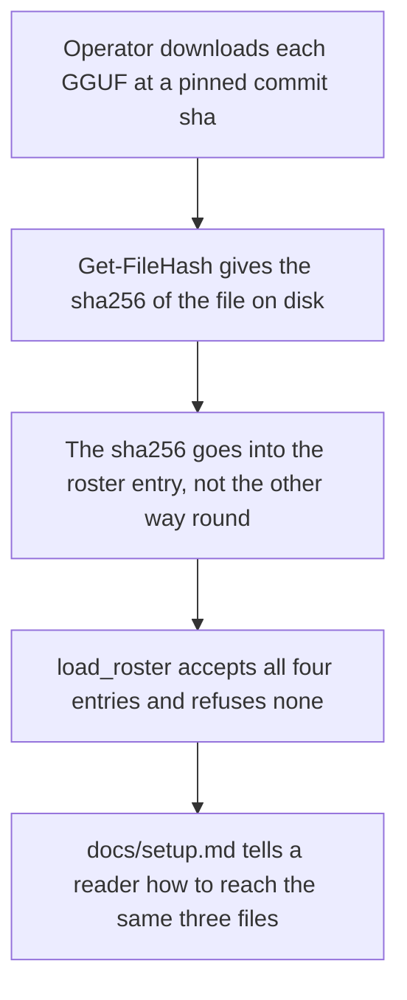
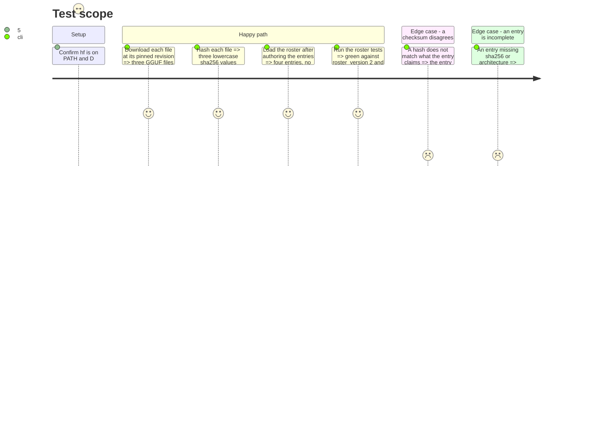

# Instruction: The three dense entries and their weights on this machine

## Architecture projection

```txt
.
├── aidd_docs/
│   └── roster/
│       └── models.json                ✏️ roster_version 1 → 2, three dense entries beside the MoE one
├── docs/
│   └── setup.md                       ✏️ a download section per dense model, revision + checksum
├── tests/
│   └── test_roster.py                 ✏️ the shipped-roster assertions follow the bump and the new entries
└── D:\ia\models\                      ✅ three new per-model directories, untracked, on this machine only
    ├── Qwen3-0.6B/Qwen3-0.6B-Q8_0.gguf
    ├── Qwen3-1.7B/Qwen3-1.7B-Q8_0.gguf
    └── Qwen3-4B/Qwen3-4B-Q4_K_M.gguf
```

## User Journey



## Test Scope



## Tasks to do

### `1)` Download the three files at their pinned revisions

> The weights arrive from the vendor repo at a named commit, not from `main` as of whenever.

1. Confirm the tooling: `hf` resolves (`C:\Users\Anael\.local\bin\hf.exe`, v1.28) and `D:` has room. Total is 4.63 GiB; nothing here is a large download.
2. Download each file into its own per-model directory under `SLM_MODELS_DIR` (`D:\ia\models`), matching the layout the MoE entry already uses:

   ```powershell
   hf download Qwen/Qwen3-0.6B-GGUF Qwen3-0.6B-Q8_0.gguf `
     --revision 23749fefcc72300e3a2ad315e1317431b06b590a `
     --local-dir D:\ia\models\Qwen3-0.6B

   hf download Qwen/Qwen3-1.7B-GGUF Qwen3-1.7B-Q8_0.gguf `
     --revision 90862c4b9d2787eaed51d12237eafdfe7c5f6077 `
     --local-dir D:\ia\models\Qwen3-1.7B

   hf download Qwen/Qwen3-4B-GGUF Qwen3-4B-Q4_K_M.gguf `
     --revision bc640142c66e1fdd12af0bd68f40445458f3869b `
     --local-dir D:\ia\models\Qwen3-4B
   ```

3. Check each file's size against the plan's table (639,446,688 / 1,834,426,016 / 2,497,280,256 bytes). A size mismatch means the download is not the pinned artifact; stop rather than hash a truncated file.

### `2)` Hash each file and record the value

> The checksum is read off the file that will actually be loaded.

1. For each file:

   ```powershell
   (Get-FileHash -Algorithm SHA256 "D:\ia\models\Qwen3-0.6B\Qwen3-0.6B-Q8_0.gguf").Hash.ToLower()
   ```

   `.ToLower()` is load-bearing: `roster._SHA256_PATTERN` requires 64 **lowercase** hex characters and `Get-FileHash` returns uppercase.
2. Keep the three values together with the file each came from. They are the only source for the `sha256` fields in task 3 — the entry is written from the file, never the file re-fetched until it matches a hand-typed entry.

### `3)` Author the three dense entries

> Methodology 13's fields, filled per model, with no MoE-offload flag anywhere in them.

1. Bump `roster_version` to `2` in `aidd_docs/roster/models.json`. Leave the MoE entry byte-identical.
2. Add three entries keyed `qwen3-0.6b-q8`, `qwen3-1.7b-q8`, `qwen3-4b-q4km`, each carrying:
   - `repo` / `revision` (the commit sha) / `file` (`<Model>/<file>.gguf`, the path under `SLM_MODELS_DIR`) / `display_id` (`Qwen3-0.6B`, `Qwen3-1.7B`, `Qwen3-4B`) / `quant` (`Q8_0`, `Q8_0`, `Q4_K_M`) / `sha256` from task 2.
   - `family: "qwen"` — already a member of `roster.KNOWN_FAMILIES`, so the judged path resolves it from the entry rather than from `MODEL_FAMILIES`.
   - `architecture`: `{"kind": "dense", "expert_count": 0, "active_params_b": 0.6 | 1.7 | 4.0}`. A dense model's active parameters are all of them; `expert_count` 0 is what makes `validate_host_fit`'s dense branch meaningful.
   - `server_flags`: `n_gpu_layers` 99 **provisionally** (phase 2's probe sets the final value), `context_size` 32768 (the value both suites publish as their context cap), `flash_attention` `"on"`, `jinja` true, `parallel_slots` 1, `load_mode` `"auto"`.
   - `server_flags.sampler`: `temperature` 0.6, `top_p` 0.95, `top_k` 20, `min_p` 0, `presence_penalty` 1.5 — the Qwen3 card's thinking-mode recommendation, including the 1.5 it names for quantized weights.
   - `validated_host`: `{"n_cpu_moe": null, "threads": 8, "fiche_summary": "Consumer NVIDIA laptop GPU, ~6 GB VRAM, Windows"}`. `null` is the whole point: this entry has no MoE offload to fit.
3. Do **not** add `--load-mode none` or any `n_cpu_moe` value to a dense entry. `none` exists on the MoE entry because `--n-cpu-moe` would otherwise mmap experts from disk; `auto` is llama.cpp's own default and is what a fully-resident dense model wants.

### `4)` Prove the roster still loads and the tests follow

1. Load all four entries and print their ids and architecture kinds:
   `uv run python -c "from pathlib import Path; from wave_local_ai_v2 import roster; r=roster.load_roster(Path('aidd_docs/roster/models.json')); print(r.roster_version, {k: v.architecture.kind for k, v in r.entries.items()})"`
2. Update `tests/test_roster.py` where it asserts the shipped roster (`roster_version == 1` at `:379`, and any assertion that enumerates the shipped entry set). The bump is the change under test, not an incident.
3. Confirm each entry's `sha256` equals the on-disk hash by re-reading both — a mismatch here is a typo, and it is cheaper to catch now than as a `RosterError` mid-run.
4. Run `uv run pytest tests/test_roster.py` and the fast gate.

### `5)` Write the download walkthrough

1. Extend `docs/setup.md` section 3 with a short block per dense model: repo, pinned revision, file in the repo, path under `SLM_MODELS_DIR`, sha256, the `hf download` line and the `Get-FileHash` line. Keep the existing MoE block first and unchanged.
2. Say plainly what the three cost: 4.63 GiB total, the largest single file 2.33 GiB — against the MoE's 17.7 GiB. A reader deciding what to download should be able to see that the dense ladder is cheap.
3. State that the roster file is the source of truth and this section exists so a human need not parse JSON — the same sentence the MoE block already carries.

## Test acceptance criteria

| Task | Acceptance criteria |
| ---- | ------------------- |
| 1 | Three GGUF files exist under `SLM_MODELS_DIR` in per-model directories, each byte size equal to the plan's table. |
| 2 | Three lowercase 64-hex checksums are recorded, each traceable to the file it was computed from. |
| 3 | `aidd_docs/roster/models.json` holds four entries at `roster_version` 2; each dense entry declares `kind: "dense"`, `n_cpu_moe: null`, `load_mode: "auto"` and carries no MoE-offload flag; the MoE entry is unchanged. |
| 4 | `load_roster` returns four entries with no `RosterError`; every `sha256` matches the file on disk; `pytest tests/test_roster.py` and the fast gate are green. |
| 5 | `docs/setup.md` lets a reader reach the same three files from the repo, revision, file name and checksum alone, and states the total disk cost. |
