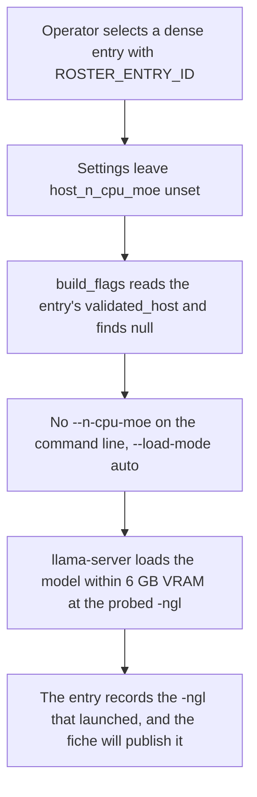
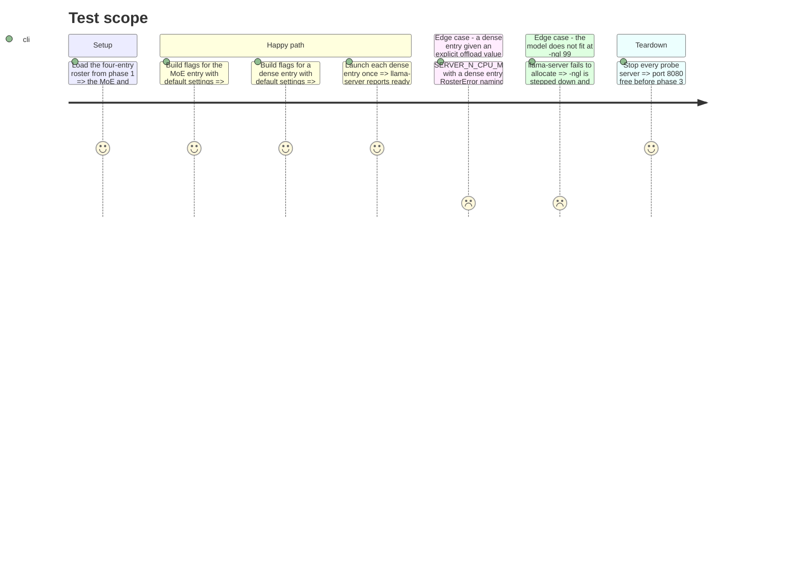

# Instruction: The dense launch seam and each entry's real `-ngl`

## Architecture projection

```txt
.
├── src/wave_local_ai_v2/
│   ├── settings.py                    ✏️ host_n_cpu_moe becomes int | None; unset means "read the entry"
│   └── server.py                      ✏️ build_flags resolves that None and omits --n-cpu-moe for a dense entry
├── tests/
│   ├── test_settings.py               ✏️ unset resolves to None; a set value still validates
│   └── test_server.py                 ✏️ the baseline stays byte-identical; a dense entry launches without the flag
├── aidd_docs/
│   └── roster/
│       └── models.json                ✏️ each dense entry's n_gpu_layers set to what actually launched
└── docs/
    └── setup.md                       ✏️ SERVER_N_CPU_MOE's new meaning, and the per-entry run loop
```

## User Journey



## Test Scope



## Tasks to do

### `1)` `host_n_cpu_moe` gains an "unset" state

> Unset must mean "the entry decides", not "0".

1. In `settings.py`, make `Settings.host_n_cpu_moe` an `int | None` defaulting to `None`, and have `load_settings` return `None` when `SERVER_N_CPU_MOE` is absent. When it is set, `_require_numeric`'s validation is unchanged (integer, `>= 0`, named reason).
2. Keep `DEFAULT_HOST_N_CPU_MOE` as the documented value of the shipped MoE entry's `validated_host.n_cpu_moe`, and say in its comment that the constant is now documentation of the entry rather than the resolution path — one definition, one meaning.
3. Do not touch `host_threads`. It is a genuine host value with no per-entry counterpart.

### `2)` `build_flags` resolves and omits

> The dense rule stays a refusal, not a silent drop.

1. In `server.build_flags`, take `host_n_cpu_moe: int | None`. Resolve `None` to `entry.validated_host["n_cpu_moe"]` (37 on the MoE entry, `null` on a dense one) **before** calling `roster.validate_host_fit`, so the check runs on the value that will be used.
2. Emit `--n-cpu-moe <value>` only when the resolved value is not `None`; every other flag keeps its current position so the MoE command stays byte-identical.
3. Leave `validate_host_fit` untouched. A dense entry handed an explicit offload value still raises, which is Methodology 13's rule and the reason this is a resolution change rather than a `if kind == "dense": skip` in the flag builder.
4. The three call sites (`__init__.py`, `quality_cli.py`, `judge_probe.py`) pass `settings.host_n_cpu_moe` and need no change; update the two comments there that claim the check "lives inside `build_flags`" only if they became inaccurate.

### `3)` The tests that pin both halves

1. `test_build_flags_matches_baseline` must still pass unchanged — that is the proof the MoE launch did not move.
2. Add: a dense roster entry plus default settings produces a flag list with no `--n-cpu-moe`, `--load-mode auto`, and everything else in the same order.
3. Add: a dense entry with `host_n_cpu_moe=0` still raises `RosterError` naming the entry, and no process is spawned.
4. Add, in `test_settings.py`: `SERVER_N_CPU_MOE` unset resolves to `None`; set to a valid integer resolves to that integer; set to a negative value still raises `SettingsError` with its reason.

### `4)` Probe each dense entry's `-ngl` on this host

> The recorded flag set is the one that launched, not the one that was hoped for.

1. For each dense entry, with `ROSTER_ENTRY_ID` set, launch `llama-server` once through the harness path and watch it reach ready. Start at the provisional `-ngl 99`.
2. On a load failure (`failed to fit params to free device memory`, or an allocation error in the stderr tail), step `-ngl` down and retry. The 4B is the one expected to need it: estimated f16 KV at 32,768 context is ~4.5 GiB on top of 2.33 GiB of weights against 5996 MiB free.
3. Record, per entry: the `-ngl` that launched, `nvidia-smi` used VRAM once loaded, and the load time. Write the final `n_gpu_layers` into the roster entry.
4. Do **not** lower `context_size` to make a model fit. Both suites publish a 32,768 context cap on every row; an entry launched at less would make that cap false.
5. Stop every probe server. `start_server` refuses to measure if port 8080 is already held, and phase 3 must not inherit a stale process.

### `5)` Document how to run one entry after another

1. In `docs/setup.md`, state `SERVER_N_CPU_MOE`'s new meaning: unset means the selected entry's own `validated_host` value is used (37 for the MoE, none at all for a dense entry); set means the operator overrides it and a dense entry will refuse.
2. Add the per-entry loop as the multi-model recipe — no script, no orchestrator:

   ```powershell
   foreach ($id in 'qwen3-0.6b-q8','qwen3-1.7b-q8','qwen3-4b-q4km') {
     $env:ROSTER_ENTRY_ID = $id
     uv run wave-local-ai-v2
     uv run wave-local-ai-v2-quality --suite classification
     uv run wave-local-ai-v2-quality --suite translation
   }
   ```

   Note why it works with no code: `load_dotenv(override=False)` leaves a shell-set variable in place, and `.env` does not set `ROSTER_ENTRY_ID` at all.
3. Say that each invocation is its own `run_id`, so rows stay selectable per model and per suite.

## Test acceptance criteria

| Task | Acceptance criteria |
| ---- | ------------------- |
| 1 | With `SERVER_N_CPU_MOE` unset, `load_settings().host_n_cpu_moe` is `None`; with it set, the value and its validation are unchanged. |
| 2 | The MoE entry at default settings still builds the byte-identical baseline command; a dense entry at default settings builds the same list with `--n-cpu-moe` absent and `--load-mode auto` present. |
| 3 | `pytest` is green, including a test that a dense entry given an explicit offload value refuses with `RosterError` and spawns nothing. |
| 4 | Each dense entry has an `n_gpu_layers` value that a live `llama-server` launch on this host actually reached ready with, and the observed VRAM figure is recorded for the phase-4 record. |
| 5 | `docs/setup.md` explains the unset/set semantics of `SERVER_N_CPU_MOE` and carries a copy-pasteable loop that runs all three entries through both suites and the runtime harness. |
