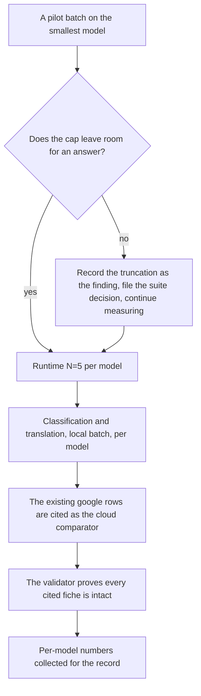
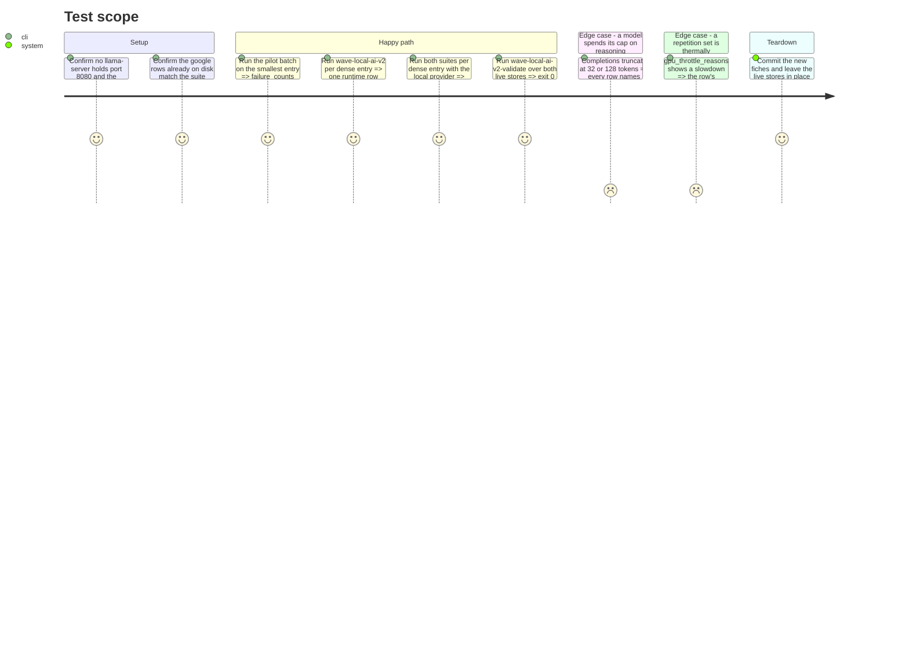

# Instruction: The live runs, model by model

## Architecture projection

```txt
.
└── aidd_docs/
    └── results/
        ├── fiches/<hash>.json          ✅ one per distinct dense flag set, tracked, write-once
        ├── runtime.jsonl               ✏️ untracked live store, one row per dense model
        └── quality.jsonl               ✏️ untracked live store, one row per item per model per suite
```

Nothing under `src/` changes in this phase. If something has to, it is a finding for the record or a tech-debt entry, not an unplanned fix between two measured runs.

## User Journey



## Test Scope



## Tasks to do

### `1)` The pilot, before anything is paid for

> The cheapest possible check that the caps leave room for an answer.

1. With `ROSTER_ENTRY_ID=qwen3-0.6b-q8` and `QUALITY_PROVIDERS=local`, run `wave-local-ai-v2-quality --suite classification` once.
2. Read three things off the printed line and the written rows: the `accuracy`, the `failure_counts` block, and one row's raw `subject_output`.
3. Decide from that, and say which case holds in the record:
   - answers land inside the cap → continue to task 2 unchanged;
   - completions are `truncated_max_tokens` because the model reasons first → that is the finding. Continue the full matrix anyway (a measured 0 with a named reason is evidence; three absent models are not), and open a tech-debt entry proposing the suite-level decision — a reasoning-envelope rule in scoring, or a per-entry server flag — as a decision to be taken, not a patch to slip in here.
4. Do not edit a prompt, a cap or a suite in response to this. `PROMPT_SET_HASH` moving would invalidate every published row that cites the suite.

### `2)` One runtime row per dense model

1. For each entry in turn (`qwen3-0.6b-q8`, `qwen3-1.7b-q8`, `qwen3-4b-q4km`), run `uv run wave-local-ai-v2` at default protocol settings: 1 warm-up, 5 counted repetitions, 10 s cooldown, pinned seed, `cache_prompt: false`.
2. Between models, let the GPU settle. A row whose repetitions report `sw_thermal_slowdown` is reported with its flag, never quietly re-run until it looks better.
3. Record per model: `run_id`, `gen_tok_per_s`, `prompt_tok_per_s`, `ttft_ms`, the three `*_spread` values, `unreliable`, peak RSS and VRAM, energy and the derived cost, and the `verdict` (expected `not_comparable` — no reference row matches a new quant and flag set).

### `3)` Both suites per dense model, local provider

1. For each entry, with `QUALITY_PROVIDERS=local`:
   `uv run wave-local-ai-v2-quality --suite classification` then `--suite translation`.
2. Six batches in total, each its own `run_id`. Confirm each row carries the model's `display_id`, its `roster_entry_id`, `roster_version` 2 and the suite's own id/version/prompt-set hash.
3. Record per model and suite: the headline (`accuracy=` or `suite_score=`), the per-language breakdown with its `indicative` marks, `failure_counts`, output tokens, energy and cost.
4. If a batch fails mid-suite, use `--resume <run_id>` rather than re-running from item 1 — the same discipline the cloud batches follow, for the same reason.

### `4)` The cloud comparator, cited rather than re-run

1. Confirm the `google` rows already in `quality.jsonl` are on the suites in play: classification at `suite_version` `"2"` (40 rows) and translation at `"1"` (42 rows), model `gemini-3.5-flash-lite`.
2. Record their `run_id`s and per-suite scores for the phase-4 tables. They are the cloud comparator; re-running them would re-pay paced quota to reproduce rows already on disk.
3. Re-run a google batch only if a suite version moved since those rows were written — and if so, say in the record which rows were regenerated and why.

### `5)` Prove the evidence is intact

1. `uv run wave-local-ai-v2-validate` over both live stores: exit `0`, a checked row count, every cited `fiche_hash` resolving.
2. Commit the new fiche files under `aidd_docs/results/fiches/`. They are the only tracked artifact this phase produces, and they are what makes the phase-4 numbers checkable even though the rows themselves stay in untracked live stores.
3. Note the wall clock the whole session cost, per model, so the record can state what reproducing it takes.

## Test acceptance criteria

| Task | Acceptance criteria |
| ---- | ------------------- |
| 1 | The pilot's outcome is written down with its `failure_counts` and one verbatim completion, and the decision it drove is stated; no prompt, cap or suite was edited in response. |
| 2 | Three runtime rows exist, one per dense entry, each with its five counted repetitions, spread values, `unreliable` flag, machine state, energy and cost. |
| 3 | Six local batches exist — three models × two suites — each with its own `run_id`, headline score, per-language breakdown and failure counts recorded. |
| 4 | The google comparator rows are identified by `run_id` and suite version, and either cited unchanged or regenerated with the reason stated. |
| 5 | `wave-local-ai-v2-validate` exits `0` over both live stores, and every fiche the new rows cite is committed. |
