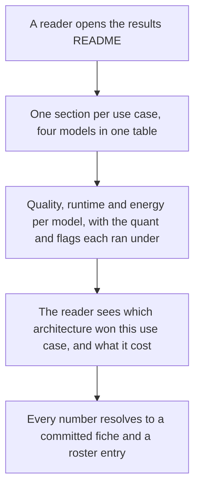
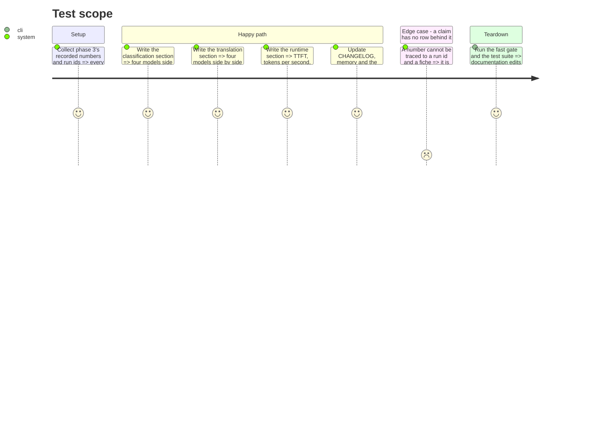

# Instruction: The side-by-side record

## Architecture projection

```txt
.
├── CHANGELOG.md                       ✏️ the Unreleased entry for this increment
├── README.md                          ✏️ the roster is four models, and what the dense ladder costs to download
├── docs/setup.md                      ✏️ already extended in phases 1-2; a pointer to the side-by-side section
├── aidd_docs/
│   ├── results/README.md              ✏️ a dated section per use case: MoE vs the three dense, quality and runtime
│   ├── memory/
│   │   ├── cli.md                     ✏️ the four entry ids and SERVER_N_CPU_MOE's unset semantics
│   │   └── architecture.md            ✏️ Gotchas: a dense entry carries no MoE-offload flag and how that is enforced
│   └── backlog/
│       ├── stories/tiny-dense-models-compared-alongside-moe.md  ✏️ status and the divergence record
│       └── tech-debt.md               ✏️ any 🟢 finding the live runs surfaced
```

## User Journey



## Test Scope



## Tasks to do

### `1)` The side-by-side sections in `aidd_docs/results/README.md`

> One dated section, one sub-section per use case, four models in each table.

1. Open with what the section is and is not: rows produced on 2026-09-06 in the untracked live stores at the current `schema_version`, **not** part of the committed reference bundle, which stays frozen one schema behind for the reason its own section already gives. Name the fiches (committed) and the roster entries the numbers resolve through.
2. Name the roster generation and the model set: `roster_version` 2, the MoE flagship plus three dense entries, each with its quant, its `-ngl` and whether it carried an MoE-offload flag. The dense/MoE distinction is the point of the section, so it belongs in the table, not in a footnote.
3. **Classification.** One table: model, provider, `run_id`, accuracy, failure counts, and the per-language breakdown with its `indicative` marks. Include the MoE flagship's existing rows and the `gemini-3.5-flash-lite` comparator, identified by their own run ids.
4. **Translation.** Same shape on `suite_score`, plus `score_breakdown` by source language, and repeat the single-reference caveat in one sentence — a chrF against one reference compares models on identical references and is not an absolute quality measure.
5. **Runtime.** One table: model, quant, `-ngl`, `--n-cpu-moe` (absent for the dense entries), `gen_tok_per_s`, `prompt_tok_per_s`, `ttft_ms`, the spread values and `unreliable`, peak RSS and VRAM, energy and derived cost. Say that every dense verdict is `not_comparable` and why (no reference row matches a new quant and flag set) — a first run's honest state, not a gap.
6. State the two caveats the comparison genuinely carries: the dense ladder is Qwen3 (May 2025) while the flagship is Qwen3.6, so the architecture comparison spans a generation; and the quants are not uniform (`Q8_0` at 0.6B/1.7B, `Q4_K_M` at 4B, `UD-IQ4_XS` on the MoE) because that is what each vendor repo publishes.
7. Report whatever the live runs actually showed, including a model that scored 0 on a suite and the reason its rows name. A weak result reported with its cause is the deliverable; a weak result omitted is not.

### `2)` `CHANGELOG.md`

1. Under `## [Unreleased] / ### Added`, in the established voice: three dense Qwen3 entries at `roster_version` 2, each pinned by commit sha with its checksum; the dense architecture block and what it makes checkable; the launch seam that lets a dense entry run without an MoE-offload flag while keeping the refusal intact for one that is given one; the per-entry run loop; and the published side-by-side per use case.
2. Under `### Changed`, `SERVER_N_CPU_MOE`'s unset semantics — it now means "read the selected entry's `validated_host`", and the MoE launch is byte-identical as before.
3. State the divergences from the story (`plan.md`'s table), including why the reference bundle was not touched.

### `3)` Memory and the project's own docs

1. `aidd_docs/memory/cli.md`: the roster now holds four entries; name the ids and what each is; `SERVER_N_CPU_MOE` unset means the entry decides, and a dense entry given a value refuses.
2. `aidd_docs/memory/architecture.md`, Gotchas: extend the roster bullet — a dense entry carries no `--n-cpu-moe` and no `--load-mode none`, the architecture block is what makes that checkable, and the check is a refusal in `validate_host_fit` rather than a convention.
3. `README.md`: the roster is four models; the dense ladder costs 4.63 GiB against the flagship's 17.7 GiB, so a reader with less disk or less VRAM has a path in. Point at the results README's side-by-side section.
4. `docs/setup.md`: one line pointing at the side-by-side section as the reason the loop from phase 2 exists.

### `4)` The backlog

1. Set the story's `status` and append the divergence record from `plan.md`, so the backlog carries why the built thing differs from the written one.
2. Append any 🟢 finding the live runs surfaced to `aidd_docs/backlog/tech-debt.md` — the reasoning-envelope decision if the pilot hit it, and the MoE entry's `revision: "main"` inconsistency now that three entries pin a sha.
3. Run the fast gate and `pytest`. Documentation-only edits still go through the gate.

## Test acceptance criteria

| Task | Acceptance criteria |
| ---- | ------------------- |
| 1 | `aidd_docs/results/README.md` carries a dated section with one table per use case and one runtime table, each naming four models, their run ids, quants and flag sets; every number traces to a row and a committed fiche; the generation gap, the quant asymmetry and the untouched reference bundle are each stated. |
| 2 | The CHANGELOG entry names the three entries, the roster version bump, the launch seam, the settings change and every divergence from the story. |
| 3 | `cli.md`, `architecture.md`, `README.md` and `docs/setup.md` describe the shipped behaviour, with no remaining claim that the roster ships exactly one entry or that `SERVER_N_CPU_MOE` defaults to 37. |
| 4 | The story's status and divergence record are updated, the live findings are filed as tech debt rather than patched, and the fast gate and test suite are green. |
