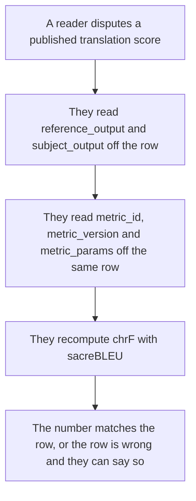
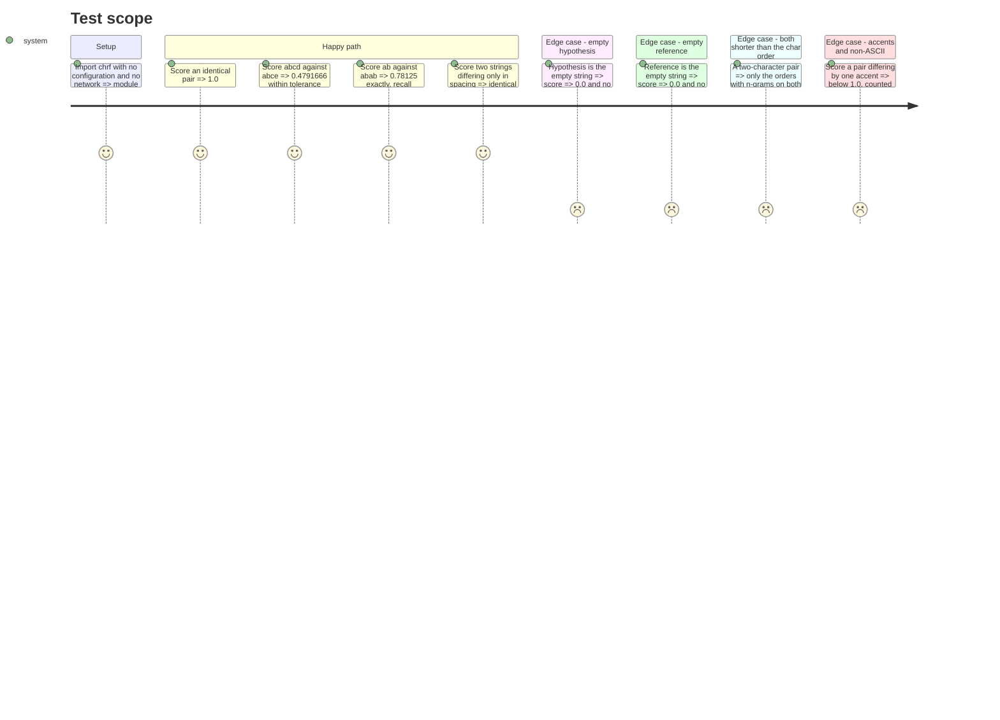

# Instruction: The chrF metric, alone and provable

## Architecture projection

```txt
.
├── src/wave_local_ai_v2/
│   └── chrf.py                    ✅ the character n-gram F-score, pure, no I/O
└── tests/
    └── test_chrf.py               ✅ hand-computed vectors and the degenerate cases
```

## User Journey



## Test Scope



## Tasks to do

### `1)` Write `chrf.py`

> The sacreBLEU default, reproduced in sixty lines, and nothing else.

1. Module docstring: what chrF is, that this reproduces sacreBLEU's default parameterisation, the two source URLs from `plan.md`'s Resources, why the metric is in-repo instead of a dependency, and that a single-reference chrF penalises a valid alternative translation — so the number is a comparison between models on identical references, not an absolute quality figure.
2. Declare the defaults as module constants: `CHAR_ORDER = 6`, `BETA = 2`, `INCLUDE_WHITESPACE = False`. Name them; do not bury them in a signature default alone.
3. `_char_ngrams(text: str, order: int) -> list[Counter[str]]`: collapse whitespace with `"".join(text.split())` when `INCLUDE_WHITESPACE` is false, then cut n-grams for `n` in `1..order`. No lowercasing — sacreBLEU does not lowercase by default, and case is information in a translation.
4. `chrf(reference: str, hypothesis: str, *, char_order=CHAR_ORDER, beta=BETA) -> float`: per order, `n_hyp`, `n_ref` and `n_match` (the multiset intersection, `hyp & ref`); an order counts toward the effective order only when `n_hyp > 0 and n_ref > 0`; average precision and recall over the effective orders; combine once as `(1 + beta**2) * p * r / (beta**2 * p + r)`. Return `0.0` when the effective order is zero or when `p + r == 0` — never raise, never divide by zero.
5. Return on `0..1`, not sacreBLEU's `0..100`, per `plan.md`'s Decisions. State the scale in the docstring and say how to compare against a sacreBLEU printout.
6. `METRIC_ID = "chrf"`, `METRIC_VERSION = "1"`, and `METRIC_PARAMS` — the frozen dict a row publishes: `char_order`, `beta`, `whitespace`, `scale`. Built from the constants above, so a parameter can never move without the published block moving with it.

### `2)` Write `tests/test_chrf.py`

> Hand-computed values, worked out in the test's own comment, not values copied back from the implementation.

1. The three vectors from the Test Scope, each with the per-order arithmetic written out in a comment so a reader can check the expected number without running anything:
   - `chrf("abc", "abc") == 1.0` — orders 1-3 match fully, orders 4-6 have no n-grams on either side and do not count.
   - `chrf("abcd", "abce")` ≈ `0.47916666…` — precisions and recalls are equal at every order, so the F-score collapses to the average precision `(3/4 + 2/3 + 1/2 + 0) / 4`.
   - `chrf("ab", "abab") == 0.78125` — exact, no tolerance. `p = (1/2 + 1/3) / 2`, `r = 1.0`, `beta = 2` weights recall four times, giving `5pr / (4p + r)`.
2. Whitespace invariance: `chrf("a b c", "abc") == chrf("abc", "abc")`.
3. Degenerate inputs return `0.0` and raise nothing: empty hypothesis, empty reference, both empty, whitespace-only.
4. Symmetry is *not* asserted — chrF is not symmetric under `beta != 1`. Add a test that pins the asymmetry (`chrf(a, b) != chrf(b, a)` for the `ab`/`abab` pair) so a later "simplification" cannot quietly swap the arguments.
5. A non-ASCII case: a French pair differing by one accent scores below `1.0`, proving n-grams are cut over characters and not bytes.

## Test acceptance criteria

| Task | Acceptance criteria |
| ---- | ------------------- |
| 1 | `chrf` returns a float in `[0, 1]` for every input pair including empty and whitespace-only ones, raises nothing, performs no I/O, and reads its parameters from named module constants that `METRIC_PARAMS` is derived from. |
| 2 | Three independently hand-computed vectors pass, one of them exactly; whitespace-only differences do not change a score; the asymmetry under `beta = 2` is pinned by a test; the fast gate and `uv run pytest` pass. |
