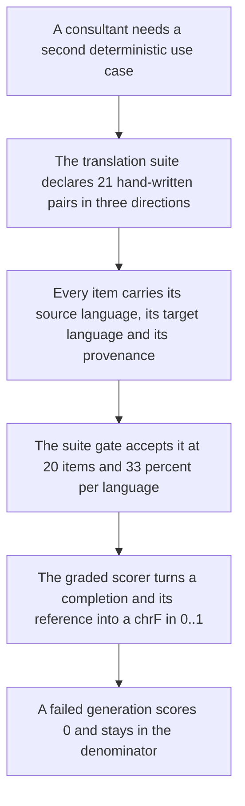
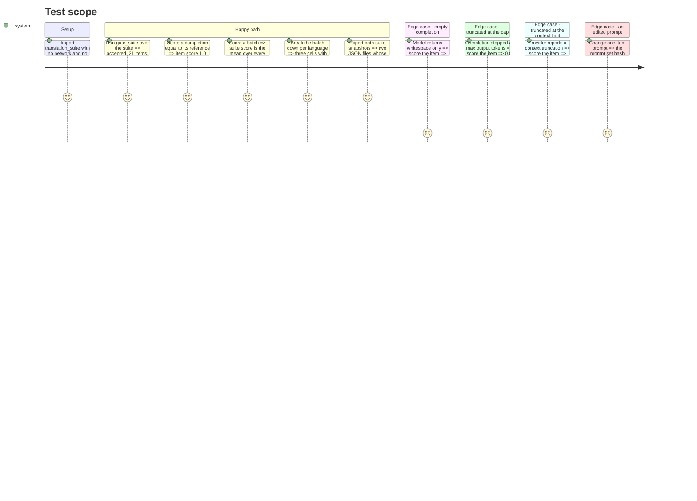

# Instruction: The translation suite and its graded scorer

## Architecture projection

```txt
.
├── src/wave_local_ai_v2/
│   ├── translation_suite.py       ✅ 21 hand-written pairs, the suite's identity and caps
│   ├── scoring.py                 ✏️ graded item/suite/per-language scoring beside the exact-match one
│   └── suite_snapshot.py          ✏️ exports both suites, per-suite item fields
└── tests/
    ├── test_translation_suite.py  ✅ the gate, the tags, the directions, the hash
    ├── test_scoring.py            ✏️ the graded scorer and the failure taxonomy on it
    └── test_suite_snapshot.py     ✏️ both snapshots round-trip
```

## User Journey



## Test Scope



## Tasks to do

### `1)` Write `translation_suite.py`

> Twenty-one hand-written pairs, natively authored, in a cycle of three directions.

1. Module docstring: the domain (short professional-register business sentences — a client email line, a delivery note, a meeting line), why translation is scored deterministically rather than judged (the epic's split: a reference translation exists, so no judge call is needed or paid for), and the single-reference caveat from `chrf.py` restated as it applies to this suite.
2. `TranslationItem` TypedDict: `item_id`, `prompt`, `source_text`, `reference`, `language`, `target_language`, `provenance`, `contamination_risk`. `language` is the **source** language — the gate dimension — and `target_language` is the new field the direction is read from.
3. One `_INSTRUCTION` shell, in English, parameterised by the two language names, prepended to the source text — the same shape `classification_suite._INSTRUCTION` uses, so every model on every provider sees an identical instruction. It asks for the translation and nothing else. State in a comment that the instruction is English even for a French or German source, matching the shipped classification suite, and that the item's `language` tag describes the material rather than the instruction.
4. Twenty-one items: seven `en→fr`, seven `fr→de`, seven `de→en`. Every source text is authored natively in its own language, never a translation of another item's source, and no two items are the same underlying text in two languages. Every item is `provenance="hand_written"`, `contamination_risk=False`. Reference translations are hand-written next to each source.
5. `SUITE_ID = "translation-business-short-form"`, `SUITE_VERSION = "1"`. `PROMPT_SET_HASH = classification_suite.prompt_set_hash(TRANSLATION_TASK_SUITE)` — the shared hashing function, not a second one, so two published hashes are comparable.
6. `MAX_OUTPUT_TOKENS = 128` (a sentence translation truncates at the classification suite's 32), `STOP_SEQUENCES: list[str] = []`, `CONTEXT_LENGTH = 32768` — the same literal and the same reason `classification_suite.CONTEXT_LENGTH` carries.
7. A comment naming the two taxonomy keys unreachable here: `unparseable` (there is no closed set to parse into, and no extraction step runs — `plan.md`'s Decisions) stays 0, and the key set remains the contract's four so two stores compare like with like. Follow `judge_probe.py`'s `_FAILURE_COUNT_KEYS` comment as the precedent.

### `2)` Extend `scoring.py` with the graded scorer

> Beside the exact-match one, sharing its failure taxonomy, never replacing it.

1. `GradedItem` TypedDict: `item_id`, `item_score`, `failure_reason`. Deliberately no `correct` and no `predicted_label` — see `plan.md`'s D4.
2. `score_translation_item(item, raw_completion, *, truncated, generated_tokens, max_output_tokens, truncation_reason=None) -> GradedItem`: the same four-way check in the same order as `score_item` (empty, then truncation with the same caller-supplied-reason override, then the score). A failure is `item_score=0.0` with its named reason and stays in the denominator. There is no `unparseable` branch; the comment says why.
3. `score_graded_suite(graded_items) -> GradedSuiteScore` returning `suite_score` (the arithmetic mean over every item, failures included as 0.0) and `failure_counts` carrying all four taxonomy keys — mirroring `score_suite`, `0.0` for an empty list rather than dividing by zero.
4. `score_graded_suite_by_language(items, graded_items) -> dict[str, GradedLanguageCell]` where a cell is `{score, n, indicative}`, zipped by position with `strict=True` and reusing `suite_gate.MIN_PER_LANGUAGE_CELL_ITEMS`, exactly as `score_suite_by_language` does. The key is `score`, not `accuracy`: a chrF mean and an exact-match rate are different statistics and one key holding either would be unnameable. Note in the docstring that this is how Methodology 4's per-language requirement is met on a graded suite.
5. Update the module docstring: it now holds two scorers, both deterministic, sharing one failure taxonomy; the exact-match one is classification's, the graded one is any reference-scored suite's.

### `3)` Generalise `suite_snapshot.py`

> Still a snapshot, still not a registry.

1. `build_snapshot` takes the suite's identity, caps, items and the item field tuple rather than importing one suite's constants at module level. `_ITEM_FIELDS` becomes per-suite: the classification tuple unchanged, and a translation tuple carrying `item_id`, `prompt`, `source_text`, `reference`, `language`, `target_language`, `provenance`, `contamination_risk`.
2. `main()` writes both files into `SUITE_DEFINITIONS_DIR` and prints both paths.
3. Run it and commit `aidd_docs/results/suite-definitions/translation-business-short-form.json`. Confirm `classification-support-routing.json` is byte-identical to what is already tracked — a diff there means the generalisation changed the classification export, which it must not.
4. Update the module docstring: two suites, one snapshot rule, still no read-time resolution.

### `4)` Tests

1. `tests/test_translation_suite.py`: the suite has ≥20 items; `gate_suite` accepts it and returns `indicative=False` with no reasons; each of `en`/`fr`/`de` is ≥25% as a source language; every `(language, target_language)` pair is one of the three declared directions and never has source equal to target; every `item_id` is unique; every item is `hand_written` with `contamination_risk=False`; every `reference` is non-empty; `PROMPT_SET_HASH` equals a fresh `prompt_set_hash` call over the items and differs from the classification suite's.
2. `tests/test_scoring.py` additions: an exact match scores `1.0`; a whitespace-only completion scores `0.0` with reason `empty`; a truncated one scores `0.0` with the cap reason by token comparison and with the caller's override when one is passed; an invalid `truncation_reason` raises, as it does on `score_item`; the suite score is the mean *including* zeros (assert against a hand-computed mean, not against a re-derivation); a per-language cell of 7 items is marked indicative and one of 10 is not; `strict=True` zipping raises on a length mismatch.
3. `tests/test_suite_snapshot.py` additions: both snapshots build; each round-trips through `json.dumps`; each snapshot's `prompt_set_hash` equals its module's; the translation snapshot carries `reference` and `target_language` on every item and no `expected_label`.

## Test acceptance criteria

| Task | Acceptance criteria |
| ---- | ------------------- |
| 1 | The suite passes `gate_suite` with no indicative reason, holds 21 hand-written items across exactly three directions with each source language at ≥25%, and declares its own id, version, prompt-set hash and three generation caps. |
| 2 | A graded item's score is a chrF in `[0, 1]`; an empty or truncated generation scores `0.0`, names its reason and remains in the suite mean; the per-language breakdown reports score, n and the indicative mark per language. |
| 3 | `uv run python -m wave_local_ai_v2.suite_snapshot` writes two files, the translation one carries `reference` and `target_language` per item, and the classification one is unchanged from the tracked copy. |
| 4 | The new and extended tests pass, the fast gate passes, and coverage stays at or above the 80% gate. |
