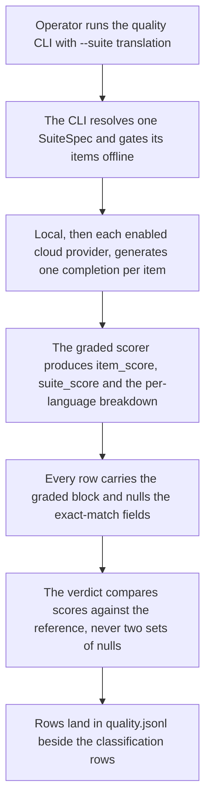
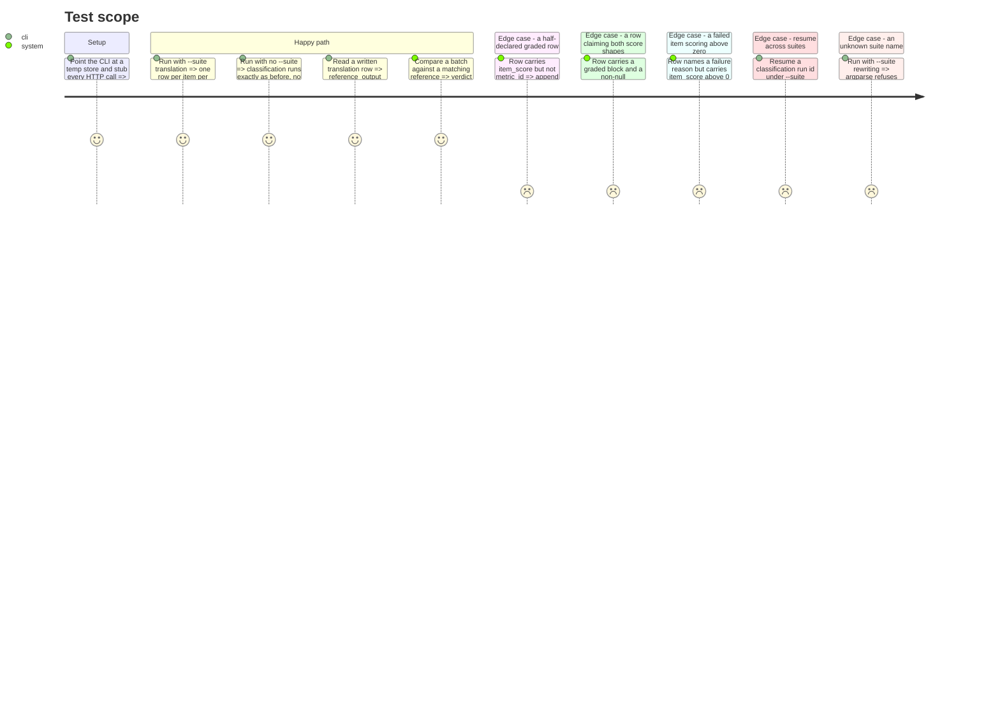

# Instruction: The graded row, the verdict, and the `--suite` seam

## Architecture projection

```txt
.
├── src/wave_local_ai_v2/
│   ├── row_contract.py            ✏️ SCHEMA_VERSION 9 -> 10, GRADED_FIELDS and its rules
│   ├── verdict.py                 ✏️ quality_verdict decides on a score when there is no label
│   ├── results.py                 ✏️ resume_skip_reason filters by task_suite
│   ├── judge_probe.py             ✏️ passes its own TASK_SUITE to resume_skip_reason
│   └── quality_cli.py             ✏️ --suite, a SuiteSpec dispatch table, a per-suite batch scorer
└── tests/
    ├── test_row_contract.py       ✏️ the graded block's presence and structure rules
    ├── test_verdict.py            ✏️ score-based reproduction and the both-null refusal
    ├── test_results.py            ✏️ resume never crosses suites
    └── test_quality_cli.py        ✏️ both suites end to end against stubbed HTTP
```

## User Journey



## Test Scope



## Tasks to do

### `1)` `row_contract.py`: the graded block

> The `JUDGED_FIELDS` shape, applied to a deterministic graded score.

1. `SCHEMA_VERSION` `"9"` → `"10"`, with a history comment in the existing style: a deterministic graded quality row carries a graded block, required only on a row carrying any of it, so an existing classification row validates unchanged.
2. `GRADED_FIELDS = frozenset({"metric_id", "metric_version", "metric_params", "item_score", "suite_score", "score_breakdown", "reference_output"})`. `subject_output` is deliberately **not** in the set: `judge_probe.py` already writes it as a non-required extra key, and putting it in the trigger set would make every probe row declare itself graded and fail validation. It is required *inside* the structural check instead.
3. `_validate_graded_fields(row)`, called from `validate_row` for kind `"quality"` beside `_validate_judged_fields`: no graded field present returns untouched; any present and any missing raises naming both sides, in the same message shape the judged check uses.
4. Structural rules on a graded row, each one a rule a client engineer could have asked for:
   - `item_score` and `suite_score` are numbers in `[0, 1]`.
   - `subject_output` is present — a score nobody can recompute is not evidence (`plan.md`'s Decisions).
   - `failure_reason is not None` implies `item_score == 0.0`. This is Methodology 9 made checkable at the writer instead of trusted at the scorer.
   - `correct` and `suite_accuracy` are both `None`. A row cannot publish an exact-match rate and a graded score at once; whichever a reader picked up would be the wrong one half the time.
   - `score_breakdown` is an object whose keys are `suite_gate.LANGUAGES`, each cell carrying `score`, `n` and `indicative`.
5. Do not touch `REQUIRED_FIELDS["quality"]`. `language_breakdown` stays required and is `None` on a translation row, the way `judge_probe.py` already nulls it.

### `2)` `verdict.py`: reproduce on a score when there is no label

1. In `quality_verdict`, replace the `predicted_label`-only comparison with a per-item comparison key resolved once for the batch: `predicted_label` when it is non-null on either side for that item, otherwise `item_score` when *that* is non-null on either side.
2. When neither is available on either side, return `not_comparable` with a reason saying the two batches carry no comparable per-item value — the honest answer `judge_probe.py` writes by hand today for its own rows, now reachable through the function.
3. Name the key in the returned block (a `compared_field` entry) so a reader can tell a label reproduction from a score reproduction without inspecting the rows.
4. Docstring: cite Methodology 8's "identical per-item predicted labels **or scores**", and state that two different translations can coincidentally score the same — accepted, because the PRD's rule is about scores and pinning it to output text instead would be a stricter rule than the one published.

### `3)` `results.py`: resume must not cross suites

1. `resume_skip_reason` gains a required `task_suite` parameter and filters `written_items` on `row.get("task_suite") == task_suite` alongside the provider check.
2. Update the docstring: the pair a resume reasons about is `(run_id, provider, task_suite)`, because one store now holds two suites and a `run_id` from one is not evidence about the other.
3. Update both call sites: `quality_cli` passes the resolved spec's `task_suite`, `judge_probe` passes its own `TASK_SUITE`.

### `4)` `quality_cli.py`: the `--suite` seam

> The minimum that stops the CLI being hard-wired. Not a registry.

1. A frozen `SuiteSpec` dataclass holding `task_suite`, `items`, `suite_id`, `suite_version`, `prompt_set_hash`, `max_output_tokens`, `stop_sequences`, `context_length`, and `score_batch` — one callable turning `(items, completions)` into `(per_item_row_fields, batch_row_fields)`.
2. `_SUITES: dict[str, SuiteSpec]` with exactly two entries, built from `classification_suite` and `translation_suite`. A module comment states the boundary: the full registry belongs to `no-use-case-is-silently-absent.md`, this table is two literals.
3. `--suite`, `choices=list(_SUITES)`, `default="classification"` — the default keeps every existing invocation and every existing test behaving identically. Help text names what each scores.
4. Thread the resolved spec through `_run`, `_run_local_suite`, `_run_cloud_batch`, `_try_run_cloud_provider` and `_score_and_write`, replacing every `CLASSIFICATION_TASK_SUITE` and every `classification_suite.<CAP>` reference. The per-item completion closures take a mapping with `item_id`/`prompt`, not `ClassificationItem` — the same duck-typing `suite_gate` and `prompt_set_hash` already document.
5. The two `score_batch` implementations:
   - classification: today's `score_item` / `score_suite` / `score_suite_by_language`, producing today's exact-match fields and no graded block. Its rows must be byte-identical to what the CLI writes now apart from `schema_version`.
   - translation: the phase-2 graded scorer, producing the graded block, `subject_output`, and `None` for `expected_label`, `predicted_label`, `correct`, `suite_accuracy` and `language_breakdown`.
6. Update the module docstring: the CLI scores one selectable suite, the provider set is still configuration, and the two suites publish two different score shapes on purpose.

### `5)` Tests

1. `test_row_contract.py`: a complete graded row validates; each structural rule has its own failing row and asserts the message names the offending field; a judged row carrying `subject_output` and no metric field still validates (the collision guard from task 1.2); a classification row validates unchanged.
2. `test_verdict.py`: two batches with identical `item_score` → `reproduced`, naming the compared field; one differing score → `not_reproduced` naming the item; both sides all-null on label and score → `not_comparable`; the existing label-based cases pass untouched.
3. `test_results.py`: a store holding a complete classification batch under a `run_id` returns `None` (run it) when asked about the same `run_id` under `task_suite="translation"`, and the completion message when asked about classification.
4. `test_quality_cli.py`: a full stubbed run under each suite; the classification run's rows carry no graded field; the translation run's rows carry the whole block with `reference_output` and `subject_output`; a failed (empty) completion writes `item_score=0.0` with its reason and stays in `suite_score`'s denominator; an unknown `--suite` value exits non-zero.

## Test acceptance criteria

| Task | Acceptance criteria |
| ---- | ------------------- |
| 1 | A row carrying part of the graded block is refused naming every missing field; a graded row claiming a non-null `correct` or `suite_accuracy`, or a named failure with a non-zero score, is refused; an existing classification row and an existing judged probe row both still validate. |
| 2 | Two runs of the same translation batch against a matching reference return `reproduced` decided on `item_score`, the block names which field decided it, and a batch with nothing comparable on either side returns `not_comparable` with a reason. |
| 3 | A `--resume` under one suite never skips a batch on the strength of another suite's rows under the same `run_id`. |
| 4 | `wave-local-ai-v2-quality` with no flag behaves exactly as before; with `--suite translation` it writes one graded row per item per enabled provider into the same store; an unrecognised suite name is refused by argparse naming the valid values. |
| 5 | The full suite passes, the fast gate passes, coverage stays at or above 80%, and no test starts a real server or makes a live cloud call. |
